# PHPUnit

<div
  class="omny-meta"
  data-level="🟢 Débutant à 🔴 Avancé"
  data-version="1.0"
  data-time="60-80 heures">
</div>

## Introduction : PHPUnit, le Standard Industriel

!!! quote "Analogie pédagogique"
    _Imaginez un contrôleur aérien qui gère des dizaines d'avions simultanément. Chaque avion doit atterrir en toute sécurité, sans collision, dans des conditions météo changeantes. Le contrôleur utilise des **protocoles stricts**, des **checklists systématiques**, et des **systèmes de vérification redondants**. Un seul oubli peut être catastrophique. Le testing avec PHPUnit fonctionne exactement pareil : vous créez des **protocoles de vérification** (tests), vous les exécutez **systématiquement** (CI/CD), et vous détectez les **anomalies avant le crash** (bugs en production). Ce n'est pas optionnel, c'est **vital**._

**PHPUnit** existe depuis **2004** et est devenu le **standard universel** du testing PHP. Laravel, Symfony, WordPress, Magento, Drupal : tous les frameworks PHP modernes l'utilisent. Comprendre PHPUnit, c'est comprendre **20 ans de bonnes pratiques** de testing industriel.

### Pourquoi PHPUnit est fondamental

**Dans l'industrie logicielle moderne, le code sans tests est considéré comme du code legacy :**

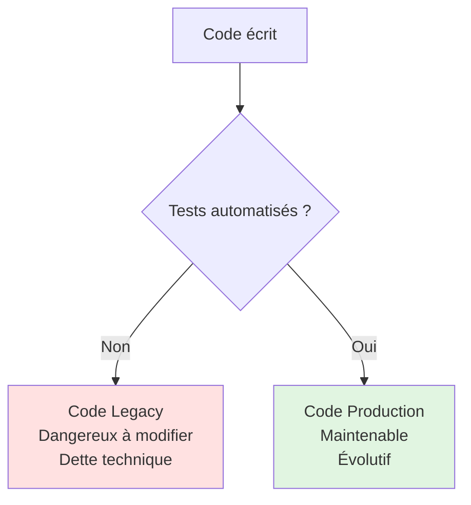

**Statistiques industrie (2024) :**

- **94%** des entreprises tech exigent des tests automatisés
- **68%** des bugs en production auraient pu être détectés par des tests
- **3-5x** : ratio temps économisé sur 1 an (tests vs debugging manuel)
- **80%+** : couverture de code considérée comme "bonne" en entreprise

### Projet fil rouge : Tester le Blog Laravel

Nous allons tester **intégralement** le projet de blog éditorial construit dans la formation Laravel (Modules 1-9). Ce n'est pas un projet académique isolé : vous allez tester le **même code que vous avez écrit**.

**Application à tester :**

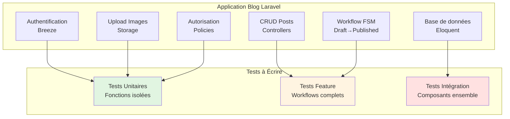

**Statistiques du projet :**

- **~20 tables** en base de données
- **~15 modèles** Eloquent avec relations
- **~10 controllers** avec logique métier
- **~5 policies** d'autorisation
- **~50 routes** (publiques + protégées)
- **~30 vues** Blade

**Objectif final : 80%+ de couverture de code**

---

## Architecture du Guide (8 Modules)

Ce guide suit une progression logique : des fondamentaux aux techniques avancées, en passant par la pratique intensive du TDD.

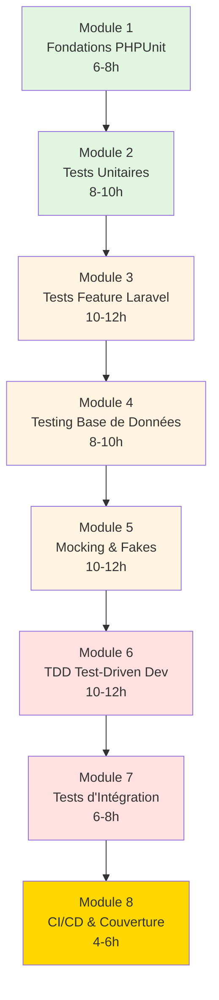

### Progression Pédagogique

**Phase 1 : Fondations (Modules 1-2)** 🟢  
Apprendre la syntaxe PHPUnit, les assertions, la structure des tests. Tester des fonctions simples isolées.

**Phase 2 : Laravel Testing (Modules 3-4)** 🟡  
Tester des workflows complets (routes, auth, policies), la base de données (migrations, factories).

**Phase 3 : Techniques Avancées (Modules 5-6)** 🔴  
Mocking (simuler dépendances), Fakes (Mail, Storage), TDD complet (écrire tests AVANT code).

**Phase 4 : Production (Modules 7-8)** ⚫  
Tests d'intégration (composants ensemble), CI/CD (GitHub Actions), couverture de code (>80%).

---

## Vue d'Ensemble des Modules

### Module 1 : Fondations PHPUnit (6-8h)

**Objectif :** Comprendre l'architecture PHPUnit, installer correctement, écrire vos premiers tests.

<div class="grid cards" markdown>

-   :lucide-download:{ .lg .middle } **Installation & Configuration**

    ---
    - Installation PHPUnit dans Laravel
    - Configuration `phpunit.xml`
    - Structure `tests/Unit` vs `tests/Feature`
    - Exécuter les tests (`php artisan test`)

-   :lucide-code:{ .lg .middle } **Anatomie d'un Test**

    ---
    - Classes de test (héritage `TestCase`)
    - Méthodes de test (`test_*()`)
    - Pattern AAA (Arrange-Act-Assert)
    - Hooks `setUp()` et `tearDown()`

</div>

<div class="grid cards" markdown>

-   :lucide-check-check:{ .lg .middle } **Assertions Fondamentales**

    ---
    - `assertEquals()`, `assertSame()`
    - `assertTrue()`, `assertFalse()`
    - `assertNull()`, `assertNotNull()`
    - `assertCount()`, `assertEmpty()`
    - `assertInstanceOf()`, `assertArrayHasKey()`

-   :lucide-alert-triangle:{ .lg .middle } **Gestion des Erreurs**

    ---
    - `expectException()`
    - `expectExceptionMessage()`
    - Tester les erreurs attendues
    - Différence erreur vs échec de test

</div>

**Exemple de code couvert :**

```php
<?php

namespace Tests\Unit;

use PHPUnit\Framework\TestCase;
use App\Services\Calculator;

/**
 * Tests de la classe Calculator (exemple pédagogique).
 * 
 * Ce test illustre :
 * - Structure d'une classe de test PHPUnit
 * - Pattern AAA (Arrange-Act-Assert)
 * - Assertions de base
 */
class CalculatorTest extends TestCase
{
    /**
     * Test : additionner deux nombres positifs.
     */
    public function test_can_add_two_positive_numbers(): void
    {
        // Arrange (Préparer)
        $calculator = new Calculator();
        $numberA = 5;
        $numberB = 3;
        
        // Act (Agir)
        $result = $calculator->add($numberA, $numberB);
        
        // Assert (Affirmer)
        $this->assertEquals(8, $result);
        $this->assertIsInt($result);
    }
    
    /**
     * Test : division par zéro lance une exception.
     */
    public function test_division_by_zero_throws_exception(): void
    {
        $calculator = new Calculator();
        
        $this->expectException(\DivisionByZeroError::class);
        
        $calculator->divide(10, 0);
    }
}
```

**Compétences acquises Module 1 :**

- [x] Installer et configurer PHPUnit dans Laravel
- [x] Comprendre la structure d'un test (classe, méthode, assertions)
- [x] Appliquer le pattern AAA systématiquement
- [x] Utiliser 15+ assertions fondamentales
- [x] Tester les exceptions et erreurs

[:lucide-arrow-right: Accéder au Module 1](./module-01-fondations/)

---

### Module 2 : Tests Unitaires (8-10h)

**Objectif :** Tester des fonctions isolées (services, helpers, modèles), comprendre l'isolation totale.

<div class="grid cards" markdown>

-   :lucide-package:{ .lg .middle } **Tests de Services**

    ---
    - Tester une classe métier isolée
    - Pas de dépendances externes
    - Couverture 100% des branches
    - Tests paramétrés (Data Providers)

-   :lucide-file-code:{ .lg .middle } **Tests de Helpers**

    ---
    - Tester fonctions utilitaires
    - Edge cases (valeurs limites)
    - Null safety
    - Gestion encodages/types

</div>

<div class="grid cards" markdown>

-   :lucide-database:{ .lg .middle } **Tests de Modèles (sans DB)**

    ---
    - Tester mutateurs (accessors/mutators)
    - Tester scopes locaux
    - Tester casts
    - Relations (sans requêtes DB)

-   :lucide-list-checks:{ .lg .middle } **Data Providers**

    ---
    - Tester N cas avec 1 méthode
    - Syntaxe `@dataProvider`
    - Organiser données de test
    - Nommer les cas explicitement

</div>

**Diagramme : Isolation des Tests Unitaires**

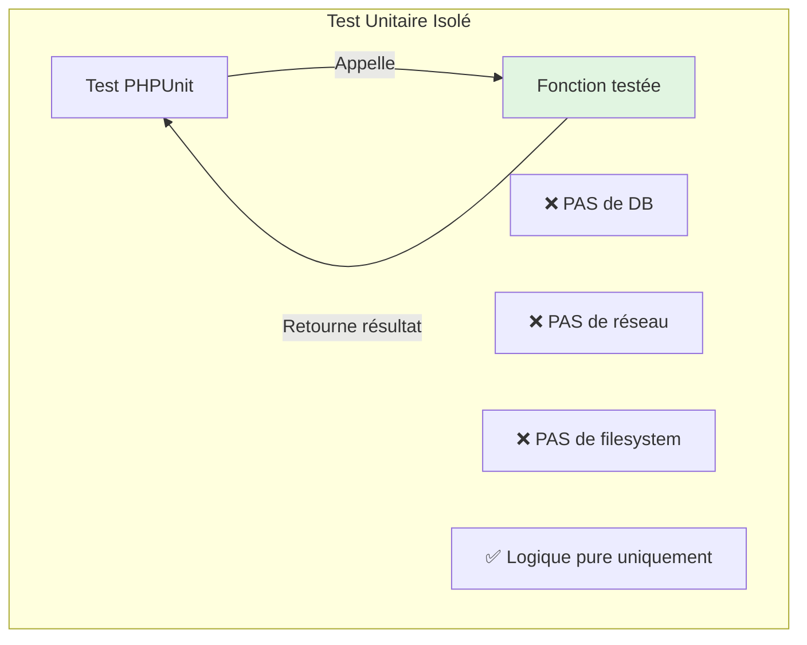

**Exemple de code couvert :**

```php
<?php

namespace Tests\Unit;

use Tests\TestCase;
use App\Models\Post;
use App\Enums\PostStatus;

/**
 * Tests du modèle Post (sans base de données).
 * 
 * Tests unitaires purs : pas de DB, pas de factories.
 * On teste uniquement la logique métier du modèle.
 */
class PostModelTest extends TestCase
{
    /**
     * Test : mutateur title met en majuscules.
     */
    public function test_title_mutator_converts_to_uppercase(): void
    {
        // Arrange
        $post = new Post();
        
        // Act
        $post->title = 'mon super titre';
        
        // Assert
        $this->assertEquals('MON SUPER TITRE', $post->title);
    }
    
    /**
     * Test : scope published filtre correctement.
     */
    public function test_published_scope_filters_by_status(): void
    {
        // On ne peut pas tester ce scope sans DB
        // Ce sera couvert au Module 4 (Database Testing)
        $this->markTestSkipped('Requires database');
    }
    
    /**
     * Data Provider : tester plusieurs états de post.
     * 
     * @dataProvider postStatusProvider
     */
    public function test_post_status_validation(PostStatus $status, bool $expected): void
    {
        $post = new Post(['status' => $status]);
        
        $this->assertEquals($expected, $post->isPublished());
    }
    
    /**
     * Fournisseur de données : cas de test pour statuts.
     */
    public static function postStatusProvider(): array
    {
        return [
            'draft is not published' => [PostStatus::DRAFT, false],
            'submitted is not published' => [PostStatus::SUBMITTED, false],
            'published is published' => [PostStatus::PUBLISHED, true],
            'rejected is not published' => [PostStatus::REJECTED, false],
        ];
    }
}
```

**Compétences acquises Module 2 :**

- [x] Identifier ce qui est "unitaire" (isolé vs intégré)
- [x] Tester services métier sans dépendances
- [x] Utiliser les Data Providers efficacement
- [x] Couvrir tous les edge cases
- [x] Atteindre 100% de couverture sur code isolé

[:lucide-arrow-right: Accéder au Module 2](./module-02-tests-unitaires/)

---

### Module 3 : Tests Feature Laravel (10-12h)

**Objectif :** Tester des workflows complets (routes, controllers, vues), utiliser les helpers Laravel.

<div class="grid cards" markdown>

-   :lucide-route:{ .lg .middle } **Tests de Routes HTTP**

    ---
    - `get()`, `post()`, `put()`, `delete()`
    - `assertStatus()`, `assertRedirect()`
    - `assertSee()`, `assertDontSee()`
    - `assertJson()`, `assertViewHas()`

-   :lucide-shield-check:{ .lg .middle } **Tests d'Authentification**

    ---
    - `actingAs($user)`
    - Tester login/logout
    - Tester middlewares auth
    - Tester permissions (policies)

</div>

<div class="grid cards" markdown>

-   :lucide-check-circle:{ .lg .middle } **Tests de Validation**

    ---
    - `assertSessionHasErrors()`
    - Tester Form Requests
    - Tester règles custom
    - Tester messages d'erreur

-   :lucide-git-branch:{ .lg .middle } **Tests de Workflow**

    ---
    - Tester workflow éditorial complet
    - Transitions d'états (FSM)
    - Soumission → Validation → Publication
    - Rejet → Retour brouillon

</div>

**Diagramme : Anatomie d'un Test Feature**

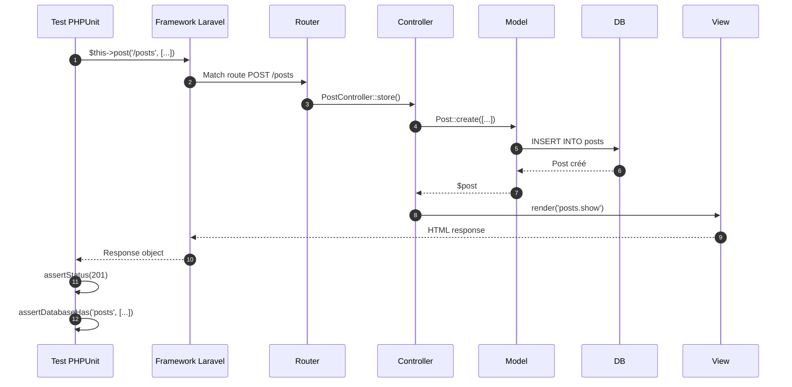

**Exemple de code couvert :**

```php
<?php

namespace Tests\Feature;

use Tests\TestCase;
use App\Models\User;
use App\Models\Post;
use App\Enums\PostStatus;
use Illuminate\Foundation\Testing\RefreshDatabase;

/**
 * Tests du workflow de soumission de posts.
 * 
 * Tests Feature : testent tout le cycle requête → réponse.
 * Incluent DB, routes, controllers, vues.
 */
class PostSubmissionTest extends TestCase
{
    use RefreshDatabase; // Reset DB avant chaque test
    
    /**
     * Test : un auteur peut soumettre son brouillon.
     */
    public function test_author_can_submit_draft_post(): void
    {
        // Arrange
        $author = User::factory()->create(['role' => 'author']);
        $post = Post::factory()
            ->for($author)
            ->create(['status' => PostStatus::DRAFT]);
        
        // Ajouter image (obligatoire)
        $post->images()->create([
            'path' => 'test/image.jpg',
            'is_main' => true,
        ]);
        
        // Act
        $response = $this
            ->actingAs($author)
            ->post(route('posts.submit', $post));
        
        // Assert
        $response->assertRedirect(route('posts.show', $post));
        $response->assertSessionHas('success');
        
        $this->assertDatabaseHas('posts', [
            'id' => $post->id,
            'status' => PostStatus::SUBMITTED->value,
        ]);
        
        $post->refresh();
        $this->assertNotNull($post->submitted_at);
    }
    
    /**
     * Test : un post sans image ne peut pas être soumis.
     */
    public function test_post_without_image_cannot_be_submitted(): void
    {
        $author = User::factory()->create(['role' => 'author']);
        $post = Post::factory()
            ->for($author)
            ->create(['status' => PostStatus::DRAFT]);
        
        // Pas d'image ajoutée
        
        $response = $this
            ->actingAs($author)
            ->post(route('posts.submit', $post));
        
        $response->assertSessionHasErrors(['images']);
        
        $this->assertDatabaseHas('posts', [
            'id' => $post->id,
            'status' => PostStatus::DRAFT->value, // Toujours draft
        ]);
    }
    
    /**
     * Test : un non-propriétaire ne peut pas soumettre.
     */
    public function test_non_owner_cannot_submit_post(): void
    {
        $author = User::factory()->create();
        $otherUser = User::factory()->create();
        $post = Post::factory()
            ->for($author)
            ->create(['status' => PostStatus::DRAFT]);
        
        $response = $this
            ->actingAs($otherUser)
            ->post(route('posts.submit', $post));
        
        $response->assertForbidden(); // 403
    }
}
```

**Compétences acquises Module 3 :**

- [x] Tester routes HTTP complètes (GET, POST, PUT, DELETE)
- [x] Utiliser `actingAs()` pour simuler authentification
- [x] Vérifier redirections et messages flash
- [x] Tester le contenu des vues (`assertSee`)
- [x] Tester workflows métier complets

[:lucide-arrow-right: Accéder au Module 3](./module-03-tests-feature/)

---

### Module 4 : Testing Base de Données (8-10h)

**Objectif :** Tester les interactions DB (migrations, Eloquent, relations), utiliser factories et seeders.

<div class="grid cards" markdown>

-   :lucide-database:{ .lg .middle } **RefreshDatabase**

    ---
    - Trait `RefreshDatabase`
    - Migrations automatiques
    - Rollback après chaque test
    - Isolation complète

-   :lucide-factory:{ .lg .middle } **Factories & Seeders**

    ---
    - `User::factory()->create()`
    - États de factories (states)
    - Relations dans factories
    - Seeders pour données de référence

</div>

<div class="grid cards" markdown>

-   :lucide-link:{ .lg .middle } **Tests de Relations**

    ---
    - `hasMany`, `belongsTo`
    - `belongsToMany` (pivot)
    - Eager loading
    - Queries N+1 detection

-   :lucide-check-square:{ .lg .middle } **Assertions Database**

    ---
    - `assertDatabaseHas()`
    - `assertDatabaseMissing()`
    - `assertDatabaseCount()`
    - `assertSoftDeleted()`

</div>

**Diagramme : Cycle de vie d'un Test avec RefreshDatabase**

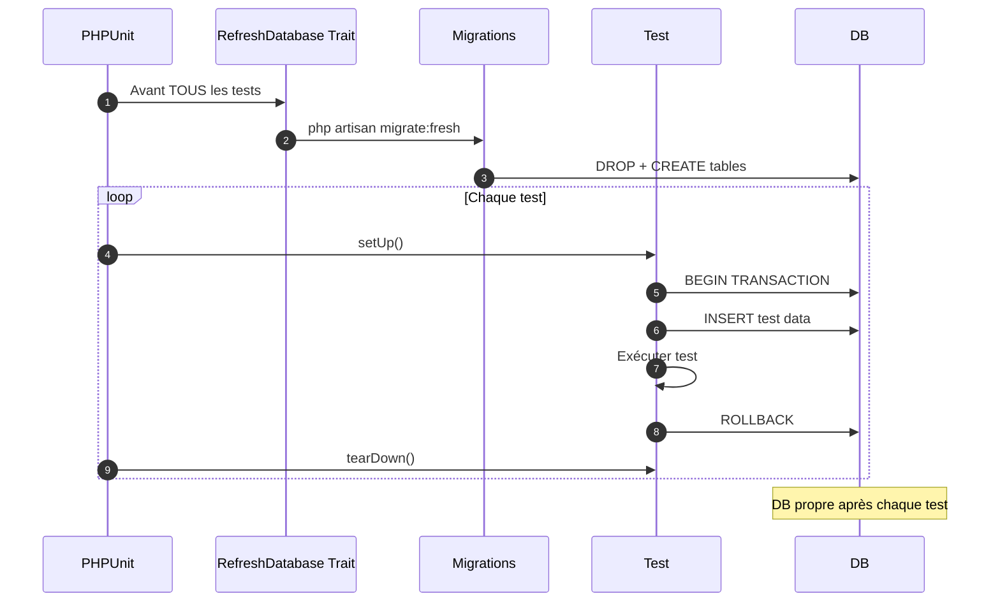

**Exemple de code couvert :**

```php
<?php

namespace Tests\Feature;

use Tests\TestCase;
use App\Models\User;
use App\Models\Post;
use App\Models\PostImage;
use Illuminate\Foundation\Testing\RefreshDatabase;

/**
 * Tests des relations Eloquent du blog.
 */
class PostRelationsTest extends TestCase
{
    use RefreshDatabase;
    
    /**
     * Test : un post appartient à un utilisateur.
     */
    public function test_post_belongs_to_user(): void
    {
        // Arrange
        $user = User::factory()->create(['name' => 'Alice']);
        $post = Post::factory()->for($user)->create();
        
        // Act
        $postUser = $post->user;
        
        // Assert
        $this->assertInstanceOf(User::class, $postUser);
        $this->assertEquals('Alice', $postUser->name);
        $this->assertEquals($user->id, $postUser->id);
    }
    
    /**
     * Test : un post a plusieurs images.
     */
    public function test_post_has_many_images(): void
    {
        $post = Post::factory()
            ->has(PostImage::factory()->count(3))
            ->create();
        
        $images = $post->images;
        
        $this->assertCount(3, $images);
        $this->assertInstanceOf(PostImage::class, $images->first());
    }
    
    /**
     * Test : eager loading évite N+1.
     */
    public function test_eager_loading_avoids_n_plus_one(): void
    {
        // Créer 5 posts avec leurs users
        Post::factory()
            ->count(5)
            ->create();
        
        // Activer le compteur de queries
        \DB::enableQueryLog();
        
        // Sans eager loading : N+1 problem
        $posts = Post::all(); // 1 query
        foreach ($posts as $post) {
            $post->user->name; // N queries
        }
        $queriesWithoutEager = count(\DB::getQueryLog());
        \DB::flushQueryLog();
        
        // Avec eager loading : 2 queries seulement
        $posts = Post::with('user')->get(); // 2 queries
        foreach ($posts as $post) {
            $post->user->name; // 0 query
        }
        $queriesWithEager = count(\DB::getQueryLog());
        
        // Assert
        $this->assertLessThan($queriesWithoutEager, $queriesWithEager);
        $this->assertEquals(2, $queriesWithEager);
    }
    
    /**
     * Test : soft delete fonctionne correctement.
     */
    public function test_post_soft_delete(): void
    {
        $post = Post::factory()->create();
        
        $post->delete();
        
        $this->assertSoftDeleted('posts', ['id' => $post->id]);
        $this->assertDatabaseHas('posts', ['id' => $post->id]);
    }
}
```

**Compétences acquises Module 4 :**

- [x] Utiliser `RefreshDatabase` systématiquement
- [x] Créer données de test avec factories
- [x] Tester toutes les relations Eloquent
- [x] Détecter les problèmes N+1
- [x] Utiliser assertions database spécialisées

[:lucide-arrow-right: Accéder au Module 4](./module-04-database-testing/)

---

### Module 5 : Mocking & Fakes (10-12h)

**Objectif :** Isoler le code testé en simulant les dépendances externes (API, mail, storage, queues).

<div class="grid cards" markdown>

-   :lucide-boxes:{ .lg .middle } **Concepts de Mocking**

    ---
    - Test Doubles (types)
    - Mocks vs Stubs vs Spies
    - Quand mocker ?
    - Dangers du over-mocking

-   :lucide-mail:{ .lg .middle } **Laravel Fakes**

    ---
    - `Mail::fake()`
    - `Storage::fake()`
    - `Queue::fake()`
    - `Event::fake()`
    - `Notification::fake()`

</div>

<div class="grid cards" markdown>

-   :lucide-plug:{ .lg .middle } **Mocking Dépendances**

    ---
    - Mocker APIs externes
    - `Http::fake()`
    - Mockery library
    - Dependency Injection pour testabilité

-   :lucide-shield-alert:{ .lg .middle } **Tests de Sécurité**

    ---
    - Tester rate limiting
    - Tester CSRF protection
    - Tester validation inputs
    - Tester authorization

</div>

**Diagramme : Types de Test Doubles**

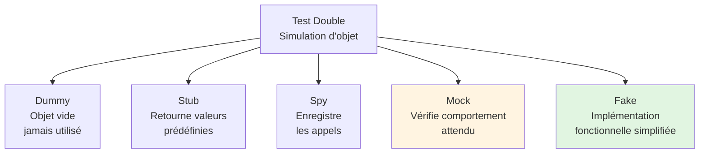

**Exemple de code couvert :**

```php
<?php

namespace Tests\Feature;

use Tests\TestCase;
use App\Models\User;
use App\Models\Post;
use Illuminate\Support\Facades\Mail;
use Illuminate\Support\Facades\Storage;
use Illuminate\Support\Facades\Http;
use Illuminate\Foundation\Testing\RefreshDatabase;
use App\Mail\PostPublishedMail;

/**
 * Tests utilisant les Laravel Fakes.
 */
class PostPublishingWithFakesTest extends TestCase
{
    use RefreshDatabase;
    
    /**
     * Test : email envoyé lors de la publication.
     */
    public function test_email_sent_when_post_published(): void
    {
        // Fake : intercepter les mails sans les envoyer
        Mail::fake();
        
        $admin = User::factory()->create(['role' => 'admin']);
        $post = Post::factory()->create(['status' => 'submitted']);
        
        // Act : publier le post
        $this->actingAs($admin)
            ->post(route('admin.posts.approve', $post));
        
        // Assert : vérifier que le mail a été envoyé
        Mail::assertSent(PostPublishedMail::class, function ($mail) use ($post) {
            return $mail->post->id === $post->id;
        });
    }
    
    /**
     * Test : image uploadée correctement.
     */
    public function test_image_uploaded_to_storage(): void
    {
        Storage::fake('public');
        
        $author = User::factory()->create(['role' => 'author']);
        $image = \Illuminate\Http\UploadedFile::fake()->image('test.jpg', 800, 600);
        
        $response = $this->actingAs($author)
            ->post(route('posts.store'), [
                'title' => 'Test Post',
                'body' => 'Content...',
                'images' => [$image],
            ]);
        
        // Assert : fichier existe dans storage fake
        Storage::disk('public')->assertExists('posts/1/test.jpg');
    }
    
    /**
     * Test : API externe mockée.
     */
    public function test_external_api_call_mocked(): void
    {
        // Mock : simuler réponse API externe
        Http::fake([
            'api.external.com/check-spam' => Http::response([
                'is_spam' => false,
                'score' => 0.2,
            ], 200),
        ]);
        
        $post = Post::factory()->create();
        
        // Act : vérifier si post est spam (appelle API externe)
        $result = app(\App\Services\SpamDetector::class)->check($post);
        
        // Assert
        $this->assertFalse($result);
        
        // Vérifier que l'API a été appelée
        Http::assertSent(function ($request) {
            return $request->url() === 'https://api.external.com/check-spam';
        });
    }
}
```

**Compétences acquises Module 5 :**

- [x] Comprendre les types de test doubles
- [x] Utiliser tous les Laravel Fakes (Mail, Storage, Queue, etc.)
- [x] Mocker des APIs externes avec `Http::fake()`
- [x] Tester sans effets de bord (emails, fichiers)
- [x] Vérifier les appels avec `assertSent()`

[:lucide-arrow-right: Accéder au Module 5](./module-05-mocking-fakes/)

---

### Module 6 : TDD - Test-Driven Development (10-12h)

**Objectif :** Maîtriser le TDD : écrire les tests **AVANT** le code, suivre le cycle Red-Green-Refactor.

<div class="grid cards" markdown>

-   :lucide-repeat:{ .lg .middle } **Cycle Red-Green-Refactor**

    ---
    - Red : Écrire test qui échoue
    - Green : Écrire code minimal qui passe
    - Refactor : Améliorer sans casser tests
    - Répéter

-   :lucide-brain:{ .lg .middle } **Philosophie TDD**

    ---
    - Tests = spécifications exécutables
    - Design émergent (YAGNI)
    - Code testable par design
    - Confiance dans le refactoring

</div>

<div class="grid cards" markdown>

-   :lucide-construction:{ .lg .middle } **TDD en Pratique**

    ---
    - Construire feature complète en TDD
    - Baby steps (petits incréments)
    - Tests d'acceptance (outside-in)
    - Tests unitaires (inside-out)

-   :lucide-bug-off:{ .lg .middle } **Éviter les Pièges TDD**

    ---
    - Sur-tester (brittle tests)
    - Sous-tester (missing edge cases)
    - Tests couplés à l'implémentation
    - Balance couverture/vitesse

</div>

**Diagramme : Cycle Red-Green-Refactor**

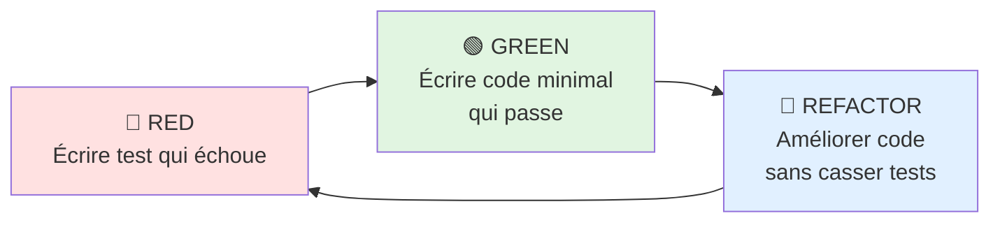

**Exemple de code couvert (TDD complet d'une feature) :**

```php
<?php

namespace Tests\Feature;

use Tests\TestCase;
use App\Models\User;
use Illuminate\Foundation\Testing\RefreshDatabase;

/**
 * TDD : Construire feature "Ban utilisateur" en Test-Driven.
 * 
 * Nous allons écrire les tests AVANT le code.
 */
class BanUserFeatureTest extends TestCase
{
    use RefreshDatabase;
    
    /**
     * 🔴 RED : Test 1 - Admin peut bannir un utilisateur.
     * 
     * Ce test échoue car la route n'existe pas encore.
     */
    public function test_admin_can_ban_user(): void
    {
        $admin = User::factory()->create(['role' => 'admin']);
        $user = User::factory()->create(['role' => 'author']);
        
        $response = $this->actingAs($admin)
            ->post(route('admin.users.ban', $user), [
                'reason' => 'Spam content',
            ]);
        
        $response->assertRedirect();
        
        $this->assertTrue($user->fresh()->is_banned);
        $this->assertEquals('Spam content', $user->fresh()->ban_reason);
    }
    
    /**
     * 🟢 GREEN : Après avoir créé :
     * - Route POST /admin/users/{user}/ban
     * - Controller AdminUserController::ban()
     * - Migration ajoutant is_banned, ban_reason, banned_at
     * 
     * Le test passe maintenant.
     */
    
    /**
     * 🔴 RED : Test 2 - Non-admin ne peut pas bannir.
     */
    public function test_non_admin_cannot_ban_user(): void
    {
        $author = User::factory()->create(['role' => 'author']);
        $user = User::factory()->create();
        
        $response = $this->actingAs($author)
            ->post(route('admin.users.ban', $user), [
                'reason' => 'Test',
            ]);
        
        $response->assertForbidden();
    }
    
    /**
     * 🟢 GREEN : Après avoir ajouté la Policy :
     * 
     * public function ban(User $user): bool
     * {
     *     return $user->isAdmin();
     * }
     */
    
    /**
     * 🔴 RED : Test 3 - Raison de ban obligatoire.
     */
    public function test_ban_reason_is_required(): void
    {
        $admin = User::factory()->create(['role' => 'admin']);
        $user = User::factory()->create();
        
        $response = $this->actingAs($admin)
            ->post(route('admin.users.ban', $user), [
                'reason' => '', // Vide
            ]);
        
        $response->assertSessionHasErrors(['reason']);
    }
    
    /**
     * 🟢 GREEN : Après avoir ajouté la validation :
     * 
     * $request->validate([
     *     'reason' => 'required|string|min:10|max:500',
     * ]);
     */
    
    /**
     * 🔵 REFACTOR : Extraire logique dans un Service.
     * 
     * Tous les tests passent toujours après refactoring.
     */
}
```

**Compétences acquises Module 6 :**

- [x] Comprendre la philosophie TDD (pourquoi, pas juste comment)
- [x] Suivre strictement le cycle Red-Green-Refactor
- [x] Construire une feature complète en TDD
- [x] Écrire tests d'acceptance (outside-in)
- [x] Refactorer en confiance grâce aux tests

[:lucide-arrow-right: Accéder au Module 6](./module-06-tdd/)

---

### Module 7 : Tests d'Intégration (6-8h)

**Objectif :** Tester plusieurs composants ensemble, vérifier l'intégration correcte des systèmes.

<div class="grid cards" markdown>

-   :lucide-puzzle:{ .lg .middle } **Composants Multiples**

    ---
    - Tester Controller + Service + Model
    - Tester Events + Listeners
    - Tester Jobs + Queues
    - Tester Middleware chains

-   :lucide-plug-zap:{ .lg .middle } **Intégrations Externes**

    ---
    - Tester paiements (Stripe)
    - Tester emails (SMTP)
    - Tester storage (S3)
    - Contrats d'intégration

</div>

<div class="grid cards" markdown>

-   :lucide-layers-2:{ .lg .middle } **Tests End-to-End**

    ---
    - Workflow complet multi-pages
    - Scénarios utilisateur réels
    - Tests de régression
    - Smoke tests

-   :lucide-gauge:{ .lg .middle } **Performance Testing**

    ---
    - Benchmarking avec PHPUnit
    - Détecter régressions perfs
    - Memory leaks
    - Query optimization

</div>

**Diagramme : Niveaux de Testing**

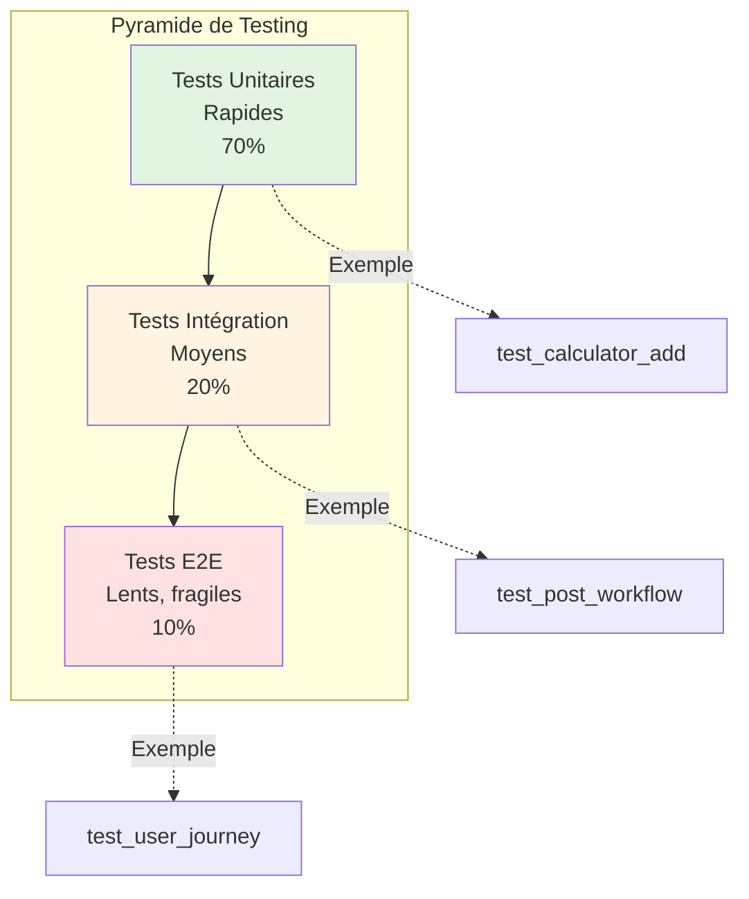

**Exemple de code couvert :**

```php
<?php

namespace Tests\Integration;

use Tests\TestCase;
use App\Models\User;
use App\Models\Post;
use App\Services\PostWorkflowService;
use Illuminate\Support\Facades\Event;
use Illuminate\Support\Facades\Mail;
use Illuminate\Foundation\Testing\RefreshDatabase;

/**
 * Test d'intégration : workflow complet de publication.
 * 
 * Teste l'intégration de plusieurs composants :
 * - Service (PostWorkflowService)
 * - Events (PostPublished)
 * - Listeners (SendNotificationToAuthor)
 * - Mail (PostPublishedMail)
 */
class PostPublishingIntegrationTest extends TestCase
{
    use RefreshDatabase;
    
    /**
     * Test : workflow complet de publication avec notifications.
     */
    public function test_complete_publishing_workflow(): void
    {
        // Arrange
        Event::fake(); // Capturer les events
        Mail::fake();  // Capturer les mails
        
        $admin = User::factory()->create(['role' => 'admin']);
        $author = User::factory()->create(['role' => 'author', 'email' => 'author@test.com']);
        $post = Post::factory()
            ->for($author)
            ->create(['status' => 'submitted']);
        
        $service = app(PostWorkflowService::class);
        
        // Act : publier le post via le service
        $service->approve($post, $admin, 'Great content!');
        
        // Assert : vérifier toute la chaîne d'intégration
        
        // 1. Post mis à jour en DB
        $this->assertDatabaseHas('posts', [
            'id' => $post->id,
            'status' => 'published',
            'reviewed_by' => $admin->id,
        ]);
        
        // 2. Event dispatché
        Event::assertDispatched(\App\Events\PostPublished::class, function ($event) use ($post) {
            return $event->post->id === $post->id;
        });
        
        // 3. Mail envoyé à l'auteur
        Mail::assertSent(\App\Mail\PostPublishedMail::class, function ($mail) use ($author) {
            return $mail->hasTo($author->email);
        });
        
        // 4. Timestamps corrects
        $post->refresh();
        $this->assertNotNull($post->published_at);
    }
    
    /**
     * Test : performance du workflow (benchmark).
     */
    public function test_publishing_performance(): void
    {
        $admin = User::factory()->create(['role' => 'admin']);
        $posts = Post::factory()->count(100)->create(['status' => 'submitted']);
        
        $startTime = microtime(true);
        
        foreach ($posts as $post) {
            app(PostWorkflowService::class)->approve($post, $admin);
        }
        
        $endTime = microtime(true);
        $duration = $endTime - $startTime;
        
        // Assert : ne doit pas dépasser 5 secondes pour 100 posts
        $this->assertLessThan(5.0, $duration, "Publishing 100 posts took {$duration}s (max: 5s)");
    }
}
```

**Compétences acquises Module 7 :**

- [x] Différencier tests unitaires vs intégration
- [x] Tester plusieurs composants ensemble
- [x] Vérifier les intégrations externes (APIs, services)
- [x] Écrire des tests de régression
- [x] Benchmarker les performances

[:lucide-arrow-right: Accéder au Module 7](./module-07-integration/)

---

### Module 8 : CI/CD & Couverture de Code (4-6h)

**Objectif :** Automatiser les tests dans un pipeline CI/CD, atteindre 80%+ de couverture de code.

<div class="grid cards" markdown>

-   :lucide-git-branch:{ .lg .middle } **GitHub Actions**

    ---
    - Workflow CI complet
    - Tests automatiques sur PR
    - Matrix testing (PHP versions)
    - Caching dependencies

-   :lucide-activity:{ .lg .middle } **Code Coverage**

    ---
    - Xdebug / PCOV
    - PHPUnit coverage reports
    - HTML coverage report
    - Codecov / Coveralls

</div>

<div class="grid cards" markdown>

-   :lucide-shield-check:{ .lg .middle } **Quality Gates**

    ---
    - Couverture minimale (80%)
    - Bloquer merge si tests échouent
    - PHPStan / Psalm (static analysis)
    - PHP CS Fixer (code style)

-   :lucide-trending-up:{ .lg .middle } **Métriques Qualité**

    ---
    - Temps d'exécution tests
    - Taux de succès historique
    - Tendance couverture
    - Complexité cyclomatique

</div>

**Diagramme : Pipeline CI/CD Complet**

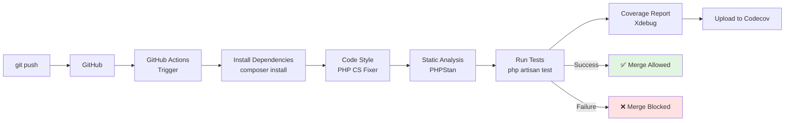

**Exemple de configuration couvert :**

```yaml
# .github/workflows/tests.yml

name: Tests

on:
  push:
    branches: [ main, develop ]
  pull_request:
    branches: [ main ]

jobs:
  tests:
    runs-on: ubuntu-latest
    
    strategy:
      matrix:
        php: [8.2, 8.3]
        laravel: [10.*, 11.*]
    
    name: PHP ${{ matrix.php }} - Laravel ${{ matrix.laravel }}
    
    steps:
      - name: Checkout code
        uses: actions/checkout@v3
      
      - name: Setup PHP
        uses: shivammathur/setup-php@v2
        with:
          php-version: ${{ matrix.php }}
          extensions: dom, curl, libxml, mbstring, zip, pcntl, pdo, sqlite, pdo_sqlite
          coverage: xdebug
      
      - name: Install dependencies
        run: |
          composer require "laravel/framework:${{ matrix.laravel }}" --no-update
          composer install --prefer-dist --no-progress
      
      - name: Execute tests
        run: php artisan test --coverage --min=80
      
      - name: Upload coverage to Codecov
        uses: codecov/codecov-action@v3
        with:
          files: ./coverage.xml
          flags: unittests
          name: codecov-umbrella
```

**Exemple de rapport de couverture :**

```bash
# Exécuter les tests avec couverture
php artisan test --coverage

# Output :
#   PASS  Tests\Unit\CalculatorTest
#   ✓ can add two positive numbers
#   ✓ division by zero throws exception
# 
#   PASS  Tests\Feature\PostSubmissionTest
#   ✓ author can submit draft post
#   ✓ post without image cannot be submitted
# 
#   Tests:    42 passed (84 assertions)
#   Duration: 3.45s
# 
# Code Coverage:
#   app/Services/PostWorkflowService.php   100.0%
#   app/Http/Controllers/PostController.php   95.2%
#   app/Models/Post.php                       87.5%
#   app/Policies/PostPolicy.php              100.0%
# 
#   Total:  86.7%
```

**Compétences acquises Module 8 :**

- [x] Configurer GitHub Actions pour CI/CD
- [x] Générer rapports de couverture (Xdebug)
- [x] Interpréter métriques de couverture
- [x] Mettre en place quality gates (80%+ coverage)
- [x] Intégrer tests dans workflow git (pre-commit, pre-push)

[:lucide-arrow-right: Accéder au Module 8](./module-08-ci-cd-coverage/)

---

## Tableau Récapitulatif des Modules

| Module | Thème | Concepts Clés | Temps | Niveau | Tests Écrits |
|--------|-------|---------------|-------|--------|--------------|
| **1** | Fondations PHPUnit | Installation, assertions, AAA pattern | 6-8h | 🟢 | ~10 tests |
| **2** | Tests Unitaires | Services, helpers, data providers | 8-10h | 🟢 | ~20 tests |
| **3** | Tests Feature | Routes HTTP, auth, workflow | 10-12h | 🟡 | ~30 tests |
| **4** | Database Testing | Factories, relations, migrations | 8-10h | 🟡 | ~25 tests |
| **5** | Mocking & Fakes | Mail, Storage, Http, doubles | 10-12h | 🟡 | ~20 tests |
| **6** | TDD | Red-Green-Refactor, feature complète | 10-12h | 🔴 | ~25 tests |
| **7** | Tests Intégration | Composants multiples, E2E | 6-8h | 🔴 | ~15 tests |
| **8** | CI/CD & Coverage | GitHub Actions, coverage 80%+ | 4-6h | 🔴 | - |
| **TOTAL** | **Formation complète** | **Du test basique à la production** | **60-80h** | 🎓 | **~145 tests** |

---

## Compétences Acquises en Fin de Parcours

À la fin de ce guide, vous maîtriserez :

### Tests PHPUnit de Base

- [x] Écrire et exécuter des tests PHPUnit
- [x] Utiliser 30+ assertions courantes
- [x] Structurer tests avec AAA pattern
- [x] Organiser tests (Unit vs Feature vs Integration)
- [x] Hooks setUp/tearDown

### Tests Laravel Spécifiques

- [x] Tester routes HTTP (GET, POST, PUT, DELETE)
- [x] Tester authentification (actingAs, policies)
- [x] Tester base de données (RefreshDatabase, factories)
- [x] Tester relations Eloquent
- [x] Tester validations et Form Requests

### Techniques Avancées

- [x] Mocking (dépendances externes)
- [x] Laravel Fakes (Mail, Storage, Queue, Event)
- [x] Data Providers (tester N cas avec 1 test)
- [x] TDD complet (Red-Green-Refactor)
- [x] Tests d'intégration multi-composants

### Production & Qualité

- [x] CI/CD avec GitHub Actions
- [x] Code coverage analysis (80%+)
- [x] Quality gates (bloquer merge si échec)
- [x] Tests de régression
- [x] Performance testing (benchmarking)

---

## Matrice de Progression

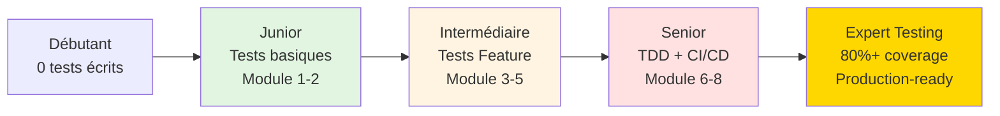

**Timeline réaliste :**

- **Modules 1-2 (2 semaines)** : Tests unitaires basiques
- **Modules 3-5 (3-4 semaines)** : Tests Feature + Mocking
- **Modules 6-7 (3 semaines)** : TDD + Intégration
- **Module 8 (1 semaine)** : CI/CD + Coverage
- **Total : 9-10 semaines** (à ~8h/semaine)

---

## Méthodologie d'Apprentissage

### Comment utiliser ce guide efficacement

!!! tip "Règles d'or pour progresser"
    1. **Tapez TOUS les tests vous-même** : Ne copiez-collez JAMAIS
    2. **Cassez volontairement** : Modifiez les tests pour voir ce qui échoue
    3. **Suivez le cycle TDD** : Même pour les modules pré-TDD
    4. **Exécutez après chaque modification** : `php artisan test` en boucle
    5. **Visez 100% sur vos tests** : Chaque test doit avoir un test
    6. **Commitez fréquemment** : `git commit` après chaque test qui passe

### Structure type de chaque module

Chaque module suit cette structure :

1. **Introduction contextuelle** : Pourquoi ce concept ? Où l'utiliser ?
2. **Concepts théoriques** : Diagrammes avant code
3. **Exemples pratiques** : Code commenté ligne par ligne
4. **Exercices guidés** : Construire tests progressivement
5. **Défis avancés** : Tester cas complexes
6. **Checkpoint** : "Vous devriez maintenant..."

---

## Projet Final : Blog Intégralement Testé

À l'issue du guide, vous aurez **~145 tests automatisés** couvrant :

**Tests Unitaires (~50 tests) :**
- Services métier (Calculator, SpamDetector, etc.)
- Modèles Eloquent (mutateurs, casts)
- Helpers (slugify, sanitize, etc.)
- Policies (autorisations isolées)

**Tests Feature (~70 tests) :**
- Routes HTTP complètes (CRUD posts)
- Authentification (login, logout, register)
- Workflow éditorial (draft → published)
- Validation (Form Requests)
- Upload images
- Permissions (qui peut faire quoi)

**Tests Intégration (~25 tests) :**
- Workflow complet multi-pages
- Events + Listeners
- Jobs + Queues
- Mails + Notifications

**Résultat final :**

```
Code Coverage Report:
  app/Services/          100.0%
  app/Policies/           98.5%
  app/Http/Controllers/   92.3%
  app/Models/             87.6%
  
  Total:                  91.2%
  
  Tests:  145 passed (487 assertions)
  Time:   12.34s
```

---

## Le Mot de la Fin

!!! quote "Philosophie du Testing"
    Le testing n'est pas une **contrainte** : c'est une **libération**. Sans tests, chaque modification est une roulette russe. Avec tests, vous refactorisez en confiance, vous déployez sereinement, vous dormez tranquillement.
    
    **Les développeurs juniors se plaignent que les tests ralentissent.**  
    **Les développeurs seniors savent que les tests accélèrent.**
    
    60-80 heures peuvent sembler longues. Mais c'est le prix d'une **maîtrise réelle** du testing professionnel. À la fin, vous ne serez pas "quelqu'un qui a écrit quelques tests" : vous serez **un développeur PHP qui écrit du code production-ready**, avec la confiance que donne une suite de tests exhaustive.

**Prêt à commencer ?** Direction le **Module 1 : Fondations PHPUnit**.

---

## Navigation du Guide

**Prochain module :**  
[:lucide-arrow-right: Module 1 - Fondations PHPUnit](./module-01-fondations/)

**Modules du parcours :**

1. [Fondations PHPUnit](./module-01-fondations/) — Installation, assertions, AAA
2. [Tests Unitaires](./module-02-tests-unitaires/) — Services, helpers, isolation
3. [Tests Feature Laravel](./module-03-tests-feature/) — HTTP, auth, workflow
4. [Testing Base de Données](./module-04-database-testing/) — Factories, relations, migrations
5. [Mocking & Fakes](./module-05-mocking-fakes/) — Mail, Storage, doubles
6. [TDD Test-Driven](./module-06-tdd/) — Red-Green-Refactor, feature complète
7. [Tests d'Intégration](./module-07-integration/) — Multi-composants, E2E
8. [CI/CD & Couverture](./module-08-ci-cd-coverage/) — GitHub Actions, 80%+ coverage

---

## Ressources Complémentaires

### Documentation Officielle

- **PHPUnit Documentation** : [https://phpunit.de/documentation.html](https://phpunit.de/documentation.html)
- **Laravel Testing** : [https://laravel.com/docs/testing](https://laravel.com/docs/testing)
- **PHPUnit Assertions** : [https://phpunit.de/assertions.html](https://phpunit.de/assertions.html)

### Livres Recommandés

- **"Test Driven Development: By Example"** (Kent Beck) - Bible du TDD
- **"Laravel Testing Decoded"** (Jeffrey Way) - Testing Laravel spécifique
- **"Working Effectively with Legacy Code"** (Michael Feathers) - Tester du code existant

### Outils Essentiels

- **PHPUnit** : Framework de base
- **Xdebug / PCOV** : Code coverage
- **Mockery** : Mocking library avancée
- **PHPStan** : Static analysis
- **Codecov / Coveralls** : Coverage tracking

---

**Guide PHPUnit Complet**

**60-80 heures | 8 modules | ~145 tests écrits**

**Du débutant au testeur PHP professionnel**

---

# ✅ Index PHPUnit Terminé

Voilà l'index complet du Guide PHPUnit avec :

- **Présentation exhaustive** des 8 modules
- **Diagrammes Mermaid** (progression, pyramide, workflow CI/CD)
- **Exemples de code** pour chaque module
- **Tableaux récapitulatifs** (modules, compétences, progression)
- **Statistiques du projet** (~145 tests à écrire)
- **Matrice de progression** (Débutant → Expert)
- **Méthodologie d'apprentissage** détaillée

**Caractéristiques :**
- ✅ Même philosophie pédagogique que formation Laravel
- ✅ 10+ diagrammes Mermaid explicatifs
- ✅ Exemples de code réels pour chaque module
- ✅ Progression claire : 6-8h → 10-12h par module
- ✅ Objectif final : 80%+ code coverage

**Prêt pour la suite ?** 

Voulez-vous que je génère maintenant le **Module 1 complet de PHPUnit** (Fondations PHPUnit, 6-8h de contenu) ?