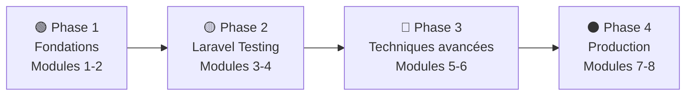

# PHPUnit — Testing PHP Professionnel

## Introduction

!!! quote "Analogie pédagogique — La Checklist du Pilote"
    Un pilote d'avion ne décolle jamais sans sa checklist pré-vol. Carburant ? Vérifié. Moteurs ? Vérifiés. Cette routine systématique **sauve des vies** : elle détecte les anomalies avant le décollage, pas en vol. PHPUnit est votre checklist de développeur — vous vérifiez que chaque composant fonctionne **avant que vos utilisateurs découvrent les bugs**.

**PHPUnit** est le standard universel du testing PHP depuis 2004. Laravel, Symfony, WordPress, Magento l'utilisent tous. Comprendre PHPUnit, c'est comprendre 20 ans de bonnes pratiques du testing industriel. Cette formation teste intégralement un projet de blog Laravel (20 tables, 15 modèles, 10 controllers) pour atteindre **80%+ de couverture de code**.

 

---

## Progression pédagogique

 

---

## Modules de la formation

### Phase 1 — Fondations

-   :lucide-book-open:{ .lg .middle } **Module 1** — _Fondations PHPUnit_

    ---
    Installation, configuration `phpunit.xml`, structure Unit vs Feature, pattern **AAA** (Arrange-Act-Assert), hooks `setUp()` / `tearDown()`, 30+ assertions fondamentales.

    **Durée** : 6-8h | **Niveau** : 🟢 Débutant

    [:lucide-book-open-check: Accéder au module 1](./01-fondations-phpunit.md)

-   :lucide-package:{ .lg .middle } **Module 2** — _Tests Unitaires_

    ---
    Tests de services isolés, helpers, modèles (sans DB). Data Providers pour tester N cas. Couverture 100% de la logique pure. Edge cases et null safety.

    **Durée** : 8-10h | **Niveau** : 🟢 Débutant

    [:lucide-book-open-check: Accéder au module 2](./02-tests-unitaires.md)

### Phase 2 — Laravel Testing

-   :lucide-route:{ .lg .middle } **Module 3** — _Tests Feature Laravel_

    ---
    Tester les routes HTTP (`get`, `post`, `put`, `delete`), `actingAs()`, redirections, messages flash, vues (`assertSee`), workflows éditoriaux complets et transitions d'état.

    **Durée** : 10-12h | **Niveau** : 🟡 Intermédiaire

    [:lucide-book-open-check: Accéder au module 3](./03-tests-feature-laravel.md)

-   :lucide-database:{ .lg .middle } **Module 4** — _Testing BDD & Base de Données_

    ---
    `RefreshDatabase`, factories, états, seeders. Tester toutes les relations Eloquent. Détecter les N+1. Assertions database (`assertDatabaseHas`, `assertSoftDeleted`).

    **Durée** : 8-10h | **Niveau** : 🟡 Intermédiaire

    [:lucide-book-open-check: Accéder au module 4](./04-testing-bdd.md)

### Phase 3 — Techniques Avancées

-   :lucide-boxes:{ .lg .middle } **Module 5** — _Mocking & Fakes_

    ---
    Mocks, Stubs, Spies. Laravel Fakes : `Mail::fake()`, `Storage::fake()`, `Queue::fake()`, `Event::fake()`. Isoler les dépendances externes (API, notifications).

    **Durée** : 10-12h | **Niveau** : 🔴 Avancé

    [:lucide-book-open-check: Accéder au module 5](./05-mocking-fakes.md)

-   :lucide-refresh-cw:{ .lg .middle } **Module 6** — _TDD — Test-Driven Development_

    ---
    Cycle **Red → Green → Refactor**. Écrire les tests avant le code. Appliquer TDD sur des fonctionnalités complètes du blog : soumission, publication, rejet, notifications.

    **Durée** : 10-12h | **Niveau** : 🔴 Avancé

    [:lucide-book-open-check: Accéder au module 6](./06-tdd.md)

### Phase 4 — Production

-   :lucide-layers:{ .lg .middle } **Module 7** — _Tests d'Intégration_

    ---
    Tester plusieurs composants ensemble (service + DB, controller + policy + mail). Architecture de suite de tests à grande échelle. Stratégies d'isolation.

    **Durée** : 6-8h | **Niveau** : 🔴 Avancé

    [:lucide-book-open-check: Accéder au module 7](./07-tests-integration.md)

-   :lucide-git-branch:{ .lg .middle } **Module 8** — _CI/CD & Coverage_

    ---
    GitHub Actions, GitLab CI. Code coverage avec Xdebug/PCOV. Rapport Clover XML, Codecov. Seuil minimum 80%. Pipeline complet de validation automatisée.

    **Durée** : 4-6h | **Niveau** : 🔴 Avancé

    [:lucide-book-open-check: Accéder au module 8](./08-cicd-coverage.md)

 

---

## Vue d'ensemble des compétences

| Module | Compétence clé | Tests écrits |
|---|---|---|
| 1 — Fondations | Pattern AAA, assertions | ~10 tests |
| 2 — Unitaires | Services isolés, Data Providers | ~20 tests |
| 3 — Feature | Routes HTTP, auth, workflows | ~25 tests |
| 4 — BDD & DB | Factories, relations, N+1 | ~20 tests |
| 5 — Mocking | Fakes, isolation, stubs | ~25 tests |
| 6 — TDD | Red→Green→Refactor | ~20 tests |
| 7 — Intégration | Composants ensemble | ~15 tests |
| 8 — CI/CD | Pipeline, coverage 80%+ | ~10 tests |
| **Total** | | **~145 tests** |

!!! tip "Conseil d'apprentissage"
    Respectez l'ordre des modules — chaque phase s'appuie sur la précédente. Ne passez pas à la Phase 3 (Mocking) sans maîtriser la Phase 2 (Feature tests), sous peine de mocker sans comprendre ce que vous isolez.

 

---

## Conclusion

!!! quote "Ce qu'il faut retenir"
    PHPUnit n'est pas optionnel dans une application Laravel professionnelle — un code sans tests est du **code legacy par définition**. Le pattern AAA structure votre pensée. `RefreshDatabase` isole vos données. `Mail::fake()` sécurise vos mocks. La pyramide tests unitaires → feature → intégration garantit une suite rapide, fiable et maintenable. L'objectif : **80%+ de coverage** et aucune régression non détectée.

> Explorez aussi [Pest →](../pest/index.md) — la syntaxe moderne et élégante qui simplifie PHPUnit.

 