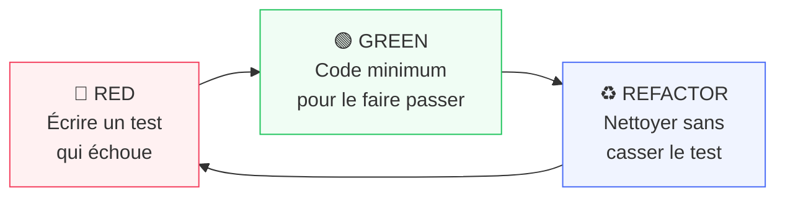

# TDD & BDD — Méthodologies de Test

<div
  class="omny-meta"
  data-level="🟡 Intermédiaire"
  data-version="2024"
  data-time="4-6 heures">
</div>

## Introduction

!!! quote "Analogie pédagogique — L'Architecte et le Plan"
    Un architecte ne commence pas à construire un mur pour voir s'il tient debout : il dessine d'abord le plan, définit les exigences structurelles, *puis* construit. TDD fonctionne pareil : vous définissez d'abord ce que le code **doit** faire (le test), observez l'échec (le plan montre le manque), puis écrivez le code minimum pour le satisfaire. Aucune surprise, aucune construction aveugle.

**TDD (Test-Driven Development)** est une pratique de développement qui inverse l'ordre habituel : on écrit le test **avant** le code. **BDD (Behavior-Driven Development)** étend TDD en formulant les tests en langage naturel, centré sur le **comportement observable** par l'utilisateur.

> TDD et BDD ne sont pas des outils — ce sont des **disciplines de travail**. Elles changent la façon dont vous pensez avant d'écrire.

<br>

---

## 1. TDD — Test-Driven Development

### Le Cycle Red → Green → Refactor



**Règles fondamentales du TDD :**

1. N'écrire **aucun code de production** sans un test qui échoue
2. N'écrire que le **minimum de code** pour faire passer le test
3. Ne pas **refactoriser** sans avoir des tests qui passent

### Exemple Complet — Calculateur de Prix

```php title="PHP — TDD Complet : RED → GREEN → REFACTOR"
// ─── 🔴 ÉTAPE 1 : RED — Écrire le test AVANT la classe ───────────────────────
// tests/Unit/PriceCalculatorTest.php

class PriceCalculatorTest extends TestCase
{
    /** @test */
    public function it_calculates_price_with_vat(): void
    {
        $calculator = new PriceCalculator();

        $result = $calculator->withVat(100.00, vatRate: 20);

        $this->assertEquals(120.00, $result);
    }
}

// 🔴 Lancer : php artisan test → FAIL (PriceCalculator n'existe pas)
```

```php title="PHP — TDD : GREEN — Code minimum (même imparfait)"
// ─── 🟢 ÉTAPE 2 : GREEN — Code MINIMUM pour passer ───────────────────────────
// app/Services/PriceCalculator.php

class PriceCalculator
{
    public function withVat(float $price, int $vatRate): float
    {
        return 120.00;  // ← Valeur en dur ! Minimum absolu.
    }
}

// 🟢 Lancer : php artisan test → PASS ✅
// → Oui, retourner 120 en dur est intentionnel. On fait passer le test d'abord.
```

```php title="PHP — TDD : RED — Nouveau test pour forcer la vraie logique"
// ─── 🔴 ÉTAPE 3 : Nouveau test pour casser le hardcode ───────────────────────
/** @test */
public function it_calculates_price_with_different_vat_rates(): void
{
    $calculator = new PriceCalculator();

    $this->assertEquals(105.50, $calculator->withVat(100.00, vatRate: 5.5));
    $this->assertEquals(110.00, $calculator->withVat(100.00, vatRate: 10));
    $this->assertEquals(100.00, $calculator->withVat(100.00, vatRate: 0));
}

// 🔴 FAIL → Le hardcode 120 ne passe plus
```

```php title="PHP — TDD : GREEN + REFACTOR — Vraie implémentation propre"
// ─── 🟢 ÉTAPE 4 : GREEN + REFACTOR ───────────────────────────────────────────
class PriceCalculator
{
    /**
     * Calcule le prix TTC à partir du HT et du taux de TVA.
     *
     * @param  float $priceHT  Prix hors taxes
     * @param  float $vatRate  Taux de TVA en pourcentage (ex: 20 pour 20%)
     */
    public function withVat(float $priceHT, float $vatRate): float
    {
        return round($priceHT * (1 + $vatRate / 100), 2);
    }

    /**
     * Calcule le prix HT à partir du TTC et du taux de TVA.
     */
    public function withoutVat(float $priceTTC, float $vatRate): float
    {
        return round($priceTTC / (1 + $vatRate / 100), 2);
    }
}

// 🟢 Tous les tests passent → ♻️ Code propre, nommage explicite, PHPDoc
```

<br>

---

## 2. BDD — Behavior-Driven Development

BDD déplace le focus de l'**implémentation** vers le **comportement observable**. Les scénarios sont rédigés en langage naturel structuré (Gherkin).

### Format Gherkin

```gherkin title="Gherkin — Langage naturel structuré pour les scénarios BDD"
Feature: Panier d'achat
  En tant qu'utilisateur connecté
  Je veux pouvoir ajouter des produits à mon panier
  Afin de préparer ma commande

  Scenario: Ajouter un produit disponible
    Given   je suis connecté en tant que "alice@example.com"
    And     le produit "Laravel Pro" est disponible au prix de 49.99€
    When    j'ajoute ce produit à mon panier
    Then    mon panier contient 1 article
    And     le total du panier est de 49.99€

  Scenario: Ajouter un produit en rupture de stock
    Given   je suis connecté en tant que "alice@example.com"
    And     le produit "Ancien Cours" est en rupture de stock
    When    j'essaie d'ajouter ce produit à mon panier
    Then    je vois un message "Produit indisponible"
    And     mon panier reste vide
```

### BDD avec Pest — Syntaxe `describe/it`

```php title="PHP — BDD-style avec Pest : describe() + it()"
<?php

use App\Models\Cart;
use App\Models\Product;
use App\Models\User;

// Pest permet d'écrire en style BDD nativement :
describe('Cart', function () {

    describe('adding products', function () {

        it('adds an available product', function () {
            $user    = User::factory()->create();
            $product = Product::factory()->create(['stock' => 10, 'price' => 49.99]);
            $cart    = new Cart($user);

            $cart->add($product);

            expect($cart->count())->toBe(1);
            expect($cart->total())->toBe(49.99);
        });

        it('rejects an out-of-stock product', function () {
            $user    = User::factory()->create();
            $product = Product::factory()->create(['stock' => 0]);
            $cart    = new Cart($user);

            expect(fn () => $cart->add($product))
                ->toThrow(OutOfStockException::class, 'Produit indisponible');

            expect($cart->count())->toBe(0);
        });

        it('updates quantity when adding same product twice', function () {
            $user    = User::factory()->create();
            $product = Product::factory()->create(['stock' => 10, 'price' => 25.00]);
            $cart    = new Cart($user);

            $cart->add($product);
            $cart->add($product);

            expect($cart->count())->toBe(1);
            expect($cart->quantity($product))->toBe(2);
            expect($cart->total())->toBe(50.00);
        });
    });
});
```

<br>

---

## 3. TDD vs BDD — Quand Utiliser Quoi ?

| Critère | TDD | BDD |
|---|---|---|
| **Focus** | Implémentation correcte | Comportement utilisateur |
| **Rédigé par** | Développeur | Dev + PO + QA |
| **Langage** | PHP/code | Gherkin ou pseudo-naturel |
| **Granularité** | Unitaire (fonctions, classes) | Feature/Acceptance |
| **Vitesse d'exécution** | Ultra-rapide | Plus lent (scénarios complets) |
| **Outils PHP** | PHPUnit, Pest | Behat, Pest describe/it |
| **Idéal pour** | Logique métier complexe | Spécifications fonctionnelles |

!!! tip "Conseil pratique"
    Utilisez **TDD** pour les classes de service, les calculs, les validators, les repositories. Utilisez **BDD** (ou les tests Feature Laravel) pour les flows utilisateur complets : inscription, paiement, authentification.

<br>

---

## 4. Bonnes Pratiques

```php title="PHP — Bonnes pratiques TDD : nommage et organisation"
// ─── Nommage des tests : verbe_condition_résultat_attendu ──────────────────────
class InvoiceServiceTest extends TestCase
{
    // ✅ Nommage descriptif
    public function test_generates_pdf_for_paid_invoice(): void {}
    public function test_throws_exception_when_invoice_not_found(): void {}
    public function test_sends_email_notification_after_generation(): void {}

    // ❌ Nommage vague
    public function test_pdf(): void {}
    public function test_error(): void {}
    public function test1(): void {}
}

// ─── Structure AAA : Arrange / Act / Assert ────────────────────────────────────
public function test_discount_is_applied_for_premium_user(): void
{
    // Arrange — Préparer le contexte
    $user    = User::factory()->premium()->create();
    $product = Product::factory()->create(['price' => 100.00]);
    $service = new PricingService();

    // Act — Exécuter l'action testée
    $price = $service->calculateFor($user, $product);

    // Assert — Vérifier le résultat
    $this->assertEquals(80.00, $price); // 20% de réduction premium
}

// ─── Given / When / Then (alternative BDD-style en PHPUnit) ──────────────────
public function test_cart_total_includes_all_items(): void
{
    // Given
    $cart = new Cart();
    $cart->add(Product::factory()->make(['price' => 10.00]), quantity: 2);
    $cart->add(Product::factory()->make(['price' => 5.00]),  quantity: 3);

    // When
    $total = $cart->total();

    // Then
    $this->assertEquals(35.00, $total); // (10×2) + (5×3)
}
```

<br>

---

## Exercices

!!! note "À vous de jouer"

**Exercice 1 — Cycle TDD complet**

```php title="PHP — Exercice 1 : implémenter un PasswordValidator en TDD"
// Appliquez le cycle RED → GREEN → REFACTOR pour créer un PasswordValidator
// qui valide les mots de passe selon ces règles :
// - Longueur >= 8 caractères
// - Au moins 1 majuscule
// - Au moins 1 chiffre
// - Au moins 1 caractère spécial
// - Pas de nom d'utilisateur inclus

// Étapes :
// 1. Écrivez 5 tests (un par règle) → RED
// 2. Implémentez le minimum pour chaque test → GREEN (l'un après l'autre)
// 3. Refactorisez la classe finale → REFACTOR
// 4. Ajoutez 2 tests de frontière (longueur exactement 8, mot de passe vide)
```

**Exercice 2 — BDD Feature Test**

```php title="PHP — Exercice 2 : scénario BDD avec Pest pour un blog"
// Écrivez un test Feature BDD-style avec Pest pour ce scénario :
// "Un auteur peut publier son article draft"
//
// Given : l'utilisateur est connecté et possède un article en status 'draft'
// When  : il envoie POST /api/posts/{id}/publish
// Then  : l'article est en status 'published'
//         une notification est envoyée (fake mail)
//         la réponse JSON contient le post mis à jour
```

<br>

---

## Conclusion

!!! quote "Ce qu'il faut retenir"
    TDD n'est pas "écrire des tests en plus" — c'est **penser différemment**. En écrivant le test en premier, vous définissez l'API publique de votre classe avant son implémentation, ce qui force des abstractions propres et une responsabilité unique. BDD déplace la conversation vers le "quoi" (comportement) plutôt que le "comment" (implémentation). Le cycle **Red → Green → Refactor** est court — quelques minutes par itération. La discipline s'acquiert en pratiquant, pas en lisant.

> Prochaine étape : [Coverage →](./coverage.md) — mesurer l'efficacité de votre suite de tests.

<br>