# Administration Système

<div
  class="omny-meta"
  data-level="🟢 Tout niveau"
  data-version="1.0"
  data-time="Consultation">
</div>


!!! quote "Analogie pédagogique"
    _Administrer un système, c'est comme gérer un grand navire. Le noyau (kernel) est la salle des machines, les processus sont l'équipage effectuant leurs tâches, et l'administrateur est le capitaine qui s'assure que personne ne consomme trop de rations (RAM) et que la coque (sécurité) reste étanche._

## A

### ACL

!!! note "Définition"
    Liste de contrôle d'accès définissant les permissions spécifiques d'utilisateurs ou groupes sur des ressources.

Utilisé pour la sécurité fine des fichiers, répertoires et services système.

- **Acronyme :** Access Control List
- **Extension :** des permissions UNIX classiques (rwx) — `getfacl` / `setfacl`

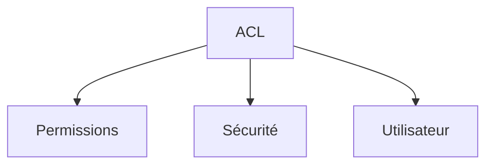

_Explication : ACL est défini comme : liste de contrôle d'accès définissant les permissions spécifiques d'utilisateurs ou groupes sur des ressources._

<br>

---

### Ansible

!!! note "Définition"
    Outil d'automatisation IT permettant la configuration, déploiement et gestion d'infrastructure.

Utilisé pour l'automatisation des tâches système et le configuration management sans agent.

- **Langage :** YAML (playbooks, roles, inventories)
- **Avantages :** agentless (SSH), idempotent, large communauté

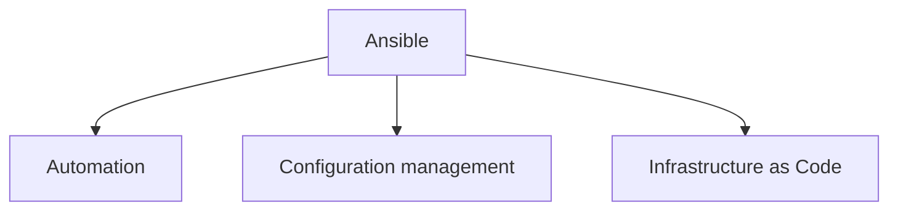

_Explication : Ansible est défini comme : outil d'automatisation IT permettant la configuration, déploiement et gestion d'infrastructure._

<br>

---

### APT

!!! note "Définition"
    Gestionnaire de paquets avancé pour les distributions Debian et dérivées (Ubuntu, Debian, Mint).

Utilisé pour installer, mettre à jour et supprimer des logiciels avec gestion des dépendances.

- **Acronyme :** Advanced Package Tool
- **Commandes :** `apt install`, `apt update`, `apt upgrade`, `apt remove`

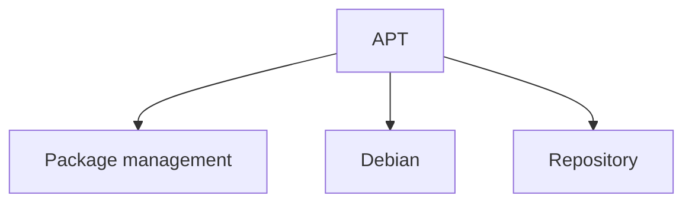

_Explication : APT est défini comme : gestionnaire de paquets avancé pour les distributions Debian et dérivées (Ubuntu, Debian, Mint)._

<br>

---

## B

### Bash

!!! note "Définition"
    Shell Unix populaire et langage de script pour l'automatisation de tâches système.

Utilisé comme interface en ligne de commande par défaut sur la majorité des distributions Linux.

- **Acronyme :** Bourne Again Shell
- **Fonctionnalités :** variables, boucles, conditions, pipes, redirections

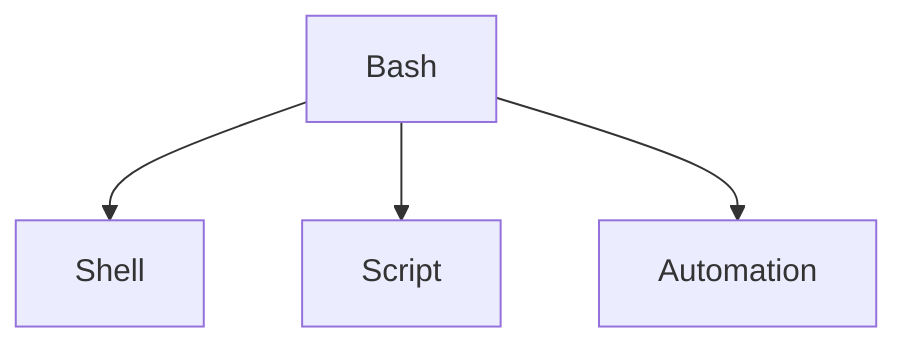

_Explication : Bash est défini comme : shell Unix populaire et langage de script pour l'automatisation de tâches système._

<br>

---

### Backup

!!! note "Définition"
    Processus de copie et sauvegarde des données pour prévenir leur perte en cas de défaillance.

Utilisé pour la continuité d'activité et la récupération après sinistre (PRA/PCA).

- **Types :** complet, incrémental, différentiel
- **Stratégie :** règle 3-2-1 — 3 copies, sur 2 supports différents, dont 1 hors site

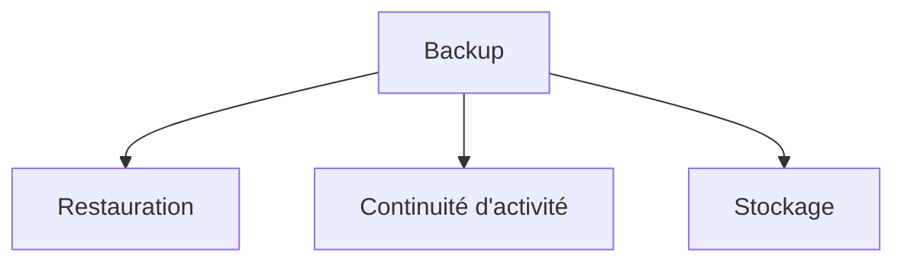

_Explication : Backup est défini comme : processus de copie et sauvegarde des données pour prévenir leur perte en cas de défaillance._

<br>

---

## C

### Chroot

!!! note "Définition"
    Technique d'isolation changeant la racine apparente du système de fichiers pour un processus.

Utilisé pour la sécurité, les tests et l'isolation d'applications dans un environnement cloisonné.

- **Principe :** création d'un environnement racine virtuel (`/` isolé)
- **Évolution :** précurseur des containers modernes (Docker, LXC)

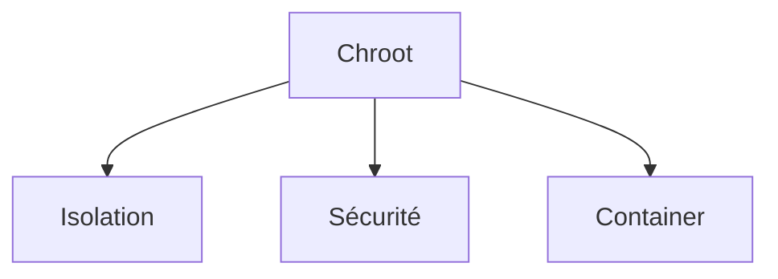

_Explication : Chroot est défini comme : technique d'isolation changeant la racine apparente du système de fichiers pour un processus._

<br>

---

### Cron

!!! note "Définition"
    Démon Unix planificateur de tâches permettant l'exécution automatique de commandes à intervalles définis.

Utilisé pour l'automatisation de maintenance, sauvegardes, monitoring et rapports périodiques.

- **Format :** `minute heure jour mois jour_semaine commande`
- **Fichiers :** crontab personnel (`crontab -e`), `/etc/crontab` système

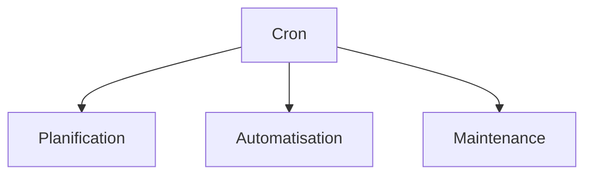

_Explication : Cron est défini comme : démon Unix planificateur de tâches permettant l'exécution automatique de commandes à intervalles définis._

<br>

---

### CIS Benchmarks

!!! note "Définition"
    Standards de configuration sécurisée pour systèmes, réseaux et applications produits par le CIS.

Utilisé pour le durcissement et l'audit de sécurité des infrastructures IT.

- **Acronyme :** Center for Internet Security
- **Niveaux :** Level 1 (configuration de base), Level 2 (défense en profondeur)

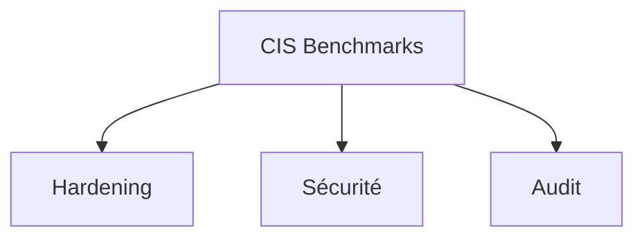

_Explication : CIS Benchmarks est défini comme : standards de configuration sécurisée pour systèmes, réseaux et applications produits par le CIS._

<br>

---

## D

### Daemon

!!! note "Définition"
    Programme s'exécutant en arrière-plan comme service système sans interaction utilisateur directe.

Utilisé pour fournir des services persistants (serveur web, base de données, réseau).

- **Convention de nommage :** nom terminé par 'd' (`httpd`, `sshd`, `mysqld`)
- **Gestion :** systemd, init.d, service

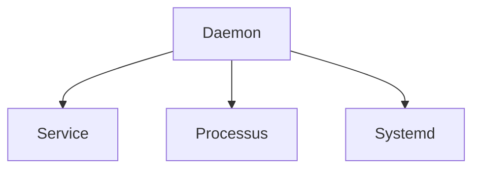

_Explication : Daemon est défini comme : programme s'exécutant en arrière-plan comme service système sans interaction utilisateur directe._

<br>

---

### DHCP

!!! note "Définition"
    Protocole d'attribution automatique d'adresses IP et de configuration réseau aux hôtes.

Utilisé pour simplifier la gestion réseau et éviter les conflits d'adresses IP.

- **Acronyme :** Dynamic Host Configuration Protocol
- **Composants :** serveur DHCP, client, pool d'adresses, lease (durée de bail)

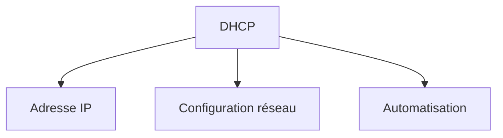

_Explication : DHCP est défini comme : protocole d'attribution automatique d'adresses IP et de configuration réseau aux hôtes._

<br>

---

## E

### EXT4

!!! note "Définition"
    Système de fichiers journalisé par défaut sur la plupart des distributions Linux.

Utilisé pour le stockage des données avec fiabilité et performance sur volumes Linux.

- **Acronyme :** Fourth Extended File System
- **Fonctionnalités :** journalisation, extents (blocs contigus), allocation retardée

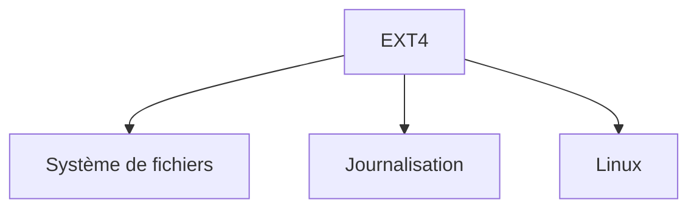

_Explication : EXT4 est défini comme : système de fichiers journalisé par défaut sur la plupart des distributions Linux._

<br>

---

## F

### Fail2ban

!!! note "Définition"
    Outil de protection contre les attaques par force brute analysant les logs système en temps réel.

Utilisé pour bloquer automatiquement les adresses IP suspectes via des règles de firewall dynamiques.

- **Principe :** analyse des logs → détection de patterns → action (ban IP)
- **Services protégés :** SSH, HTTP, FTP, mail, applications web

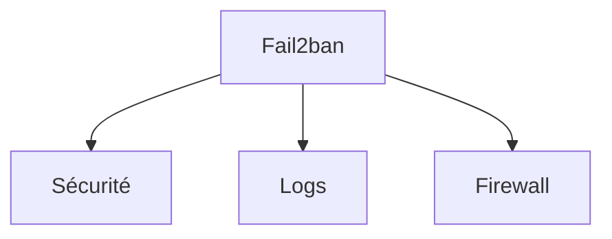

_Explication : Fail2ban est défini comme : outil de protection contre les attaques par force brute analysant les logs système en temps réel._

<br>

---

### Filesystem

!!! note "Définition"
    Organisation logique et hiérarchique du stockage des fichiers et répertoires sur un support.

Utilisé pour structurer, organiser et accéder aux données stockées sur disque.

- **Types :** EXT4, NTFS (Windows), APFS (macOS), ZFS, Btrfs
- **Fonctions :** métadonnées, permissions, indexation, journalisation

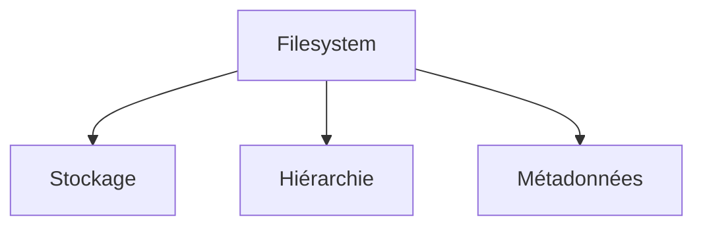

_Explication : Filesystem est défini comme : organisation logique et hiérarchique du stockage des fichiers et répertoires sur un support._

<br>

---

## G

### GPT

!!! note "Définition"
    Standard moderne de partitionnement de disque remplaçant le MBR traditionnel.

Utilisé pour les disques de grande capacité et le démarrage UEFI sur les systèmes modernes.

- **Acronyme :** GUID Partition Table
- **Avantages :** support disques > 2 To, jusqu'à 128 partitions, redondance de la table


_Explication : GPT est défini comme : standard moderne de partitionnement de disque remplaçant le MBR traditionnel._

<br>

---

## H

### Hardening

!!! note "Définition"
    Processus de sécurisation d'un système par configuration rigoureuse et suppression des vulnérabilités.

Utilisé pour réduire la surface d'attaque et améliorer la posture sécuritaire d'un serveur.

- **Techniques :** désactivation services inutiles, mises à jour, configuration sécurisée, SELinux
- **Standards :** CIS Benchmarks, DISA STIG

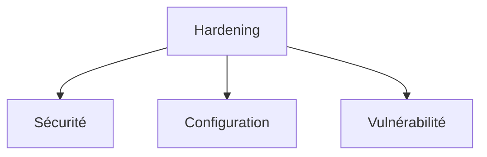

_Explication : Hardening est défini comme : processus de sécurisation d'un système par configuration rigoureuse et suppression des vulnérabilités._

<br>

---

### Htop

!!! note "Définition"
    Moniteur de processus interactif et amélioré pour systèmes Unix/Linux, successeur de `top`.

Utilisé pour surveiller l'utilisation des ressources système (CPU, RAM, processus) en temps réel.

- **Amélioré par rapport à :** `top` (interface colorée, tri interactif, recherche)
- **Fonctionnalités :** gestion des processus, arborescence, filtrage

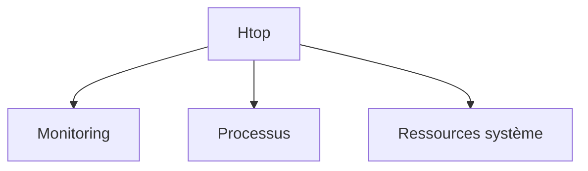

_Explication : Htop est défini comme : moniteur de processus interactif et amélioré pour systèmes Unix/Linux, successeur de `top`._

<br>

---

## I

### Inode

!!! note "Définition"
    Structure de données contenant les métadonnées d'un fichier dans les systèmes Unix/Linux.

Utilisé pour l'organisation interne des fichiers — un inode = un fichier, indépendamment du nom.

- **Contenu :** permissions, propriétaire, taille, timestamps, pointeurs vers les blocs de données
- **Limitation :** nombre d'inodes fixe à la création du filesystem — `df -i` pour vérifier

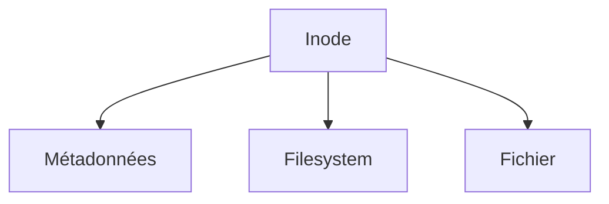

_Explication : Inode est défini comme : structure de données contenant les métadonnées d'un fichier dans les systèmes Unix/Linux._

<br>

---

### Iptables

!!! note "Définition"
    Framework de filtrage de paquets réseau pour Linux basé sur le module noyau Netfilter.

Utilisé pour implémenter des firewalls, NAT et manipulation de paquets sur Linux.

- **Concepts :** tables (`filter`, `nat`, `mangle`), chaînes (`INPUT`, `OUTPUT`, `FORWARD`)
- **Successeur :** nftables (syntaxe unifiée, meilleures performances)

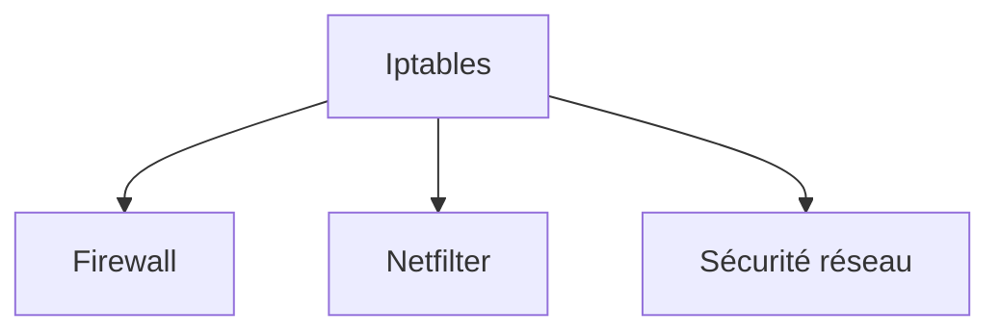

_Explication : Iptables est défini comme : framework de filtrage de paquets réseau pour Linux basé sur le module noyau Netfilter._

<br>

---

## J

### Journald

!!! note "Définition"
    Service de journalisation centralisé faisant partie de systemd.

Utilisé pour collecter, stocker et consulter les logs système de manière unifiée et indexée.

- **Commande :** `journalctl` (avec filtres : `-u service`, `-f` follow, `-n` lignes)
- **Avantages :** indexation binaire, recherche rapide, rotation automatique

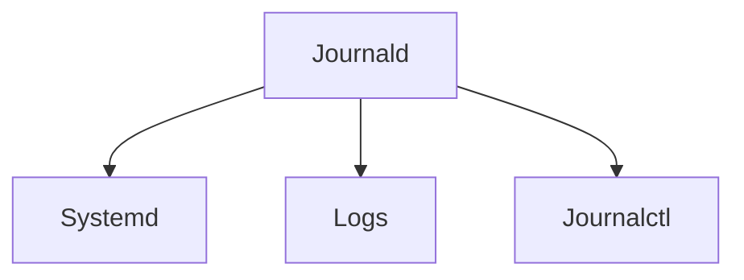

_Explication : Journald est défini comme : service de journalisation centralisé faisant partie de systemd._

<br>

---

## K

### Kernel

!!! note "Définition"
    Noyau du système d'exploitation gérant les ressources matérielles et logicielles.

Utilisé comme interface entre les applications et le matériel — couche la plus basse de l'OS.

- **Fonctions :** gestion mémoire, scheduler de processus, pilotes, système de fichiers
- **Types :** monolithique (Linux), microkernel (Minix), hybride (macOS)

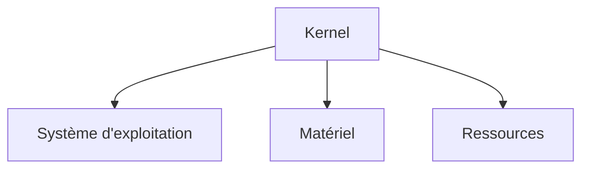

_Explication : Kernel est défini comme : noyau du système d'exploitation gérant les ressources matérielles et logicielles._

<br>

---

### KVM

!!! note "Définition"
    Solution de virtualisation intégrée au noyau Linux exploitant les extensions matérielles CPU.

Utilisé pour créer et gérer des machines virtuelles haute performance sur Linux.

- **Acronyme :** Kernel-based Virtual Machine
- **Outils de gestion :** libvirt, QEMU, virt-manager, Proxmox

```mermaid
graph TB
    A[KVM] --> B[Virtualisation]
    A --> C[Hyperviseur]
    A --> D[Machine virtuelle]
```

_Explication : KVM est défini comme : solution de virtualisation intégrée au noyau Linux exploitant les extensions matérielles CPU._

<br>

---

## L

### LDAP

!!! note "Définition"
    Protocole d'accès et de gestion d'annuaires informatiques centralisés.

Utilisé pour l'authentification centralisée et la gestion des identités dans les entreprises.

- **Acronyme :** Lightweight Directory Access Protocol
- **Implémentations :** Active Directory (Microsoft), OpenLDAP (open source)

```mermaid
graph TB
    A[LDAP] --> B[Annuaire]
    A --> C[Authentification]
    A --> D[Active Directory]
```

_Explication : LDAP est défini comme : protocole d'accès et de gestion d'annuaires informatiques centralisés._

<br>

---

### LVM

!!! note "Définition"
    Gestionnaire de volumes logiques permettant une gestion flexible et dynamique du stockage.

Utilisé pour redimensionner, déplacer et sauvegarder (snapshots) les volumes à chaud.

- **Acronyme :** Logical Volume Manager
- **Composants :** PV (Physical Volume) → VG (Volume Group) → LV (Logical Volume)

```mermaid
graph TB
    A[LVM] --> B[Volume logique]
    A --> C[Stockage flexible]
    A --> D[Redimensionnement]
```

_Explication : LVM est défini comme : gestionnaire de volumes logiques permettant une gestion flexible et dynamique du stockage._

<br>

---

### Log rotation

!!! note "Définition"
    Processus automatique d'archivage et de suppression des anciens fichiers de logs.

Utilisé pour éviter la saturation de l'espace disque tout en conservant un historique exploitable.

- **Outils :** logrotate (Linux), newsyslog (BSD)
- **Stratégies :** rotation par taille, par périodicité, compression gzip

```mermaid
graph TB
    A[Log rotation] --> B[Logs]
    A --> C[Espace disque]
    A --> D[Archivage]
```

_Explication : Log rotation est défini comme : processus automatique d'archivage et de suppression des anciens fichiers de logs._

<br>

---

## M

### Mount

!!! note "Définition"
    Action de rendre accessible un système de fichiers en l'attachant à l'arborescence Linux.

Utilisé pour accéder aux disques, partitions, systèmes de fichiers distants (NFS, CIFS).

- **Commandes :** `mount` (monter), `umount` (démonter), `findmnt` (lister)
- **Points de montage :** répertoires servant d'accès aux filesystems (ex. `/mnt`, `/media`)

```mermaid
graph TB
    A[Mount] --> B[Filesystem]
    A --> C[Point de montage]
    A --> D[Arborescence]
```

_Explication : Mount est défini comme : action de rendre accessible un système de fichiers en l'attachant à l'arborescence Linux._

<br>

---

### MBR

!!! note "Définition"
    Secteur de démarrage traditionnel contenant la table de partitions et le bootloader (GRUB).

Utilisé sur les systèmes BIOS hérités pour le démarrage et le partitionnement du disque.

- **Acronyme :** Master Boot Record
- **Limitations :** 4 partitions primaires maximum, disques < 2 To — remplacé par GPT/UEFI

```mermaid
graph TB
    A[MBR] --> B[Partitionnement]
    A --> C[BIOS]
    A --> D[GPT]
```

_Explication : MBR est défini comme : secteur de démarrage traditionnel contenant la table de partitions et le bootloader (GRUB)._

<br>

---

## N

### NFS

!!! note "Définition"
    Protocole de partage de fichiers en réseau permettant l'accès distant transparent à des systèmes de fichiers.

Utilisé pour partager des systèmes de fichiers entre machines Unix/Linux sur un réseau local.

- **Acronyme :** Network File System
- **Versions :** NFSv3 (stateless), NFSv4 (avec sécurité Kerberos, stateful)

```mermaid
graph TB
    A[NFS] --> B[Partage de fichiers]
    A --> C[Réseau]
    A --> D[Montage distant]
```

_Explication : NFS est défini comme : protocole de partage de fichiers en réseau permettant l'accès distant transparent à des systèmes de fichiers._

<br>

---

### Nftables

!!! note "Définition"
    Framework moderne de filtrage réseau succédant à iptables sur Linux.

Utilisé pour la gestion avancée du trafic réseau, firewall et NAT avec une syntaxe unifiée.

- **Avantages :** syntaxe unifiée IPv4/IPv6, performance améliorée, moins de tables
- **Compatibilité :** peut coexister avec iptables via des modules de compatibilité

```mermaid
graph TB
    A[Nftables] --> B[Iptables]
    A --> C[Firewall]
    A --> D[Netfilter]
```

_Explication : Nftables est défini comme : framework moderne de filtrage réseau succédant à iptables sur Linux._

<br>

---

## P

### PAM

!!! note "Définition"
    Framework d'authentification modulaire permettant de configurer les méthodes d'authentification.

Utilisé pour centraliser et standardiser l'authentification système sur Linux.

- **Acronyme :** Pluggable Authentication Modules
- **Modules courants :** `pam_unix`, `pam_ldap`, `pam_google_authenticator` (MFA)

```mermaid
graph TB
    A[PAM] --> B[Authentification]
    A --> C[Modules]
    A --> D[Sécurité]
```

_Explication : PAM est défini comme : framework d'authentification modulaire permettant de configurer les méthodes d'authentification._

<br>

---

### PID

!!! note "Définition"
    Identifiant numérique unique attribué à chaque processus en cours d'exécution.

Utilisé pour identifier, surveiller et gérer les processus système.

- **Acronyme :** Process ID
- **Commandes :** `ps`, `top`, `htop`, `kill <PID>`, `pgrep <nom>`

```mermaid
graph TB
    A[PID] --> B[Processus]
    A --> C[Gestion]
    A --> D[Surveillance]
```

_Explication : PID est défini comme : identifiant numérique unique attribué à chaque processus en cours d'exécution._

<br>

---

## R

### RAID

!!! note "Définition"
    Techniques de regroupement de disques pour améliorer la performance et/ou la redondance des données.

Utilisé pour la haute disponibilité du stockage et la protection des données en cas de panne disque.

- **Acronyme :** Redundant Array of Independent Disks
- **Niveaux courants :** RAID 0 (performance), RAID 1 (miroir), RAID 5 (parité distribuée), RAID 6, RAID 10

```mermaid
graph TB
    A[RAID] --> B[Redondance]
    A --> C[Performance]
    A --> D[Stockage]
```

_Explication : RAID est défini comme : techniques de regroupement de disques pour améliorer la performance et/ou la redondance des données._

<br>

---

### RPM

!!! note "Définition"
    Format de paquet et gestionnaire pour les distributions Red Hat et dérivées (RHEL, Fedora, CentOS).

Utilisé pour installer, mettre à jour et gérer les logiciels avec résolution des dépendances.

- **Acronyme :** RPM Package Manager (anciennement Red Hat Package Manager)
- **Commandes :** `rpm` (bas niveau), `yum` (obsolète), `dnf` (actuel)

!!! warning "Homonymie"
    En mécanique, RPM désigne aussi les **rotations par minute** d'un disque dur (ex. 7200 RPM). Contexte différent.

```mermaid
graph TB
    A[RPM] --> B[Package management]
    A --> C[Red Hat]
    A --> D[DNF]
```

_Explication : RPM est défini comme : format de paquet et gestionnaire pour les distributions Red Hat et dérivées (RHEL, Fedora, CentOS)._

<br>

---

### Rsync

!!! note "Définition"
    Outil de synchronisation de fichiers efficace utilisant des algorithmes delta (transfert différentiel).

Utilisé pour les sauvegardes, synchronisations et transferts optimisés locaux ou distants.

- **Avantages :** transfert incrémental (seuls les blocs modifiés), compression, préservation des métadonnées
- **Utilisation :** backup, déploiement de code, migration de données

```mermaid
graph TB
    A[Rsync] --> B[Synchronisation]
    A --> C[Backup]
    A --> D[Transfert]
```

_Explication : Rsync est défini comme : outil de synchronisation de fichiers efficace utilisant des algorithmes delta (transfert différentiel)._

<br>

---

## S

### SELinux

!!! note "Définition"
    Système de contrôle d'accès obligatoire (MAC) ajoutant une couche de sécurité renforcée au noyau Linux.

Utilisé pour confiner les processus et limiter les dégâts en cas de compromission d'un service.

- **Acronyme :** Security-Enhanced Linux
- **Modes :** `enforcing` (applique les règles), `permissive` (log uniquement), `disabled`

```mermaid
graph TB
    A[SELinux] --> B[Sécurité]
    A --> C[Confinement]
    A --> D[Contrôle d'accès]
```

_Explication : SELinux est défini comme : système de contrôle d'accès obligatoire (MAC) ajoutant une couche de sécurité renforcée au noyau Linux._

<br>

---

### SSH

!!! note "Définition"
    Protocole de communication sécurisée permettant l'accès distant chiffré à des systèmes.

Utilisé pour l'administration à distance, transfert de fichiers (SCP/SFTP) et tunneling sécurisé.

- **Acronyme :** Secure Shell
- **Fonctionnalités :** authentification par clé publique, port forwarding, X11 forwarding, SFTP

```mermaid
graph TB
    A[SSH] --> B[Accès distant]
    A --> C[Chiffrement]
    A --> D[Administration]
```

_Explication : SSH est défini comme : protocole de communication sécurisée permettant l'accès distant chiffré à des systèmes._

<br>

---

### Sudo

!!! note "Définition"
    Commande permettant l'exécution de commandes avec les privilèges d'un autre utilisateur (root).

Utilisé pour l'élévation de privilèges temporaire et traçable sans partager le mot de passe root.

- **Acronyme :** Substitute User DO / Super User DO
- **Configuration :** `/etc/sudoers` (à éditer via `visudo` pour éviter les erreurs de syntaxe)

```mermaid
graph TB
    A[Sudo] --> B[Privilèges]
    A --> C[Sécurité]
    A --> D[Administration]
```

_Explication : Sudo est défini comme : commande permettant l'exécution de commandes avec les privilèges d'un autre utilisateur (root)._

<br>

---

### Systemd

!!! note "Définition"
    Système d'init moderne pour Linux gérant les services, le démarrage et plus encore.

Utilisé pour démarrer, arrêter et superviser les services système sur toutes les grandes distributions.

- **Composants :** `systemctl` (contrôle), `journald` (logs), `networkd` (réseau), `resolved` (DNS)
- **Units :** `.service`, `.timer`, `.mount`, `.socket`

```mermaid
graph TB
    A[Systemd] --> B[Init]
    A --> C[Services]
    A --> D[Journald]
```

_Explication : Systemd est défini comme : système d'init moderne pour Linux gérant les services, le démarrage et plus encore._

<br>

---

## T

### Tmpfs

!!! note "Définition"
    Système de fichiers temporaire stocké entièrement en mémoire RAM.

Utilisé pour des données temporaires nécessitant des accès très rapides et un nettoyage automatique.

- **Avantages :** vitesse maximale (RAM), nettoyage automatique au redémarrage
- **Utilisations typiques :** `/tmp`, caches applicatifs, répertoires de builds

```mermaid
graph TB
    A[Tmpfs] --> B[Mémoire RAM]
    A --> C[Performance]
    A --> D[Temporaire]
```

_Explication : Tmpfs est défini comme : système de fichiers temporaire stocké entièrement en mémoire RAM._

<br>

---

## U

### Umask

!!! note "Définition"
    Masque définissant les permissions par défaut retirées lors de la création de nouveaux fichiers et répertoires.

Utilisé pour contrôler les permissions d'accès attribuées automatiquement à la création.

- **Valeurs courantes :** `022` → fichiers 644, répertoires 755 | `027` → fichiers 640, répertoires 750
- **Calcul :** permissions finales = permissions maximales (666/777) − umask

```mermaid
graph TB
    A[Umask] --> B[Permissions]
    A --> C[Sécurité]
    A --> D[Fichier]
```

_Explication : Umask est défini comme : masque définissant les permissions par défaut retirées lors de la création de nouveaux fichiers et répertoires._

<br>

---

### UUID

!!! note "Définition"
    Identifiant unique universel utilisé pour identifier de manière persistante des ressources système.

Utilisé pour identifier les disques et partitions indépendamment du nom de périphérique (`/dev/sdX`).

- **Acronyme :** Universally Unique Identifier
- **Format :** `8-4-4-4-12` caractères hexadécimaux — ex. `550e8400-e29b-41d4-a716-446655440000`

```mermaid
graph TB
    A[UUID] --> B[Identification]
    A --> C[Partition]
    A --> D[Persistant]
```

_Explication : UUID est défini comme : identifiant unique universel utilisé pour identifier de manière persistante des ressources système._

<br>

---

## V

### Virtualisation

!!! note "Définition"
    Technologie créant des environnements virtuels isolés sur du matériel physique partagé.

Utilisé pour optimiser l'utilisation des ressources matérielles et isoler les workloads.

- **Types d'hyperviseurs :** Type 1 bare metal (Proxmox, VMware ESXi), Type 2 hosted (VirtualBox)
- **Technologies :** Proxmox, VMware vSphere, Microsoft Hyper-V, KVM, Xen

```mermaid
graph TB
    A[Virtualisation] --> B[Hyperviseur]
    A --> C[Machine virtuelle]
    A --> D[Isolation]
```

_Explication : Virtualisation est défini comme : technologie créant des environnements virtuels isolés sur du matériel physique partagé._

<br>

---

### VNC

!!! note "Définition"
    Protocole de bureau à distance permettant le contrôle graphique d'une machine via le réseau.

Utilisé pour l'administration graphique à distance de serveurs et postes de travail.

- **Acronyme :** Virtual Network Computing
- **Variantes :** TightVNC, RealVNC, TigerVNC, noVNC (web)

```mermaid
graph TB
    A[VNC] --> B[Bureau à distance]
    A --> C[Contrôle graphique]
    A --> D[Administration]
```

_Explication : VNC est défini comme : protocole de bureau à distance permettant le contrôle graphique d'une machine via le réseau._

<br>

---

## Y

### YUM

!!! note "Définition"
    Gestionnaire de paquets automatisant l'installation et la résolution des dépendances pour Red Hat.

Utilisé pour simplifier la gestion des logiciels et mises à jour sur les distributions Red Hat.

- **Acronyme :** Yellowdog Updater Modified
- **Successeur :** DNF (Dandified YUM) — actuel sur RHEL 8+, Fedora, Rocky Linux

```mermaid
graph TB
    A[YUM] --> B[RPM]
    A --> C[Dépendances]
    A --> D[DNF]
```

_Explication : YUM est défini comme : gestionnaire de paquets automatisant l'installation et la résolution des dépendances pour Red Hat._

<br>

---

## Z

### ZFS

!!! note "Définition"
    Système de fichiers avancé combinant filesystem et gestionnaire de volumes avec protection intégrée des données.

Utilisé pour la protection des données enterprise, les snapshots et la gestion du stockage à grande échelle.

- **Acronyme :** Zettabyte File System
- **Fonctionnalités :** déduplication, compression transparente, RAID logiciel (RAIDZ), checksums, snapshots

```mermaid
graph TB
    A[ZFS] --> B[Snapshot]
    A --> C[Intégrité]
    A --> D[Déduplication]
```

_Explication : ZFS est défini comme : système de fichiers avancé combinant filesystem et gestionnaire de volumes avec protection intégrée des données._

<br>
