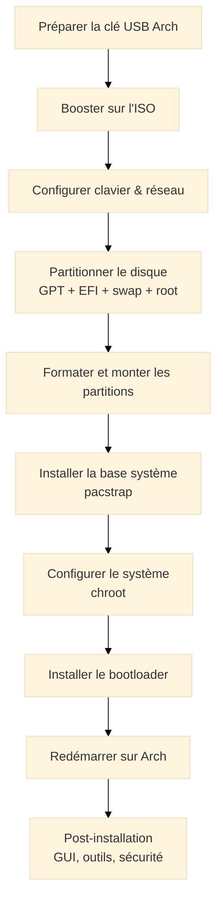
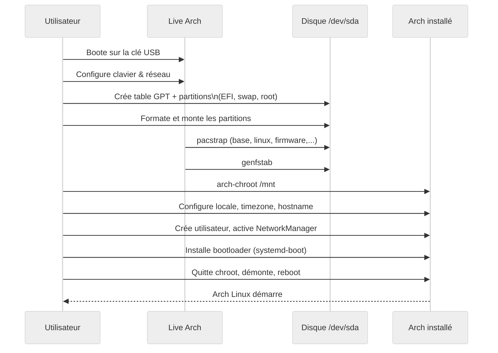

# Arch Linux - Installation Step by Step

<div
  class="omny-meta"
  data-level="🟡 Intermédiaire & 🔴 Avancé"
  data-version="1.0"
  data-time="45-60 minutes (lecture) - 1h30 à 3h (pratique)">
</div>

## Introduction à l’installation d’Arch Linux

!!! quote "Analogie pédagogique"
*Imagine que tu montes un **PC de A à Z** avec des pièces achetées séparément : carte mère, CPU, RAM, boîtier, câblage. Contrairement à un PC préassemblé, rien n'est “magique” : **tu comprends chaque vis et chaque câble**. Installer Arch Linux, c’est exactement ça côté logiciel : tu construis ton système pièce par pièce (partitions, noyau, services, environnement graphique), en gardant **un contrôle total** sur ce qui est installé.*

Arch Linux est une distribution **rolling release**, minimaliste, qui te donne un système très nu au départ et te laisse décider de tout : gestionnaire de paquets, environnement graphique, services, outils de dev, etc.
Ce guide te propose une installation **classique, propre et reproductible** :

* Mode **UEFI + GPT** (standard moderne)
* Disque **dédié à Arch** (pas de dual-boot détaillé ici)
* Système de fichiers **ext4** (simple et robuste)
* Bootloader **systemd-boot** (ou GRUB en alternative)
* Base prête pour un usage dev / cyber

On reste volontairement **sur la voie “manuelle”** (à la Arch Wiki) plutôt que le script `archinstall`, pour que tu comprennes toutes les briques.[^archinstall]

!!! info "Public visé"
- Personnes à l’aise avec la ligne de commande Linux
- Étudiants en systèmes / réseau / cyber qui veulent un environnement propre
- Développeurs qui veulent une machine **100 % maîtrisée** (et qui aiment savoir ce qu’ils installent)

---

## Pour repartir des bases

Avant de lancer des `fdisk` partout, posons les concepts qu’on va manipuler.

### UEFI vs BIOS en pratique

En simplifiant :

* **BIOS/Legacy** : ancien firmware, table de partitions **MBR**, limités (max 4 partitions primaires, disques limités à 2 To, etc.)
* **UEFI** : firmware moderne, travaille avec une table de partitions **GPT**, permet une **partition système EFI** dédiée au boot, plus souple et robuste.[^uefi]

Dans ce guide, on part sur : **UEFI + GPT**.
Tu peux vérifier en live Arch :

```bash
ls /sys/firmware/efi/efivars
```

* Si le dossier existe → tu es en **UEFI**
* S’il n’existe pas → tu es probablement en **BIOS/Legacy** (on mettra un encart spécifique).

### Vocabulaire minimal

* **ISO** : image du support d’installation (ce que tu graves sur la clé USB).
* **pacman** : gestionnaire de paquets d’Arch.
* **pacstrap** : outil pour installer le système de base sur le disque.
* **chroot** : “changer de racine”, entrer **dans** le système fraîchement installé pour le configurer.
* **fstab** : fichier qui décrit comment les systèmes de fichiers sont montés au boot.

---

## Vue d’ensemble du processus d’installation

Avant le step-by-step, un schéma global.



<small><em>Ce diagramme montre le **flux logique complet** : de la clé USB à un système Arch bootable, puis aux étapes de post-installation.</em></small>

---

## Étape 0 – Préparation hors ligne (avant de toucher au disque)

### 0.1. Télécharger l’ISO Arch Linux

Télécharge l’ISO depuis le site officiel d’Arch. Tu obtiens un fichier du type :

```text
archlinux-YYYY.MM.DD-x86_64.iso
```

Vérifie l’intégrité (bonne pratique sécurité) :

```bash
sha256sum archlinux-YYYY.MM.DD-x86_64.iso
```

Compare avec la somme fournie sur le site.
Si ça ne correspond pas → **tu ne continues pas**.

### 0.2. Créer la clé USB bootable

Sur un **Linux existant** :

```bash
lsblk                           # repérer ta clé, ex : /dev/sdX

sudo dd if=archlinux-YYYY.MM.DD-x86_64.iso \
     of=/dev/sdX \
     bs=4M \
     status=progress \
     oflag=sync
```

* `of=/dev/sdX` → bien le disque complet, pas `/dev/sdX1`.
* `oflag=sync` → on force l’écriture physique complète.

Sous **Windows**, utilise `Rufus` ou `Ventoy` en mode “image disque”.

!!! warning "Cible du disque à vérifier 3 fois"
Un `dd` sur le mauvais disque, et tu effaces **tout**. Toujours confirmer avec `lsblk` avant.

---

## Étape 1 – Booter sur l’ISO Arch et préparer l’environnement

### 1.1. Démarrage sur la clé

Dans le firmware (BIOS/UEFI) :

* Active le mode **UEFI** (pas “Legacy only”)
* Désactive **Secure Boot** (sinon le boot Arch échouera sans configuration spécifique)
* Place la clé USB en priorité de boot

Tu arrives sur un menu, tu choisis **Arch Linux install medium (x86_64, UEFI)**.
Après le chargement, tu te retrouves en **root** dans un shell minimal.

### 1.2. Vérifier le mode UEFI

```bash
ls /sys/firmware/efi/efivars
```

* Si le dossier existe → **OK, on est en UEFI (chemin principal du guide)**
* Sinon → on mettra un encadré BIOS/Legacy plus loin.

### 1.3. Passer le clavier en français (AZERTY)

Par défaut, clavier US. Pour la santé mentale :

```bash
loadkeys fr
```

Teste :

```bash
echo "azerty"
```

Si tu vois `azerty`, tout va bien.

### 1.4. Vérifier le réseau

Si tu es en **Ethernet**, tu as souvent déjà un IP via DHCP.

```bash
ip addr
ping -c 4 archlinux.org
```

Si les pings passent → Internet OK.

En **Wi-Fi**, le plus simple dans le live Arch est d’utiliser `iwctl` :

```bash
iwctl
```

Dans l’interface `iwctl` :

```text
station wlan0 scan
station wlan0 get-networks
station wlan0 connect MonSSID
# saisir la passphrase
exit
```

Puis :

```bash
ping -c 4 archlinux.org
```

!!! info "archinstall vs installation manuelle"
Tu peux lancer l’installateur semi-guidé :
`bash
    archinstall
    `
Mais ce guide part sur l’**installation manuelle** pour que tu comprennes toutes les briques. `archinstall` reste intéressant plus tard pour automatiser la création de machines.

---

## Étape 2 – Choisir et préparer le disque

On part sur un disque **entièrement dédié à Arch** : pas de dual-boot détaillé ici.

### 2.1. Identifier le disque cible

```bash
lsblk
```

Typiquement tu verras :

```text
sda    465G
├─sda1 ...
└─...
sdb     29G  # ta clé USB
```

On supposera dans la suite que :

* Disque interne = **`/dev/sda`**
* Clé USB = `/dev/sdb`

!!! warning "Risque de destruction de données"
Toutes les partitions du disque choisi vont être supprimées.
Vérifie **trois fois** que tu travailles bien sur le bon disque (`lsblk`, tailles, etc.).

### 2.2. Schéma de partitions recommandé (UEFI + GPT)

| Partition   | Taille recommandée | Type               | Point de montage         | Rôle                 |
| ----------- | ------------------ | ------------------ | ------------------------ | -------------------- |
| `/dev/sda1` | 512 Mio à 1 Gio    | EFI System (FAT32) | `/boot` (ou `/boot/efi`) | Boot UEFI            |
| `/dev/sda2` | 2–8 Gio            | Linux swap         | swap                     | Mémoire d’échange    |
| `/dev/sda3` | reste du disque    | Linux filesystem   | `/`                      | Système (root, ext4) |

On reste volontairement simple : **pas de /home séparé** pour ce premier run.
Tu pourras ensuite rajouter des disques / partitions selon tes besoins.

### 2.3. Créer une table de partitions GPT

```bash
gdisk /dev/sda
```

Dans `gdisk` :

* `o` → créer une nouvelle table GPT (warning : efface tout)
* `w` → écrire et quitter

Ou en version plus interactive avec `parted` :

```bash
parted /dev/sda
```

Dans `parted` :

```text
mklabel gpt
quit
```

### 2.4. Créer les partitions avec `fdisk` (exemple concret)

```bash
fdisk /dev/sda
```

Séquence typique :

1. Créer la partition EFI (`/dev/sda1`) :

   * `n` → nouvelle partition
   * `Partition number` : `1`
   * `First sector` : Enter (par défaut)
   * `Last sector` : `+512M`
   * Type : `t` → puis code `1` (EFI System) ou `uefi` selon la version

2. Créer la partition swap (`/dev/sda2`) :

   * `n` → partition 2
   * Last sector : `+4G` (par exemple)
   * `t` → sélectionner la partition 2, type `19` ou `swap` selon la version

3. Créer la partition root (`/dev/sda3`) :

   * `n` → partition 3
   * Last sector : Enter (jusqu'à la fin du disque)
   * Type par défaut (Linux filesystem)

4. Afficher le résultat : `p`

5. Écrire : `w`

Tu peux vérifier ensuite :

```bash
lsblk /dev/sda
```

---

## Étape 3 – Formater les partitions et les monter

### 3.1. Formater la partition EFI en FAT32

```bash
mkfs.fat -F32 /dev/sda1
```

### 3.2. Configurer la swap

```bash
mkswap /dev/sda2
swapon /dev/sda2
```

### 3.3. Formater la partition root en ext4

```bash
mkfs.ext4 /dev/sda3
```

Tu peux utiliser `btrfs` plus tard, mais pour une première installation : **ext4 = simplicité + robustesse**.

### 3.4. Monter les partitions

On monte d’abord la racine :

```bash
mount /dev/sda3 /mnt
```

Créer le point de montage pour `/boot` :

```bash
mkdir -p /mnt/boot
mount /dev/sda1 /mnt/boot
```

Vérifie :

```bash
lsblk
```

Tu dois voir les partitions montées sur `/mnt`.

---

## Étape 4 – Installer le système de base

### 4.1. Choisir un miroir (optionnel mais conseillé)

Tu peux éditer `/etc/pacman.d/mirrorlist` pour mettre les miroirs les plus proches en haut (France / Europe).
Pour un premier essai tu peux aussi garder ceux par défaut.

### 4.2. Installer la base avec `pacstrap`

```bash
pacstrap -K /mnt \
  base linux linux-firmware \
  vim nano \
  networkmanager
```

Explications rapides :

* `base` : paquet de base Arch (shell, outils essentiels)
* `linux` : noyau Linux générique Arch
* `linux-firmware` : firmware pour une partie du matériel
* `vim` / `nano` : éditeurs de texte
* `networkmanager` : gestion réseau moderne, pratique en post-install

---

## Étape 5 – Générer `fstab` et entrer dans le système (`chroot`)

### 5.1. Générer `fstab`

```bash
genfstab -U /mnt >> /mnt/etc/fstab
```

Tu peux vérifier :

```bash
cat /mnt/etc/fstab
```

Tu dois voir les entrées pour `/`, `/boot` et `swap`.

### 5.2. Entrer dans le nouveau système

```bash
arch-chroot /mnt
```

À partir de maintenant, **tout ce que tu fais concerne le système Arch installé sur le disque**, pas le live.

---

## Étape 6 – Configuration de base du système

### 6.1. Configurer le fuseau horaire

```bash
ln -sf /usr/share/zoneinfo/Europe/Paris /etc/localtime
hwclock --systohc
```

### 6.2. Localisation et langue

Édite `/etc/locale.gen` :

```bash
vim /etc/locale.gen
```

Décommente par exemple :

```text
en_US.UTF-8 UTF-8
fr_FR.UTF-8 UTF-8
```

Puis :

```bash
locale-gen
```

Créer `/etc/locale.conf` :

```bash
echo "LANG=fr_FR.UTF-8" > /etc/locale.conf
```

### 6.3. Nom de la machine (hostname)

```bash
echo "arch-machine" > /etc/hostname
```

Et compléter `/etc/hosts` :

```bash
cat << 'EOF' > /etc/hosts
127.0.0.1   localhost
::1         localhost
127.0.1.1   arch-machine.localdomain arch-machine
EOF
```

### 6.4. Mot de passe root

```bash
passwd
```

Choisis un mot de passe solide, même en environnement perso.

### 6.5. Création d’un utilisateur non-root

```bash
useradd -m -G wheel -s /bin/bash alain
passwd alain
```

Ouvre `/etc/sudoers` via :

```bash
EDITOR=vim visudo
```

Décommente la ligne :

```text
%wheel ALL=(ALL:ALL) ALL
```

Ton user `alain` pourra utiliser `sudo`.

### 6.6. Activer NetworkManager

```bash
systemctl enable NetworkManager
```

Au prochain boot, tu pourras gérer le réseau facilement (Ethernet/Wi-Fi).

---

## Étape 7 – Installer le bootloader (UEFI)

On part sur **systemd-boot**, très simple avec UEFI, puis on évoque GRUB.

### 7.1. Installer systemd-boot

Le répertoire EFI est déjà monté sur `/boot`.
Installe systemd-boot :

```bash
bootctl install
```

Cela installe les fichiers nécessaires dans `/boot`.

### 7.2. Configurer l’entrée Arch

Crée `/boot/loader/loader.conf` :

```bash
cat << 'EOF' > /boot/loader/loader.conf
default arch
timeout 3
editor no
EOF
```

Crée ensuite `/boot/loader/entries/arch.conf` :

```bash
cat << 'EOF' > /boot/loader/entries/arch.conf
title   Arch Linux
linux   /vmlinuz-linux
initrd  /initramfs-linux.img
options root=PARTUUID=XXX rw
EOF
```

Remplace `PARTUUID=XXX` par la valeur réelle de la partition root (`/dev/sda3`) :

```bash
blkid /dev/sda3
```

Tu verras quelque chose comme :

```text
/dev/sda3: UUID="..." TYPE="ext4" PARTUUID="xxxxxxxx-xxxx-xxxx-xxxx-xxxxxxxxxxxx"
```

Copie le `PARTUUID=` correspondant dans `arch.conf`.

!!! info "Alternative : GRUB"
Tu peux installer **GRUB** à la place de systemd-boot (utile si multi-OS, scénarios plus complexes) :
`bash
    pacman -S grub efibootmgr
    grub-install --target=x86_64-efi \                  --efi-directory=/boot \                  --bootloader-id=GRUB
    grub-mkconfig -o /boot/grub/grub.cfg
    `

---

## Étape 8 – Premier redémarrage

### 8.1. Quitter le chroot et démonter

```bash
exit                   # sortir du chroot
umount -R /mnt         # démonter toutes les partitions
swapoff /dev/sda2      # optionnel, sinon il sera géré au reboot
```

### 8.2. Redémarrer

```bash
reboot
```

Pense à **retirer la clé USB** ou à changer l’ordre de boot si nécessaire.

Si tout est correct, tu dois voir apparaître :

* Le menu systemd-boot (ou GRUB)
* Ton entrée “Arch Linux”
* Puis un prompt de login (`alain` + mot de passe)

Tu peux vérifier :

```bash
uname -r         # version du noyau
lsblk            # vérifie le montage
ping -c 4 archlinux.org
```

---

## Étape 9 – Post-installation minimale (console)

À ce stade, tu as une Arch **fonctionnelle en mode console**. On prépare un système exploitable pour dev / cyber.

### 9.1. Mises à jour

```bash
sudo pacman -Syu
```

### 9.2. Paquets de base utiles

```bash
sudo pacman -S \
  base-devel \
  git \
  htop \
  zip unzip \
  tree \
  wget curl \
  man-db man-pages \
  openssh
```

Active le service SSH si besoin :

```bash
sudo systemctl enable --now sshd
```

### 9.3. Pare-feu simple (UFW)

```bash
sudo pacman -S ufw
sudo systemctl enable --now ufw
sudo ufw default deny incoming
sudo ufw default allow outgoing
sudo ufw allow ssh      # si besoin
sudo ufw status verbose
```

!!! warning "Arch et sécurité : pas de garde-fous magiques"
Arch te laisse la main sur tout : c’est un **avantage** en cybersécurité (tu maîtrises chaque service), mais aussi un **risque** si tu oublies les basiques (pare-feu, mises à jour, SSH exposé sans durcissement, etc.).

---

## Étape 10 – Ajouter un environnement graphique (exemple : GNOME)

Cette partie est optionnelle : certains préfèrent rester en TTY ou utiliser un tiling WM ultra minimaliste.
On prend ici **GNOME + Wayland** comme exemple concret.

### 10.1. Pilotes graphiques de base

* Pour Intel / AMD récents, souvent les pilotes libres suffisent.

```bash
sudo pacman -S \
  xorg-server \
  mesa
```

### 10.2. GNOME + GDM

```bash
sudo pacman -S \
  gnome gnome-extra \
  gdm
```

Activer GDM :

```bash
sudo systemctl enable gdm
```

Reboot :

```bash
sudo reboot
```

Tu arrives sur un écran de login graphique et peux te connecter à ton compte `alain`.

---

## Encadré – Et si la machine est en BIOS/Legacy ?

Si, au tout début, `ls /sys/firmware/efi/efivars` ne renvoyait rien, tu es en **BIOS/Legacy**.
Les différences majeures :

* Table de partitions **MBR** au lieu de GPT
* Pas de partition EFI, on installe GRUB dans le MBR

Schéma partitions minimal :

| Partition   | Type             | Point de montage |
| ----------- | ---------------- | ---------------- |
| `/dev/sda1` | Linux swap       | swap             |
| `/dev/sda2` | Linux filesystem | `/`              |

Bootloader :

```bash
sudo pacman -S grub
sudo grub-install --target=i386-pc /dev/sda
sudo grub-mkconfig -o /boot/grub/grub.cfg
```

Le reste du guide (pacstrap, chroot, config) reste **identique**.

---

## Synthèse du processus d’installation



<small><em>Ce diagramme de séquence montre les échanges entre toi, le système live, le disque et le système Arch installé : chaque action est visible et maîtrisée, sans “magie noire” d’installateur graphique.</em></small>

---

## Et BlackArch dans tout ça ?

BlackArch est une **extension pentest** basée sur Arch Linux :

* Ce n’est **pas** une distribution totalement différente au sens Debian vs Arch.
* C’est plutôt un **gros dépôt spécialisé** qui ajoute **des centaines d’outils de sécurité offensive** : scanners, exploits, outils forensic, etc.[^blackarch]

Tu peux l’utiliser de deux façons :

1. **ISO BlackArch dédiée**

   * Tu installes directement BlackArch depuis leur ISO.
   * Avantage : tu obtiens immédiatement un environnement de pentest très chargé.
   * Inconvénient : énormément d’outils préinstallés, parfois trop pour un usage quotidien ou pour une machine de prod.

2. **BlackArch comme extension sur une Arch existante**

   * Tu suis ce guide → tu obtiens une Arch propre, maîtrisée.
   * Ensuite tu ajoutes les dépôts BlackArch et tu n’installes que ce dont tu as besoin.
   * C’est souvent **plus propre** pour un environnement de dev / lab sérieux.

En pratique, pour un profil dev / cyber :

* **Arch “vanille”** + sélection d’outils (Nmap, Wireshark, Burp, etc.) = environnement sobre, contrôlable, orienté prod / lab.
* **BlackArch complet** = excellent pour **laboratoire offensif**, CTF, recherche de vulnérabilités, mais trop dense pour une machine “de tous les jours”.

!!! info "Arch vs BlackArch en un coup d’œil"

| Critère               | Arch Linux                     | BlackArch (extension)                        |
| --------------------- | ------------------------------ | -------------------------------------------- |
| Base système          | Minimal, à construire toi-même | Arch + dépôts supplémentaires                |
| Outils de pentest     | À installer à la carte         | Très large catalogue disponible              |
| Usage recommandé      | Dev, admin, lab maîtrisé       | Lab de pentest, CTF, recherche offensive     |
| Contrôle / lisibilité | Très élevé                     | Peut devenir très chargé si on installe tout |

Dans ton contexte (dev, cyber, pédagogie), le scénario le plus propre est en général :

> Installer **Arch comme dans ce guide**, durcir un minimum, puis ajouter **progressivement** des outils de pentest (via AUR, dépôts BlackArch si besoin), en gardant une vraie maîtrise de ce qui est installé.

---

## Ressources complémentaires

* **Arch Wiki – Installation guide** (référence canonique, en anglais)
* **Arch Wiki – System maintenance** (mises à jour, bonnes pratiques)
* **BlackArch – Installation sur Arch existante** (dépôts et métapaquets)

---

[^uefi]: L’UEFI (*Unified Extensible Firmware Interface*) remplace le BIOS classique et permet, entre autres, la gestion de la table de partitions GPT, des entrées de boot multiples et, côté sécurité, des mécanismes comme Secure Boot.

[^archinstall]: `archinstall` est un installateur semi-guidé inclus dans l’ISO Arch. Il automatise une partie des choix (schéma disque, environnement graphique, etc.), mais s’appuie sur les mêmes briques de base (`pacstrap`, `fstab`, `chroot`).

[^blackarch]: BlackArch est un projet dérivé d’Arch Linux qui fournit un dépôt de paquets orientés tests d’intrusion. On y trouve plusieurs milliers d’outils spécialisés, organisés par catégorie (reconnaissance, exploitation, forensic, etc.).
