# Bases Fondamentales

<div
  class="omny-meta"
  data-level="🟢 Tout niveau"
  data-version="1.0"
  data-time="Consultation">
</div>


!!! quote "Analogie pédagogique"
    _L'informatique fondamentale est l'alphabet et la grammaire de la technologie. Sans comprendre ce qu'est un bit, un processeur ou un réseau, essayer de coder ou d'administrer des systèmes revient à essayer d'écrire un roman dans une langue que l'on ne parle qu'à moitié._

## A

### Algorithme

!!! note "Définition"
    Séquence d'instructions logiques et ordonnées pour résoudre un problème ou effectuer une tâche spécifique.

Utilisé en programmation, recherche opérationnelle, intelligence artificielle et optimisation.

- **Synonymes :** procédure, méthode, processus algorithmique

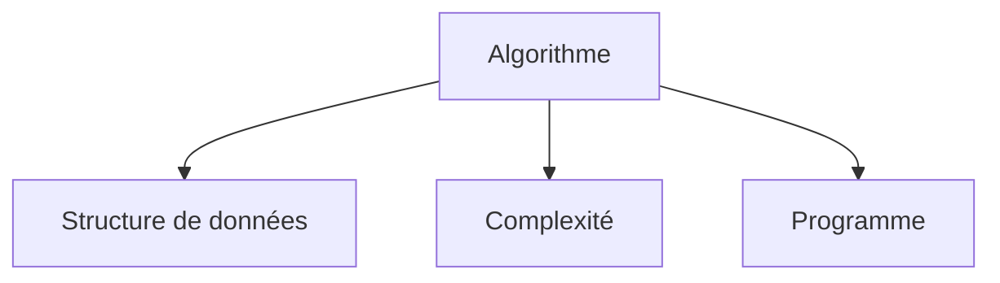

_Explication : Algorithme est défini comme : séquence d'instructions logiques et ordonnées pour résoudre un problème ou effectuer une tâche spécifique._

<br>

---

### API

!!! note "Définition"
    Interface de programmation permettant la communication et l'échange de données entre différents logiciels ou services.

Essentiel dans l'architecture microservices, développement web et intégration de systèmes.

- **Acronyme :** Application Programming Interface
- **Variantes :** REST API, GraphQL API, SOAP API

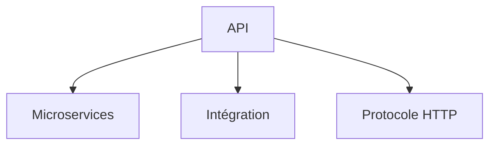

_Explication : API est défini comme : interface de programmation permettant la communication et l'échange de données entre différents logiciels ou services._

<br>

---

### ASCII

!!! note "Définition"
    Standard d'encodage de caractères utilisant 7 bits pour représenter 128 caractères différents.

Utilisé pour la compatibilité entre systèmes, protocoles de communication et encodage de base.

- **Acronyme :** American Standard Code for Information Interchange
- **Extension :** ASCII étendu (8 bits, 256 caractères)

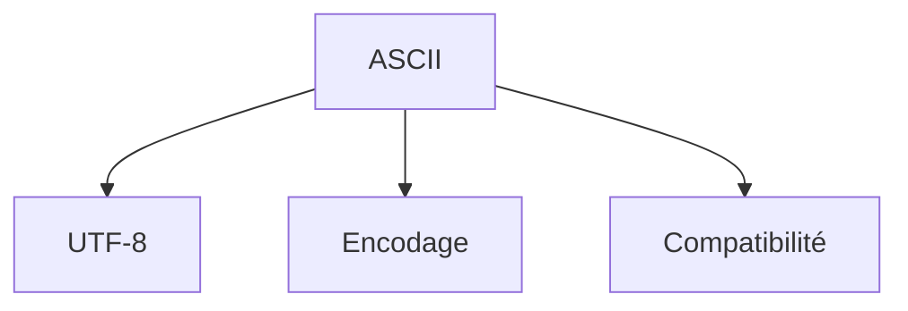

_Explication : ASCII est défini comme : standard d'encodage de caractères utilisant 7 bits pour représenter 128 caractères différents._

<br>

---

## B

### Big O

!!! note "Définition"
    Notation mathématique décrivant la complexité algorithmique dans le pire des cas en fonction de la taille des données.

Utilisé pour analyser et comparer l'efficacité des algorithmes.

- **Variantes :** Θ (Theta), Ω (Omega), o (petit o)

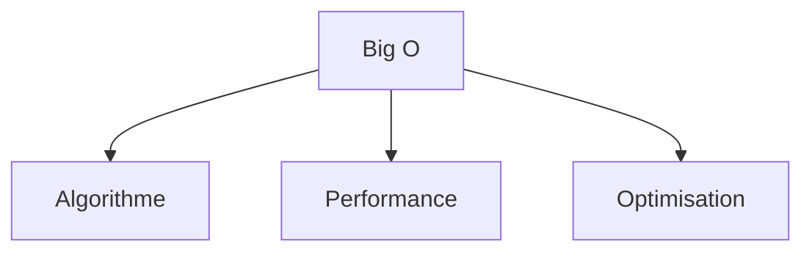

_Explication : Big O est défini comme : notation mathématique décrivant la complexité algorithmique dans le pire des cas en fonction de la taille des données._

<br>

---

### Binaire

!!! note "Définition"
    Système de numération en base 2 utilisant uniquement les chiffres 0 et 1, langage fondamental des ordinateurs.

Utilisé dans tous les systèmes informatiques, représentation des données et logique booléenne.

- **Variantes :** BCD (Binary Coded Decimal), Gray code

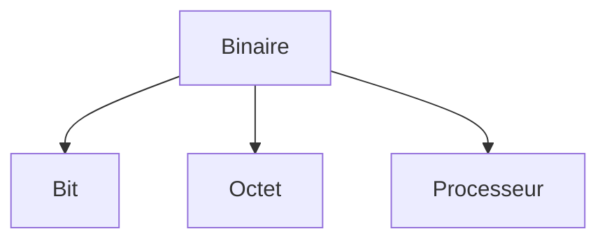

_Explication : Binaire est défini comme : système de numération en base 2 utilisant uniquement les chiffres 0 et 1, langage fondamental des ordinateurs._

<br>

---

### Bit

!!! note "Définition"
    Plus petite unité d'information en informatique, peut valoir 0 ou 1.

Utilisé pour mesurer la capacité de stockage et la vitesse de transmission.

- **Variantes :** kb (kilobit), Mb (mégabit), Gb (gigabit)

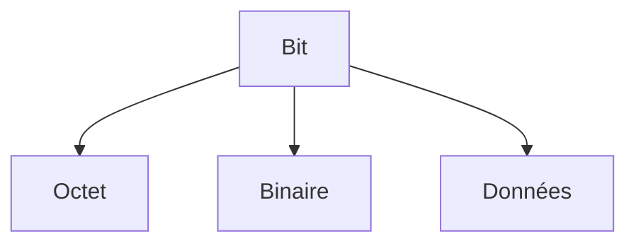

_Explication : Bit est défini comme : plus petite unité d'information en informatique, peut valoir 0 ou 1._

<br>

---

### Byte

!!! note "Définition"
    Unité d'information composée de 8 bits, capable de représenter 256 valeurs différentes.

Utilisé pour mesurer la taille des fichiers et la capacité mémoire.

- **Synonyme :** Octet
- **Variantes :** KB (kilobyte), MB (mégabyte), GB (gigabyte)

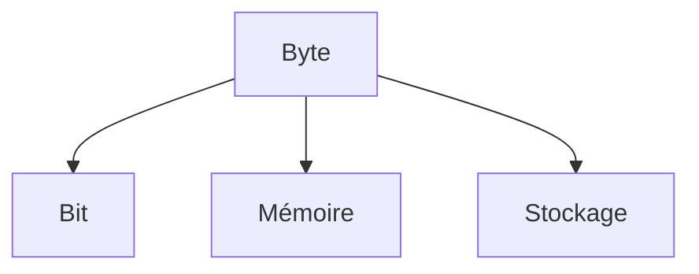

_Explication : Byte est défini comme : unité d'information composée de 8 bits, capable de représenter 256 valeurs différentes._

<br>

---

## C

### Cache

!!! note "Définition"
    Mémoire rapide stockant temporairement des données fréquemment utilisées pour accélérer les accès.

Utilisé dans les processeurs, navigateurs web, bases de données et systèmes distribués.

- **Types :** Cache L1/L2/L3, cache web, cache applicatif

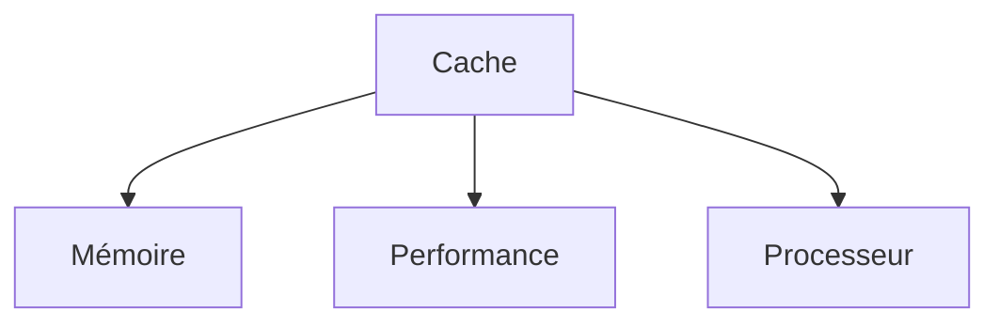

_Explication : Cache est défini comme : mémoire rapide stockant temporairement des données fréquemment utilisées pour accélérer les accès._

<br>

---

### Compilation

!!! note "Définition"
    Processus de traduction du code source écrit par un programmeur en code machine exécutable par l'ordinateur.

Utilisé dans le développement logiciel avec des langages comme C, C++, Rust, Go.

- **Antonyme :** Interprétation
- **Types :** AOT (Ahead-of-Time), JIT (Just-in-Time)

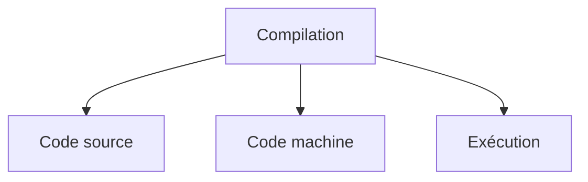

_Explication : Compilation est défini comme : processus de traduction du code source écrit par un programmeur en code machine exécutable par l'ordinateur._

<br>

---

### Complexité temporelle

!!! note "Définition"
    Mesure du temps d'exécution d'un algorithme en fonction de la taille des données d'entrée.

Utilisé pour l'analyse d'algorithmes et l'optimisation de performance.

- **Notation :** Big O, Theta, Omega

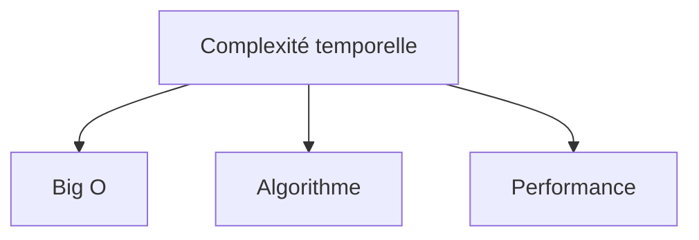

_Explication : Complexité temporelle est défini comme : mesure du temps d'exécution d'un algorithme en fonction de la taille des données d'entrée._

<br>

---

## D

### Débogage

!!! note "Définition"
    Processus d'identification, d'analyse et de correction des erreurs dans un programme informatique.

Utilisé durant le développement logiciel et la maintenance applicative.

- **Synonyme :** Debug
- **Outils :** debugger, breakpoints, logs

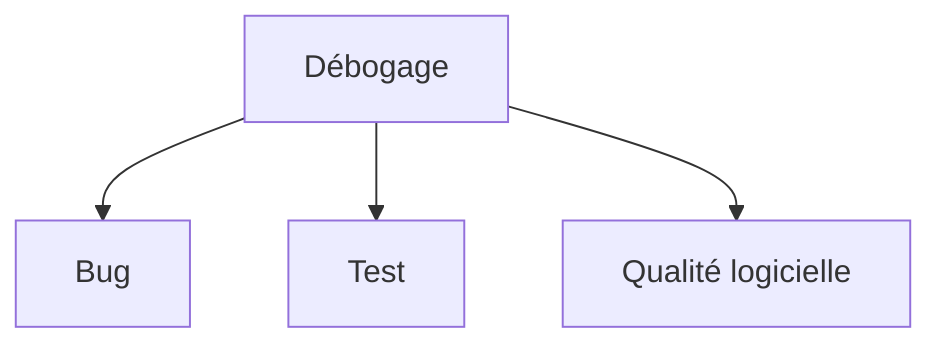

_Explication : Débogage est défini comme : processus d'identification, d'analyse et de correction des erreurs dans un programme informatique._

<br>

---

### DFS

!!! note "Définition"
    Algorithme de parcours d'arbres ou de graphes explorant aussi profondément que possible avant de revenir en arrière.

Utilisé en intelligence artificielle, résolution de problèmes et analyse de graphes.

- **Acronyme :** Depth-First Search
- **Antonyme :** BFS (Breadth-First Search)

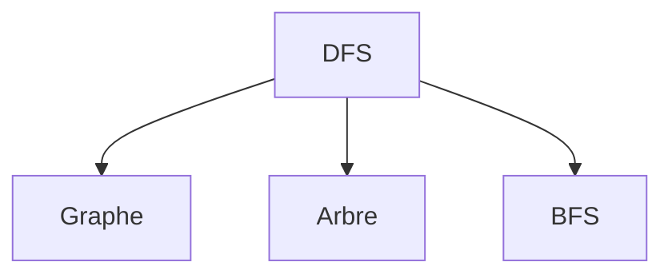

_Explication : DFS est défini comme : algorithme de parcours d'arbres ou de graphes explorant aussi profondément que possible avant de revenir en arrière._

<br>

---

## E

### Encodage

!!! note "Définition"
    Processus de conversion de données dans un format spécifique selon des règles définies.

Utilisé pour la représentation de caractères, compression et transmission de données.

- **Types :** UTF-8, ASCII, Base64, URL encoding

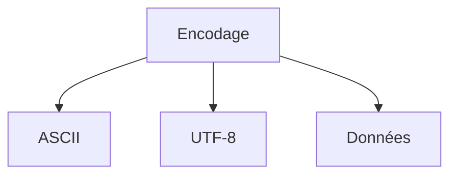

_Explication : Encodage est défini comme : processus de conversion de données dans un format spécifique selon des règles définies._

<br>

---

## F

### Fonction

!!! note "Définition"
    Bloc de code réutilisable effectuant une tâche spécifique, pouvant recevoir des paramètres et retourner une valeur.

Utilisé dans tous les paradigmes de programmation pour la modularité et la réutilisabilité.

- **Synonymes :** méthode, procédure, routine
- **Types :** fonction pure, fonction récursive, fonction lambda

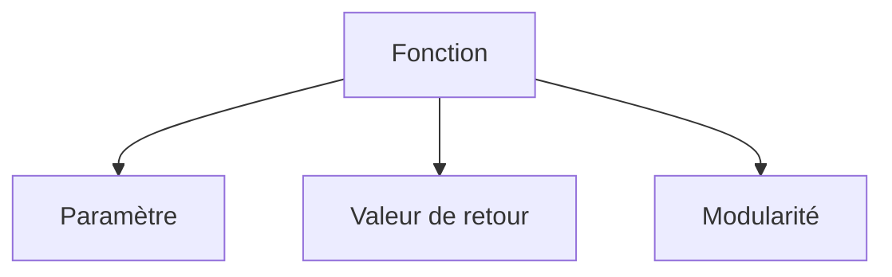

_Explication : Fonction est défini comme : bloc de code réutilisable effectuant une tâche spécifique, pouvant recevoir des paramètres et retourner une valeur._

<br>

---

### Framework

!!! note "Définition"
    Structure logicielle préconçue fournissant une base et des outils pour développer des applications.

Utilisé pour accélérer le développement et standardiser l'architecture.

- **Types :** framework web, framework mobile, framework de test
- **Exemples :** React, Django, Spring

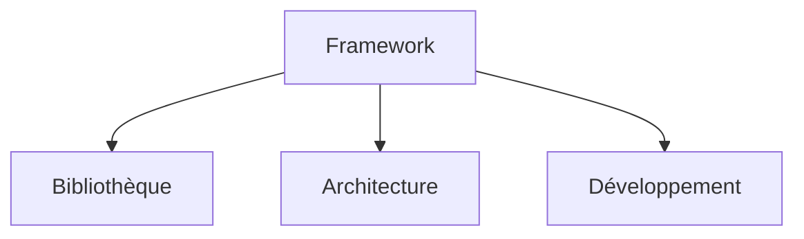

_Explication : Framework est défini comme : structure logicielle préconçue fournissant une base et des outils pour développer des applications._

<br>

---

## G

### Garbage Collection

!!! note "Définition"
    Processus automatique de libération de la mémoire occupée par des objets qui ne sont plus utilisés.

Utilisé dans les langages managés comme Java, C#, Python pour éviter les fuites mémoire.

- **Synonyme :** ramasse-miettes
- **Types :** mark-and-sweep, generational GC, reference counting

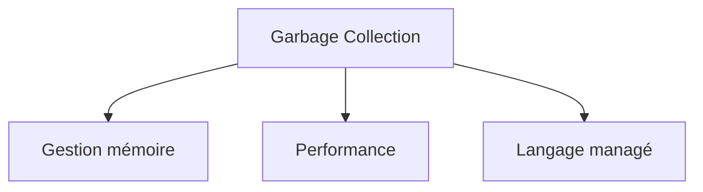

_Explication : Garbage Collection est défini comme : processus automatique de libération de la mémoire occupée par des objets qui ne sont plus utilisés._

<br>

---

### Git

!!! note "Définition"
    Système de contrôle de version distribué permettant de suivre les modifications de fichiers et de collaborer.

Utilisé dans le développement logiciel pour le versioning et la collaboration.

- **Commandes principales :** `add`, `commit`, `push`, `pull`, `merge`
- **Plateformes :** GitHub, GitLab, Bitbucket

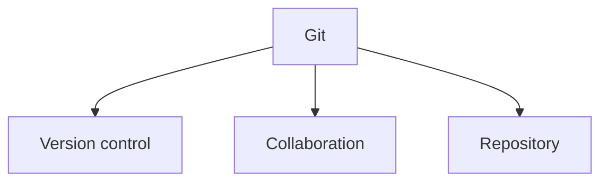

_Explication : Git est défini comme : système de contrôle de version distribué permettant de suivre les modifications de fichiers et de collaborer._

<br>

---

## H

### Hash

!!! note "Définition"
    Fonction mathématique transformant des données de taille arbitraire en une empreinte de taille fixe.

Utilisé pour l'intégrité des données, l'indexation et la cryptographie.

- **Synonymes :** hachage, empreinte
- **Algorithmes :** MD5, SHA-256, bcrypt

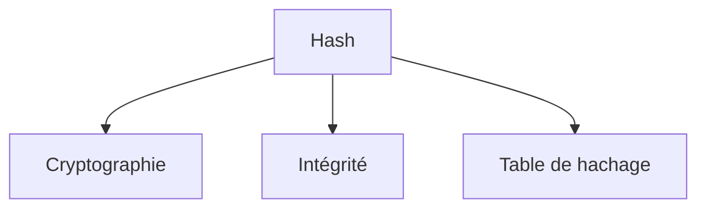

_Explication : Hash est défini comme : fonction mathématique transformant des données de taille arbitraire en une empreinte de taille fixe._

<br>

---

### Heap

!!! note "Définition"
    Structure de données arborescente où chaque nœud parent est ordonné par rapport à ses enfants / Zone mémoire pour allocation dynamique.

Utilisé dans les algorithmes de tri, files de priorité et gestion mémoire.

- **Types :** max-heap, min-heap, binary heap
- **Distinction :** heap (structure de données) vs heap (zone mémoire)

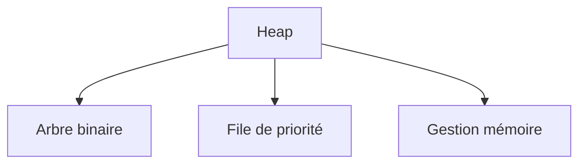

_Explication : Heap est défini comme : structure de données arborescente où chaque nœud parent est ordonné par rapport à ses enfants / Zone mémoire pour allocation dynamique._

<br>

---

### Hexadécimal

!!! note "Définition"
    Système de numération en base 16 utilisant les chiffres 0-9 et les lettres A-F.

Utilisé pour représenter les adresses mémoire, codes couleur et données binaires.

- **Notation :** préfixe `0x` (ex. `0xFF`), préfixe `#` (ex. `#FF0000`)

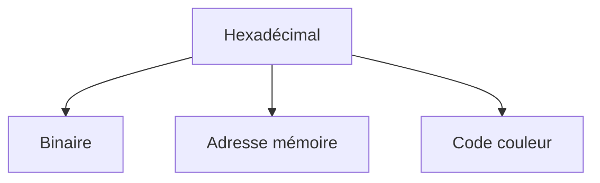

_Explication : Hexadécimal est défini comme : système de numération en base 16 utilisant les chiffres 0-9 et les lettres A-F._

<br>

---

## I

### IDE

!!! note "Définition"
    Environnement de développement intégré combinant éditeur de code, débogueur, compilateur et autres outils.

Utilisé pour augmenter la productivité des développeurs.

- **Acronyme :** Integrated Development Environment
- **Exemples :** VS Code, IntelliJ, Eclipse

```mermaid
graph TB
    A[IDE] --> B[Éditeur]
    A --> C[Débogueur]
    A --> D[Productivité]
```

_Explication : IDE est défini comme : environnement de développement intégré combinant éditeur de code, débogueur, compilateur et autres outils._

<br>

---

### Interprétation

!!! note "Définition"
    Exécution directe du code source ligne par ligne sans compilation préalable.

Utilisé dans les langages de script comme Python, JavaScript, Ruby.

- **Antonyme :** Compilation
- **Avantages :** flexibilité, développement rapide

```mermaid
graph TB
    A[Interprétation] --> B[Code source]
    A --> C[Exécution directe]
    A --> D[Compilation]
```

_Explication : Interprétation est défini comme : exécution directe du code source ligne par ligne sans compilation préalable._

<br>

---

## J

### JIT

!!! note "Définition"
    Technique de compilation à la volée pendant l'exécution du programme pour optimiser les performances.

Utilisé dans les machines virtuelles comme JVM, .NET CLR.

- **Acronyme :** Just-In-Time compilation
- **Avantage :** optimisations runtime spécifiques à l'environnement d'exécution

```mermaid
graph TB
    A[JIT] --> B[Machine virtuelle]
    A --> C[Optimisation]
    A --> D[Performance]
```

_Explication : JIT est défini comme : technique de compilation à la volée pendant l'exécution du programme pour optimiser les performances._

<br>

---

## L

### Langage de programmation

!!! note "Définition"
    Syntaxe formelle permettant d'écrire des instructions compréhensibles par un ordinateur.

Utilisé pour créer des logiciels, applications et systèmes.

- **Types :** compilés, interprétés, hybrides
- **Paradigmes :** impératif, orienté objet, fonctionnel

```mermaid
graph TB
    A[Langage de programmation] --> B[Paradigme]
    A --> C[Syntaxe]
    A --> D[Programme]
```

_Explication : Langage de programmation est défini comme : syntaxe formelle permettant d'écrire des instructions compréhensibles par un ordinateur._

<br>

---

### Liste chaînée

!!! note "Définition"
    Structure de données linéaire où chaque élément contient des données et un pointeur vers l'élément suivant.

Utilisé pour l'implémentation de structures dynamiques et algorithmes.

- **Types :** simple, double, circulaire
- **Avantages :** insertion/suppression efficaces en O(1) si le nœud est connu

```mermaid
graph TB
    A[Liste chaînée] --> B[Pointeur]
    A --> C[Nœud]
    A --> D[Structure dynamique]
```

_Explication : Liste chaînée est défini comme : structure de données linéaire où chaque élément contient des données et un pointeur vers l'élément suivant._

<br>

---

## M

### Mémoire virtuelle

!!! note "Définition"
    Technique permettant d'utiliser l'espace disque comme extension de la mémoire physique.

Utilisé par les systèmes d'exploitation pour gérer la mémoire efficacement.

- **Mécanismes :** pagination, segmentation, swap
- **Avantages :** isolation des processus, gestion transparente pour les applications

```mermaid
graph TB
    A[Mémoire virtuelle] --> B[Pagination]
    A --> C[Mémoire physique]
    A --> D[Système d'exploitation]
```

_Explication : Mémoire virtuelle est défini comme : technique permettant d'utiliser l'espace disque comme extension de la mémoire physique._

<br>

---

## O

### Objet

!!! note "Définition"
    Instance d'une classe en programmation orientée objet, combinant données et méthodes.

Utilisé pour modéliser des entités du monde réel dans le code.

- **Concepts liés :** encapsulation, héritage, polymorphisme
- **Langages :** Java, C++, Python, C#

```mermaid
graph TB
    A[Objet] --> B[Classe]
    A --> C[Encapsulation]
    A --> D[POO]
```

_Explication : Objet est défini comme : instance d'une classe en programmation orientée objet, combinant données et méthodes._

<br>

---

## P

### Pile

!!! note "Définition"
    Structure de données LIFO où les éléments sont ajoutés et retirés par le même bout.

Utilisé pour la gestion des appels de fonctions, expressions arithmétiques et algorithmes de parcours.

- **Acronyme :** LIFO (Last In, First Out)
- **Opérations :** push, pop, top/peek

```mermaid
graph TB
    A[Pile] --> B[LIFO]
    A --> C[Appel de fonction]
    A --> D[File]
```

_Explication : Pile est défini comme : structure de données LIFO où les éléments sont ajoutés et retirés par le même bout._

<br>

---

### Pointeur

!!! note "Définition"
    Variable contenant l'adresse mémoire d'une autre variable ou structure de données.

Utilisé dans les langages de bas niveau pour la gestion directe de la mémoire.

- **Langages :** C, C++, Assembly
- **Risques :** segmentation fault, memory leak

```mermaid
graph TB
    A[Pointeur] --> B[Adresse mémoire]
    A --> C[Référence]
    A --> D[Gestion mémoire]
```

_Explication : Pointeur est défini comme : variable contenant l'adresse mémoire d'une autre variable ou structure de données._

<br>

---

### Polymorphisme

!!! note "Définition"
    Capacité d'un objet à prendre plusieurs formes selon le contexte d'utilisation.

Utilisé en programmation orientée objet pour la flexibilité et l'extensibilité du code.

- **Types :** polymorphisme de sous-type, paramétrique, ad-hoc
- **Mécanismes :** surcharge, redéfinition, interfaces

```mermaid
graph TB
    A[Polymorphisme] --> B[Héritage]
    A --> C[Interface]
    A --> D[POO]
```

_Explication : Polymorphisme est défini comme : capacité d'un objet à prendre plusieurs formes selon le contexte d'utilisation._

<br>

---

## R

### Récursivité

!!! note "Définition"
    Technique de programmation où une fonction s'appelle elle-même pour résoudre un problème.

Utilisé pour résoudre des problèmes décomposables en sous-problèmes similaires.

- **Éléments :** cas de base (condition d'arrêt), cas récursif
- **Exemples :** factorielle, suite de Fibonacci, parcours d'arbres

```mermaid
graph TB
    A[Récursivité] --> B[Fonction]
    A --> C[Cas de base]
    A --> D[Appel récursif]
```

_Explication : Récursivité est défini comme : technique de programmation où une fonction s'appelle elle-même pour résoudre un problème._

<br>

---

### Refactoring

!!! note "Définition"
    Processus de restructuration du code existant sans modifier son comportement externe.

Utilisé pour améliorer la lisibilité, maintenabilité et performance du code sans régression fonctionnelle.

- **Techniques :** extraction de méthode, renommage, simplification conditionnelle
- **Outils :** IDE automatisés, analyseurs de code statique

```mermaid
graph TB
    A[Refactoring] --> B[Code legacy]
    A --> C[Maintenabilité]
    A --> D[Qualité logicielle]
```

_Explication : Refactoring est défini comme : processus de restructuration du code existant sans modifier son comportement externe._

<br>

---

## S

### Structure de données

!!! note "Définition"
    Organisation logique et systématique des données en mémoire pour faciliter leur manipulation.

Utilisé pour optimiser les opérations et l'utilisation de la mémoire selon les cas d'usage.

- **Types :** linéaires (tableaux, listes), non-linéaires (arbres, graphes)
- **Critères de choix :** complexité temporelle/spatiale, opérations fréquentes

```mermaid
graph TB
    A[Structure de données] --> B[Algorithme]
    A --> C[Complexité]
    A --> D[Mémoire]
```

_Explication : Structure de données est défini comme : organisation logique et systématique des données en mémoire pour faciliter leur manipulation._

<br>

---

## T

### Table de hachage

!!! note "Définition"
    Structure de données associant des clés à des valeurs via une fonction de hachage pour un accès rapide.

Utilisé pour l'implémentation de dictionnaires, caches et index avec une complexité moyenne O(1).

- **Synonymes :** hash table, hash map, dictionnaire
- **Gestion des collisions :** chaînage, adressage ouvert

```mermaid
graph TB
    A[Table de hachage] --> B[Fonction de hachage]
    A --> C[Clé-valeur]
    A --> D[Collision]
```

_Explication : Table de hachage est défini comme : structure de données associant des clés à des valeurs via une fonction de hachage pour un accès rapide._

<br>

---

### TDD

!!! note "Définition"
    Méthodologie de développement où les tests unitaires sont écrits avant le code de production.

Utilisé pour améliorer la qualité du code et garantir la couverture de tests dès la conception.

- **Acronyme :** Test-Driven Development
- **Cycle :** Red → Green → Refactor

```mermaid
graph TB
    A[TDD] --> B[Test unitaire]
    A --> C[Code de production]
    A --> D[Refactoring]
```

_Explication : TDD est défini comme : méthodologie de développement où les tests unitaires sont écrits avant le code de production._

<br>

---

## U

### UTF-8

!!! note "Définition"
    Standard d'encodage Unicode utilisant 1 à 4 octets par caractère, rétro-compatible ASCII.

Utilisé pour représenter tous les caractères Unicode dans les applications modernes. Standard de fait sur le web.

- **Acronyme :** Unicode Transformation Format 8-bit
- **Avantages :** compatibilité ASCII, efficacité pour le latin, universalité

```mermaid
graph TB
    A[UTF-8] --> B[Unicode]
    A --> C[ASCII]
    A --> D[Encodage]
```

_Explication : UTF-8 est défini comme : standard d'encodage Unicode utilisant 1 à 4 octets par caractère, rétro-compatible ASCII._

<br>

---

## V

### Variable

!!! note "Définition"
    Espace mémoire nommé capable de stocker une valeur qui peut être modifiée pendant l'exécution.

Utilisé dans tous les langages de programmation pour manipuler les données.

- **Types :** locale, globale, statique, dynamique
- **Propriétés :** type de donnée, portée (scope), durée de vie

```mermaid
graph TB
    A[Variable] --> B[Mémoire]
    A --> C[Type de données]
    A --> D[Portée]
```

_Explication : Variable est défini comme : espace mémoire nommé capable de stocker une valeur qui peut être modifiée pendant l'exécution._

<br>

---

### Version control

!!! note "Définition"
    Système de suivi et de gestion des modifications apportées aux fichiers au fil du temps.

Utilisé dans le développement logiciel pour la collaboration, l'historique et la gestion des branches.

- **Synonyme :** contrôle de version, SCM (Source Code Management)
- **Systèmes :** Git, SVN, Mercurial

```mermaid
graph TB
    A[Version control] --> B[Git]
    A --> C[Collaboration]
    A --> D[Historique]
```

_Explication : Version control est défini comme : système de suivi et de gestion des modifications apportées aux fichiers au fil du temps._

<br>
