# Cloud Computing

<div
  class="omny-meta"
  data-level="🟢 Tout niveau"
  data-version="1.0"
  data-time="Consultation">
</div>


!!! quote "Analogie pédagogique"
    _Le Cloud Computing est le passage de l'achat d'un puits à l'abonnement à l'eau courante. Au lieu d'acheter, d'entretenir et de sécuriser vos propres serveurs physiques dans une salle informatique (votre propre puits), vous louez de la puissance de calcul au robinet (AWS, Azure) et ne payez que ce que vous consommez._

## A

### Auto Scaling

!!! note "Définition"
    Ajustement automatique des ressources cloud en fonction de la demande en temps réel.

Utilisé pour optimiser les coûts et maintenir la performance lors de pics de charge.

- **Métriques déclencheurs :** CPU, mémoire, requêtes par seconde, métriques custom
- **Types :** horizontal (ajout d'instances — scale out), vertical (augmentation ressources — scale up)

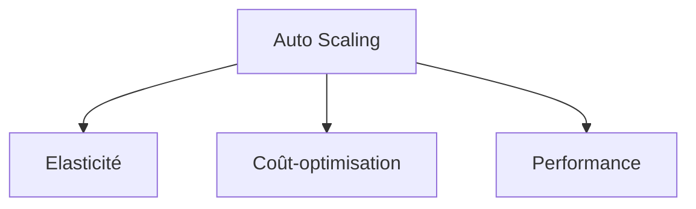

_Explication : Auto Scaling est défini comme : ajustement automatique des ressources cloud en fonction de la demande en temps réel._

<br>

---

### AWS

!!! note "Définition"
    Plateforme de services cloud Amazon offrant infrastructure, plateforme et logiciels à la demande.

Utilisé pour héberger, développer et déployer des applications dans le cloud public.

- **Acronyme :** Amazon Web Services
- **Services phares :** EC2, S3, RDS, Lambda, VPC, IAM, CloudFront

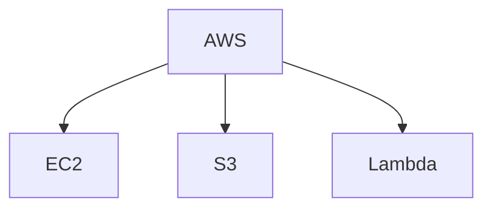

_Explication : AWS est défini comme : plateforme de services cloud Amazon offrant infrastructure, plateforme et logiciels à la demande._

<br>

---

### Azure

!!! note "Définition"
    Plateforme cloud Microsoft fournissant services IaaS, PaaS et SaaS.

Utilisé pour l'intégration avec l'écosystème Microsoft et les applications d'entreprise.

- **Services :** Virtual Machines, Storage, App Service, Azure Functions
- **Intégrations :** Active Directory, Office 365, Windows Server

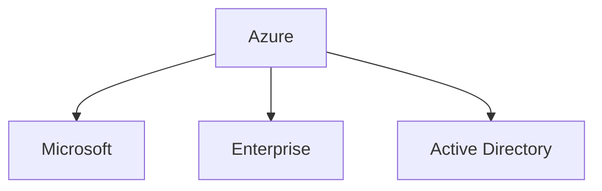

_Explication : Azure est défini comme : plateforme cloud Microsoft fournissant services IaaS, PaaS et SaaS._

<br>

---

## C

### Container

!!! note "Définition"
    Unité de déploiement légère incluant application et toutes ses dépendances dans un environnement isolé.

Utilisé pour standardiser les environnements et simplifier le déploiement entre développement et production.

- **Avantages :** portabilité, isolation légère, efficacité des ressources vs machines virtuelles
- **Technologies :** Docker, containerd, CRI-O

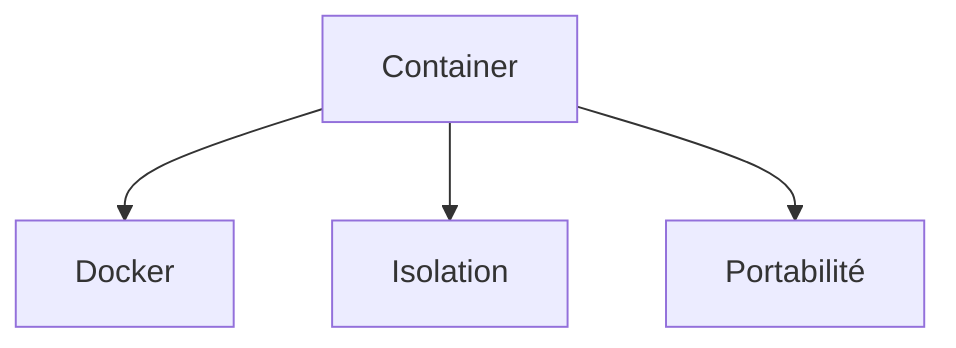

_Explication : Container est défini comme : unité de déploiement légère incluant application et toutes ses dépendances dans un environnement isolé._

<br>

---

### CloudFormation

!!! note "Définition"
    Service AWS d'infrastructure as code utilisant des templates JSON/YAML déclaratifs.

Utilisé pour provisionner et gérer l'infrastructure AWS de manière reproductible et versionnable.

- **Concepts :** stacks, templates, resources, parameters, outputs
- **Avantages :** reproducibilité, versioning Git, rollback automatique

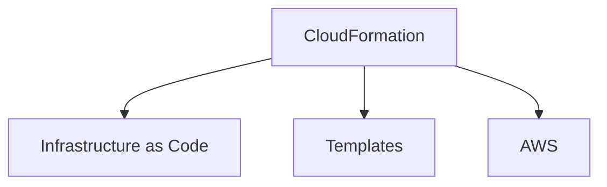

_Explication : CloudFormation est défini comme : service AWS d'infrastructure as code utilisant des templates JSON/YAML déclaratifs._

<br>

---

## D

### Docker

!!! note "Définition"
    Plateforme de conteneurisation permettant d'empaqueter applications et dépendances en images portables.

Utilisé pour créer des environnements cohérents du développement à la production.

- **Composants :** Docker Engine, images (template), containers (instance), registries
- **Commandes :** `docker build`, `docker run`, `docker push`, `docker pull`

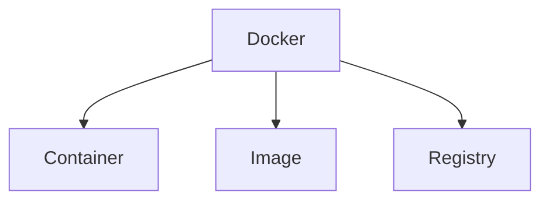

_Explication : Docker est défini comme : plateforme de conteneurisation permettant d'empaqueter applications et dépendances en images portables._

<br>

---

### Dockerfile

!!! note "Définition"
    Script contenant les instructions séquentielles pour construire une image Docker.

Utilisé pour automatiser la création d'images reproductibles et documentées.

- **Instructions :** `FROM`, `RUN`, `COPY`, `EXPOSE`, `CMD`, `ENV`
- **Bonnes pratiques :** multi-stage builds, minimiser les layers, images de base minimales

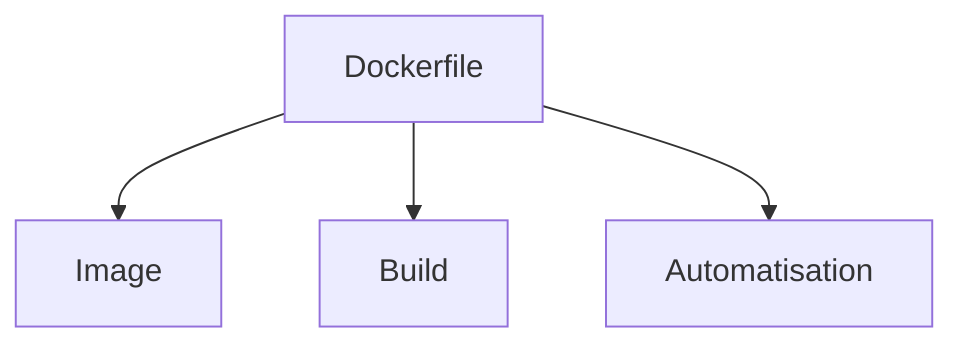

_Explication : Dockerfile est défini comme : script contenant les instructions séquentielles pour construire une image Docker._

<br>

---

## E

### EC2

!!! note "Définition"
    Service de machines virtuelles cloud d'Amazon Web Services.

Utilisé pour exécuter des applications dans des instances virtuelles redimensionnables.

- **Acronyme :** Elastic Compute Cloud
- **Types d'instances :** general purpose, compute optimized, memory optimized, storage optimized, GPU

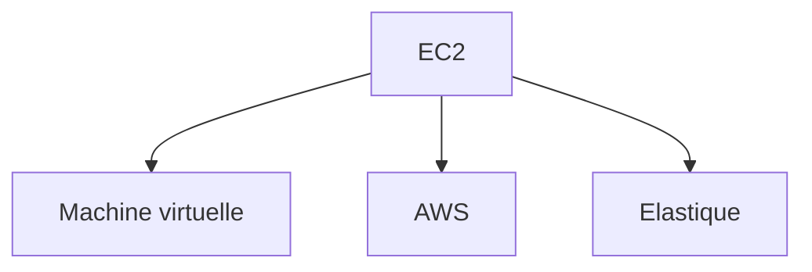

_Explication : EC2 est défini comme : service de machines virtuelles cloud d'Amazon Web Services._

<br>

---

### ECS

!!! note "Définition"
    Service de conteneurs managé d'AWS pour déployer et gérer des applications conteneurisées.

Utilisé pour orchestrer des containers Docker sans gérer l'infrastructure sous-jacente.

- **Acronyme :** Elastic Container Service
- **Modes :** EC2 (gestion des instances vous-même), Fargate (fully serverless managed)

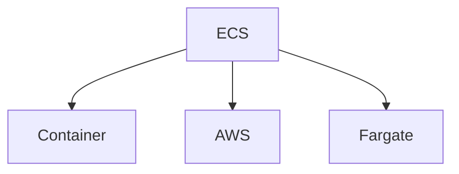

_Explication : ECS est défini comme : service de conteneurs managé d'AWS pour déployer et gérer des applications conteneurisées._

<br>

---

### EKS

!!! note "Définition"
    Service Kubernetes managé d'AWS simplifiant le déploiement et la gestion des clusters.

Utilisé pour exécuter Kubernetes en production sans gérer la complexité du control plane.

- **Acronyme :** Elastic Kubernetes Service
- **Intégrations :** IAM, VPC, ELB, CloudWatch, ECR

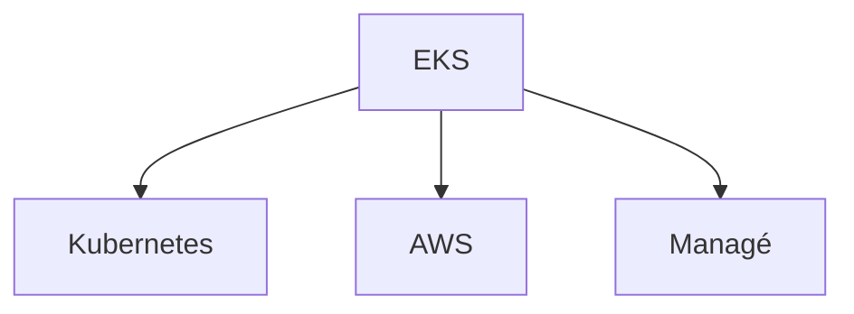

_Explication : EKS est défini comme : service Kubernetes managé d'AWS simplifiant le déploiement et la gestion des clusters._

<br>

---

## F

### FaaS

!!! note "Définition"
    Modèle d'exécution cloud où le code s'exécute en réponse à des événements sans gérer de serveurs.

Utilisé pour créer des applications event-driven avec une facturation à l'exécution.

- **Acronyme :** Function as a Service
- **Exemples :** AWS Lambda, Azure Functions, Google Cloud Functions

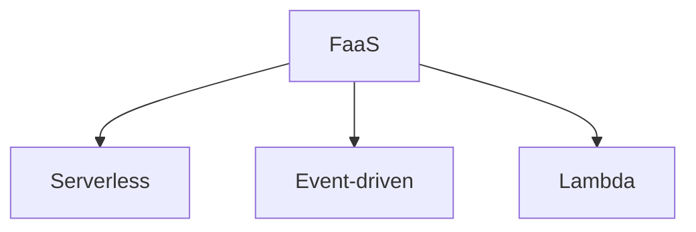

_Explication : FaaS est défini comme : modèle d'exécution cloud où le code s'exécute en réponse à des événements sans gérer de serveurs._

<br>

---

### Fault tolerance

!!! note "Définition"
    Capacité d'un système à continuer de fonctionner correctement malgré les pannes de composants.

Utilisé pour assurer la haute disponibilité des applications et services critiques.

- **Techniques :** redondance, failover automatique, circuit breakers
- **Design patterns :** multi-AZ, multi-region, active-passive, active-active

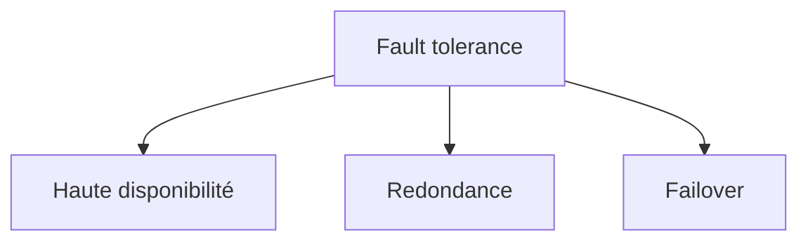

_Explication : Fault tolerance est défini comme : capacité d'un système à continuer de fonctionner correctement malgré les pannes de composants._

<br>

---

## G

### GCP

!!! note "Définition"
    Plateforme de services cloud de Google axée sur l'analytique, l'IA et la data.

Utilisé pour les applications nécessitant machine learning, big data ou l'infrastructure Google.

- **Acronyme :** Google Cloud Platform
- **Services :** Compute Engine, BigQuery, AI Platform, GKE (Kubernetes Engine)

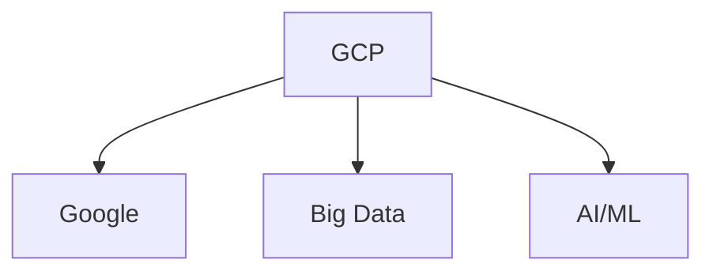

_Explication : GCP est défini comme : plateforme de services cloud de Google axée sur l'analytique, l'IA et la data._

<br>

---

## H

### Helm

!!! note "Définition"
    Gestionnaire de paquets pour Kubernetes facilitant le déploiement d'applications complexes.

Utilisé pour packager, configurer et déployer des applications Kubernetes avec versioning.

- **Concepts :** charts (packages), releases (instances déployées), values, templates
- **Avantages :** réutilisabilité, versioning, rollback, templating puissant

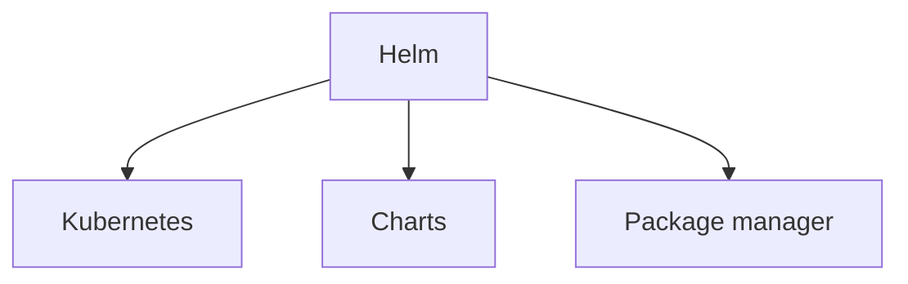

_Explication : Helm est défini comme : gestionnaire de paquets pour Kubernetes facilitant le déploiement d'applications complexes._

<br>

---

### Horizontal scaling

!!! note "Définition"
    Ajout de ressources en parallèle (instances supplémentaires) pour gérer l'augmentation de charge.

Utilisé pour distribuer la charge sur plusieurs instances identiques derrière un load balancer.

- **Synonyme :** scale out
- **Avantages :** élasticité, tolérance aux pannes, coût-efficacité par rapport au scale up

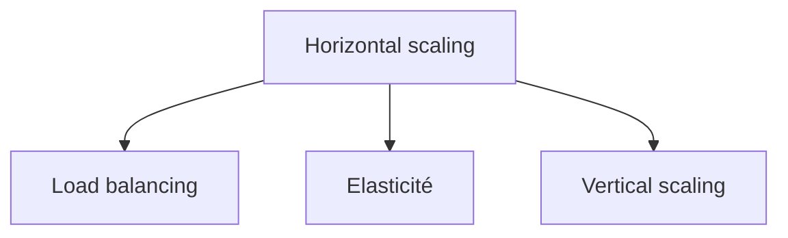

_Explication : Horizontal scaling est défini comme : ajout de ressources en parallèle (instances supplémentaires) pour gérer l'augmentation de charge._

<br>

---

## I

### IaaS

!!! note "Définition"
    Modèle cloud fournissant une infrastructure virtualisée (compute, storage, network) à la demande.

Utilisé pour migrer des workloads existants vers le cloud avec un contrôle maximal.

- **Acronyme :** Infrastructure as a Service
- **Composants :** compute (VMs), stockage (blocs/objets), réseau (VPC), virtualisation

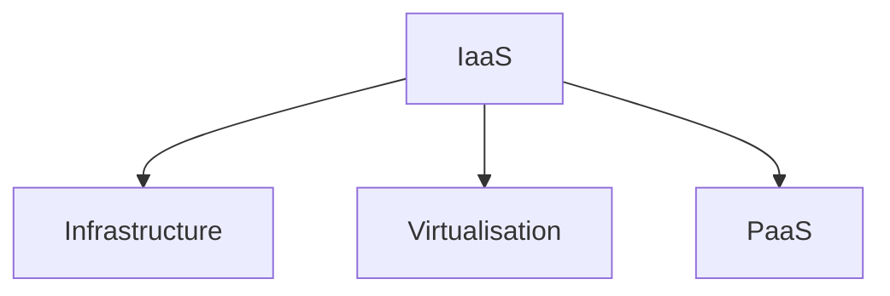

_Explication : IaaS est défini comme : modèle cloud fournissant une infrastructure virtualisée (compute, storage, network) à la demande._

<br>

---

### IAM

!!! note "Définition"
    Système de gestion des identités et des accès aux ressources cloud.

Utilisé pour contrôler finement qui peut accéder à quoi dans l'environnement cloud.

- **Acronyme :** Identity and Access Management
- **Concepts :** users, groups, roles, policies (JSON), permissions, least privilege

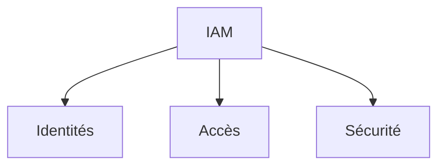

_Explication : IAM est défini comme : système de gestion des identités et des accès aux ressources cloud._

<br>

---

## K

### Kubernetes

!!! note "Définition"
    Plateforme d'orchestration de conteneurs automatisant le déploiement, la mise à l'échelle et la gestion.

Utilisé pour gérer des applications conteneurisées à grande échelle en production.

- **Composants :** control plane (master), worker nodes, pods, services, ingress
- **Concepts :** deployments, configmaps, secrets, persistent volumes, namespaces

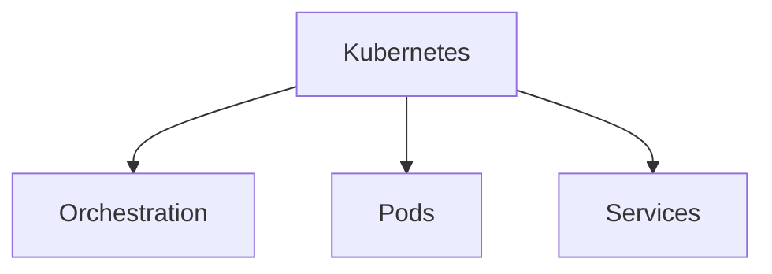

_Explication : Kubernetes est défini comme : plateforme d'orchestration de conteneurs automatisant le déploiement, la mise à l'échelle et la gestion._

<br>

---

### kubectl

!!! note "Définition"
    Outil en ligne de commande pour interagir avec les clusters Kubernetes.

Utilisé pour déployer, inspecter et gérer les ressources Kubernetes depuis le terminal.

- **Commandes :** `get`, `create`, `apply`, `delete`, `describe`, `logs`, `exec`
- **Configuration :** kubeconfig, contexts, namespaces

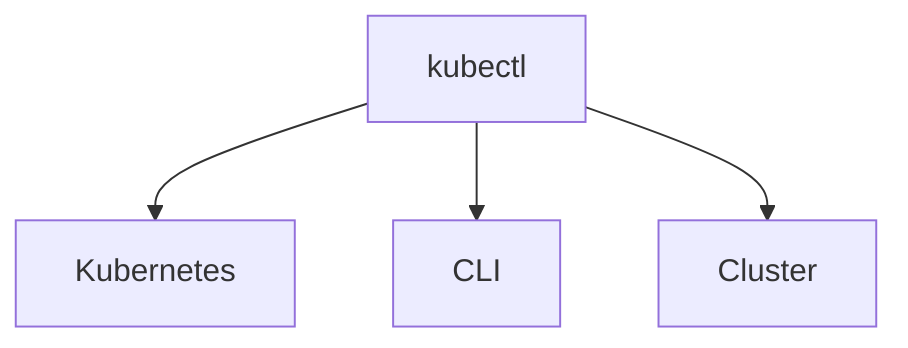

_Explication : kubectl est défini comme : outil en ligne de commande pour interagir avec les clusters Kubernetes._

<br>

---

## L

### Lambda

!!! note "Définition"
    Service de calcul serverless d'AWS exécutant du code en réponse à des événements.

Utilisé pour créer des applications event-driven sans provisionner ni gérer de serveurs.

- **Déclencheurs :** API Gateway, S3, DynamoDB, CloudWatch Events, SQS
- **Langages :** Python, Node.js, Java, C#, Go, Ruby

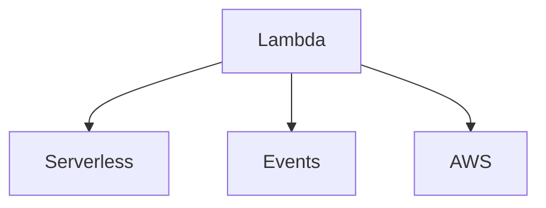

_Explication : Lambda est défini comme : service de calcul serverless d'AWS exécutant du code en réponse à des événements._

<br>

---

### Load Balancer

!!! note "Définition"
    Service distribuant le trafic entrant sur plusieurs instances pour optimiser disponibilité et performances.

Utilisé pour améliorer la résilience et répartir équitablement la charge de travail.

- **Types :** Application (L7 — HTTP/HTTPS), Network (L4 — TCP/UDP), Classic
- **Algorithmes :** round robin, least connections, weighted, IP hash

```mermaid
graph TB
    A[Load Balancer] --> B[Distribution]
    A --> C[Haute disponibilité]
    A --> D[Performance]
```

_Explication : Load Balancer est défini comme : service distribuant le trafic entrant sur plusieurs instances pour optimiser disponibilité et performances._

<br>

---

## M

### Microservices

!!! note "Définition"
    Architecture décomposant une application en services indépendants, déployables séparément.

Utilisé pour améliorer la scalabilité, la maintenabilité et permettre des déploiements indépendants.

- **Avantages :** diversité technologique, autonomie des équipes, isolation des pannes
- **Challenges :** complexité des systèmes distribués, latence réseau, cohérence des données

```mermaid
graph TB
    A[Microservices] --> B[Indépendance]
    A --> C[Scalabilité]
    A --> D[API Gateway]
```

_Explication : Microservices est défini comme : architecture décomposant une application en services indépendants, déployables séparément._

<br>

---

### Multi-cloud

!!! note "Définition"
    Stratégie utilisant plusieurs fournisseurs cloud pour éviter le vendor lock-in.

Utilisé pour diversifier les risques, optimiser les coûts et utiliser le meilleur service de chaque provider.

- **Avantages :** négociation de prix, best-of-breed, redondance inter-cloud
- **Challenges :** complexité de gestion, compétences requises, intégration inter-cloud

```mermaid
graph TB
    A[Multi-cloud] --> B[Diversification]
    A --> C[Vendor lock-in]
    A --> D[Optimisation]
```

_Explication : Multi-cloud est défini comme : stratégie utilisant plusieurs fournisseurs cloud pour éviter le vendor lock-in._

<br>

---

## P

### PaaS

!!! note "Définition"
    Plateforme cloud fournissant un environnement de développement et déploiement complet et managé.

Utilisé pour développer et déployer des applications sans gérer l'infrastructure sous-jacente.

- **Acronyme :** Platform as a Service
- **Exemples :** Heroku, Google App Engine, Azure App Service, Railway

```mermaid
graph TB
    A[PaaS] --> B[Développement]
    A --> C[Déploiement]
    A --> D[IaaS]
```

_Explication : PaaS est défini comme : plateforme cloud fournissant un environnement de développement et déploiement complet et managé._

<br>

---

### Pod

!!! note "Définition"
    Plus petite unité déployable dans Kubernetes contenant un ou plusieurs conteneurs colocalisés.

Utilisé comme wrapper pour les conteneurs partageant le même réseau et les mêmes volumes.

- **Caractéristiques :** éphémère, IP unique dans le cluster, volumes partagés entre containers
- **Patterns :** sidecar (assistant), ambassador (proxy), adapter (transformation)

```mermaid
graph TB
    A[Pod] --> B[Container]
    A --> C[Kubernetes]
    A --> D[Éphémère]
```

_Explication : Pod est défini comme : plus petite unité déployable dans Kubernetes contenant un ou plusieurs conteneurs colocalisés._

<br>

---

## S

### S3

!!! note "Définition"
    Service de stockage objet d'AWS offrant durabilité quasi-infinie et scalabilité automatique.

Utilisé pour stocker et récupérer n'importe quelle quantité de données depuis n'importe où.

- **Acronyme :** Simple Storage Service
- **Classes de stockage :** Standard, Infrequent Access (IA), Glacier, Deep Archive

```mermaid
graph TB
    A[S3] --> B[Stockage objet]
    A --> C[Durabilité]
    A --> D[AWS]
```

_Explication : S3 est défini comme : service de stockage objet d'AWS offrant durabilité quasi-infinie et scalabilité automatique._

<br>

---

### SaaS

!!! note "Définition"
    Modèle cloud où le logiciel est accessible via Internet en tant que service abonné.

Utilisé pour consommer des applications sans installation, maintenance ni gestion d'infrastructure.

- **Acronyme :** Software as a Service
- **Exemples :** Salesforce, Office 365, Google Workspace, Slack, Notion

```mermaid
graph TB
    A[SaaS] --> B[Application]
    A --> C[Internet]
    A --> D[Abonnement]
```

_Explication : SaaS est défini comme : modèle cloud où le logiciel est accessible via Internet en tant que service abonné._

<br>

---

### Serverless

!!! note "Définition"
    Modèle d'exécution où l'infrastructure est entièrement gérée par le fournisseur cloud.

Utilisé pour se concentrer sur le code métier avec une scalabilité automatique et une facturation à l'usage.

- **Avantages :** scalabilité automatique, pay-per-use, zero serveur à gérer
- **Services :** FaaS (Lambda), API Gateway, bases de données managées, queues

```mermaid
graph TB
    A[Serverless] --> B[FaaS]
    A --> C[Managed services]
    A --> D[Pay-per-use]
```

_Explication : Serverless est défini comme : modèle d'exécution où l'infrastructure est entièrement gérée par le fournisseur cloud._

<br>

---

## T

### Terraform

!!! note "Définition"
    Outil d'infrastructure as code permettant de provisionner des ressources cloud de manière déclarative.

Utilisé pour gérer l'infrastructure de manière reproductible, versionnable et multi-cloud.

- **Concepts :** providers (AWS/Azure/GCP), resources, variables, outputs, state
- **Workflow :** `terraform init` → `plan` (aperçu) → `apply` (déploiement)

```mermaid
graph TB
    A[Terraform] --> B[Infrastructure as Code]
    A --> C[Multi-cloud]
    A --> D[State]
```

_Explication : Terraform est défini comme : outil d'infrastructure as code permettant de provisionner des ressources cloud de manière déclarative._

<br>

---

## V

### VPC

!!! note "Définition"
    Réseau virtuel privé isolé dans le cloud pour vos ressources.

Utilisé pour créer un environnement réseau sécurisé avec contrôle total du routage et des accès.

- **Acronyme :** Virtual Private Cloud
- **Composants :** subnets (publics/privés), route tables, security groups, NACLs, Internet Gateway

```mermaid
graph TB
    A[VPC] --> B[Réseau privé]
    A --> C[Isolation]
    A --> D[Sécurité]
```

_Explication : VPC est défini comme : réseau virtuel privé isolé dans le cloud pour vos ressources._

<br>

---

### Vertical scaling

!!! note "Définition"
    Augmentation des ressources (CPU, RAM) d'une machine existante pour gérer plus de charge.

Utilisé quand l'application ne peut pas être distribuée horizontalement ou en complément.

- **Synonyme :** scale up
- **Limitations :** plafond matériel/cloud, single point of failure, coût croissant

```mermaid
graph TB
    A[Vertical scaling] --> B[Ressources]
    A --> C[Scale up]
    A --> D[Horizontal scaling]
```

_Explication : Vertical scaling est défini comme : augmentation des ressources (CPU, RAM) d'une machine existante pour gérer plus de charge._

<br>
