# Cybersécurité

<div
  class="omny-meta"
  data-level="🟢 Tout niveau"
  data-version="1.0"
  data-time="Consultation">
</div>


!!! quote "Analogie pédagogique"
    _La cybersécurité est un jeu d'échecs asymétrique. L'attaquant (Red Team) n'a besoin de trouver qu'une seule faille pour gagner, tandis que le défenseur (Blue Team) doit protéger absolument toutes les pièces, à tout moment, tout en respectant les règles fixées par l'arbitre (Gouvernance)._

## A

### AES

!!! note "Définition"
    Standard de chiffrement symétrique adopté par le gouvernement américain pour protéger les données.

Utilisé pour le chiffrement de données sensibles et communications sécurisées.

- **Acronyme :** Advanced Encryption Standard
- **Tailles de clés :** 128, 192, 256 bits
- **Remplace :** DES, 3DES

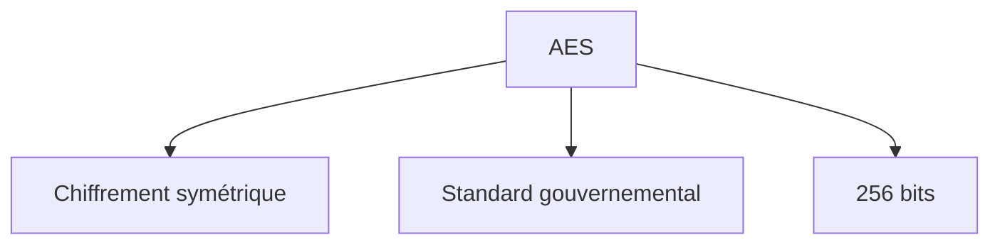

_Explication : AES est défini comme : standard de chiffrement symétrique adopté par le gouvernement américain pour protéger les données._

<br>

---

### APT

!!! note "Définition"
    Cyberattaque sophistiquée et persistante menée par des acteurs étatiques ou criminels organisés.

Utilisé pour décrire des campagnes d'attaque longues et ciblées visant des organisations spécifiques.

- **Acronyme :** Advanced Persistent Threat
- **Caractéristiques :** persistance, sophistication, ciblage spécifique
- **Exemples :** APT1, Lazarus Group, Cozy Bear

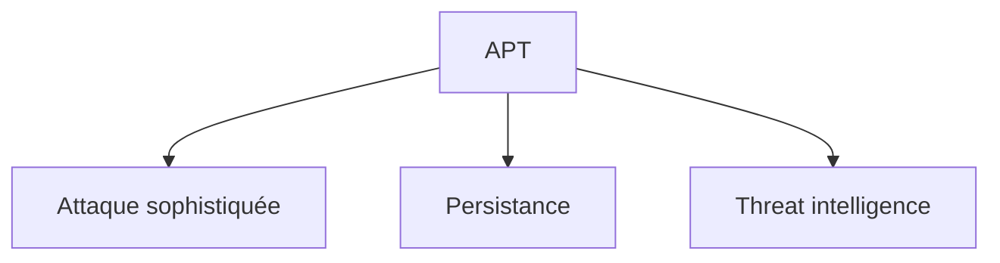

_Explication : APT est défini comme : cyberattaque sophistiquée et persistante menée par des acteurs étatiques ou criminels organisés._

<br>

---

### Antivirus

!!! note "Définition"
    Logiciel de protection détectant et supprimant les programmes malveillants.

Utilisé pour la protection en temps réel des endpoints contre les malwares connus et variants.

- **Méthodes de détection :** signatures, heuristique, analyse comportementale
- **Évolution :** antivirus → EPP → EDR → XDR

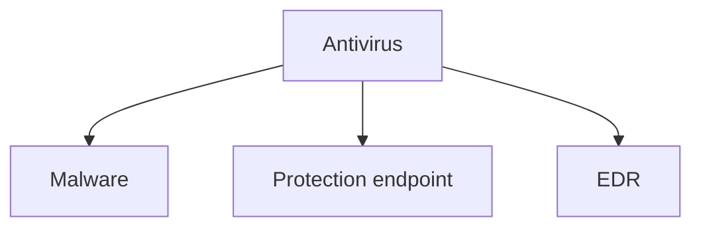

_Explication : Antivirus est défini comme : logiciel de protection détectant et supprimant les programmes malveillants._

<br>

---

## B

### Backdoor

!!! note "Définition"
    Accès secret et non autorisé installé dans un système pour contourner les contrôles de sécurité.

Utilisé par les attaquants pour maintenir un accès persistant aux systèmes compromis sans être détectés.

- **Types :** hardware, software, protocol backdoors
- **Détection :** monitoring réseau, analyse de code, forensics

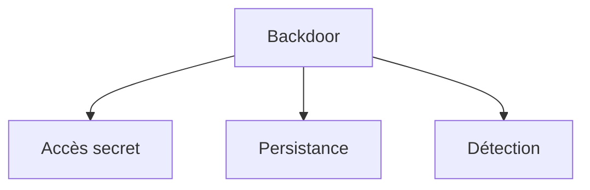

_Explication : Backdoor est défini comme : accès secret et non autorisé installé dans un système pour contourner les contrôles de sécurité._

<br>

---

### Blue Team

!!! note "Définition"
    Équipe défensive responsable de la protection et de la détection des cyberattaques.

Utilisé dans les exercices de sécurité et opérations de cyberdéfense quotidiennes.

- **Rôles :** monitoring, détection, réponse aux incidents, hardening
- **Outils :** SIEM, EDR, IDS/IPS, threat intelligence

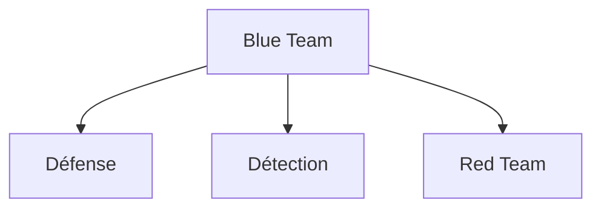

_Explication : Blue Team est défini comme : équipe défensive responsable de la protection et de la détection des cyberattaques._

<br>

---

### Botnet

!!! note "Définition"
    Réseau d'ordinateurs infectés contrôlés à distance par des cybercriminels.

Utilisé pour mener des attaques DDoS, campagnes de spam, cryptomining et vol de données massif.

- **Composants :** bot master, command & control (C&C), bots (zombies)
- **Exemples :** Mirai, Zeus, Conficker

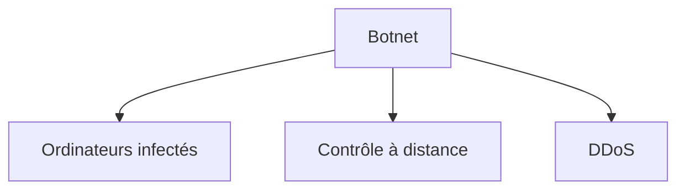

_Explication : Botnet est défini comme : réseau d'ordinateurs infectés contrôlés à distance par des cybercriminels._

<br>

---

## C

### CA

!!! note "Définition"
    Entité de confiance émettant et gérant des certificats numériques.

Utilisé pour établir l'authenticité et l'intégrité des communications numériques via une chaîne de confiance.

- **Acronyme :** Certificate Authority
- **Fonctions :** émission, révocation, validation des certificats
- **Exemples :** Let's Encrypt, DigiCert, Verisign

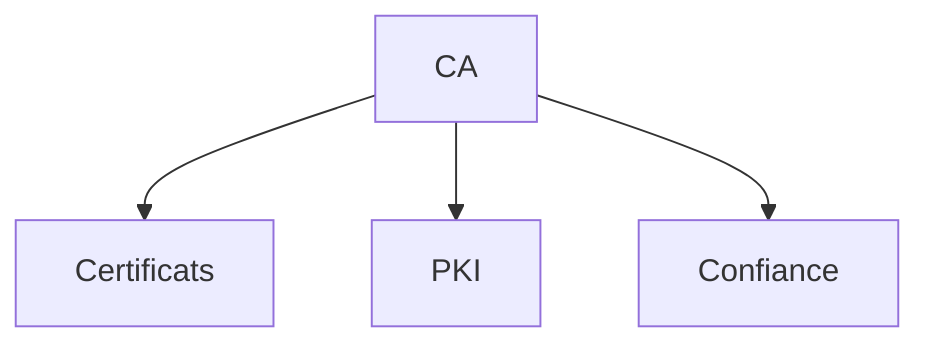

_Explication : CA est défini comme : entité de confiance émettant et gérant des certificats numériques._

<br>

---

### CERT

!!! note "Définition"
    Organisation dédiée à la réponse aux incidents de sécurité informatique.

Utilisé pour coordonner la réponse aux cybermenaces nationales ou sectorielles et partager les renseignements.

- **Acronyme :** Computer Emergency Response Team
- **Activités :** incident response, vulnerability research, threat intelligence
- **Exemples :** US-CERT, CERT-FR, CERTs sectoriels

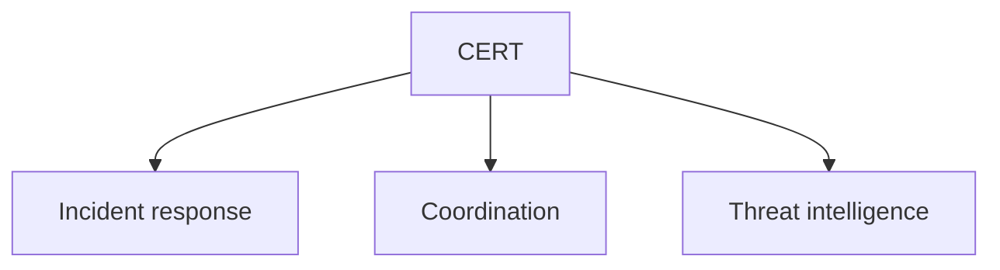

_Explication : CERT est défini comme : organisation dédiée à la réponse aux incidents de sécurité informatique._

<br>

---

### CVE

!!! note "Définition"
    Base de données publique des vulnérabilités de sécurité informatique connues.

Utilisé pour identifier et référencer les failles de sécurité de manière standardisée à l'échelle mondiale.

- **Acronyme :** Common Vulnerabilities and Exposures
- **Format :** `CVE-YYYY-NNNN` (année-numéro séquentiel)
- **Gestion :** MITRE Corporation

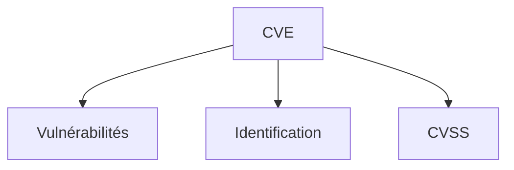

_Explication : CVE est défini comme : base de données publique des vulnérabilités de sécurité informatique connues._

<br>

---

### CVSS

!!! note "Définition"
    Système standardisé de notation de la gravité des vulnérabilités de sécurité.

Utilisé pour prioriser les correctifs et évaluer les risques de sécurité de manière objective.

- **Acronyme :** Common Vulnerability Scoring System
- **Score :** 0.0 à 10.0 — None, Low, Medium, High, Critical
- **Métriques :** base (intrinsèque), temporal (évolution), environmental (contexte)

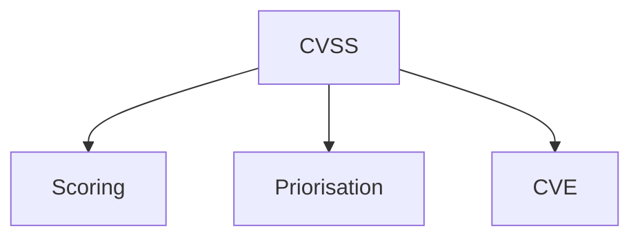

_Explication : CVSS est défini comme : système standardisé de notation de la gravité des vulnérabilités de sécurité._

<br>

---

## D

### DDoS

!!! note "Définition"
    Attaque visant à rendre un service indisponible en le surchargeant de requêtes simultanées.

Utilisé pour perturber les services en ligne, extorquer des organisations ou masquer d'autres intrusions.

- **Acronyme :** Distributed Denial of Service
- **Types :** volumétrique, protocol, application layer (L7)
- **Protection :** CDN, load balancing, rate limiting, anycast

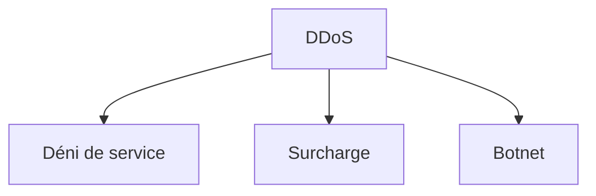

_Explication : DDoS est défini comme : attaque visant à rendre un service indisponible en le surchargeant de requêtes simultanées._

<br>

---

### DLP

!!! note "Définition"
    Technologie empêchant la fuite de données sensibles hors de l'organisation.

Utilisé pour protéger la propriété intellectuelle et respecter les réglementations de protection des données.

- **Acronyme :** Data Loss Prevention
- **Approches :** endpoint DLP, network DLP, storage DLP
- **Méthodes :** pattern matching, machine learning, classification des données

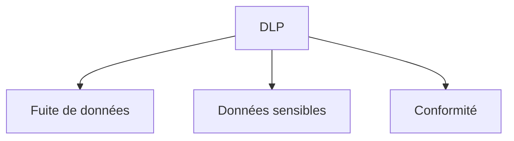

_Explication : DLP est défini comme : technologie empêchant la fuite de données sensibles hors de l'organisation._

<br>

---

## E

### EDR

!!! note "Définition"
    Solution de sécurité surveillant et analysant les activités des endpoints en temps réel.

Utilisé pour détecter, investiguer et répondre aux menaces avancées contournant les antivirus traditionnels.

- **Acronyme :** Endpoint Detection and Response
- **Capacités :** monitoring continu, threat hunting, forensics, response automatisée
- **Évolution :** antivirus → EPP → EDR → XDR

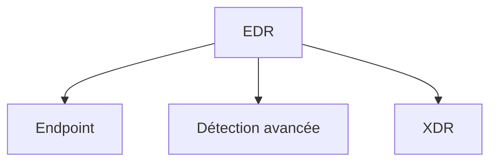

_Explication : EDR est défini comme : solution de sécurité surveillant et analysant les activités des endpoints en temps réel._

<br>

---

### Encryption

!!! note "Définition"
    Processus de transformation des données en format illisible pour protéger leur confidentialité.

Utilisé pour sécuriser les données en transit (réseau) et au repos (stockage).

- **Types :** symétrique (même clé), asymétrique (clé publique/privée), hash
- **Standards :** AES, RSA, ECC, SHA

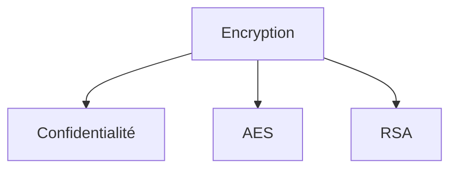

_Explication : Encryption est défini comme : processus de transformation des données en format illisible pour protéger leur confidentialité._

<br>

---

## F

### Firewall

!!! note "Définition"
    Système de sécurité réseau filtrant le trafic selon des règles prédéfinies.

Utilisé pour contrôler les communications entre réseaux de niveaux de confiance différents.

- **Types :** packet filtering, stateful inspection, application layer (WAF), NGFW
- **Déploiement :** network, host-based, cloud firewalls

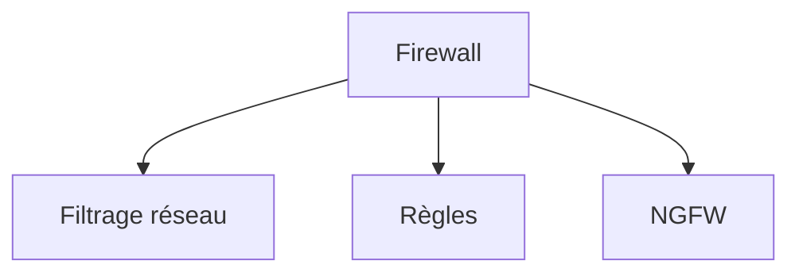

_Explication : Firewall est défini comme : système de sécurité réseau filtrant le trafic selon des règles prédéfinies._

<br>

---

### Forensics

!!! note "Définition"
    Investigation numérique pour analyser les preuves d'incidents de sécurité informatique.

Utilisé pour comprendre les attaques, identifier les responsables et constituer des preuves légales.

- **Phases :** préservation → acquisition → analyse → présentation
- **Outils :** EnCase, FTK, Volatility, Autopsy

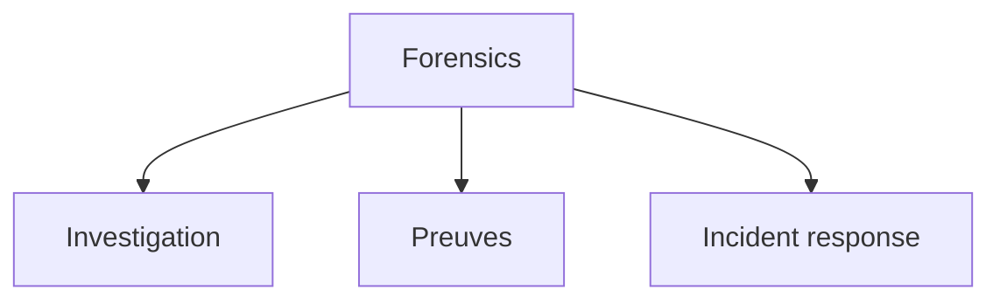

_Explication : Forensics est défini comme : investigation numérique pour analyser les preuves d'incidents de sécurité informatique._

<br>

---

## H

### Hash

!!! note "Définition"
    Fonction cryptographique produisant une empreinte unique et de taille fixe à partir d'une donnée quelconque.

Utilisé pour vérifier l'intégrité des données et stocker les mots de passe de manière irréversible.

- **Algorithmes :** SHA-256, SHA-3, bcrypt, scrypt, Argon2
- **Propriétés :** déterministe, irréversible, résistant aux collisions

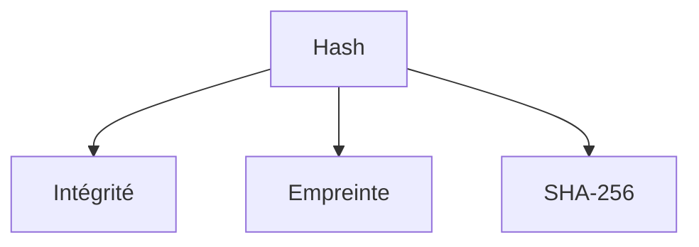

_Explication : Hash est défini comme : fonction cryptographique produisant une empreinte unique et de taille fixe à partir d'une donnée quelconque._

<br>

---

### Honeypot

!!! note "Définition"
    Système leurre conçu pour attirer et détecter les attaquants en simulant des ressources vulnérables.

Utilisé pour collecter des renseignements sur les techniques d'attaque et détourner les intrusions.

- **Types :** low-interaction, high-interaction, honeynets
- **Objectifs :** early warning, threat intelligence, analyse forensique

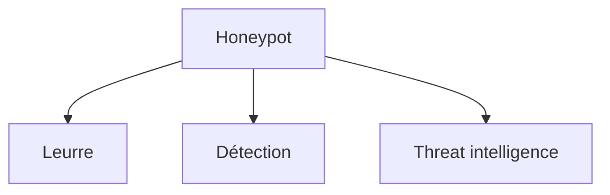

_Explication : Honeypot est défini comme : système leurre conçu pour attirer et détecter les attaquants en simulant des ressources vulnérables._

<br>

---

## I

### IDS/IPS

!!! note "Définition"
    Systèmes de détection et prévention d'intrusions pour identifier les activités malveillantes réseau ou système.

Utilisé pour surveiller le trafic réseau et les activités système suspectes en temps réel.

- **Acronyme :** Intrusion Detection/Prevention System
- **Types :** network-based (NIDS/NIPS), host-based (HIDS/HIPS)
- **Méthodes :** signature-based, anomaly-based, behavioral analysis

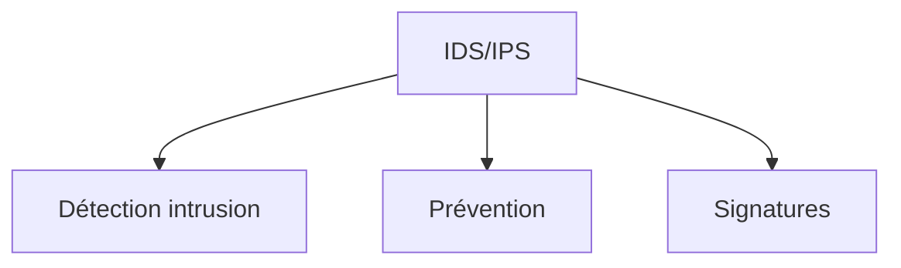

_Explication : IDS/IPS est défini comme : systèmes de détection et prévention d'intrusions pour identifier les activités malveillantes réseau ou système._

<br>

---

### IOC

!!! note "Définition"
    Indicateurs techniques permettant d'identifier une compromission ou une menace active.

Utilisé pour la détection automatisée, l'investigation et le threat hunting dans les SOC.

- **Acronyme :** Indicator of Compromise
- **Types :** adresses IP, noms de domaine, hash de fichiers, clés de registre
- **Formats de partage :** STIX/TAXII, OpenIOC, règles YARA

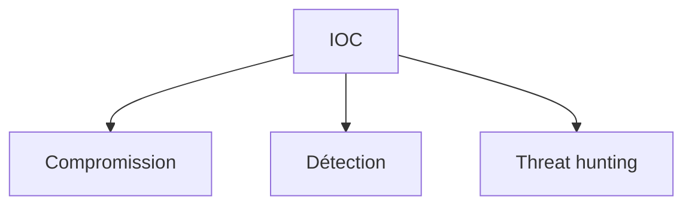

_Explication : IOC est défini comme : indicateurs techniques permettant d'identifier une compromission ou une menace active._

<br>

---

## K

### Keylogger

!!! note "Définition"
    Logiciel ou matériel enregistrant secrètement les frappes clavier d'un utilisateur.

Utilisé par les attaquants pour voler des mots de passe, identifiants et informations sensibles.

- **Types :** software, hardware, acoustic, optical
- **Protection :** claviers virtuels, logiciels anti-keylogger, authentification MFA

```mermaid
graph TB
    A[Keylogger] --> B[Frappes clavier]
    A --> C[Vol de données]
    A --> D[Malware]
```

_Explication : Keylogger est défini comme : logiciel ou matériel enregistrant secrètement les frappes clavier d'un utilisateur._

<br>

---

## M

### Malware

!!! note "Définition"
    Logiciel malveillant conçu pour endommager, perturber ou accéder illégalement aux systèmes.

Utilisé par les cybercriminels comme vecteur principal d'attaques informatiques.

- **Types :** virus, worms, trojans, ransomware, spyware, adware, rootkits
- **Vecteurs d'infection :** email, web, USB, réseau interne, supply chain

```mermaid
graph TB
    A[Malware] --> B[Logiciel malveillant]
    A --> C[Ransomware]
    A --> D[Antivirus]
```

_Explication : Malware est défini comme : logiciel malveillant conçu pour endommager, perturber ou accéder illégalement aux systèmes._

<br>

---

### MFA

!!! note "Définition"
    Méthode d'authentification nécessitant plusieurs facteurs de vérification indépendants.

Utilisé pour renforcer la sécurité des accès aux systèmes critiques, même en cas de compromission de mot de passe.

- **Acronyme :** Multi-Factor Authentication
- **Facteurs :** something you know / have / are (connaissance / possession / inhérence)
- **Méthodes :** SMS OTP, TOTP (Google Authenticator), hardware tokens (YubiKey), biométrie

```mermaid
graph TB
    A[MFA] --> B[Authentification]
    A --> C[Facteurs multiples]
    A --> D[Sécurité renforcée]
```

_Explication : MFA est défini comme : méthode d'authentification nécessitant plusieurs facteurs de vérification indépendants._

<br>

---

### MITRE ATT&CK

!!! note "Définition"
    Framework décrivant les tactiques, techniques et procédures (TTPs) des cyberattaquants réels.

Utilisé pour le threat modeling, l'analyse de lacunes défensives et la mesure de la maturité SOC.

- **Matrices :** Enterprise, Mobile, ICS (systèmes industriels)
- **Utilisation :** threat modeling, gap analysis, cartographie des détections

```mermaid
graph TB
    A[MITRE ATT&CK] --> B[TTPs]
    A --> C[Framework]
    A --> D[Threat modeling]
```

_Explication : MITRE ATT&CK est défini comme : framework décrivant les tactiques, techniques et procédures (TTPs) des cyberattaquants réels._

<br>

---

## P

### Penetration Testing

!!! note "Définition"
    Test d'intrusion autorisé simulant une cyberattaque réelle pour identifier les vulnérabilités exploitables.

Utilisé pour évaluer la sécurité des systèmes de manière proactive, avant qu'un vrai attaquant ne le fasse.

- **Phases :** reconnaissance → scanning → exploitation → post-exploitation → reporting
- **Types :** black box (sans connaissance), white box (accès total), gray box (connaissance partielle)

```mermaid
graph TB
    A[Penetration Testing] --> B[Test d'intrusion]
    A --> C[Vulnérabilités]
    A --> D[Red Team]
```

_Explication : Penetration Testing est défini comme : test d'intrusion autorisé simulant une cyberattaque réelle pour identifier les vulnérabilités exploitables._

<br>

---

### Phishing

!!! note "Définition"
    Technique d'ingénierie sociale utilisant des communications frauduleuses pour voler des informations.

Utilisé pour obtenir des credentials, données personnelles ou installer des malwares via la tromperie.

- **Types :** email phishing, spear phishing (ciblé), whaling (dirigeants), smishing (SMS), vishing (voix)
- **Protection :** formation utilisateurs, filtres email, MFA, DMARC/SPF

```mermaid
graph TB
    A[Phishing] --> B[Ingénierie sociale]
    A --> C[Communications frauduleuses]
    A --> D[Social engineering]
```

_Explication : Phishing est défini comme : technique d'ingénierie sociale utilisant des communications frauduleuses pour voler des informations._

<br>

---

### PKI

!!! note "Définition"
    Infrastructure de gestion des clés publiques pour sécuriser les communications numériques.

Utilisé pour établir la confiance et l'authenticité entre entités dans les environnements numériques.

- **Acronyme :** Public Key Infrastructure
- **Composants :** CA, RA (Registration Authority), certificats, CRL, OCSP

```mermaid
graph TB
    A[PKI] --> B[Clés publiques]
    A --> C[Certificats]
    A --> D[CA]
```

_Explication : PKI est défini comme : infrastructure de gestion des clés publiques pour sécuriser les communications numériques._

<br>

---

## R

### Ransomware

!!! note "Définition"
    Malware chiffrant les données des victimes et exigeant une rançon pour la clé de déchiffrement.

Utilisé par les cybercriminels pour extorquer des organisations, hôpitaux, collectivités et entreprises.

- **Évolution :** crypto-ransomware → double extorsion (vol + chiffrement) → triple extorsion
- **Protection :** sauvegardes isolées, segmentation réseau, EDR, formation utilisateurs

```mermaid
graph TB
    A[Ransomware] --> B[Chiffrement]
    A --> C[Rançon]
    A --> D[Malware]
```

_Explication : Ransomware est défini comme : malware chiffrant les données des victimes et exigeant une rançon pour la clé de déchiffrement._

<br>

---

### Red Team

!!! note "Définition"
    Équipe offensive simulant des cyberattaques réalistes pour tester les défenses en conditions réelles.

Utilisé pour évaluer la capacité de détection et de réponse aux incidents d'une organisation sur la durée.

- **Approche :** adversarial simulation sur plusieurs semaines/mois
- **Objectifs :** tester la blue team, améliorer les défenses, mesurer le risque résiduel

```mermaid
graph TB
    A[Red Team] --> B[Attaque simulée]
    A --> C[Test défenses]
    A --> D[Blue Team]
```

_Explication : Red Team est défini comme : équipe offensive simulant des cyberattaques réalistes pour tester les défenses en conditions réelles._

<br>

---

### Risk Assessment

!!! note "Définition"
    Processus d'identification, d'analyse et d'évaluation des risques de sécurité d'une organisation.

Utilisé pour prioriser les investissements en sécurité et prendre des décisions de traitement du risque.

- **Étapes :** identification des assets → identification des menaces → évaluation des vulnérabilités → calcul du risque
- **Méthodes :** qualitative (matrices), quantitative (FAIR), hybrides

```mermaid
graph TB
    A[Risk Assessment] --> B[Identification]
    A --> C[Évaluation]
    A --> D[Priorisation]
```

_Explication : Risk Assessment est défini comme : processus d'identification, d'analyse et d'évaluation des risques de sécurité d'une organisation._

<br>

---

## S

### SIEM

!!! note "Définition"
    Plateforme centralisant la collecte et l'analyse des événements de sécurité de l'ensemble du SI.

Utilisé pour détecter les incidents de sécurité par corrélation de logs et faciliter la réponse.

- **Acronyme :** Security Information and Event Management
- **Capacités :** log management, corrélation de règles, alerting, tableaux de bord
- **Évolution :** SIEM → SOAR → security data lake

```mermaid
graph TB
    A[SIEM] --> B[Événements sécurité]
    A --> C[Corrélation]
    A --> D[SOAR]
```

_Explication : SIEM est défini comme : plateforme centralisant la collecte et l'analyse des événements de sécurité de l'ensemble du SI._

<br>

---

### SOAR

!!! note "Définition"
    Plateforme orchestrant et automatisant les réponses aux incidents de sécurité.

Utilisé pour accélérer la réponse aux incidents, standardiser les playbooks et réduire la charge analytique des équipes.

- **Acronyme :** Security Orchestration Automation Response
- **Capacités :** workflow automation, case management, intégration threat intelligence

```mermaid
graph TB
    A[SOAR] --> B[Orchestration]
    A --> C[Automatisation]
    A --> D[SIEM]
```

_Explication : SOAR est défini comme : plateforme orchestrant et automatisant les réponses aux incidents de sécurité._

<br>

---

### SOC

!!! note "Définition"
    Centre opérationnel dédié à la surveillance 24/7 et à la réponse aux incidents de sécurité.

Utilisé pour fournir une capacité de détection et réponse continue, souvent externalisée (MSSP).

- **Acronyme :** Security Operations Center
- **Niveaux :** Tier 1 (triage/monitoring), Tier 2 (investigation), Tier 3 (threat hunting/forensics)

```mermaid
graph TB
    A[SOC] --> B[Surveillance 24/7]
    A --> C[Incident response]
    A --> D[Threat hunting]
```

_Explication : SOC est défini comme : centre opérationnel dédié à la surveillance 24/7 et à la réponse aux incidents de sécurité._

<br>

---

### Social Engineering

!!! note "Définition"
    Manipulation psychologique visant à obtenir des informations confidentielles ou des accès non autorisés.

Utilisé par les attaquants pour contourner les mesures techniques de sécurité en ciblant l'humain.

- **Techniques :** pretexting, baiting, quid pro quo, autorité feinte, urgence artificielle
- **Protection :** sensibilisation, formation régulière, procédures de vérification d'identité

```mermaid
graph TB
    A[Social Engineering] --> B[Manipulation]
    A --> C[Phishing]
    A --> D[Formation]
```

_Explication : Social Engineering est défini comme : manipulation psychologique visant à obtenir des informations confidentielles ou des accès non autorisés._

<br>

---

## T

### Threat Intelligence

!!! note "Définition"
    Informations collectées, analysées et contextualisées sur les menaces actuelles et émergentes.

Utilisé pour prendre des décisions de sécurité éclairées et adapter les défenses aux menaces réelles.

- **Types :** tactical (IOCs), operational (TTPs), strategic (tendances), technical (signatures)
- **Sources :** OSINT, commercial, gouvernemental, interne (telemetry)

```mermaid
graph TB
    A[Threat Intelligence] --> B[Menaces]
    A --> C[Décisions]
    A --> D[IOC]
```

_Explication : Threat Intelligence est défini comme : informations collectées, analysées et contextualisées sur les menaces actuelles et émergentes._

<br>

---

### TLS

!!! note "Définition"
    Protocole cryptographique sécurisant les communications sur les réseaux informatiques.

Utilisé pour protéger les données en transit sur Internet — HTTPS, email sécurisé, VPN, APIs.

- **Acronyme :** Transport Layer Security
- **Versions actives :** TLS 1.2, TLS 1.3 (dépréciés : SSL, TLS 1.0, TLS 1.1)

```mermaid
graph TB
    A[TLS] --> B[Communication sécurisée]
    A --> C[HTTPS]
    A --> D[Chiffrement]
```

_Explication : TLS est défini comme : protocole cryptographique sécurisant les communications sur les réseaux informatiques._

<br>

---

### Two-Factor Authentication

!!! note "Définition"
    Méthode d'authentification utilisant exactement deux facteurs distincts pour vérifier l'identité.

Utilisé pour renforcer la sécurité des comptes utilisateur contre le vol de mot de passe.

- **Acronyme :** 2FA
- **Facteurs :** mot de passe + SMS / application TOTP / hardware token
- **Évolution :** 2FA → MFA → passwordless (FIDO2/WebAuthn)

```mermaid
graph TB
    A[2FA] --> B[Deux facteurs]
    A --> C[Sécurité comptes]
    A --> D[MFA]
```

_Explication : Two-Factor Authentication est défini comme : méthode d'authentification utilisant exactement deux facteurs distincts pour vérifier l'identité._

<br>

---

## V

### Vulnerability

!!! note "Définition"
    Faiblesse dans un système, application ou processus exploitable par un attaquant.

Utilisé pour identifier et corriger les points faibles avant qu'ils ne soient exploités en condition réelle.

- **Types :** bugs logiciels, mauvaises configurations, failles de conception
- **Gestion :** vulnerability management, patch management, risk assessment

```mermaid
graph TB
    A[Vulnerability] --> B[Faiblesse système]
    A --> C[Exploitation]
    A --> D[CVE]
```

_Explication : Vulnerability est défini comme : faiblesse dans un système, application ou processus exploitable par un attaquant._

<br>

---

### VPN

!!! note "Définition"
    Réseau privé virtuel créant une connexion sécurisée et chiffrée sur un réseau public.

Utilisé pour protéger les communications et permettre l'accès distant aux ressources internes.

- **Acronyme :** Virtual Private Network
- **Types :** site-to-site, remote access, SSL/TLS VPN, IPSec VPN, WireGuard

```mermaid
graph TB
    A[VPN] --> B[Réseau privé virtuel]
    A --> C[Accès distant]
    A --> D[Chiffrement]
```

_Explication : VPN est défini comme : réseau privé virtuel créant une connexion sécurisée et chiffrée sur un réseau public._

<br>

---

## W

### WAF

!!! note "Définition"
    Pare-feu applicatif protégeant les applications web contre les attaques spécifiques au protocole HTTP.

Utilisé pour filtrer, surveiller et bloquer le trafic HTTP/HTTPS malveillant avant qu'il n'atteigne l'application.

- **Acronyme :** Web Application Firewall
- **Protection :** OWASP Top 10, injection SQL, XSS, DDoS applicatif, bot mitigation
- **Déploiement :** cloud (Cloudflare, AWS WAF), on-premise, hybride

```mermaid
graph TB
    A[WAF] --> B[Application web]
    A --> C[Filtrage HTTP]
    A --> D[OWASP Top 10]
```

_Explication : WAF est défini comme : pare-feu applicatif protégeant les applications web contre les attaques spécifiques au protocole HTTP._

<br>

---

## Z

### Zero Trust

!!! note "Définition"
    Modèle de sécurité fondé sur le principe qu'aucun utilisateur ni dispositif n'est fiable par défaut.

Utilisé pour sécuriser les environnements cloud, hybrides et les architectures distribuées modernes.

- **Principe :** "never trust, always verify" — vérification à chaque accès
- **Composants :** vérification d'identité forte, sécurité des appareils, micro-segmentation réseau

```mermaid
graph TB
    A[Zero Trust] --> B[Never trust]
    A --> C[Always verify]
    A --> D[Segmentation]
```

_Explication : Zero Trust est défini comme : modèle de sécurité fondé sur le principe qu'aucun utilisateur ni dispositif n'est fiable par défaut._

<br>

---

### Zero-Day

!!! note "Définition"
    Vulnérabilité inconnue des éditeurs et non corrigée, activement exploitée par des attaquants.

Utilisé pour décrire les menaces les plus dangereuses car aucune défense basée sur des signatures n'existe.

- **Cycle de vie :** découverte → exploitation active → divulgation → patch → fin de menace
- **Protection :** analyse comportementale, sandboxing, threat intelligence, least privilege

```mermaid
graph TB
    A[Zero-Day] --> B[Vulnérabilité inconnue]
    A --> C[Non patchée]
    A --> D[APT]
```

_Explication : Zero-Day est défini comme : vulnérabilité inconnue des éditeurs et non corrigée, activement exploitée par des attaquants._

<br>
