# Développement Mobile

<div
  class="omny-meta"
  data-level="🟢 Tout niveau"
  data-version="1.0"
  data-time="Consultation">
</div>


!!! quote "Analogie pédagogique"
    _Développer une application mobile est comme concevoir un magasin dans un centre commercial haut de gamme. L'interface (UI) doit être irréprochable et fluide pour attirer le client, tandis que l'arrière-boutique (API/Backend) doit gérer les stocks instantanément. Le tout en respectant scrupuleusement le cahier des charges strict du propriétaire du centre commercial (Apple/Google)._

Ce glossaire est une ressource exhaustive couvrant l'ensemble de l'écosystème du développement mobile Apple. Vous y trouverez les concepts fondamentaux du langage **Swift**, les frameworks d'interface utilisateur comme **SwiftUI** et **UIKit**, ainsi que les outils de distribution et le développement backend avec **Vapor**. 

Il comporte actuellement **47 mots-clés** essentiels pour tout développeur souhaitant maîtriser le développement iOS moderne.

## A

### ABI

> Interface binaire définissant comment le code compilé interagit avec le système d'exploitation et les autres bibliothèques au niveau machine.

### ABI

!!! note "Définition"

L'ABI (Application Binary Interface) est ce qui permet à Swift d'être stable depuis Swift 5.0 — le code compilé avec une version du compilateur peut s'exécuter avec une version différente de la runtime Swift, sans recompilation.

- **Acronyme :** Application Binary Interface
- **Stabilité Swift :** atteinte avec Swift 5.0 en 2019 — fondamentale pour la distribution sur l'App Store
- **Conséquence :** Swift est livré avec iOS depuis iOS 12.2, plus besoin de l'embarquer dans l'app

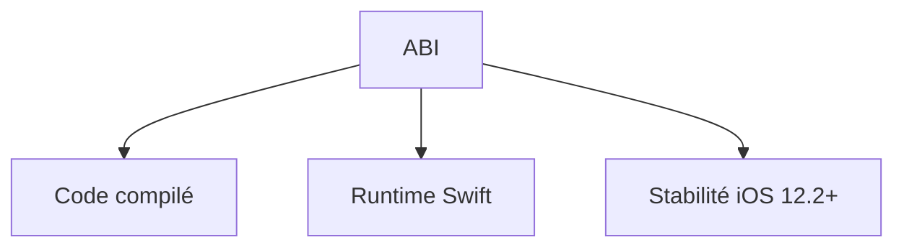

_Le rôle de l'ABI dans la stabilité binaire et la compatibilité des versions de Swift._

### Actor (Swift Concurrency)

> Type de référence Swift conçu pour la concurrence sécurisée, garantissant qu'un seul thread accède à son état mutable à la fois.

### Actor

!!! note "Définition"

Les actors isolent leur état — tout accès se fait de manière asynchrone. Swift Concurrency utilise les actors pour éliminer les data races sans verrous manuels, rendant le code concurrent à la fois sûr et lisible.

- **Syntaxe :** `actor BankAccount { var balance: Double }`
- **MainActor :** actor spécial garantissant l'exécution sur le thread principal (UI)
- **Différence :** classe ordinaire (accès concurrent non protégé) vs. actor (accès sérialisé)

```swift title="Swift — Déclaration d'un actor"
actor BankAccount {
    var balance: Double = 0.0

    func deposit(_ amount: Double) {
        balance += amount // sécurisé, un seul accès concurrent
    }
}
```

_Un `actor` protège son état interne : tout appel de méthode depuis l'extérieur est implicitement `await`._

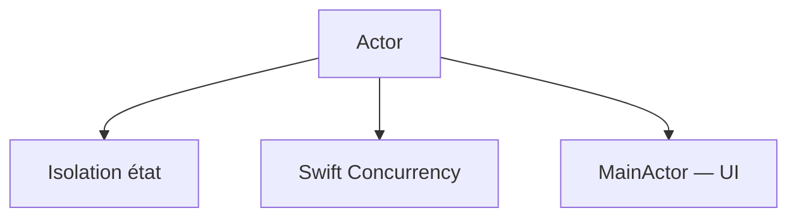

_Schéma représentant l'isolation d'état et la sécurité de thread offerte par les Actors._

### App Lifecycle (iOS)

> Ensemble des états et transitions qu'une application iOS traverse depuis son lancement jusqu'à sa fermeture.

### App Lifecycle

!!! note "Définition"

Comprendre le cycle de vie est essentiel pour gérer correctement les ressources. Une app peut être active, en arrière-plan, suspendue ou terminée — chaque transition déclenche des callbacks spécifiques à exploiter.

- **États (UIKit) :** Not Running → Inactive → Active → Background → Suspended
- **SwiftUI :** `@Environment(\.scenePhase)` avec les valeurs `.active`, `.inactive`, `.background`
- **Callbacks clés :** `applicationDidBecomeActive`, `applicationDidEnterBackground`, `sceneDidBecomeActive`

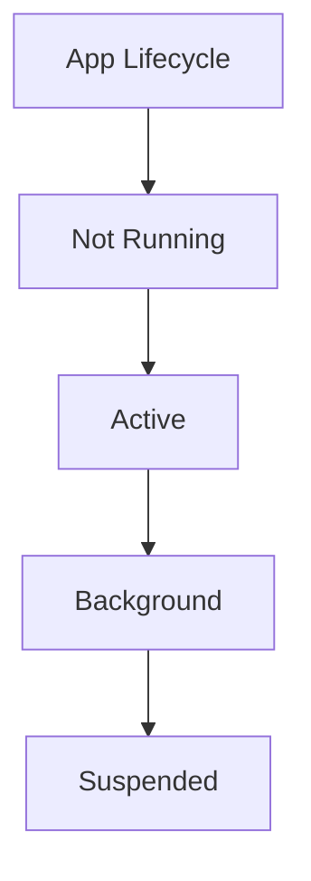

_Diagramme de transition des états d'exécution d'une application iOS._

### App Store Connect

> Plateforme Apple de gestion des applications distribuées sur l'App Store — soumission, métadonnées, pricing et analytics.

### App Store Connect

!!! note "Définition"

App Store Connect est le portail central pour tout développeur Apple. On y soumet les builds (via Xcode ou Transporter), on configure les métadonnées (descriptions, screenshots, mots-clés), on gère les testeurs TestFlight et on consulte les analytics de performance.

- **Fonctions :** soumission d'apps, TestFlight (beta), analytics, gestion des In-App Purchases, certificats
- **Review :** chaque soumission est revue par l'équipe Apple (délai : quelques heures à quelques jours)
- **URL :** [appstoreconnect.apple.com](https://appstoreconnect.apple.com)

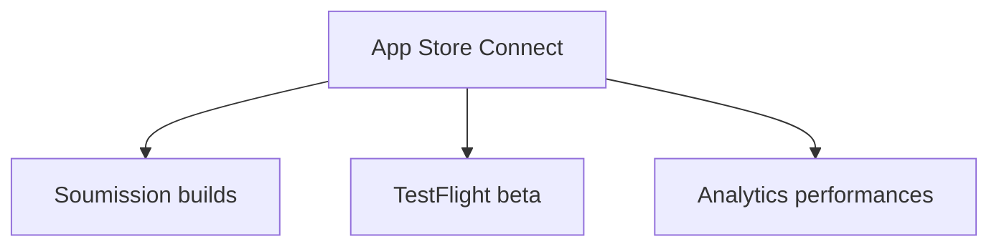

_Cycle de gestion et de distribution via le portail App Store Connect._

### @AppStorage (SwiftUI)

> Property wrapper SwiftUI lisant et écrivant une valeur dans `UserDefaults` avec synchronisation automatique de l'interface.

### @AppStorage

!!! note "Définition"

`@AppStorage` simplifie radicalement la persistance légère dans SwiftUI — la vue se met automatiquement à jour si la valeur `UserDefaults` change (depuis une extension, une notification, ou une autre vue). Idéal pour les préférences utilisateur.

- **Persistance :** `UserDefaults.standard` par défaut, ou une suite personnalisée
- **Types supportés :** `Bool`, `Int`, `Double`, `String`, `Data`, `URL`
- **Équivalent UIKit :** `UserDefaults.standard.set/get` + notification manuelle

```swift title="Swift — @AppStorage : préférences persistantes"
struct ParametresView: View {
    @AppStorage("thème")         var thème: String  = "clair"
    @AppStorage("notifications") var notifs: Bool   = true
    @AppStorage("taillePolice")  var taille: Double = 16.0

    var body: some View {
        Form {
            Picker("Thème", selection: $thème) {
                Text("Clair").tag("clair")
                Text("Sombre").tag("sombre")
            }
            Toggle("Notifications", isOn: $notifs)
            Slider(value: $taille, in: 12...24)
        }
    }
}
```

_Chaque modification via `$thème` écrit dans `UserDefaults` et re-rend la vue — zéro code de synchronisation._

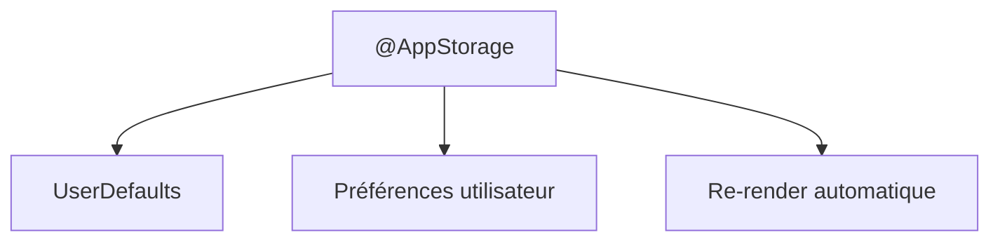

_Synchronisation automatique entre UserDefaults et l'UI via le property wrapper @AppStorage._

### Async / Await (Swift Concurrency)

> Syntaxe Swift moderne pour l'écriture de code asynchrone de manière séquentielle et lisible, sans callbacks ni completion handlers.

### Async / Await

!!! note "Définition"

Avant Swift Concurrency, la gestion des opérations asynchrones reposait sur des closures imbriquées ("callback hell") ou des frameworks comme Combine/RxSwift. `async/await` rend le code asynchrone aussi lisible que du code synchrone.

- **Introduit :** Swift 5.5 (iOS 15, Xcode 13) — compatible iOS 13+ avec back-deployment partiel
- **`async` :** marque une fonction comme asynchrone
- **`await` :** suspend l'exécution jusqu'à la complétion de la tâche asynchrone
## B

### @Bindable (SwiftUI)

> Property wrapper SwiftUI (iOS 17+) permettant de créer des bindings vers les propriétés d'un type `@Observable`.

### @Bindable

!!! note "Définition"

Avec l'ancien système (`ObservableObject`), les bindings vers des propriétés d'un ViewModel utilisaient `@ObservedObject` + `$`. Avec `@Observable`, le property wrapper `@Bindable` remplace ce rôle — il génère des `Binding<T>` depuis les propriétés d'un objet observable.

- **Introduit :** iOS 17, Swift 5.9 (avec le framework Observation)
- **Usage :** `@Bindable var vm: MonViewModel` → `$vm.propriété` produit un `Binding<T>`
- **Différence :** `@State` est pour les valeurs locales, `@Bindable` est pour les objets partagés

```swift title="Swift — @Bindable avec @Observable"
@Observable class FormViewModel {
    var nom = ""
    var email = ""
}

struct FormView: View {
    @Bindable var vm: FormViewModel  // vm est un @Observable

    var body: some View {
        TextField("Nom", text: $vm.nom)    // Binding vers vm.nom
        TextField("Email", text: $vm.email)
    }
}
```

_`@Bindable` informe SwiftUI que l'objet peut fournir des `Binding<T>` vers ses propriétés sans nécessiter `@Published`._

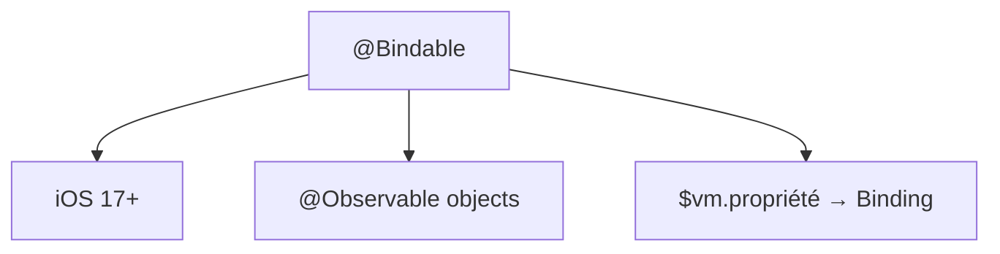

_Flux de création de Binding via le property wrapper @Bindable introduit avec le framework Observation._

### @Binding (SwiftUI)

> Property wrapper SwiftUI créant une référence bidirectionnelle vers une valeur d'état détenue par un parent.

### @Binding

!!! note "Définition"

`@Binding` est le mécanisme de communication descendant de SwiftUI — un enfant reçoit un `Binding<T>` et peut lire et modifier la valeur du parent sans en être propriétaire. C'est la mise en œuvre du flux de données unidirectionnel : la source de vérité reste dans le parent.

- **Création :** depuis `@State` via le préfixe `$`, ou via `@Bindable`
- **Règle :** l'enfant ne possède pas la donnée — il la lit et l'écrit via le binding
- **Binding.constant :** crée un binding non modifiable (pour les prévisualisations)

```swift title="Swift — @Binding : communication parent → enfant"
struct Toggle: View {
    @Binding var isOn: Bool         // Reçu du parent

    var body: some View {
        Button(isOn ? "ON" : "OFF") {
            isOn.toggle()          // Modifie la valeur dans le parent
        }
    }
}

struct ParentView: View {
    @State private var actif = false

    var body: some View {
        Toggle(isOn: $actif)        // $actif crée un Binding<Bool>
    }
}
```

_La modification de `isOn` dans l'enfant met à jour `actif` dans le parent — SwiftUI re-rend les deux vues._

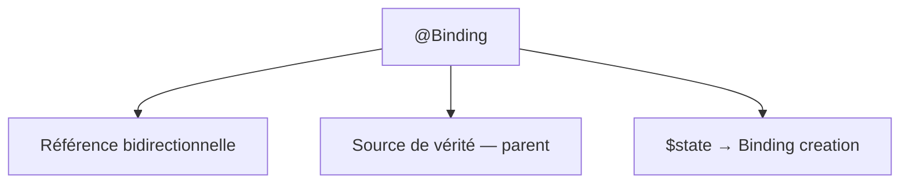

_Mécanisme de liaison bidirectionnelle assurant la synchronisation de l'état entre une vue parente et son enfant._

### Bundle Identifier

> Chaîne de caractères unique identifiant une application Apple sur l'ensemble des plateformes et services Apple.

### Bundle Identifier

!!! note "Définition"

Le Bundle ID est l'empreinte digitale de votre application dans l'écosystème Apple. Il suit le format DNS inversé (`com.nomEntreprise.nomApp`) et doit être unique sur l'App Store. Il est utilisé pour les push notifications, les entitlements, iCloud, et la signature du code.

- **Format :** `com.example.monApp` (DNS inversé)
- **Immuable :** une fois soumis sur l'App Store, ne peut plus être changé
- **Usage :** push notifications (APNs), Universal Links, App Clips, entitlements

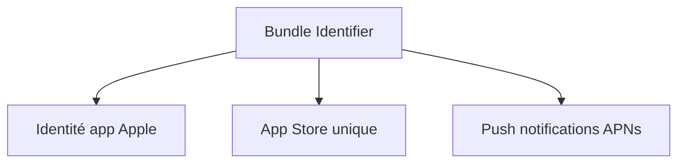

_Le Bundle ID comme clé unique de l'identité d'une application dans l'écosystème Apple._

<br>

---

## C

### Closure

> Bloc de code autonome et de première classe pouvant être stocké, passé en paramètre et capturant son contexte environnant.

### Closure

!!! note "Définition"

Les closures sont l'équivalent Swift des lambdas ou fonctions anonymes. Elles capturent les variables de leur contexte (`[weak self]` pour éviter les cycles de rétention). Elles sont omniprésentes dans les APIs UIKit (completion handlers, animations, callbacks).

- **Capture list :** `[weak self]`, `[unowned self]` pour éviter les retain cycles
- **Trailing closure :** syntaxe compacte si la closure est le dernier paramètre
- **Escaping :** `@escaping` si la closure est appelée après le retour de la fonction

```swift title="Swift — Closure avec capture list"
// Trailing closure
UIView.animate(withDuration: 0.3) {
    self.view.alpha = 0
}

// Escaping closure avec [weak self]
networkService.fetchData { [weak self] result in
    guard let self = self else { return }
    self.updateUI(with: result)
}
```

_`[weak self]` empêche la closure de retenir fortement `self` — essentiel pour éviter les fuites mémoire._


_Représentation des concepts clés des closures : capture de contexte et gestion de la mémoire (Retain Cycle)._

### Codable

> Protocole Swift combinant `Encodable` et `Decodable` pour sérialiser et désérialiser des données JSON/XML automatiquement.

### Codable

!!! note "Définition"

`Codable` est l'une des fonctionnalités les plus pratiques de Swift. Une struct ou classe conforme à `Codable` peut être encodée en JSON et décodée depuis JSON automatiquement, sans écrire manuellement de code de parsing.

- **Composition :** `Codable = Encodable + Decodable`
- **CodingKeys :** enum permettant de mapper des clés JSON vers des propriétés Swift au nom différent
- **JSONDecoder / JSONEncoder :** les classes standard pour encoder/décoder

```swift title="Swift — Struct Codable et décodage JSON"
struct User: Codable {
    let id: Int
    let name: String
    let email: String
}

// Décodage depuis JSON
let json = """{"id": 1, "name": "Alice", "email": "alice@example.com"}"""
let data = json.data(using: .utf8)!
let user = try JSONDecoder().decode(User.self, from: data)
```

_Swift synthétise automatiquement les méthodes `encode` et `decode` pour les types conformes à `Codable`._

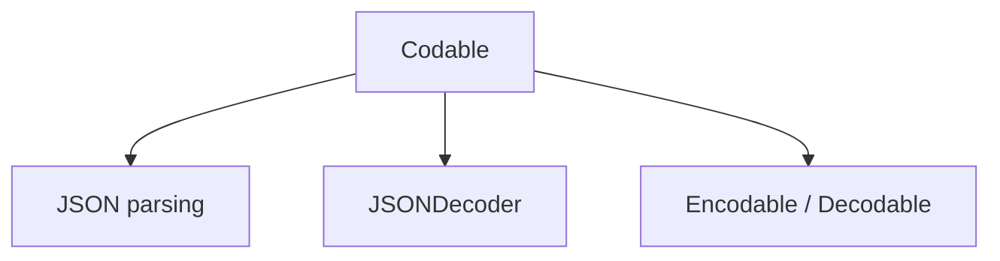

_Le système Codable facilitant la sérialisation et le mapping automatique de données JSON._

### Combine

> Framework Apple de programmation réactive (reactive programming) permettant de chaîner et de transformer des flux de valeurs asynchrones.

### Combine

!!! note "Définition"

Combine introduit les concepts de Publisher (émetteur de valeurs) et Subscriber (consommateur). Il permet de composer des pipelines de traitement de données asynchrones — transformation, filtrage, fusion, gestion d'erreurs — de manière déclarative.

- **Introduit :** iOS 13, macOS 10.15 — framework First-Party Apple
- **Concepts :** Publisher, Subscriber, Subject, Operator (`map`, `filter`, `flatMap`, `combineLatest`)
- **Intégration SwiftUI :** `@Published` + `ObservableObject` reposent sur Combine

```swift title="Swift — Pipeline Combine"
import Combine

let publisher = [1, 2, 3, 4, 5].publisher
publisher
    .filter { $0 % 2 == 0 }   // garde les pairs
    .map    { $0 * 10 }        // multiplie par 10
    .sink   { print($0) }      // affiche : 20, 40
```

_Chaque opérateur retourne un nouveau Publisher — les pipelines Combine sont composables à l'infini._

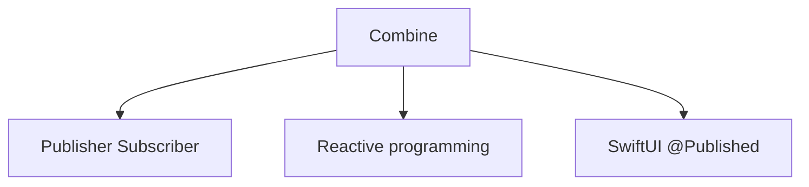

_Architecture réactive de Combine basée sur la propagation de flux via Publishers et Subscribers._

### Core Data

> Framework Apple de persistance et de gestion objet-graphe pour stocker, requêter et synchroniser des données structurées sur iOS.

### Core Data

!!! note "Définition"

Core Data n'est pas une base de données — c'est une couche de gestion d'objet-graphe. Derrière, il peut utiliser SQLite, des fichiers binaires ou mémoire. Il gère automatiquement les relations entre objets, les migrations de schéma et l'intégration avec CloudKit (synchronisation iCloud).

- **Stack :** NSPersistentContainer (simplifié), NSManagedObjectContext, NSManagedObject
- **Intégration SwiftUI :** `@FetchRequest`, `@Environment(\.managedObjectContext)`
- **Alternatives modernes :** SwiftData (iOS 17+), Realm, SQLite.swift

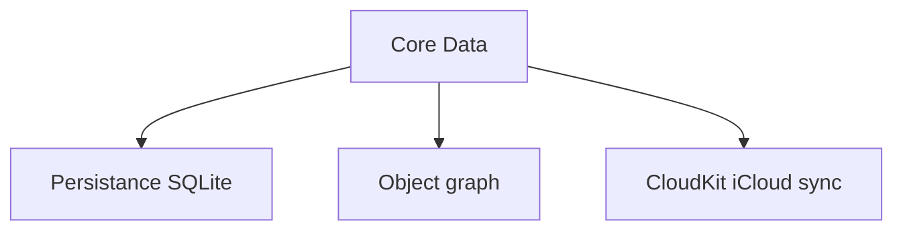

_Organisation logicielle de la couche de persistance et de synchronisation des données avec Core Data._

<br>

---

## D

### Delegate Pattern

> Patron de conception permettant à un objet de déléguer certaines de ses responsabilités à un autre objet via un protocole.

### Delegate Pattern

!!! note "Définition"

Le pattern Delegate est au cœur de UIKit. `UITableViewDelegate`, `UITextFieldDelegate`, `URLSessionDelegate` — des dizaines d'APIs Apple fonctionnent ainsi. L'objet délégant définit un protocole, l'objet délégué l'implémente.

- **Mécanisme :** protocole + propriété `weak var delegate: MonProtocole?`
- **`weak` obligatoire :** éviter les retain cycles (A retient B, B retient A)
- **Alternative moderne :** closures / callbacks, Combine, async/await

```swift title="Swift — Delegate pattern"
protocol DataServiceDelegate: AnyObject {
    func didReceiveData(_ data: [String])
}

class DataService {
    weak var delegate: DataServiceDelegate?

    func fetch() {
        // ... appel réseau ...
        delegate?.didReceiveData(["item1", "item2"])
    }
}
```

_`weak var delegate` est impératif — une référence forte créerait un cycle de rétention._

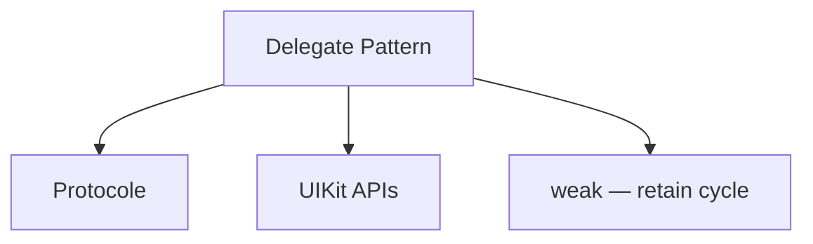

_Le pattern de délégation facilitant la communication entre objets tout en évitant les fuites mémoire via weak._

<br>

---

## E

### Enum avec associated values

> Énumération Swift pouvant stocker des données supplémentaires de types différents pour chaque case.

### Enum avec associated values

!!! note "Définition"

Les enums Swift sont bien plus puissants que dans la plupart des langages. Chaque case peut porter des valeurs associées de types différents — ce qui permet de modéliser des états complexes de manière typée et exhaustive, notamment pour la gestion des résultats d'API.

- **Syntaxe :** `case success(Data)` — la donnée fait partie du case
- **Pattern matching :** `if case .failure(let error) = result { ... }`
- **`Result<Success, Failure>` :** type standard Swift utilisant des associated values

```swift title="Swift — Enum avec associated values"
enum NetworkResult {
    case success(Data)
    case failure(Error)
    case loading
}

func handle(_ result: NetworkResult) {
    switch result {
    case .success(let data):   process(data)
    case .failure(let error):  showError(error)
    case .loading:             showSpinner()
    }
}
```

_Le compilateur Swift vérifie l'exhaustivité du `switch` — chaque case doit être traité._

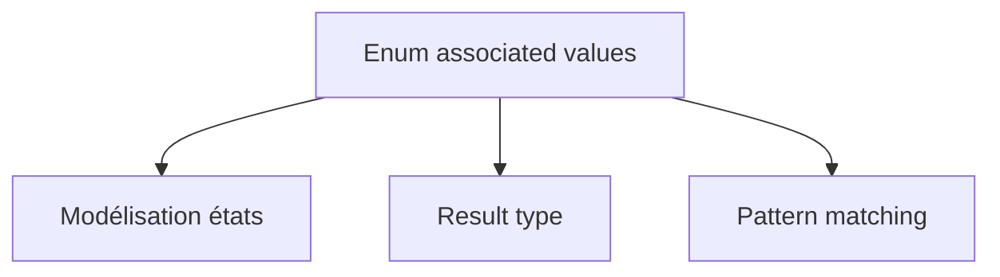

_Modélisation d'états complexes et typés pour une gestion d'erreurs robuste via les enums._

### @EnvironmentObject (SwiftUI)

> Property wrapper SwiftUI injectant un objet observable partagé depuis l'environnement, sans le passer explicitement entre les vues.

### @EnvironmentObject

!!! note "Définition"

`@EnvironmentObject` est le mécanisme de partage global de SwiftUI — un `ObservableObject` injecté une fois dans l'arbre des vues est accessible par n'importe quelle vue descendante via `@EnvironmentObject`, sans le propager manuellement à travers les niveaux.

- **Injection :** `.environmentObject(monObjet)` sur une vue parente
- **Accès :** `@EnvironmentObject var store: MonStore` dans n'importe quel descendant
- **Crash si absent :** si l'objet n'est pas injecté, l'app crashe à l'exécution — tester avec des previews

```swift title="Swift — @EnvironmentObject : DI globale SwiftUI"
class UserStore: ObservableObject {
    @Published var utilisateurConnecté: String = "Alice"
}

// Injection au niveau racine
@main struct MyApp: App {
    @StateObject private var store = UserStore()
    var body: some Scene {
        WindowGroup { ContentView().environmentObject(store) }
    }
}

// Consommation dans un descendant profond
struct ProfilView: View {
    @EnvironmentObject var store: UserStore
    var body: some View {
        Text("Bonjour \(store.utilisateurConnecté)")
    }
}
```

_iOS 17+ : `@EnvironmentObject` reste valide, mais l'alternative recommandée est d'injecter un `@Observable` via `.environment(\\.maClé, objet)`._

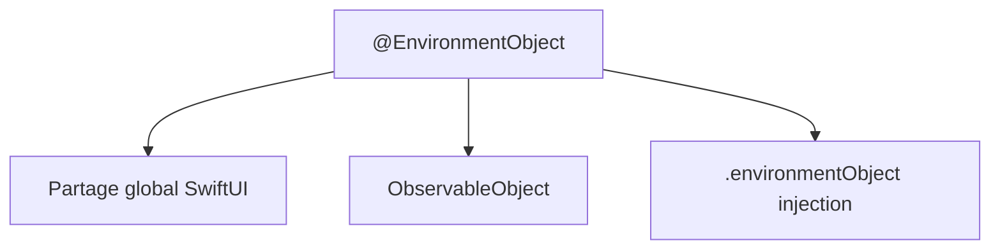

_Mécanisme d'injection de dépendances à travers l'arbre de vues SwiftUI._

<br>

---

## F

### Fluent (Vapor)

> ORM (Object-Relational Mapper) officiel de Vapor permettant de définir les modèles de base de données en Swift et d'écrire des requêtes type-safe.

### Fluent

!!! note "Définition"

Fluent traduit les classes Swift (`@Model`) en tables SQL et les opérations Swift (`Article.query(on: db).filter(...)`) en requêtes SQL optimisées. Il supporte SQLite (développement), PostgreSQL (production), MySQL et MongoDB. Les migrations versionnent le schéma.

- **Protocole central :** `Model` — classe Swift mappée à une table SQL
- **Property wrappers :** `@ID`, `@Field`, `@Parent`, `@Children`, `@Siblings`, `@Timestamp`
- **Migrations :** `AsyncMigration` avec `prepare` (créer) et `revert` (défaire)
- **Eager loading :** `.with(\.$relation)` pour éviter le problème N+1

```swift title="Swift (Vapor) — Modèle Fluent et migration"
final class Article: Model, Content, @unchecked Sendable {
    static let schema = "articles"
    @ID(key: .id)          var id: UUID?
    @Field(key: "titre")   var titre: String
    @Parent(key: "auteur_id") var auteur: Utilisateur
    init() {}
}
```

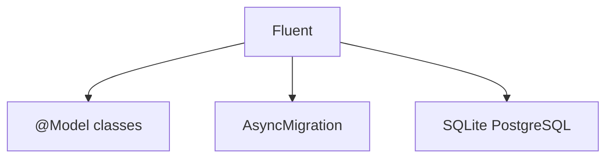

_Le lien entre modèles Swift et base de données relationnelle via Fluent._

<br>

---

## G

### Generics

> Mécanisme Swift permettant d'écrire du code flexible et réutilisable qui fonctionne avec n'importe quel type satisfaisant des contraintes données.

### Generics

!!! note "Définition"

Les generics sont fondamentaux dans Swift — `Array<Element>`, `Optional<Wrapped>`, `Result<Success, Failure>` sont tous des types génériques. Ils permettent d'écrire une logique une seule fois, valide pour de nombreux types différents.

- **Syntaxe :** `func swap<T>(_ a: inout T, _ b: inout T)`
- **Contraintes :** `where T: Comparable`, `T: Codable`, `T: Equatable`
- **Opaque types :** `some View` (SwiftUI) est un type générique opaque

```swift title="Swift — Fonction générique avec contrainte"
// Fonctionne avec tout type Comparable
func maximum<T: Comparable>(_ a: T, _ b: T) -> T {
    return a > b ? a : b
}

maximum(3, 7)           // → 7 (Int)
maximum("apple", "zen") // → "zen" (String)
```

_Une contrainte (`T: Comparable`) garantit que seuls les types compatibles peuvent être utilisés._

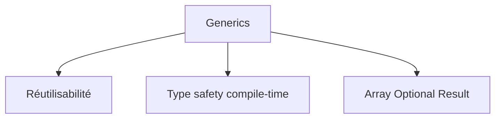

_Concepts de réutilisabilité et de sécurité de type offerts par les Generics._

<br>

---

## J

### JWT (Vapor)

> JSON Web Token — standard d'authentification stateless utilisé dans les APIs Vapor pour sécuriser les routes sans état de session serveur.

### JWT (Vapor)

!!! note "Définition"

Dans une API Vapor, le JWT est signé avec une clé secrète HMAC-SHA256 via le package `JWTKit`. Il encode l'identité de l'utilisateur (`sub`), son rôle et son expiration (`exp`). Le serveur valide la signature sans consulter la base de données — c'est l'avantage clé du stateless.

- **Package :** `vapor/jwt-kit` (à ajouter dans `Package.swift`)
- **Signature :** HMAC-SHA256 (symétrique) ou RSA (asymétrique)
- **Claims standards :** `sub` (sujet), `exp` (expiration), `iat` (émis à)

```swift title="Swift (Vapor) — Payload JWT"
struct PayloadJWT: JWTPayload {
    var sub: SubjectClaim
    var exp: ExpirationClaim
    var rôle: String
    func verify(using algorithm: some JWTAlgorithm) async throws {
        try self.exp.verifyNotExpired()
    }
}
```

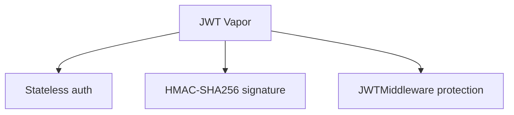

_L'authentification décentralisée et sécurisée par jetons JSON Web Token._

<br>

---

## M

### Middleware (Vapor)

> Composant Vapor interceptant chaque requête HTTP avant et après le handler pour appliquer une logique transversale (auth, CORS, logging).

### Middleware (Vapor)

!!! note "Définition"

Un middleware Vapor implémente `AsyncMiddleware` avec la méthode `respond(to:chainingTo:)`. Tout le code avant `try await next.respond(to: request)` s'exécute avant le handler, tout le code après s'exécute après. Les middlewares globaux (dans `configure.swift`) s'appliquent à toutes les routes ; les middlewares locaux s'appliquent via `routes.grouped(MonMiddleware())`.

- **Cas d'usage :** authentification JWT, CORS, journalisation, rate limiting, compression
- **Ordre :** l'ordre d'ajout détermine l'ordre d'exécution
- **`Request.storage` :** mécanisme pour transmettre des données d'un middleware à un handler

```swift title="Swift (Vapor) — Middleware de journalisation"
final class LogMiddleware: AsyncMiddleware {
    func respond(to req: Request, chainingTo next: AsyncResponder) async throws -> Response {
        req.logger.info("→ \(req.method) \(req.url.path)")
        let response = try await next.respond(to: req)
        req.logger.info("← \(response.status.code)")
        return response
    }
}
```

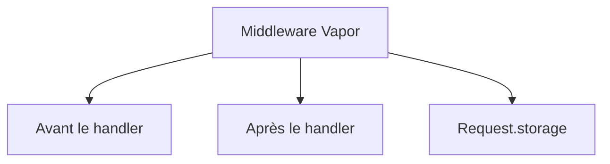

_Le cycle d'interception des requêtes et réponses via les middlewares._

### MVVM

> Architecture logicielle (Model-View-ViewModel) adaptée au paradigme réactif de SwiftUI, séparant la logique métier de l'interface utilisateur.

### MVVM

!!! note "Définition"

MVVM découple les vues SwiftUI (struct `View`) de la logique métier (classe `ViewModel`). La vue observe le ViewModel via `@StateObject` / `@ObservedObject` / `@Observable` et se met à jour automatiquement quand ses données changent. Le ViewModel ne référence jamais SwiftUI directement — il est testable indépendamment.

- **Model :** données brutes (structs Codable, modèles Fluent)
- **View :** struct SwiftUI — décrit l'interface en fonction de l'état du ViewModel
- **ViewModel :** classe `@Observable` ou `ObservableObject` — logique métier, appels réseau, transformation des données

```swift title="Swift — MVVM complet avec @Observable"
// Model
struct Article: Identifiable, Codable {
    let id: UUID
    let titre: String
}

// ViewModel
@Observable class ArticlesViewModel {
    var articles: [Article] = []
    var isLoading = false
    var erreur: String?

    func charger() async {
        isLoading = true
        // await ArticleService.shared.fetch()
        isLoading = false
    }
}

// View
struct ArticlesView: View {
    @State private var vm = ArticlesViewModel()

    var body: some View {
        List(vm.articles) { Text($0.titre) }
            .task { await vm.charger() }
    }
}
```

_Le ViewModel ne dépend pas de SwiftUI — il peut être testé avec XCTest sans simulateur._

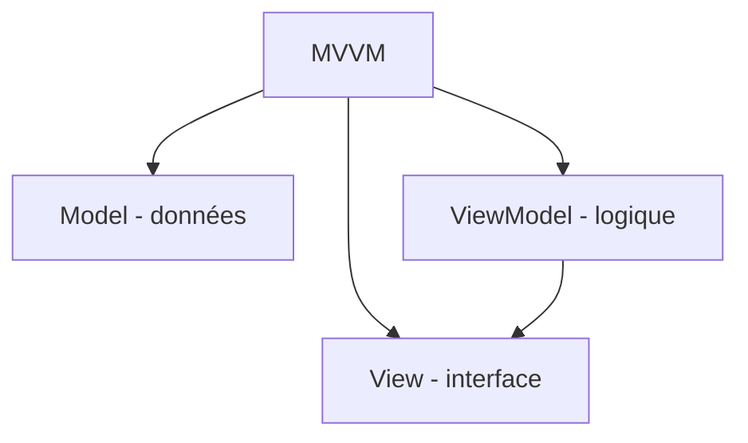

_Architecture MVVM montrant la séparation entre les données, la logique de présentation et la vue._

<br>

---

## N

### NavigationStack (SwiftUI)

> Container SwiftUI gérant la navigation par pile (push/pop) entre vues, avec support des deep links et des états externalisés.

### NavigationStack

!!! note "Définition"

`NavigationStack` (introduit iOS 16) remplace `NavigationView` en offrant un contrôle programmatique complet de la pile de navigation. L'état de navigation est externalisé dans un tableau (un `NavigationPath`), permettant des deep links, des bookmarks et des tests facilités.

- **Introduit :** iOS 16, remplace `NavigationView`
- **Navigation par valeur :** `.navigationDestination(for: Type.self)` + `NavigationLink(value:)`
- **Deep linking :** la pile de navigation peut être reconstruite depuis un URL ou un état sauvegardé

```swift title="Swift — NavigationStack avec navigationDestination"
NavigationStack {
    List(items) { item in
        NavigationLink(value: item) {
            Text(item.name)
        }
    }
    .navigationDestination(for: Item.self) { item in
        ItemDetailView(item: item)
    }
}
```

_Chaque `NavigationLink(value:)` pousse la `navigationDestination` correspondante sur la pile._

```mermaid
flowchart TB
    A[NavigationStack] --> B["Navigation par pile"]
    A --> C["Deep linking URL"]
    A --> D["NavigationPath état"]
```

_Structure de navigation par pile permettant des transitions fluides et un support natif du deep linking._

<br>

---

## O

### Observable (SwiftUI)

> Macro Swift (iOS 17+) remplaçant `ObservableObject` + `@Published` par une observation automatique et granulaire des propriétés.

### Observable

!!! note "Définition"

`@Observable` est la nouvelle façon de gérer l'état dans SwiftUI. Le compilateur instrumente automatiquement les accès aux propriétés — seules les vues qui lisent une propriété spécifique se re-rendent quand elle change, ce qui améliore les performances globales de l'application.

- **Introduit :** Swift 5.9, iOS 17 (via le framework Observation)
- **Migration :** `class ViewModel: ObservableObject` + `@Published` → `@Observable class ViewModel`
- **Avantage :** observation granulaire (propriété par propriété, pas struct entière)

```swift title="Swift — @Observable vs. ObservableObject"
// Avant (iOS 13+)
class ViewModel: ObservableObject {
    @Published var count = 0
    @Published var name  = ""
}

// Avec @Observable (iOS 17+)
@Observable class ViewModel {
    var count = 0
    var name  = ""
}
```

_Avec `@Observable`, SwiftUI ne re-rend que les vues qui lisent `count` si `count` change — pas toutes les vues abonnées au `ViewModel`._

```mermaid
flowchart TB
    A[Observable] --> B["iOS 17 Macro"]
    A --> C["Observation granulaire"]
    A --> D["ObservableObject migration"]
```

_Le nouveau paradigme d'observation granulaire introduit par la macro @Observable._

### ObservableObject (SwiftUI)

> Protocole Combine (iOS 13+) permettant à une classe d'émettre des notifications de changement d'état que SwiftUI peut observer.

### ObservableObject

!!! note "Définition"

`ObservableObject` est le fondement du state management SwiftUI pour iOS 13+. Une classe conforme possède des propriétés `@Published` qui déclenchent automatiquement `objectWillChange.send()` avant chaque modification — SwiftUI re-rend alors toutes les vues abonnées à cet objet.

- **Prérequis :** conformité à `ObservableObject` sur une `class` (pas `struct`)
- **`@Published` :** déclenche le changement sur chaque modification de la propriété
- **iOS 17+ :** remplacé par `@Observable` (plus performant, observation granulaire)

```swift title="Swift — ObservableObject avec @Published"
class PanierViewModel: ObservableObject {
    @Published var articles: [String] = []
    @Published var total: Double = 0.0

    func ajouter(_ article: String, prix: Double) {
        articles.append(article)
        total += prix
    }
}
```

_Chaque modification d'une propriété `@Published` déclenche un re-render de toutes les vues abonnées via `@StateObject` ou `@ObservedObject`._

```mermaid
flowchart TB
    A[ObservableObject] --> B["@Published propriétés"]
    A --> C["Combine objectWillChange"]
    A --> D["iOS 17 → @Observable"]
```

_Le cycle de notification d'état géré par le protocole ObservableObject pour synchroniser l'UI._

### @ObservedObject (SwiftUI)

> Property wrapper SwiftUI recevant une référence externe vers un `ObservableObject` et abonnant la vue à ses changements.

### @ObservedObject

!!! note "Définition"

Contrairement à `@StateObject` (qui possède l'objet), `@ObservedObject` reçoit l'objet de l'extérieur — le ViewModel est créé et géré ailleurs (par un parent, un container DI, etc.) et passé à l'enfant.

- **Différence clé :** `@StateObject` = propriétaire (crée l'instance), `@ObservedObject` = observateur (reçoit l'instance)
- **Durée de vie :** suit la durée de vie de l'objet passé — pas de recréation si la vue parente re-rend

```swift title="Swift — @ObservedObject vs @StateObject"
// Parent : crée et possède le ViewModel
struct ParentView: View {
    @StateObject private var vm = PanierViewModel()
    var body: some View {
        EnfantView(vm: vm)  // Passe la référence
    }
}

// Enfant : observe sans posséder
struct EnfantView: View {
    @ObservedObject var vm: PanierViewModel
    var body: some View {
        Text("Articles : \(vm.articles.count)")
    }
}
```

_Règle d'usage : `@StateObject` dans la vue qui instancie le ViewModel, `@ObservedObject` dans toutes les vues enfants qui l'utilisent._

```mermaid
flowchart TB
    A["@ObservedObject"] --> B["Référence externe"]
    A --> C["Re-render sur @Published"]
    A --> D["@StateObject = propriétaire"]
```

_Différence de possession de l'état entre @StateObject et @ObservedObject._

### Optionals (Swift)

> Type Swift représentant explicitement l'absence possible d'une valeur, éliminant les NullPointerExceptions au niveau du système de types.

### Optionals

!!! note "Définition"

`Optional<T>` est l'une des décisions de design les plus importantes de Swift — toute valeur pouvant être `nil` doit être déclarée explicitement comme `Optional`. Le compilateur force le développeur à gérer ce cas, éliminant la principale source de bugs dans les langages à valeur nulle implicite.

- **Syntaxe :** `var name: String?` est équivalent à `var name: Optional<String>`
- **Unwrapping :** `if let`, `guard let`, `??` (nil coalescing), `!` (force — dangereux)
- **Optional chaining :** `user?.address?.city` — retourne `nil` si n'importe quel maillon est `nil`

```swift title="Swift — Gestion sécurisée des optionals"
var city: String? = "Paris"

// if let (safe unwrap)
if let c = city { print(c) }

// guard let (early exit)
guard let c = city else { return }

// nil coalescing (valeur par défaut)
let display = city ?? "Ville inconnue"

// optional chaining (ne crash pas)
let upper = city?.uppercased()
```

_Préférez toujours `if let` ou `guard let` au force-unwrap `!` qui provoque un crash immédiat si la valeur est `nil`._

```mermaid
flowchart TB
    A[Optionals] --> B["Absence de valeur"]
    A --> C["Type safety — nil explicite"]
    A --> D["if let guard let"]
```

_Mécanismes de sécurité entourant la gestion des valeurs optionnelles en Swift._

<br>

---

## P

### Property Wrappers (Swift)

> Mécanisme Swift permettant d'encapsuler la logique de stockage et d'accès d'une propriété dans un type réutilisable.

### Property Wrappers

!!! note "Définition"

Les property wrappers sont la magie derrière tout l'écosystème SwiftUI — `@State`, `@Binding`, `@Published`, `@AppStorage`, `@FetchRequest` sont tous des property wrappers. Ils permettent d'ajouter du comportement personnalisé autour d'une propriété de manière transparente.

- **Syntaxe :** `@propertyWrapper struct MyWrapper<T> { var wrappedValue: T }`
- **SwiftUI built-in :** `@State`, `@Binding`, `@StateObject`, `@ObservedObject`, `@EnvironmentObject`, `@AppStorage`
- **Accès :** `$myProp` accède au `projectedValue` du wrapper (ex. `Binding` pour `@State`)

```mermaid
flowchart TB
    A["Property Wrappers"] --> B["State Management"]
    A --> C["SwiftUI @State @Binding"]
    A --> D["Logique réutilisable"]
```

_Concept d'encapsulation de logique réutilisable derrière la syntaxe des Property Wrappers._

### Protocol (Swift)

> Contrat définissant un ensemble de propriétés et méthodes qu'un type doit implémenter pour être considéré conforme.

### Protocol

!!! note "Définition"

Swift est un langage "protocol-oriented" — les protocoles sont un mécanisme de polymorphisme plus flexible que l'héritage de classes. Un type peut se conformer à plusieurs protocoles, permettant une composition d'unités de code puissante.

- **Protocol extensions :** permettent d'ajouter des implémentations par défaut à un protocole
- **`some Protocol` :** type opaque — le type concret exact est caché au consommateur
- **`any Protocol` :** existentiel — boîte générique pour tout type conforme

```swift title="Swift — Protocole avec extension"
protocol Describable {
    var description: String { get }
}

// Extension : implémentation par défaut
extension Describable {
    func printDescription() {
        print(description)
    }
}

struct User: Describable {
    var name: String
    var description: String { "Utilisateur : \(name)" }
}
```

_Les extensions de protocole offrent du comportement partagé sans héritage — c'est le "protocol-oriented programming"._

```mermaid
flowchart TB
    A[Protocol] --> B["Contrat de type"]
    A --> C["Protocol extensions"]
    A --> D["some any — types opaques"]
```

_Le rôle central des protocoles et de leurs extensions dans l'architecture Swift._

<br>

---

## R

### RouteCollection (Vapor)

> Protocole Vapor permettant de grouper les routes d'une ressource dans un contrôleur dédié et réutilisable.

### RouteCollection

!!! note "Définition"

`RouteCollection` correspond au pattern Contrôleur — une classe ou struct qui implémente `boot(routes:)` déclare toutes les routes de sa ressource. Enregistrée via `app.register(collection: MonController())`, elle organise le code REST de façon cohérente et modulaire.

- **Méthode requise :** `func boot(routes: RoutesBuilder) throws`
- **Convention REST :** chaque ressource = un contrôleur = un `RouteCollection`
- **`@Sendable` :** les handlers doivent être marqués `@Sendable` pour Swift 6

```swift title="Swift (Vapor) — RouteCollection complet"
final class ArticleController: RouteCollection {
    func boot(routes: RoutesBuilder) throws {
        let articles = routes.grouped("articles")
        articles.get(use: lister)
        articles.post(use: créer)
        articles.get(":id", use: lire)
    }
    @Sendable func lister(req: Request) async throws -> [Article] { [] }
    @Sendable func créer(req: Request) async throws -> Article { Article() }
    @Sendable func lire(req: Request) async throws -> Article { Article() }
}
```

```mermaid
flowchart TB
    A[RouteCollection] --> B["boot routes"]
    A --> C["Pattern Controleur"]
    A --> D["@Sendable handlers"]
```

_L'organisation modulaire du routage API avec les RouteCollections._

<br>

---

## S

### ScenePhase (SwiftUI)

> Enum SwiftUI représentant le cycle de vie de la scène (fenêtre) d'une application : active, inactive, ou en arrière-plan.

### ScenePhase

!!! note "Définition"

`ScenePhase` est l'équivalent SwiftUI de `UIApplicationDelegate` pour le cycle de vie. En lisant `@Environment(\.scenePhase)`, une vue peut réagir aux transitions de l'application : couper un minuteur en arrière-plan, sauvegarder les données avant suspend, ré-autoriser l'accès réseau au retour.

- **Valeurs :** `.active` (visible et réactive), `.inactive` (visible mais non réactive), `.background` (hors écran)
- **Accès :** `@Environment(\.scenePhase) var scenePhase`
- **Callback :** `.onChange(of: scenePhase)` — déclenché à chaque transition

```swift title="Swift — ScenePhase : réagir au cycle de vie"
struct ContentView: View {
    @Environment(\.scenePhase) var scenePhase

    var body: some View {
        MainView()
            .onChange(of: scenePhase) { _, nouvellePhase in
                switch nouvellePhase {
                case .active:     print("App au premier plan")
                case .inactive:   print("App inactive")
                case .background: print("App en arrière-plan — sauvegarder")
                @unknown default: break
                }
            }
    }
}
```

```mermaid
flowchart TB
    A[ScenePhase] --> B[".active"]
    A --> C[".inactive"]
    A --> D[".background"]
```

_Les trois états principaux du cycle de vie d'une scène SwiftUI._

### SPM (Swift Package Manager)

> Gestionnaire de paquets officiel Apple pour déclarer, résoudre et intégrer des dépendances dans les projets Swift.

### SPM

!!! note "Définition"

Swift Package Manager est l'outil officiel d'Apple intégré nativement dans Xcode depuis version 11. Il gère le téléchargement, la compilation et l'intégration des bibliothèques via un fichier `Package.swift` robuste et type-safe.

- **Fichier central :** `Package.swift` (format DSL Swift)
- **Intégration :** Xcode → File → Add Packages
- **Avantages :** Zéro configuration externe nécessaire, géré directement par le compilateur Swift.

```mermaid
flowchart TB
    A[SPM] --> B["Package.swift"]
    A --> C["Xcode Integration"]
    A --> D["Binary Targets"]
```

_Workflow d'intégration des dépendances via Swift Package Manager._

### @State (SwiftUI)

> Property wrapper SwiftUI déclarant une source de vérité locale à une vue — toute modification déclenche un re-render.

### @State

!!! note "Définition"

`@State` est le mécanisme d'état le plus fondamental de SwiftUI. La valeur est stockée en dehors de la struct `View` par SwiftUI (dans un stockage stable), ce qui explique qu'elle persiste entre les re-renders. Elle est toujours privée à la vue qui la déclare.

- **Règle :** `@State` est toujours `private` — la valeur ne se propage pas en dehors de la vue
- **Types simples :** `Bool`, `Int`, `String`, `Double`, valeurs enum — pas des classes
- **Binding :** `$monétat` expose un `Binding<T>` pour passer à une vue enfant

```swift title="Swift — @State : état local d'une vue"
struct CompteurView: View {
    @State private var compte: Int = 0       // Source de vérité locale
    @State private var afficherAlerte = false

    var body: some View {
        VStack {
            Text("Compte : \(compte)")
            Button("Incrémenter") { compte += 1 }
            Button("Réinitialiser") {
                compte = 0
                afficherAlerte = true
            }
        }
        .alert("Réinitialisé", isPresented: $afficherAlerte) {
            Button("OK") { }
        }
    }
}
```

```mermaid
flowchart TB
    A["@State"] --> B["Source de vérité locale"]
    A --> C["private — encapsulée"]
    A --> D["$binding pour enfants"]
```

_Le rôle de @State comme source de vérité locale et privée d'une vue SwiftUI._

### @StateObject (SwiftUI)

> Property wrapper SwiftUI créant et possédant un `ObservableObject` pour toute la durée de vie de la vue, sans recréation lors des re-renders.

### @StateObject

!!! note "Définition"

`@StateObject` est la solution au problème de `@ObservedObject` dans les parents — si le parent re-rend, `@ObservedObject` recréerait l'objet, perdant son état. `@StateObject` garantit que l'instance est créée une seule fois et vit aussi longtemps que la vue.

- **Règle d'or :** `@StateObject` pour le premier propriétaire, `@ObservedObject` pour les enfants receveurs
- **Scope :** lie la durée de vie du ViewModel à celle de la vue — détruit quand la vue disparaît
- **iOS 17+ :** remplacé progressivement par `@State private var vm = MonViewModel()` avec `@Observable`

```swift title="Swift — @StateObject : propriété stable du ViewModel"
struct ArticleListeView: View {
    // Créé une seule fois, survivant aux re-renders
    @StateObject private var vm = ArticleListeViewModel()

    var body: some View {
        List(vm.articles) { article in
            Text(article.titre)
        }
        .task { await vm.charger() }
    }
}
```

```mermaid
flowchart TB
    A["@StateObject"] --> B["Propriétaire de l'instance"]
    A --> C["Durée de vie = vue"]
    A --> D["iOS 17 → @State + @Observable"]
```

_Persistance de l'instance du ViewModel à travers le cycle de vie de la vue via @StateObject._


### Struct vs. Class (Swift)

> Distinction fondamentale en Swift entre les types valeur (struct) et les types référence (classe), avec des implications importantes sur la mémoire et le comportement.

### Struct vs. Class

!!! note "Définition"

La règle générale Swift : préférer les structs. Elles sont copiées (value semantics), thread-safe par nature, et optimisées par le compilateur. Les classes sont nécessaires quand l'identité d'objet (référence partagée) ou l'héritage est requis.

- **Struct :** value type, copié à l'affectation, pas d'héritage, `mutating` pour modifier
- **Class :** reference type, partagé par référence, héritage possible, ARC pour la mémoire
- **SwiftUI :** `View` = struct, `ViewModel` = class (`@Observable` ou `ObservableObject`)

```swift title="Swift — Value vs. Reference semantics"
struct Point { var x: Int; var y: Int }
var a = Point(x: 1, y: 2)
var b = a     // b est une COPIE indépendante
b.x = 99
print(a.x)    // → 1 (a n'est pas modifié)

class Node  { var value: Int = 0 }
let n1 = Node(); let n2 = n1  // n2 pointe sur le MÊME objet
n2.value = 42
print(n1.value) // → 42 (partagé)
```

```mermaid
flowchart TB
    A["Struct vs Class"] --> B["Value type — copie"]
    A --> C["Reference type — partagé"]
    A --> D["ARC mémoire classes"]
```

_La sémantique de valeur des structs élimine les bugs de partage d'état implicite — raison pour laquelle SwiftUI utilise des structs pour les vues._

### Swift Concurrency

> Modèle de concurrence moderne de Swift basé sur async/await, actors et structured concurrency pour écrire du code asynchrone sûr.

### Swift Concurrency

!!! note "Définition"

Swift Concurrency résout les problèmes historiques de GCD (Grand Central Dispatch) : data races, callback hell, gestion complexe des erreurs, annulation difficile. Il introduit un modèle structuré où les tâches ont une durée de vie explicite.

- **Éléments :** `async/await`, `Task`, `TaskGroup`, `Actor`, `@Sendable`, `AsyncSequence`
- **Structured concurrency :** les tâches enfants ne peuvent pas outliver leur parent
- **Sendable :** protocole garantissant qu'un type peut être partagé entre concurrency domains sans data races

```swift title="Swift — Task et TaskGroup"
// Lancer une tâche asynchrone
Task {
    let data = try await fetchData()
    await MainActor.run { updateUI(data) }
}

// Exécution parallèle avec TaskGroup
let results = try await withTaskGroup(of: Data.self) { group in
    group.addTask { try await fetchA() }
    group.addTask { try await fetchB() }
    return await group.reduce(into: []) { $0.append($1) }
}
```

```mermaid
graph TD
    A[Swift Concurrency] --> B[async await]
    A --> C[Actor isolation]
    A --> D[Structured concurrency]
```

_Le modèle de concurrence structurée et de sécurité mémoire asynchrone de Swift._

### SwiftData

> Framework Apple de persistance moderne (iOS 17+) utilisant des macros Swift pour remplacer et simplifier Core Data.

### SwiftData

!!! note "Définition"

SwiftData modernise la persistance sur iOS avec une syntaxe déclarative basée sur les macros Swift. Là où Core Data nécessitait un modèle XCDataModel graphique, SwiftData définit le schéma directement en code Swift, avec support natif de Swift Concurrency et SwiftUI.

- **Introduit :** iOS 17, macOS 14 (WWDC 2023)
- **Syntaxe :** `@Model class User { var name: String }` — le modèle est du code Swift pur
- **SwiftUI :** `@Query` pour fetcher les données, `@Environment(\.modelContext)` pour le contexte
- **Migration :** chemin de migration depuis Core Data officiel

```swift title="Swift — Modèle SwiftData"
import SwiftData

@Model
class Task {
    var title: String
    var isDone: Bool = false
    var createdAt: Date = Date()

    init(title: String) { self.title = title }
}
```

```mermaid
flowchart TB
    A[SwiftData] --> B["iOS 17 macros"]
    A --> C["Core Data modernisé"]
    A --> D["SwiftUI @Query"]
```

_Le workflow de persistance moderne utilisant SwiftData et les macros @Model._

### SwiftNIO (Vapor)

> Framework Apple de réseau asynchrone bas niveau, fondement de Vapor, basé sur un modèle event loop non-bloquant.

### SwiftNIO

!!! note "Définition"

SwiftNIO est le moteur derrière Vapor — il gère les connexions TCP/HTTP de façon non-bloquante sur un petit nombre de threads. Chaque thread exécute une event loop qui traite des milliers de connexions simultanées sans les bloquer.

- **Créé :** Apple, 2018 — open source
- **Modèle :** event loop non-bloquant (comme Node.js, mais en Swift)
- **Lien Vapor :** Vapor utilise SwiftNIO pour toutes les opérations réseau
- **`ByteBuffer` :** type central de SwiftNIO pour manipuler les données réseau

```mermaid
graph TB
    A[SwiftNIO] --> B["Event Loop threads"]
    A --> C["Connexions TCP/HTTP"]
    B --> D["Vapor Request Handler"]
    D --> E["Réponse HTTP"]
```

_Le moteur réseau non-bloquant de SwiftNIO qui propulse Vapor._

### SwiftUI

> Framework Apple de création d'interfaces utilisateur déclaratif, multi-plateformes et réactif, introduit en 2019.

### SwiftUI

!!! note "Définition"

SwiftUI représente un changement de paradigme majeur par rapport à UIKit : l'UI n'est plus construite de manière impérative mais décrite de façon déclarative. L'interface est une fonction de son état (`UI = f(State)`).

- **Déclaratif :** On décrit "quoi" afficher, pas "comment" (SwiftUI gère le rendu)
- **Live Previews :** Visualisation immédiate du code dans Xcode sans compilation complète
- **Multi-plateformes :** Même code pour iOS, macOS, watchOS, tvOS
- **Architecture préconisée :** MVVM ou Observation (iOS 17+)

```mermaid
flowchart TB
    A[SwiftUI] --> B["Déclaratif"]
    A --> C["State Management"]
    A --> D["Previews dynamiques"]
```

_L'approche déclarative et réactive de la construction d'interfaces avec SwiftUI._

<br>

---

## T

### TestFlight

> Plateforme Apple de distribution beta permettant de tester des applications iOS avant la mise en production.

### TestFlight

!!! note "Définition"

TestFlight est le pipeline entre développement et App Store. Il permet de distribuer des builds à des testeurs (jusqu'à 10 000 testeurs externes) qui reçoivent des mises à jour automatiques et peuvent soumettre des feedbacks directement depuis l'app.

- **Testeurs internes :** membres de l'équipe App Store Connect (max 100)
- **Testeurs externes :** invitation par email ou lien public (max 10 000)
- **Durée build :** 90 jours maximum, puis suppression automatique

```mermaid
flowchart TB
    A[TestFlight] --> B["Beta testing"]
    A --> C["10000 testeurs externes"]
    A --> D["Feedback intégré"]
```

_Le workflow de distribution beta et de collecte de feedback via TestFlight._

<br>

---

## U

### UIKit

> Framework Apple de création d'interfaces utilisateur impératif, fondement du développement iOS depuis 2008.

### UIKit

!!! note "Définition"

UIKit est le framework historique du développement iOS. Son modèle impératif (`viewDidLoad`, delegates, `IBOutlet`) contraste avec SwiftUI déclaratif. Il offre un contrôle granulaire sur chaque aspect de l'UI.

- **Architecture :** MVC (Model-View-Controller) — pattern imposé par UIKit
- **Composants clés :** `UIViewController`, `UIView`, `UITableView`, `UICollectionView`
- **Coexistence :** SwiftUI et UIKit peuvent s'utiliser ensemble via `UIViewControllerRepresentable`

```mermaid
flowchart TB
    A[UIKit] --> B["MVC iOS historique"]
    A --> C[UIViewController]
    A --> D["SwiftUI interop"]
```

_L'architecture classique MVC au cœur du framework UIKit._

### Unit Testing (XCTest)

> Pratique consistant à tester individuellement les plus petites unités de code (fonctions, méthodes) pour en garantir la validité.

### Unit Testing

!!! note "Définition"

Dans l'écosystème Apple, les tests unitaires sont réalisés avec le framework XCTest. Ils permettent de valider la logique métier des ViewModels et des Services sans nécessiter d'interface graphique.

- **Framework :** XCTest
- **AAA Pattern :** Arrange (préparer), Act (exécuter), Assert (vérifier)
- **Mocks & Stubs :** objets simulés pour isoler l'unité testée des dépendances externes (APIs, DB)

```mermaid
flowchart TB
    A["Unit Testing"] --> B[XCTest]
    A --> C["Logic Validation"]
    A --> D["AAA Pattern"]
```

_L'isolation et la validation des unités de code via les tests unitaires._

<br>

---

## V

### Vapor

> Framework web Swift open source basé sur SwiftNIO, permettant de créer des APIs backend performantes en Swift.

### Vapor

!!! note "Définition"

Vapor est le framework backend Swift le plus populaire. Il apporte la sécurité du système de types Swift, async/await natif, et un ORM (Fluent) au développement backend — permettant d'utiliser le même langage côté iOS et côté serveur.

- **Fondé sur :** SwiftNIO (event loop non-blocking d'Apple)
- **Ecosystème :** Fluent (ORM), Leaf (templates), JWTKit, Queues
- **Plateformes :** Linux (Ubuntu, Debian), macOS, Docker

```swift title="Swift (Vapor) — Premier serveur Vapor"
import Vapor
@main struct App { static func main() async throws {
    let app = try await Application.make(.development)
    app.get("bonjour") { req async -> String in "Bonjour depuis Vapor !" }
    try await app.execute()
}}
```

```mermaid
flowchart TB
    A[Vapor] --> B["Framework backend Swift"]
    A --> C["SwiftNIO event loop"]
    A --> D["Fluent ORM"]
```

_L'unification du développement frontend et backend sous le langage Swift avec Vapor._

### ViewModifier (SwiftUI)

> Protocole SwiftUI permettant d'encapsuler un ensemble de modificateurs dans un type réutilisable applicable à n'importe quelle vue.

### ViewModifier

!!! note "Définition"

Au lieu de répéter les mêmes modificateurs partout, `ViewModifier` encapsule ce style dans un type dédié. C'est le fondement d'un design system SwiftUI.

- **Protocole :** `ViewModifier` avec la méthode `func body(content: Content) -> some View`
- **Application :** `.modifier(MonModificateur())` ou extension `.monStyle()` sur `View`

```swift title="Swift — ViewModifier : encapsuler un style"
struct StyleCarte: ViewModifier {
    func body(content: Content) -> some View {
        content
            .padding()
            .background(Color.white)
            .cornerRadius(12)
            .shadow(color: .black.opacity(0.1), radius: 4, y: 2)
    }
}
```

```mermaid
flowchart TB
    A[ViewModifier] --> B["Protocole SwiftUI"]
    A --> C["Design system"]
    A --> D["Extension View"]
```

_L'encapsulation de styles réutilisables via le protocole ViewModifier._

<br>

---

## X

### Xcode

> Environnement de développement intégré (IDE) officiel Apple pour développer des applications dans tout l'écosystème Apple.

### Xcode

!!! note "Définition"

Xcode est l'outil central de tout développeur Apple — il intègre l'éditeur de code Swift, le simulateur iOS, Instruments (profiling), le débogueur LLDB et le gestionnaire de packages SPM.

- **Composants :** éditeur Swift, Interface Builder, Simulator, Instruments, LLDB
- **Build system :** compilateur Swift (swiftc), LLVM, linker
- **Distribution :** signature et distribution vers l'App Store

```mermaid
flowchart TB
    A[Xcode] --> B["IDE Apple"]
    A --> C["Simulateur iOS"]
    A --> D["Instruments profiling"]
```

_L'IDE Xcode comme pilier central de l'écosystème de développement Apple._

### Xcode Instruments

> Suite d'outils de profiling intégrée à Xcode pour diagnostiquer fuites mémoire, CPU et problèmes réseau.

### Xcode Instruments

!!! note "Définition"

Instruments est le microscope du développeur iOS. Il permet d'analyser en temps réel la consommation CPU, la mémoire (et détecter les retain cycles via Leaks) et les performances de rendu.

- **Outils clés :** Time Profiler (CPU), Leaks (fuites mémoire), Allocations, Core Animation
- **Utilisation :** Product → Profile dans Xcode (⌘ + I)

```mermaid
flowchart TB
    A[Instruments] --> B["Time Profiler CPU"]
    A --> C["Leaks mémoire"]
    A --> D["Core Animation rendu"]
```

_L'analyse de performance granulaire avec la suite Xcode Instruments._

### XCTest

> Framework officiel d'Apple pour l'écriture et l'exécution de tests unitaires, de performance et d'interface utilisateur (UI).

### XCTest

!!! note "Définition"

XCTest est intégré à Xcode et permet d'automatiser la vérification de la qualité logicielle. Il inclut des assertions (`XCTAssert`), des mesures de performance et des API pour interagir avec l'interface utilisateur (XCUITest).

- **XCTAssert :** vérifie si une condition est remplie
- **XCUITest :** simule des interactions utilisateur (taps, swipes, saisie)

```mermaid
flowchart TB
    A[XCTest] --> B["Tests Unitaires"]
    A --> C["Tests Performance"]
    A --> D["Tests UI"]
```

_L'écosystème complet de test fourni par le framework XCTest._

<br>

---

## Conclusion

!!! quote "Résumé — Développement Mobile & Backend Swift"
    Ce glossaire couvre l'écosystème complet du développement Swift moderne : le **langage** (Optionals, Generics, Protocols, Closures, Swift Concurrency), les **frameworks Apple** (SwiftUI — @State, @Binding, @StateObject, @Observable, MVVM, ViewModifier, NavigationStack, SwiftData, ScenePhase) et le **backend Vapor** (Routing, Fluent ORM, JWT, Middleware, RouteCollection, SwiftNIO). Maîtriser ce vocabulaire permet de naviguer entre les APIs Apple et Vapor, de comprendre la documentation officielle et de collaborer efficacement dans une équipe fullstack Swift.

> Continuez avec le [Glossaire Cybersécurité](./cybersecurite.md) pour explorer les concepts de sécurité informatique, cryptographie et réponse aux incidents.

<br>