# DevSecOps

<div
  class="omny-meta"
  data-level="🟢 Tout niveau"
  data-version="1.0"
  data-time="Consultation">
</div>


!!! quote "Analogie pédagogique"
    _Le DevSecOps est une chaîne d'assemblage automobile moderne. Plutôt que de construire la voiture (Dev), de la démarrer (Ops) puis de réaliser un crash-test à la toute fin (Sec) avec le risque de devoir tout recommencer, la sécurité est testée à chaque étape du montage (Security as Code). Si une pièce est défectueuse, la chaîne s'arrête immédiatement._

## A

### Ansible

!!! note "Définition"
    Outil d'automatisation IT sans agent (agentless) pour la configuration, le déploiement et l'orchestration de systèmes.

Ansible est apprécié pour sa simplicité : les tâches sont décrites en YAML lisible, sans agent à installer sur les machines cibles. Il se connecte via SSH et applique des playbooks de manière idempotente.

- **Langage :** YAML (playbooks, roles, inventories)
- **Avantages :** agentless, idempotence, courbe d'apprentissage faible
- **Alternatives :** Chef (Ruby), Puppet, Salt

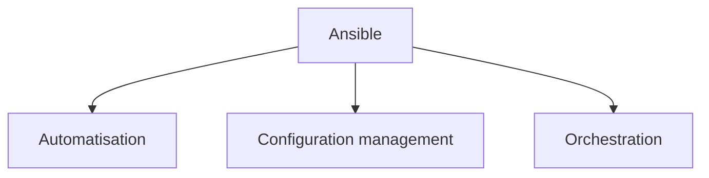

_Explication : Ansible est défini comme : outil d'automatisation IT sans agent (agentless) pour la configuration, le déploiement et l'orchestration de systèmes._

<br>

---

### Artifact

!!! note "Définition"
    Produit livrable généré par un processus de build et stocké dans un dépôt centralisé pour distribution et versioning.

Un artifact est le résultat concret d'une étape de CI : une JAR, une image Docker, un package npm, un binaire compilé. Il est versionné et promu entre environnements (dev → staging → prod) sans être recompilé.

- **Types :** binaires, images Docker, packages (npm, pip, Maven), libraries
- **Dépôts :** Nexus, Artifactory, Harbor, GitHub Packages, ECR

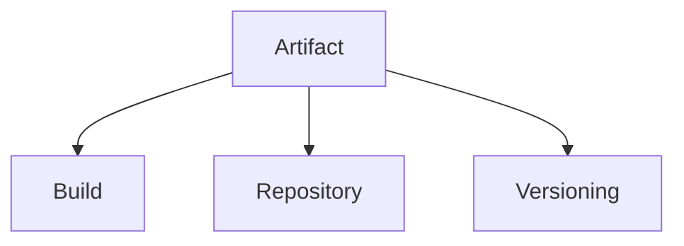

_Explication : Artifact est défini comme : produit livrable généré par un processus de build et stocké dans un dépôt centralisé pour distribution et versioning._

<br>

---

### Automation

!!! note "Définition"
    Exécution automatique de tâches répétitives sans intervention humaine pour réduire les erreurs et accélérer les cycles.

L'automatisation est la colonne vertébrale du DevSecOps — elle couvre le testing, le déploiement, le provisioning d'infrastructure et le monitoring, remplaçant les processus manuels sujets aux erreurs.

- **Domaines :** testing, deployment, infrastructure provisioning, monitoring, security scanning
- **Outils :** Jenkins, GitLab CI, GitHub Actions, Ansible, Terraform

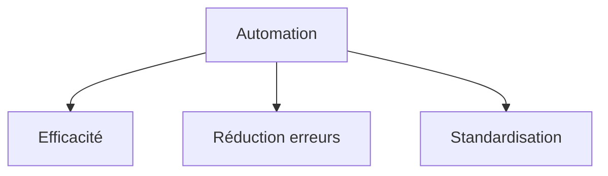

_Explication : Automation est défini comme : exécution automatique de tâches répétitives sans intervention humaine pour réduire les erreurs et accélérer les cycles._

<br>

---

## B

### Blue-Green Deployment

!!! note "Définition"
    Stratégie de déploiement utilisant deux environnements identiques (blue = actif, green = standby) pour les mises à jour sans interruption.

Le trafic utilisateur bascule instantanément de l'environnement blue vers le green une fois la nouvelle version validée. En cas de problème, le rollback est immédiat — il suffit de rebascule le trafic.

- **Principe :** bascule instantanée entre les deux environnements
- **Avantages :** zero downtime, rollback en quelques secondes, test en production contrôlé
- **Contrainte :** coût doublé (deux environnements complets en parallèle)

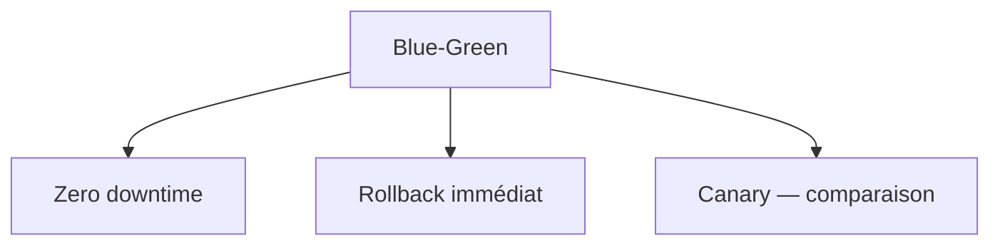

_Explication : Blue-Green Deployment est défini comme : stratégie de déploiement utilisant deux environnements identiques (blue = actif, green = standby) pour les mises à jour sans interruption._

<br>

---

## C

### CI/CD

!!! note "Définition"
    Pratiques d'intégration et de livraison continues automatisant l'ensemble du cycle de développement logiciel.

L'intégration continue (CI) déclenche automatiquement build et tests à chaque commit. La livraison continue (CD) étend ce pipeline jusqu'au déploiement automatique en production. Ensemble, ils réduisent drastiquement le risque et la durée des cycles de release.

- **Acronyme :** Continuous Integration / Continuous Deployment (ou Delivery)
- **Pipeline type :** source → build → test → security scan → deploy → monitor
- **Outils :** GitHub Actions, GitLab CI, Jenkins, CircleCI, ArgoCD

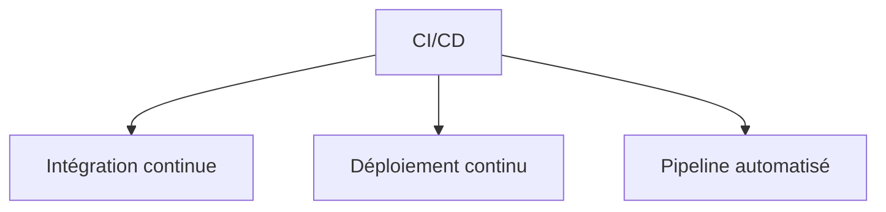

_Explication : CI/CD est défini comme : pratiques d'intégration et de livraison continues automatisant l'ensemble du cycle de développement logiciel._

<br>

---

### Canary Deployment

!!! note "Définition"
    Stratégie de déploiement progressif orientant une faible proportion du trafic réel vers la nouvelle version pour valider en production.

Le terme vient des canaris utilisés dans les mines pour détecter les gaz toxiques. Les premières requêtes servent de test — si les métriques se dégradent, le déploiement est stoppé automatiquement.

- **Principe :** déploiement graduel avec monitoring des métriques clés
- **Métriques surveillées :** taux d'erreur, latence, business KPIs
- **Comparaison :** Blue-Green = bascule totale, Canary = progression contrôlée

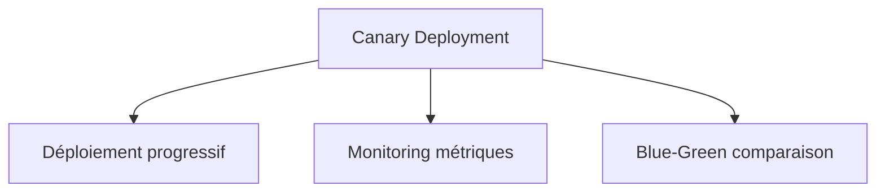

_Explication : Canary Deployment est défini comme : stratégie de déploiement progressif orientant une faible proportion du trafic réel vers la nouvelle version pour valider en production._

<br>

---

### Chef

!!! note "Définition"
    Plateforme d'automatisation d'infrastructure utilisant du code Ruby (cookbooks) pour décrire et appliquer la configuration des serveurs.

Chef fonctionne en mode client-serveur : un chef-server centralise les politiques, les nodes (clients) les téléchargent et les appliquent. L'approche convergente garantit que chaque exécution ramène le système vers l'état désiré.

- **Concepts :** cookbooks, recipes, nodes, chef-server, chef-client
- **Approche :** Infrastructure as Code, convergence automatique
- **Alternatives :** Ansible (agentless), Puppet (déclaratif)

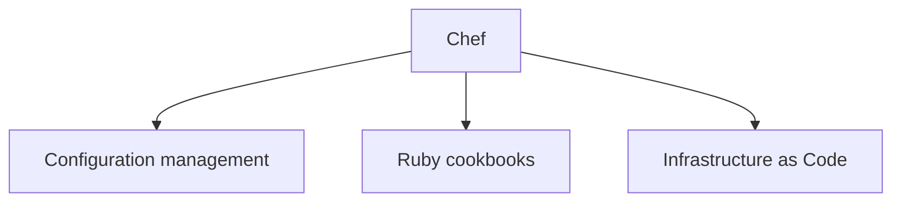

_Explication : Chef est défini comme : plateforme d'automatisation d'infrastructure utilisant du code Ruby (cookbooks) pour décrire et appliquer la configuration des serveurs._

<br>

---

### Configuration Drift

!!! note "Définition"
    Divergence progressive entre la configuration réelle d'un système et son état désiré, causée par des modifications manuelles non contrôlées.

La dérive de configuration est un problème silencieux mais critique — des modifications manuelles non tracées peuvent créer des incohérences entre serveurs, rendre les déploiements imprévisibles et compromettre la sécurité.

- **Causes :** modifications manuelles (ssh + vim), mises à jour partielles, erreurs humaines
- **Solutions :** configuration management (Ansible, Chef), immutable infrastructure, IaC

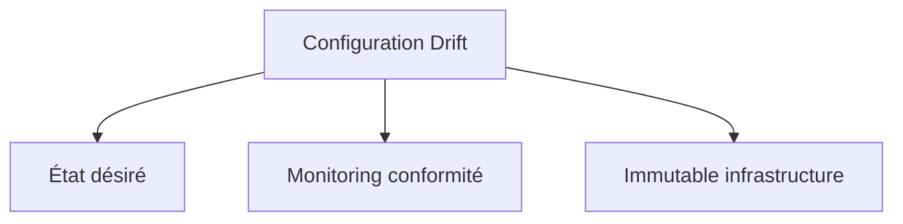

_Explication : Configuration Drift est défini comme : divergence progressive entre la configuration réelle d'un système et son état désiré, causée par des modifications manuelles non contrôlées._

<br>

---

## D

### DAST

!!! note "Définition"
    Tests de sécurité dynamiques analysant une application en cours d'exécution pour détecter les vulnérabilités exploitables depuis l'extérieur.

Contrairement au SAST (analyse statique du code), le DAST simule un attaquant externe qui interagit avec l'application en fonctionnement. Il détecte les vulnérabilités runtime comme les injections SQL, XSS, ou mauvaises configurations de sécurité.

- **Acronyme :** Dynamic Application Security Testing
- **Approche :** black box testing, simulation d'attaques réelles
- **Outils :** OWASP ZAP, Burp Suite, Veracode, Acunetix

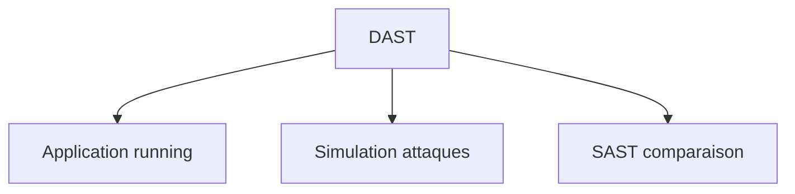

_Explication : DAST est défini comme : tests de sécurité dynamiques analysant une application en cours d'exécution pour détecter les vulnérabilités exploitables depuis l'extérieur._

<br>

---

### Docker Registry

!!! note "Définition"
    Service de stockage et de distribution centralisés d'images de conteneurs Docker.

Le registry est l'équivalent d'un dépôt de packages pour les images Docker. La pipeline CI/CD construit une image, la pousse vers le registry, puis les orchestrateurs (Kubernetes) la tirent pour l'exécuter.

- **Types :** public (Docker Hub), privé (Harbor, ECR, ACR, GHCR)
- **Fonctionnalités :** vulnerability scanning, contrôle d'accès, réplication géographique
- **Bonnes pratiques :** scanner les images à chaque push, activer le signing (Notary/Cosign)

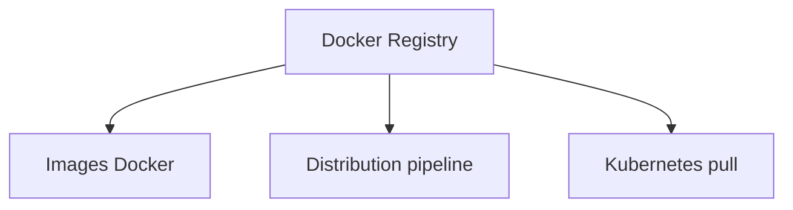

_Explication : Docker Registry est défini comme : service de stockage et de distribution centralisés d'images de conteneurs Docker._

<br>

---

### DORA Metrics

!!! note "Définition"
    Métriques de performance DevOps définies par le programme DevOps Research and Assessment pour mesurer la maturité des équipes de livraison.

Les quatre métriques DORA sont le standard de référence pour évaluer la performance d'une équipe de développement/ops : fréquence de déploiement, délai de mise en production, taux d'échec des changements et temps de rétablissement (MTTR).

- **4 métriques :** Deployment Frequency, Lead Time for Changes, Change Failure Rate, MTTR
- **Niveaux :** Low, Medium, High, Elite performers

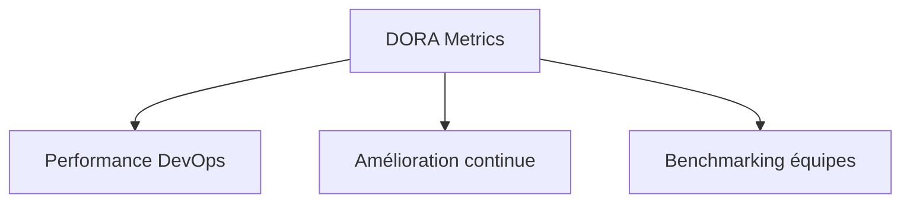

_Explication : DORA Metrics est défini comme : métriques de performance DevOps définies par le programme DevOps Research and Assessment pour mesurer la maturité des équipes de livraison._

<br>

---

## F

### Feature Flag

!!! note "Définition"
    Technique permettant d'activer ou désactiver des fonctionnalités applicatives en production sans redéploiement.

Les feature flags découplent le déploiement du code de son activation. Une feature peut être déployée en production mais désactivée — elle est activée progressivement pour des segments d'utilisateurs ou des équipes internes pour validation.

- **Avantages :** rollback instantané, rollout progressif, A/B testing, trunk-based development
- **Outils :** LaunchDarkly, Flagsmith, Split.io, OpenFeature

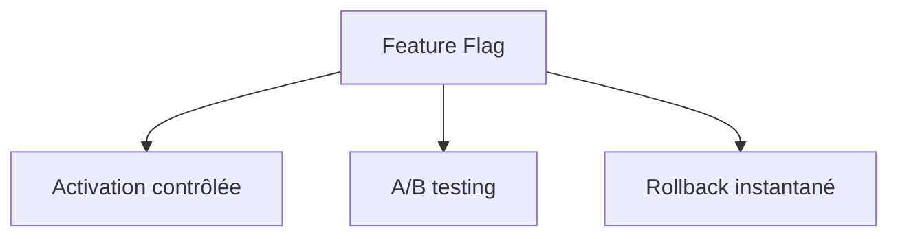

_Explication : Feature Flag est défini comme : technique permettant d'activer ou désactiver des fonctionnalités applicatives en production sans redéploiement._

<br>

---

## G

### GitOps

!!! note "Définition"
    Pratique utilisant Git comme source de vérité unique pour l'état de l'infrastructure et des applications, avec synchronisation automatique.

GitOps applique les principes du développement logiciel (pull requests, code review, historique Git) à la gestion de l'infrastructure. Des agents surveillent le dépôt Git et appliquent automatiquement tout changement détecté.

- **Principe :** état désiré dans Git, synchronisation automatique par agents (réconciliation)
- **Outils :** ArgoCD, Flux, Jenkins X
- **Contraste :** push-based (CI/CD traditionnel) vs. pull-based (GitOps)

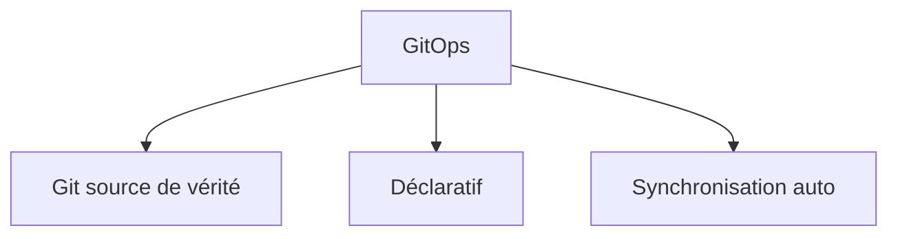

_Explication : GitOps est défini comme : pratique utilisant Git comme source de vérité unique pour l'état de l'infrastructure et des applications, avec synchronisation automatique._

<br>

---

### Grafana

!!! note "Définition"
    Plateforme open-source de visualisation et de monitoring permettant la création de dashboards interactifs multi-sources.

Grafana est la solution de visualisation de référence dans les stacks de monitoring modernes. Elle se connecte à des dizaines de sources de données (Prometheus, InfluxDB, Elasticsearch, Loki) et offre des dashboards temps-réel avec alerting intégré.

- **Sources de données :** Prometheus, InfluxDB, Elasticsearch, CloudWatch, Loki
- **Fonctionnalités :** alerting, annotations, templating, panels partageables
- **Stack classique :** Prometheus (collecte) + Grafana (visualisation)

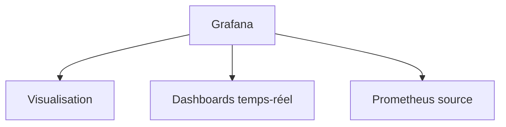

_Explication : Grafana est défini comme : plateforme open-source de visualisation et de monitoring permettant la création de dashboards interactifs multi-sources._

<br>

---

## H

### Helm

!!! note "Définition"
    Gestionnaire de paquets pour Kubernetes facilitant le déploiement, la configuration et le versioning d'applications complexes.

Helm pour Kubernetes, c'est ce que `apt` est pour Debian ou `npm` pour Node.js. Un chart Helm est un template d'application paramétrable — on peut déployer un Nginx, une base de données ou une application complète en une seule commande.

- **Concepts :** charts (templates), values (paramètres), releases (instances déployées)
- **Avantages :** réutilisabilité, versioning, rollback, composition d'applications
- **Dépôts :** Artifact Hub, Bitnami, charts officiels des projets CNCF

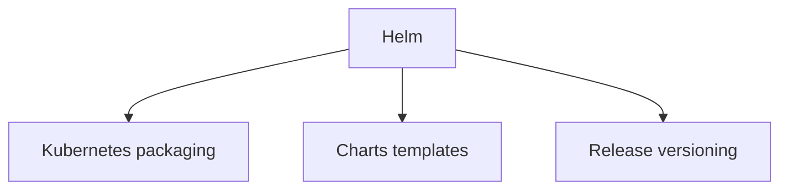

_Explication : Helm est défini comme : gestionnaire de paquets pour Kubernetes facilitant le déploiement, la configuration et le versioning d'applications complexes._

<br>

---

## I

### IaC

!!! note "Définition"
    Approche consistant à gérer et provisionner l'infrastructure via du code versionné et automatisé plutôt que par des interfaces graphiques manuelles.

L'Infrastructure as Code traite les serveurs, réseaux et services cloud comme du code source — avec les mêmes bénéfices : versioning Git, code review, tests automatisés et reproductibilité totale des environnements.

- **Acronyme :** Infrastructure as Code
- **Outils :** Terraform (multi-cloud), CloudFormation (AWS), Pulumi (langages natifs), ARM templates (Azure)
- **Principes :** idempotence, déclaratif, reproductibilité

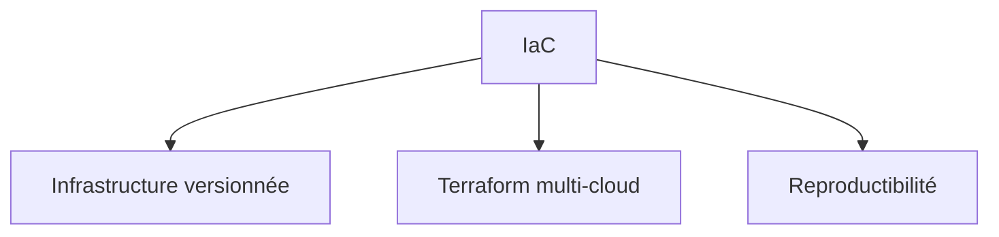

_Explication : IaC est défini comme : approche consistant à gérer et provisionner l'infrastructure via du code versionné et automatisé plutôt que par des interfaces graphiques manuelles._

<br>

---

### Immutable Infrastructure

!!! note "Définition"
    Architecture où les serveurs et conteneurs ne sont jamais modifiés après déploiement — ils sont remplacés par de nouvelles instances.

Le principe "replace, don't repair" élimine la dérive de configuration : au lieu de patcher un serveur en production, on génère une nouvelle image avec les correctifs et on remplace les instances existantes. Les conteneurs Docker sont l'incarnation moderne de ce principe.

- **Principe :** replace, don't repair — nouvelles instances remplacent les anciennes
- **Bénéfices :** consistency totale, rollback simple, prévisibilité
- **Lien avec :** Configuration Drift (éliminé), IaC (provisionne les nouvelles instances)

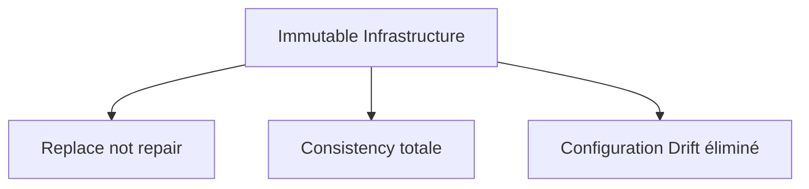

_Explication : Immutable Infrastructure est défini comme : architecture où les serveurs et conteneurs ne sont jamais modifiés après déploiement — ils sont remplacés par de nouvelles instances._

<br>

---

## J

### Jenkins

!!! note "Définition"
    Serveur d'automatisation open-source pour CI/CD avec une architecture extensible via un écosystème riche de plugins.

Jenkins est l'un des serveurs CI/CD les plus répandus. Son architecture master/agents lui permet de distribuer les builds sur plusieurs machines. Les pipelines sont définis en code (Jenkinsfile) pour être versionnés avec le projet.

- **Architecture :** controller (master) + agents (workers)
- **Concepts :** jobs, pipelines déclaratifs, Jenkinsfile, plugins (>1800 disponibles)
- **Alternative moderne :** GitHub Actions, GitLab CI (intégration native à la forge)

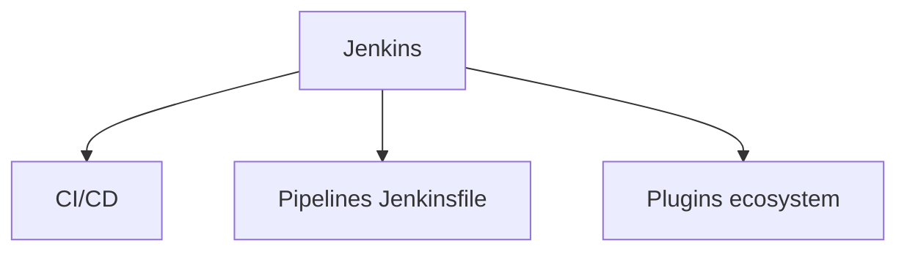

_Explication : Jenkins est défini comme : serveur d'automatisation open-source pour CI/CD avec une architecture extensible via un écosystème riche de plugins._

<br>

---

## M

### MTTR

!!! note "Définition"
    Temps moyen nécessaire pour restaurer un service après une panne ou un incident de production.

Le MTTR est une métrique DORA fondamentale : une équipe elite résout ses incidents en moins d'une heure. Il se réduit par le monitoring proactif, l'automatisation des runbooks et la pratique des post-mortems.

- **Acronyme :** Mean Time To Recovery / Restore
- **Amélioration :** monitoring précis, automation, runbooks, post-mortems sans blâme
- **Lien avec :** DORA Metrics (l'une des 4 métriques clés)

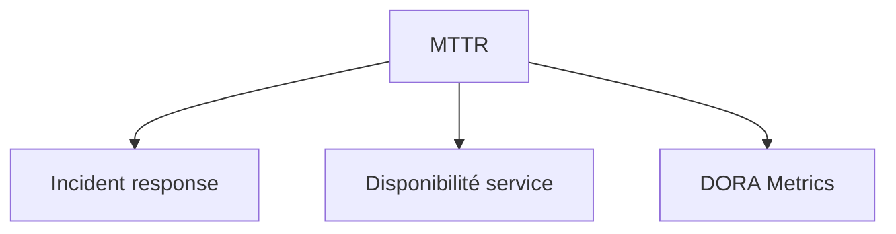

_Explication : MTTR est défini comme : temps moyen nécessaire pour restaurer un service après une panne ou un incident de production._

<br>

---

### Monitoring

!!! note "Définition"
    Surveillance continue des systèmes, applications et infrastructure pour détecter et résoudre les problèmes proactivement.

Le monitoring est le système nerveux de toute infrastructure en production. Il couvre trois dimensions : les métriques d'infrastructure (CPU, mémoire, disque), les métriques applicatives (latence, taux d'erreur) et les métriques métier (commandes, conversions).

- **Types :** infrastructure, application (APM), business metrics, logs, traces
- **Stack :** collecte → stockage → visualisation → alerting
- **Évolution :** monitoring → observabilité (logs + métriques + traces)

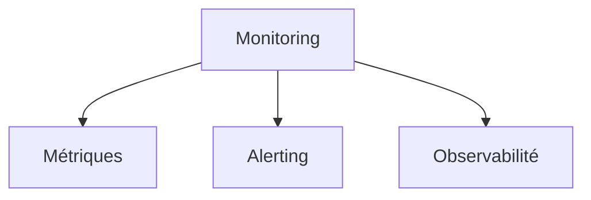

_Explication : Monitoring est défini comme : surveillance continue des systèmes, applications et infrastructure pour détecter et résoudre les problèmes proactivement._

<br>

---

## P

### Pipeline

!!! note "Définition"
    Séquence automatisée d'étapes transformant le code source en livrable déployé et vérifié en production.

Le pipeline CI/CD est le cœur du DevSecOps — chaque commit déclenche automatiquement une chaîne de vérifications (build, tests unitaires, scans de sécurité, tests d'intégration, déploiement) sans intervention humaine.

- **Étapes types :** checkout → build → test → security scan → containerize → deploy → verify
- **Types :** CI pipeline (validation), CD pipeline (livraison), deployment pipeline (production)
- **Concept :** "fail fast" — détecter les problèmes le plus tôt possible dans la chaîne

```mermaid
graph TB
    A[Pipeline] --> B[Automatisation]
    A --> C[Étapes sequentielles]
    A --> D[Livraison continue]
```

_Explication : Pipeline est défini comme : séquence automatisée d'étapes transformant le code source en livrable déployé et vérifié en production._

<br>

---

### Prometheus

!!! note "Définition"
    Système de monitoring et d'alerting open-source collectant et stockant des métriques en base de données temporelle (time-series).

Prometheus est devenu le standard de facto du monitoring cloud-native. Son modèle pull-based — il va chercher les métriques chez les applications — et son langage de requête PromQL permettent des analyses précises et flexibles.

- **Architecture :** pull-based, service discovery automatique, scrape intervals configurables
- **Langage de requête :** PromQL (Prometheus Query Language)
- **Écosystème :** Grafana (visualisation), Alertmanager (alerting), exporters (node, blackbox, etc.)

```mermaid
graph TB
    A[Prometheus] --> B[Time-series DB]
    A --> C[PromQL requêtes]
    A --> D[Grafana visualisation]
```

_Explication : Prometheus est défini comme : système de monitoring et d'alerting open-source collectant et stockant des métriques en base de données temporelle (time-series)._

<br>

---

## R

### Rolling Deployment

!!! note "Définition"
    Stratégie de mise à jour progressive remplaçant les instances de l'ancienne version une par une tout en maintenant le service disponible.

Kubernetes implémente nativement le rolling deployment : les pods sont remplacés un par un (ou par groupe), et des health checks valident chaque nouvelle instance avant de passer à la suivante. Si un pod échoue, le déploiement s'arrête.

- **Principe :** remplacement graduel avec health checks à chaque étape
- **Avantages :** zero downtime, rollback partiel possible, utilisation des ressources optimisée
- **Comparaison :** Blue-Green (bascule totale) vs. Rolling (progressif)

```mermaid
graph TB
    A[Rolling Deployment] --> B[Mise à jour progressive]
    A --> C[Zero downtime]
    A --> D[Health checks]
```

_Explication : Rolling Deployment est défini comme : stratégie de mise à jour progressive remplaçant les instances de l'ancienne version une par une tout en maintenant le service disponible._

<br>

---

### Runbook

!!! note "Définition"
    Documentation procédurale détaillée guidant les équipes ops lors des opérations courantes et de la résolution d'incidents.

Un runbook transforme l'expertise tacite des ingénieurs en procédures documentées et reproductibles. Pour chaque type d'incident courant, il décrit les symptômes, les étapes de diagnostic, les actions correctives et les voies d'escalade.

- **Contenu :** symptômes, étapes de diagnostic, actions correctives, escalade, contacts
- **Format :** markdown/wiki, automation scripts, playbooks SOAR
- **Bonne pratique :** tester et mettre à jour les runbooks après chaque incident

```mermaid
graph TB
    A[Runbook] --> B[Procédures incidents]
    A --> C[Diagnostic guidé]
    A --> D[Automation SOAR]
```

_Explication : Runbook est défini comme : documentation procédurale détaillée guidant les équipes ops lors des opérations courantes et de la résolution d'incidents._

<br>

---

## S

### SAST

!!! note "Définition"
    Tests de sécurité statiques analysant le code source sans l'exécuter pour détecter les vulnérabilités dès le développement.

Le SAST est le "shift left" de la sécurité : en analysant le code avant son exécution, il détecte les injections SQL, les XSS, les secrets hardcodés ou les mauvaises pratiques cryptographiques dès la phase de développement, là où le coût de correction est le plus faible.

- **Acronyme :** Static Application Security Testing
- **Approche :** white box testing, analyse AST, détection de patterns dangereux
- **Outils :** SonarQube, Checkmarx, Semgrep, Veracode, CodeQL

```mermaid
graph TB
    A[SAST] --> B[Analyse code source]
    A --> C[Shift left sécurité]
    A --> D[DAST comparaison]
```

_Explication : SAST est défini comme : tests de sécurité statiques analysant le code source sans l'exécuter pour détecter les vulnérabilités dès le développement._

<br>

---

### SCA

!!! note "Définition"
    Analyse des composants et dépendances tierces utilisées dans un projet pour identifier les vulnérabilités et les licences problématiques.

La quasi-totalité du code applicatif moderne dépend de centaines de bibliothèques open source. Le SCA les inventorie et les confronte aux bases CVE pour signaler les dépendances vulnérables.

- **Acronyme :** Software Composition Analysis
- **Périmètre :** bibliothèques open source, licences, CVE connues, transitive dependencies
- **Outils :** Snyk, WhiteSource (Mend), Black Duck, Dependabot (GitHub)

```mermaid
graph TB
    A[SCA] --> B[Dépendances tierces]
    A --> C[CVE vulnerabilités]
    A --> D[Open source licences]
```

_Explication : SCA est défini comme : analyse des composants et dépendances tierces utilisées dans un projet pour identifier les vulnérabilités et les licences problématiques._

<br>

---

### Secret Management

!!! note "Définition"
    Gestion sécurisée et centralisée des informations sensibles telles que mots de passe, clés API, certificats et tokens.

Hardcoder un secret dans le code source est l'une des erreurs de sécurité les plus fréquentes — et les plus dangereuses. Un secret management robuste stocke les credentials de manière chiffrée, avec audit trail, rotation automatique et accès au moindre privilège.

- **Bonnes pratiques :** rotation automatique, accès minimal (moindre privilège), audit trail complet
- **Outils :** HashiCorp Vault, AWS Secrets Manager, Azure Key Vault, Kubernetes Secrets (+ SOPS/Sealed Secrets)

```mermaid
graph TB
    A[Secret Management] --> B[Credentials chiffrés]
    A --> C[Rotation automatique]
    A --> D[Audit trail]
```

_Explication : Secret Management est défini comme : gestion sécurisée et centralisée des informations sensibles telles que mots de passe, clés API, certificats et tokens._

<br>

---

### SRE

!!! note "Définition"
    Discipline appliquant les principes et méthodes de l'ingénierie logicielle aux opérations pour améliorer la fiabilité des systèmes.

Inventé par Google en 2003, le Site Reliability Engineering traite la fiabilité comme une feature logicielle. Les SRE défendent des SLO (objectifs de niveau de service) et gèrent un "error budget" — si le budget d'erreurs est épuisé, plus aucun déploiement risqué n'est autorisé.

- **Acronyme :** Site Reliability Engineering
- **Concepts :** SLI (indicateurs), SLO (objectifs), error budgets, toil (travail répétitif à automatiser)
- **Origine :** Google (Ben Treynor Sloss, 2003)

```mermaid
graph TB
    A[SRE] --> B[Fiabilité système]
    A --> C[SLO error budgets]
    A --> D[Automatisation toil]
```

_Explication : SRE est défini comme : discipline appliquant les principes et méthodes de l'ingénierie logicielle aux opérations pour améliorer la fiabilité des systèmes._

<br>

---

## T

### Terraform

!!! note "Définition"
    Outil d'Infrastructure as Code permettant de provisionner et gérer des ressources sur n'importe quel cloud de manière déclarative.

Terraform décrit l'état désiré de l'infrastructure en HCL (HashiCorp Configuration Language), puis calcule et applique les modifications nécessaires pour atteindre cet état. Il maintient un fichier d'état (state) qui représente la réalité de l'infrastructure provisionnée.

- **Concepts :** providers (AWS/Azure/GCP/...), resources, data sources, modules, state
- **Workflow :** `terraform plan` (simulation) → `terraform apply` (application) → `terraform destroy`
- **Alternative :** OpenTofu (fork open source), Pulumi (langages natifs)

```mermaid
graph TB
    A[Terraform] --> B[Infrastructure as Code]
    A --> C[Multi-cloud providers]
    A --> D[State management]
```

_Explication : Terraform est défini comme : outil d'Infrastructure as Code permettant de provisionner et gérer des ressources sur n'importe quel cloud de manière déclarative._

<br>

---

## V

### Vault

!!! note "Définition"
    Gestionnaire de secrets centralisé d'HashiCorp pour stocker, accéder et gérer les informations sensibles de manière sécurisée.

Vault va au-delà du simple stockage de secrets : il génère des credentials dynamiques à durée de vie limitée (ex. des identifiants PostgreSQL temporaires valables 1 heure), garantissant que même une fuite de secret expire rapidement.

- **Fonctionnalités :** chiffrement transit/repos, dynamic secrets, PKI as a service, audit logging
- **Secrets engines :** AWS, database, PKI, SSH, KV, Transit
- **Intégrations :** Kubernetes (sidecar injection), CI/CD pipelines, cloud providers

```mermaid
graph TB
    A[Vault] --> B[Secrets chiffrés]
    A --> C[Dynamic secrets TTL]
    A --> D[Audit logging]
```

_Explication : Vault est défini comme : gestionnaire de secrets centralisé d'HashiCorp pour stocker, accéder et gérer les informations sensibles de manière sécurisée._

<br>

---

## Conclusion

!!! quote "Résumé — DevSecOps"
    DevSecOps, c'est l'alliance de trois cultures : la vélocité du développement (CI/CD, Pipeline, Feature Flags), la rigueur des opérations (IaC, Monitoring, SRE, Runbooks) et la sécurité intégrée dès la conception (SAST, DAST, SCA, Secret Management). Ces termes forment le vocabulaire de l'ingénieur moderne qui livre vite, fréquemment et en toute confiance.

> Continuez avec le [Glossaire Développement Mobile](./developpement-mobile.md) pour explorer les concepts Swift, iOS et les frameworks Apple.
