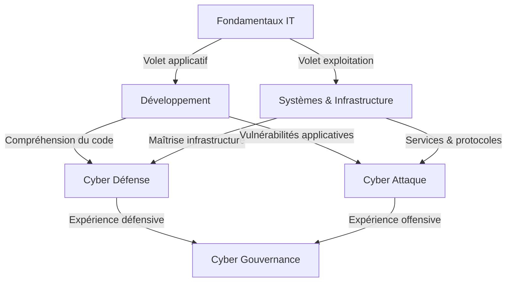

# Heatmap de compétences

!!! quote "Analogie"
    _Une heatmap de compétences fonctionne comme une carte thermique : les zones rouges indiquent là où la chaleur — c'est-à-dire l'exigence — est la plus forte. **Elle ne dit pas ce qu'il faut apprendre en premier, mais ce qui est indispensable pour ne pas brûler les étapes**._

## Objectif

La heatmap fournit une lecture rapide de l'intensité de compétences attendue selon les domaines. Elle permet de :

- visualiser les dépendances fortes entre disciplines
- expliquer les prérequis des parcours avancés
- guider la spécialisation métier

 

---

## Échelle d'intensité

| Niveau | Interprétation |
|:---|---|
| 🟢 Faible | Notions utiles |
| 🟡 Modéré | Compétence opérationnelle |
| 🟠 Élevé | Compétence cœur |
| 🔴 Critique | Maîtrise indispensable |

 

---

## Heatmap globale

Le tableau suivant croise chaque compétence transversale avec les domaines de la documentation, afin de visualiser d'un seul regard où l'intensité est la plus forte selon la spécialisation visée.

| Compétence | Fondamentaux | Développement | Systèmes | Cyber Défense | Cyber Attaque | Gouvernance |
|---|:---|:---|:---|:---|:---|:---|
| **Logique informatique** | 🔴 Critique | 🟠 Élevé | 🟠 Élevé | 🟡 Modéré | 🟡 Modéré | 🟡 Modéré |
| **Programmation** | 🟠 Élevé | 🔴 Critique | 🟡 Modéré | 🟡 Modéré | 🟠 Élevé | 🟢 Faible |
| **Administration Linux** | 🟡 Modéré | 🟡 Modéré | 🔴 Critique | 🔴 Critique | 🟠 Élevé | 🟢 Faible |
| **Réseaux** | 🟡 Modéré | 🟡 Modéré | 🔴 Critique | 🔴 Critique | 🔴 Critique | 🟡 Modéré |
| **Analyse de logs** | 🟢 Faible | 🟡 Modéré | 🟠 Élevé | 🔴 Critique | 🟡 Modéré | 🟡 Modéré |
| **Tests applicatifs** | 🟢 Faible | 🟠 Élevé | 🟢 Faible | 🟡 Modéré | 🟡 Modéré | 🟢 Faible |
| **Pentest** | 🟢 Faible | 🟡 Modéré | 🟡 Modéré | 🟢 Faible | 🔴 Critique | 🟢 Faible |
| **Détection / règles** | 🟢 Faible | 🟡 Modéré | 🟠 Élevé | 🔴 Critique | 🟡 Modéré | 🟡 Modéré |
| **Gestion des risques** | 🟡 Modéré | 🟢 Faible | 🟡 Modéré | 🟡 Modéré | 🟢 Faible | 🔴 Critique |
| **Conformité** | 🟡 Modéré | 🟢 Faible | 🟡 Modéré | 🟢 Faible | 🟢 Faible | 🔴 Critique |

 

---

## Convergence des domaines

!!! quote "Note"
    _Le schéma ci-dessous rappelle la structure de dépendance entre domaines.  
    Il permet de lire la heatmap dans son contexte : une compétence critique dans un domaine avancé suppose que les domaines en amont aient été consolidés._

_La cybersécurité technique est une **spécialisation issue du socle technique**, et **non un point d'entrée direct**.  
La gouvernance tire sa pertinence de l'expérience accumulée dans les deux branches opérationnelles._

 

---

## Lecture opérationnelle

Un parcours crédible repose sur trois principes que la heatmap illustre concrètement :

**la cybersécurité technique exige une base systèmes et réseau solide** 
— _les colonnes Cyber Défense et Cyber Attaque concentrent plusieurs 🔴 sur des compétences directement issues de ces domaines_

 

**l'offensif efficace suppose une compréhension du développement** 
— _la colonne Cyber Attaque affiche 🟠 Élevé sur la Programmation, pas seulement sur le Pentest_

 

**la gouvernance gagne en pertinence lorsqu'elle s'appuie sur une expérience technique réelle** 
— _ses deux compétences critiques (**Gestion des risques**, **Conformité**) ne peuvent pas être pilotées sans culture terrain_

 

---

## Conclusion

La heatmap constitue un **outil d'orientation rapide**. Elle doit être consultée avant de choisir un parcours et renvoie systématiquement vers les **Fondamentaux IT** pour toute remise à niveau, quelle que soit la colonne visée.

 

---

Pour une comparaison visuelle des parcours sous forme de radar par axes de compétences, consultez le [Diagramme radar des compétences](./radar.md).

 