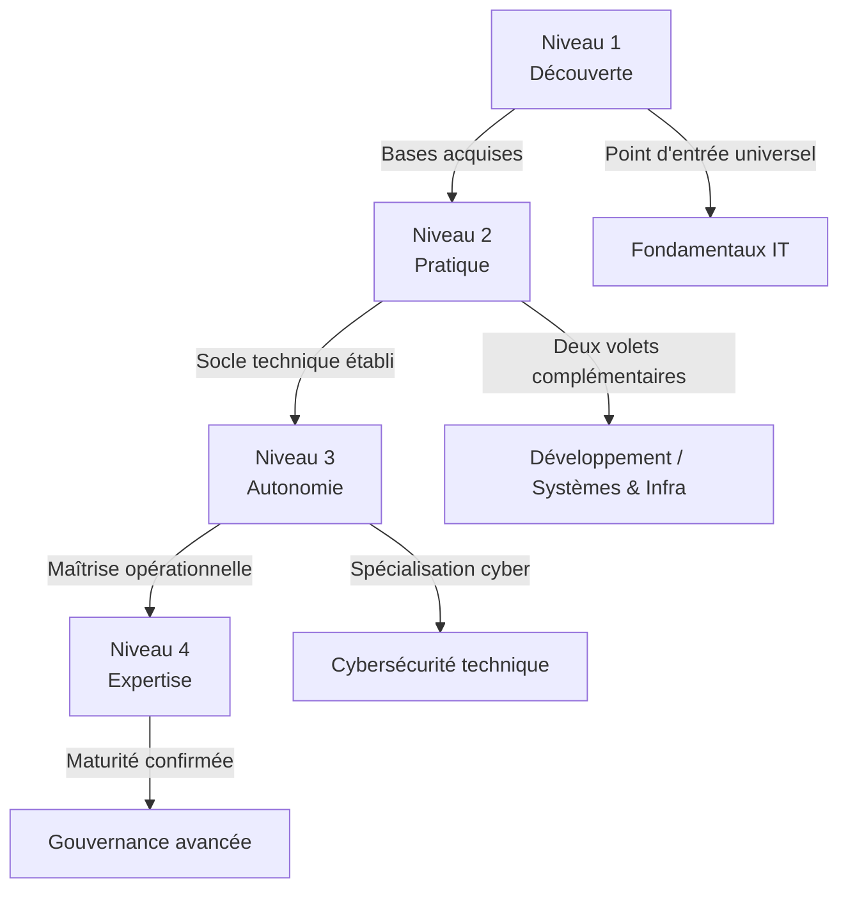

# Matrice de compétences

!!! quote "Analogie"
    _Construire une expertise technique revient à ériger un bâtiment : sans fondations solides, toute spécialisation avancée devient instable. La matrice ci-dessous permet de vérifier que la progression respecte une logique d'apprentissage saine._

## Objectif

Cette matrice définit, pour chaque domaine, le niveau de maîtrise attendu selon le stade de progression. Elle permet de :

- positionner un apprenant de manière objective
- éviter les parcours incohérents
- harmoniser les prérequis entre sections de la documentation

 

---

## Niveaux de référence

Chacun des quatre niveaux représente un stade de progression distinct.  
**La lecture de ce référentiel est indispensable avant d'interpréter la matrice par domaine.**

| Niveau | Signification |
|:---:|---|
| **N1** | Découverte — compréhension des concepts et du vocabulaire |
| **N2** | Pratique encadrée — mise en œuvre guidée |
| **N3** | Autonomie — réalisation professionnelle standard |
| **N4** | Expertise — architecture, optimisation, audit |

 

---

## Matrice par domaine

Le tableau suivant croise chaque domaine de la documentation avec les quatre niveaux de progression, afin d'indiquer à quel stade chaque discipline doit être prioritairement investie.

**Légende :**

- 🟠 **Élevé** : domaine structurant à ce niveau
- 🟡 **Modéré** : compétence de consolidation
- 🟢 **Faible** : exposition ou culture générale suffisante
- **—** : non pertinent comme point d'entrée

| Domaine | N1 | N2 | N3 | N4 |
|---|:---:|:---:|:---:|:---:|
| Fondamentaux IT | 🟠 Élevé | 🟠 Élevé | 🟡 Modéré | 🟢 Faible |
| Développement | 🟢 Faible | 🟠 Élevé | 🟠 Élevé | 🟡 Modéré |
| Systèmes & Infrastructure | 🟢 Faible | 🟠 Élevé | 🟠 Élevé | 🟡 Modéré |
| Cyber Défense (Blue / SOC / DFIR) | — | 🟡 Modéré | 🟠 Élevé | 🟠 Élevé |
| Cyber Attaque (Red / Pentest) | — | 🟡 Modéré | 🟡 Modéré | 🟠 Élevé |
| Cyber Gouvernance (GRC) | 🟢 Faible | 🟡 Modéré | 🟡 Modéré | 🟠 Élevé |

!!! note
    Les domaines **Cyber Défense** et **Cyber Attaque** ne constituent pas des points d'entrée valides en N1. Tenter de les aborder sans socle technique établi produit invariablement des lacunes structurelles difficiles à combler.

 

---

## Progression globale

!!! quote "Note"
    _Le schéma ci-dessous illustre la progression naturelle entre les quatre niveaux et les domaines qui leur correspondent. Chaque transition est conditionnée par l'acquisition effective du niveau précédent — une flèche ne représente pas une option, mais une dépendance._

_La cybersécurité technique ne devient pertinente qu'après consolidation du socle en N2. La gouvernance atteint sa pleine valeur opérationnelle en N4, lorsqu'elle s'appuie sur une expérience terrain réelle._

 

---

## Conclusion

La matrice sert de **garde-fou pédagogique**. Elle ne mesure pas un niveau absolu mais indique à quel stade chaque domaine doit être prioritairement investi pour garantir une progression cohérente.

**Notre recommandation : les Fondamentaux IT restent le point d'entrée universel, quelle que soit la spécialisation visée.**

 

---

Pour visualiser ces mêmes dépendances sous forme d'intensité par compétence transversale, consultez la [Heatmap de compétences](./heatmap.md).

 