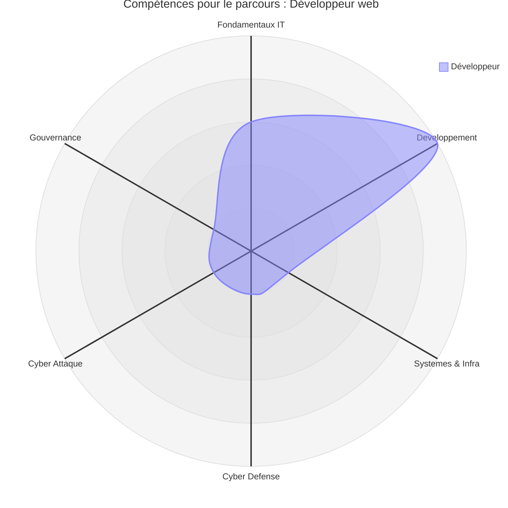
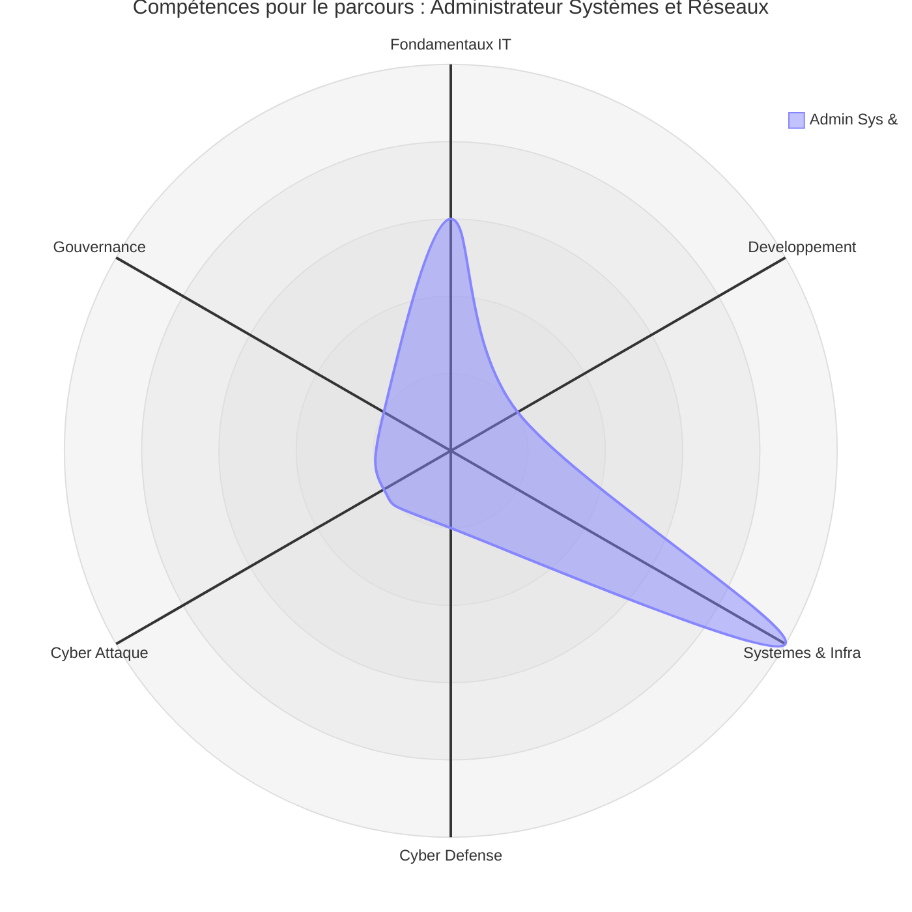
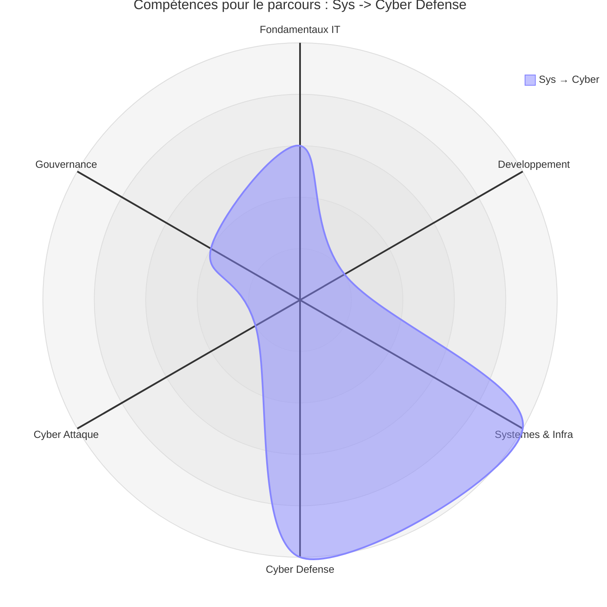
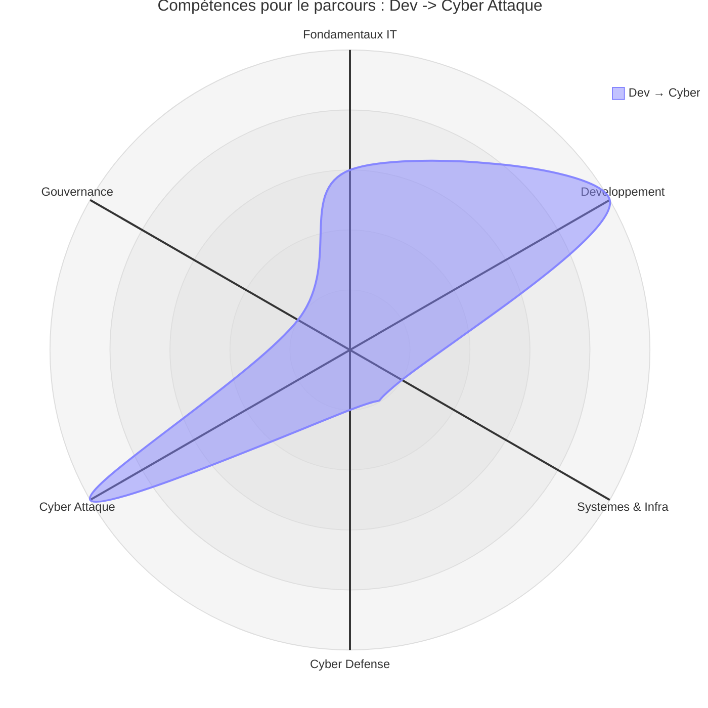
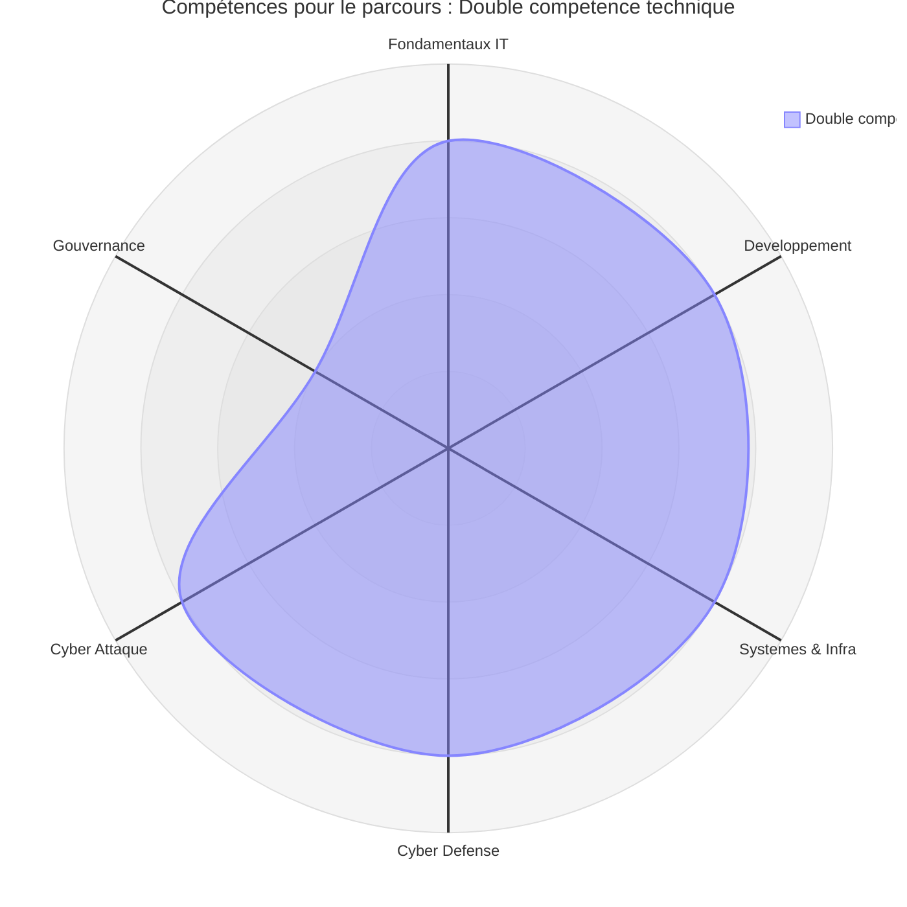
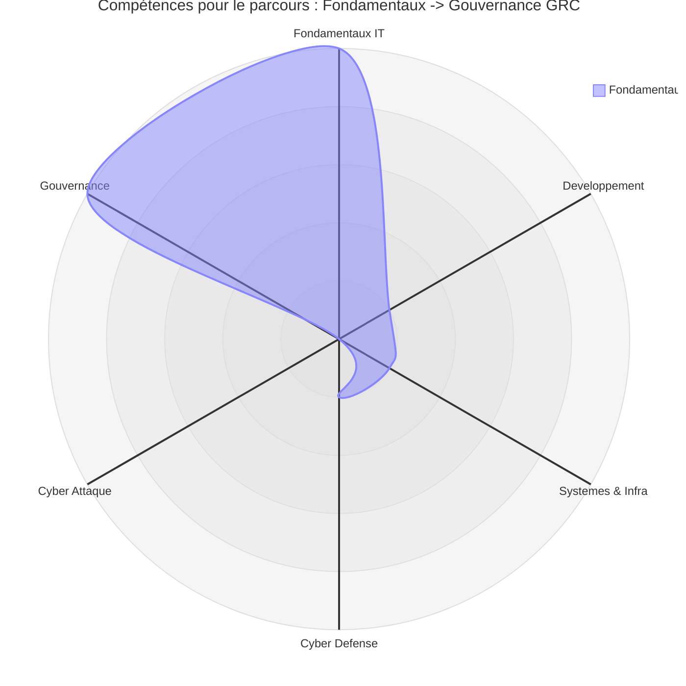

# Diagramme radar des compétences

!!! quote "Analogie"
    _Un diagramme radar révèle la forme d'un parcours, pas seulement son niveau. Un profil équilibré dessine un polygone régulier ; une spécialisation forte produit un pic marqué sur un axe. Ni l'un ni l'autre n'est meilleur — tout dépend de l'objectif visé._

## Objectif

Ce document sert à comparer visuellement les parcours OmnyDocs en termes de compétences mobilisées. Le but n'est pas de noter un apprenant, mais de visualiser la forme d'un parcours — équilibré ou spécialisé — afin de choisir un chemin cohérent avec ses objectifs métiers.

Les valeurs sont relatives (0 à 5). Elles représentent l'intensité moyenne attendue sur l'ensemble du parcours.

---

## Axes

Les six axes couvrent directement les grandes sections de la documentation :

- Fondamentaux IT
- Développement
- Systèmes & Infrastructure
- Cyber Défense
- Cyber Attaque
- Gouvernance (GRC)

---

## Référentiel 0–5

| Valeur | Lecture |
|:---:|---|
| 0 | Hors périmètre |
| 1 | Notions / sensibilisation |
| 2 | Pratique guidée |
| 3 | Autonomie opérationnelle |
| 4 | Niveau confirmé |
| 5 | Niveau avancé / spécialisation |

---

## Source de vérité

Le tableau suivant centralise les valeurs utilisées dans chaque diagramme radar. Il constitue la référence en cas de doute sur l'interprétation d'un graphique.

| Parcours | Fondamentaux | Dév | Sys | Cyber Défense | Cyber Attaque | GRC |
|---|:---:|:---:|:---:|:---:|:---:|:---:|
| Développeur web | 3 | 5 | 1 | 1 | 1 | 1 |
| Admin Sys & Réseaux | 3 | 1 | 5 | 1 | 1 | 1 |
| Sys → Cyber Défense | 3 | 1 | 5 | 5 | 1 | 2 |
| Dev → Cyber Attaque | 3 | 5 | 1 | 1 | 5 | 1 |
| Double compétence technique | 4 | 4 | 4 | 4 | 4 | 2 |
| Fondamentaux → Gouvernance (GRC) | 5 | 1 | 1 | 1 | 0 | 5 |

**Lecture :**

- "Double compétence technique" est le profil le plus équilibré techniquement.
- "Sys → Cyber Défense" et "Dev → Cyber Attaque" sont des spécialisations fortes sur un axe dominant.
- "Fondamentaux → GRC" est volontairement orienté gouvernance, avec un socle technique minimal mais solide.
- "Développeur web" et "Admin Sys & Réseaux" sont des parcours terminaux sans extension cyber.

---

## Diagrammes par parcours

### Développeur web

_Parcours centré sur le volet applicatif. Le pic sur l'axe Développement reflète la maîtrise attendue de la stack TALL. Les autres axes restent volontairement bas — ce parcours ne vise pas la cybersécurité ni l'infrastructure._

 

---

### Administrateur Systèmes & Réseaux

_Parcours centré sur l'exploitation. Le pic sur l'axe Systèmes & Infra reflète la maîtrise attendue de Linux, Windows, des services réseau et de la virtualisation. Symétrique du parcours Développeur web sur l'axe opposé._

 

---

### Sys → Cyber Défense

_Extension naturelle du parcours Admin. Le radar présente deux pics symétriques sur Systèmes et Cyber Défense, ce qui reflète la dépendance forte entre les deux domaines._

 

---

### Dev → Cyber Attaque

_Extension naturelle du parcours Développeur web. Les deux pics sur Développement et Cyber Attaque reflètent la complémentarité entre compréhension du code et exploitation des vulnérabilités applicatives._

 

---

### Double compétence technique

_Le polygone le plus régulier de la série. La forme quasi-hexagonale illustre l'équilibre entre tous les domaines techniques. La gouvernance reste à 2 — elle ne constitue pas l'objectif premier de ce parcours._

 

---

### Fondamentaux → Gouvernance (GRC)

_Profil asymétrique en opposition : deux pics forts sur Fondamentaux et Gouvernance, axes techniques quasi inexistants. Ce radar n'est pas un défaut — il reflète fidèlement un profil GRC pur, orienté conformité et pilotage stratégique._

 

---

## Conclusion

Le diagramme radar ne hiérarchise pas les parcours — il les différencie. Un pic unique traduit une spécialisation assumée ; un polygone régulier traduit une polyvalence construite. Les deux ont leur place selon le contexte professionnel visé.

**Notre recommandation : choisir la forme de radar qui correspond à l'objectif métier, pas à une idée abstraite de "complétude".**

---

Pour approfondir la progression recommandée et les dépendances entre domaines, consultez la page [Compréhension](./comprehension.md).

 