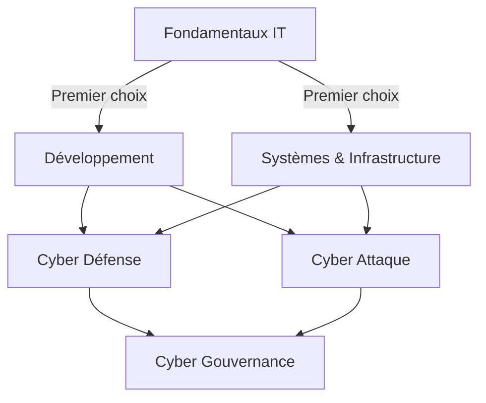

# Compréhension

!!! quote "Analogie"
    _Construire une expertise technique s'apparente à la formation d'un professionnel de terrain : **on ne se spécialise pas avant d'avoir construit un socle fiable.** Une progression maîtrisée réduit fortement les angles morts techniques._

## Objectif

Cette page définit des parcours cohérents dans OmnyDocs afin de guider la montée en compétence selon différents objectifs métiers. Chaque parcours part du même point d'entrée — les **Fondamentaux IT** — et bifurque ensuite selon la spécialisation visée.

 

---

## Vue d'ensemble des parcours

_Les **Fondamentaux IT** alimentent deux branches techniques de même niveau — **Développement** et **Infrastructure** — qui convergent ensuite vers la **cybersécurité opérationnelle**. La **Gouvernance** constitue la couche stratégique supérieure, accessible une fois le socle technique établi._

 

---

## Choisir son parcours

Chaque carte ci-dessous correspond à un parcours détaillé. Il contient la ligne de matrice associée, les compétences heatmap pertinentes, le diagramme radar et les orientations possibles vers d'autres spécialisations.

- ### :lucide-code-2: Développeur web
    ---
    Stack TALL (Tailwind, Alpine.js, Laravel, Livewire). Le parcours le plus accessible, sans prérequis en infrastructure ni en cybersécurité.

    🟢 **Accessibilité : facile**

    [Consulter ce parcours](./parcours/developpeur-web.md)

- ### :lucide-server: Admin Systèmes & Réseaux
    ---
    Linux, Windows, services réseau, virtualisation, supervision. Approche orientée exploitation et administration d'environnements techniques.

    🔵 **Accessibilité : modérée**

    [Consulter ce parcours](./parcours/admin-sys-reseau.md)

- ### :lucide-layers: Double compétence technique
    ---
    Développement et infrastructure combinés avant spécialisation cyber. Le profil le plus complet, le plus exigeant.

    🔴 **Accessibilité : difficile**

    [Consulter ce parcours](./parcours/double-competence.md)

- ### :lucide-shield: Sys → Cyber Défense
    ---
    Extension naturelle du parcours Admin. Spécialisation Blue Team : SOC, détection, réponse à incident, DFIR.

    🟡 **Accessibilité : avancée**

    [Consulter ce parcours](./parcours/sys-cyber-defense.md)

- ### :lucide-crosshair: Dev → Cyber Attaque
    ---
    Extension naturelle du parcours Développeur. Spécialisation pentest Web et API, exploitation de vulnérabilités applicatives.

    🟡 **Accessibilité : avancée**

    [Consulter ce parcours](./parcours/dev-cyber-attaque.md)

- ### :lucide-scale: Gouvernance (GRC)
    ---
    Conformité, gestion des risques, pilotage SMSI. Accessible sans expertise technique poussée, mais une culture terrain reste indispensable.

    🔵 **Accessibilité : modérée**

    [Consulter ce parcours](./parcours/gouvernance.md)

 

---

## Tableau de synthèse

Les parcours présentés ci-dessus sont résumés dans le tableau suivant pour faciliter la comparaison et orienter rapidement le choix selon le profil et l'objectif visé.

| Parcours | Dominante | Accessibilité | Métiers cibles |
|---|---|:---:|---|
| Développeur web | Applicatif | 🟢 Facile | Développeur web, Fullstack |
| Admin Sys & Réseaux | Infrastructure | 🔵 Modérée | Sysadmin, Admin réseau |
| Systèmes → Blue | Infrastructure | 🟡 Avancée | SOC, DFIR |
| Dev → Red | Applicatif | 🟡 Avancée | Pentest |
| Double pilier | Hybride | 🔴 Difficile | Expert sécurité |
| Gouvernance | Organisationnelle | 🔵 Modérée | RSSI, Audit |

<small>Légende : 🟢 Facile — 🔵 Modérée — 🟡 Avancée — 🔴 Difficile</small>

 

---

## Conclusion

Une progression cohérente repose toujours sur un socle technique solide. **La spécialisation précoce reste le principal facteur d'échec dans les parcours cybersécurité** : elle crée des angles morts qui se révèlent coûteux à combler plus tard.

!!! tip "Notre recommandation : commencer ou consolider les **Fondamentaux IT** avant toute spécialisation, quelle qu'elle soit."

 

---

Pour visualiser précisément les niveaux de maîtrise attendus par domaine, consultez :

- la [Matrice de compétences](./competences/matrice.md)
- la [Heatmap de compétences](./competences/heatmap.md)
- le [Diagramme radar des compétences](./competences/radar.md)

 