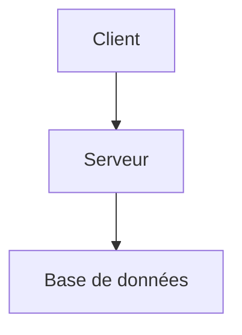
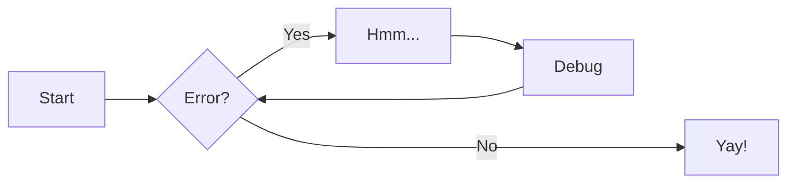

# Introduction

**Objectif** : acquérir les fondamentaux de l'informatique sont nécessaires pour comprendre et exceller dans n'importe quel domaine.

Les bases que vous vous apprêtez à découvrir constituent un socle intellectuel et technique indispensable pour comprendre les concepts
avancés en **cybersécurité**, **développement**, **infrastructure** et **analyse de systèmes**. 

!!! quote "Partage de connaissance"
_Ce partage est le fruit de mon apprentissage au quotidien. Je suis quelqu'un de pointilleux. Je partage ce que j'apprends avec des précisions que j'aurais aimé avoir avant de passer des heures à comprendre chacun des concepts. Ainsi, ce savoir vous donnera les moyens de poser un premier pied dans l’univers de l’informatique, tout en comprenant ce que vous faites._

L’informatique repose sur un socle commun de compétences et de concepts transversaux. Ces fondations, bien que souvent sous-estimées, sont indispensables à toute montée en compétence : du **développement logiciel** à l’**administration système**, du **réseau** à la **cybersécurité**.

!!! tip
_Prenez le temps nécessaire pour assimiler chaque notion. 
**Fixer une durée stricte n'est pas pertinent** face à la diversité des profils et des rythmes d'apprentissage._

-   [x] **Mon conseil** _Avancez méthodiquement, sans brûler les étapes, car c'est de cette rigueur qui fera de vous un professionnel fiable, compétent et recherché._

