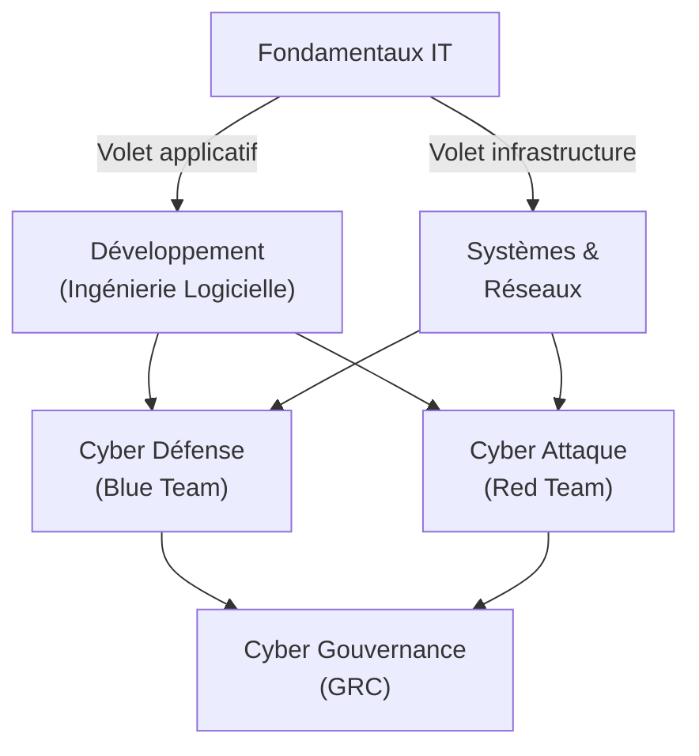

# Introduction à OmnyDocs

!!! quote "Analogie pédagogique — L'Architecte et l'Ouvrier"
    _Apprendre l'informatique en copiant-collant des tutoriels, c'est comme construire une maison en suivant un plan IKEA : vous obtiendrez un résultat, mais à la première fondation qui fissure, vous ne saurez pas comment réparer. OmnyDocs ne vous apprend pas seulement à assembler les pièces. Nous vous enseignons la physique des matériaux, la résistance des structures et l'art de l'architecture. Notre but n'est pas de faire de vous un simple exécutant, mais un ingénieur capable de raisonner par lui-même._

L'informatique moderne repose sur un socle commun de compétences extrêmement imbriquées. Que vous souhaitiez devenir développeur Full-Stack, ingénieur système, analyste SOC ou pentester, les fondations restent les mêmes : comprendre comment l'information circule, comment elle est stockée, et comment elle peut être manipulée ou protégée.

**OmnyDocs** a été conçu avec une philosophie unique : la technique sans la pédagogie n'est que du bruit. Chaque module de ce portail est structuré pour démystifier la complexité, en privilégiant la compréhension profonde (le "Pourquoi") avant l'exécution technique (le "Comment").

 

---

## À qui s'adresse ce portail ?

Cette documentation a été pensée pour s'adapter à votre niveau d'expertise :

* **Les Débutants** : Vous y trouverez des parcours guidés partant des fondamentaux absolus, sans jargon inutile, avec de nombreuses analogies pour raccrocher la technique à des concepts familiers.
* **Les Professionnels (Reconversion/Montée en compétence)** : Vous pouvez plonger directement dans des Masterclasses denses (Laravel, Cybersécurité) pour structurer vos connaissances existantes avec les standards de l'industrie.

> **Aucun prérequis mathématique ou académique n'est exigé.** Seule une curiosité insatiable et une rigueur intellectuelle sont nécessaires.

---

## L'Architecture du Savoir

OmnyDocs est divisé en grands piliers technologiques. La navigation a été pensée pour vous permettre de créer votre propre parcours.

- ### :lucide-layers: Fondamentaux IT
    ---
    Le point d'entrée universel. Concepts transversaux, formats de données, architecture des ordinateurs, et modélisation. **Le socle indispensable.**

- ### :lucide-code-2: Développement (Dev & Cloud)
    ---
    L'ingénierie logicielle moderne. Masterclass PHP, framework Laravel, écosystème TALL (Tailwind, Alpine, Livewire), et ingénierie de la qualité (Tests unitaires, TDD).

- ### :lucide-server: Sys & Réseau
    ---
    L'infrastructure de production. Administration Linux/Windows, architecture réseau, virtualisation (Proxmox, KVM), et supervision en environnement d'entreprise.

- ### :lucide-scale: Cybersécurité (GRC)
    ---
    La gouvernance, les risques et la conformité. Normes ISO (27001, 27005), réglementations (RGPD, NIS2, DORA), et construction d'un SMSI. La vision stratégique.

- ### :lucide-shield: Cybersécurité (Blue Team)
    ---
    La cyber-défense opérationnelle. Architecture SOC, détection (SIEM, YARA), réponse à incident (DFIR) et analyse de malwares (Reverse Engineering).

- ### :lucide-sword: Cybersécurité (Red Team)
    ---
    La sécurité offensive. OSINT, tests de pénétration (Web, Réseau, Active Directory), exploitation de vulnérabilités et ingénierie sociale.

 

---

## Progression Recommandée

Il n'y a pas de chemin unique, mais il existe une logique d'apprentissage. Voici comment les différents domaines s'alimentent entre eux :

```mermaid
flowchart TB
    F[Fondamentaux IT]

    DEV["Développement<br />(Ingénierie Logicielle)"]
    SYS["Systèmes &<br />Réseaux"]

    BLUE["Cyber Défense<br />(Blue Team)"]
    RED["Cyber Attaque<br />(Red Team)"]
    GRC["Cyber Gouvernance<br />(GRC)"]

    F -->|Volet applicatif| DEV
    F -->|Volet infrastructure| SYS

    DEV --> BLUE
    SYS --> BLUE

    DEV --> RED
    SYS --> RED

    BLUE --> GRC
    RED --> GRC
```

_Note : Il est illusoire de vouloir protéger (Blue Team) ou attaquer (Red Team) un système si l'on ne comprend pas comment il a été développé (Dev) ou configuré (Sys/Réseau)._

 

---

## Conventions du Standard SKILL

OmnyDocs respecte le standard de documentation **SKILL v2.0.0 (Zensical)**. Vous rencontrerez régulièrement des balises visuelles (Admonitions) pour structurer l'information :

!!! tip "Conseil"
    Bonne pratique recommandée, optimisation des performances, de la sécurité ou de la maintenabilité directement applicable.

!!! info "Information"
    Contexte complémentaire utile à la compréhension sans être bloquant.

!!! note "Note"
    Précision technique ou rappel factuel à garder en tête pour la suite.

!!! warning "Attention"
    Point de vigilance critique. Ignorer ce type de message peut entraîner des erreurs de configuration ou des vulnérabilités.

!!! danger "Alerte de Sécurité"
    Action destructrice (perte de données) ou commande offensive devant être exécutée exclusivement dans des environnements de test isolés.

!!! quote "Analogie pédagogique"
    Vulgarisation d'un concept complexe en utilisant une image du quotidien, généralement placée au début d'un module technique.

!!! quote "Note / Réflexion"
    Prise de recul, variante contextuelle ou aparté éditorial hors contenu technique strict.

!!! example "Exemple"
    Illustration concrète d'un concept, utilisée principalement dans les projets guidés et les modules pratiques.

!!! abstract "Abstract"
    Résumé, introduction d'une philosophie ou appel à l'action orientant le lecteur avant d'entrer dans le guide.

Les blocs de code sont systématiquement commentés pour expliquer chaque instruction, sans supposer que le contexte est évident.

---

## Conclusion

!!! quote "Ce qu'il faut retenir"
    OmnyDocs n'est pas un dictionnaire technique, c'est une plateforme d'ingénierie pédagogique. Avancez méthodiquement, lisez les analogies, comprenez les diagrammes, et surtout : **pratiquez**. La théorie vous donne la carte, mais seule la pratique vous apprendra à naviguer.

> [Découvrir les parcours métiers →](./comprehension.md)

 