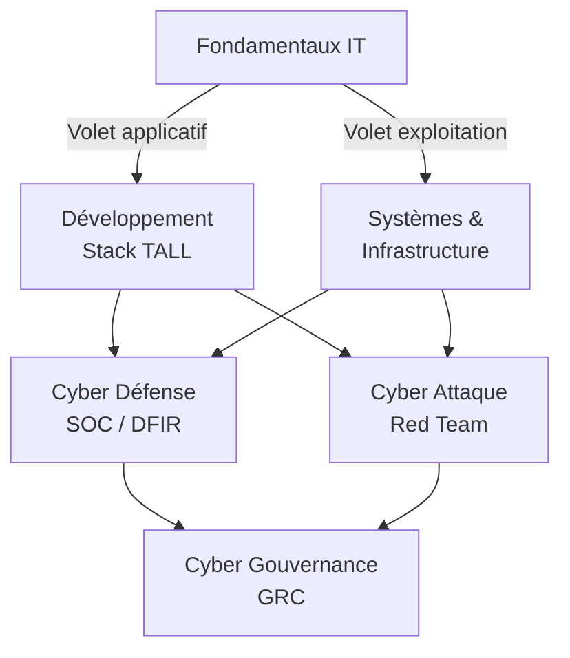

# Introduction

**Objectif** : les fondamentaux de l'informatique constituent le socle indispensable pour comprendre et exceller dans tout domaine technique.

!!! quote "Partage de connaissance"
    _Ce partage est le fruit de mon apprentissage au quotidien. Par souci de transparence, une partie du contenu de cette documentation est générée avec l'assistance de l'intelligence artificielle — mais chaque page est relue, orientée et enrichie avec les connaissances que j'ai acquises avec le temps. Rien n'est publié sans être passé par le filtre d'une révision humaine attentive._

    _Je suis quelqu'un de minutieux. La moindre zone d'ombre me dérange, et c'est précisément pour cette raison que vous trouverez régulièrement des diagrammes et des schémas explicatifs : là où un texte seul ne suffit pas à rendre un concept limpide, une représentation visuelle prend le relais._

    _Ce savoir vous donnera les moyens de poser un premier pied dans l'univers de l'informatique, tout en comprenant réellement ce que vous faites — pas uniquement en reproduisant des instructions._

L'informatique repose sur un socle commun de compétences et de concepts transversaux. Ces fondations, bien que souvent sous-estimées, sont indispensables à toute montée en compétence : du **développement logiciel** à l'**administration système**, du **réseau** à la **cybersécurité**.

> **Nous avons conçu cette documentation pour que chaque concept soit compris, pas seulement exécuté.**  
> Chaque guide, chaque exemple et chaque exercice poursuit un seul objectif : vous donner les moyens de raisonner par vous-même, et non de reproduire mécaniquement des instructions.

 

---

## À qui s'adresse cette documentation

Nous ne supposons aucun prérequis particulier pour commencer. Les sections sont conçues pour être abordées dans l'ordre proposé, mais un lecteur ayant déjà des bases solides peut naviguer directement vers le domaine qui l'intéresse.

Nous nous adressons aussi bien aux personnes qui découvrent l'informatique qu'aux professionnels souhaitant consolider ou élargir leurs compétences. Ce qui nous importe, c'est que vous progressiez avec méthode et que vous compreniez ce que vous faites à chaque étape.

---

## Comment naviguer

- ### :lucide-layers: Fondamentaux IT
    ---
    Le point d'entrée que nous recommandons à tout nouveau lecteur. Concepts transversaux, logique, formats de données, outils de développement et modélisation.

- ### :lucide-server: Systèmes & Infrastructure
    ---
    Administration Linux et Windows, réseaux, services, virtualisation, supervision. Une approche orientée exploitation et environnements de production.

- ### :lucide-code-2: Développement & Stack TALL
    ---
    HTML/CSS, PHP, Laravel, Alpine.js, Livewire, bases de données, tests et introduction au DevSecOps. Un parcours complet, du premier fichier HTML au déploiement.

- ### :lucide-scale: Cyber : Gouvernance
    ---
    Référentiels et normes (ISO 27001, NIST, PCI DSS), réglementations européennes (RGPD, NIS2, DORA), démarche SMSI et analyse de risques. La couche stratégique et juridique de la cybersécurité.

- ### :lucide-shield: Cyber : Défense
    ---
    Architecture SOC, détection et analyse (SIEM, IDS/IPS, YARA, Sigma), réponse à incident, investigation numérique (DFIR) et analyse de malwares. L'axe opérationnel de la protection.

- ### :lucide-sword: Cyber : Attaque
    ---
    OSINT, pentest Web et API, tests réseau et Active Directory, exploitation, password attacks et ingénierie sociale. Une approche offensive encadrée par un cadre légal et éthique explicite.

_Chaque section expose ses prérequis en introduction. En cas de doute sur le parcours adapté à vos objectifs, la page [Compréhension](./comprehension.md) propose des chemins guidés selon les métiers visés._

 

---

## Progression recommandée

```mermaid
flowchart TB
    F[Fondamentaux IT]

    DEV["Développement<br />Stack TALL"]
    SYS["Systèmes &<br />Infrastructure"]

    BLUE["Cyber Défense<br />SOC / DFIR"]
    RED["Cyber Attaque<br />Red Team"]
    GRC["Cyber Gouvernance<br />GRC"]

    F -->|Volet applicatif| DEV
    F -->|Volet exploitation| SYS

    DEV --> BLUE
    SYS --> BLUE

    DEV --> RED
    SYS --> RED

    BLUE --> GRC
    RED --> GRC
```

<em>Les Fondamentaux IT alimentent deux branches techniques de même niveau. Elles convergent ensuite vers la cybersécurité opérationnelle. La gouvernance constitue la couche stratégique supérieure, accessible une fois le socle technique établi.</em>

 

---

## Conventions utilisées

Nous utilisons des blocs visuels distincts tout au long de la documentation pour structurer l'information selon sa nature. Voici leur signification.

!!! tip "Conseil"
    Bonne pratique recommandée ou retour d'expérience directement applicable.

!!! info "Information"
    Contexte complémentaire utile à la compréhension sans être bloquant.

!!! note "Note"
    Précision technique ou rappel factuel à garder en tête pour la suite.

!!! warning "Attention"
    Point de vigilance ou risque à ne pas ignorer avant de poursuivre.

!!! danger "Danger"
    Erreur critique pouvant entraîner une perte de données, une faille de sécurité ou un dysfonctionnement majeur. À lire impérativement.

!!! quote "Réflexion"
    Prise de recul, analogie ou note éditoriale hors contenu technique strict.

!!! quote "Note"
    Variante contextuelle, utilisée pour des apartés éditoriaux plus courts.

!!! example "Exemple"
    Illustration concrète d'un concept, utilisée principalement dans les projets guidés et les modules pratiques.

!!! abstract "Abstract"
    Résumé, introduction d'une philosophie ou appel à l'action orientant le lecteur avant d'entrer dans le guide.

Les blocs de code sont systématiquement commentés pour expliquer chaque instruction, sans supposer que le contexte est évident.

 

---

> Prenez le temps nécessaire pour assimiler chaque notion.  
> **Se fixer une durée stricte n'est pas pertinent** face à la diversité des profils et des rythmes d'apprentissage.

!!! tip "Conseil"
    Avancez méthodiquement, sans brûler les étapes : **c'est cette rigueur qui fera de vous un professionnel fiable, compétent et recherché**.

 

---

Pour choisir le parcours le mieux adapté à vos objectifs et visualiser les dépendances entre domaines, consultez la page [Compréhension](./comprehension.md).

 