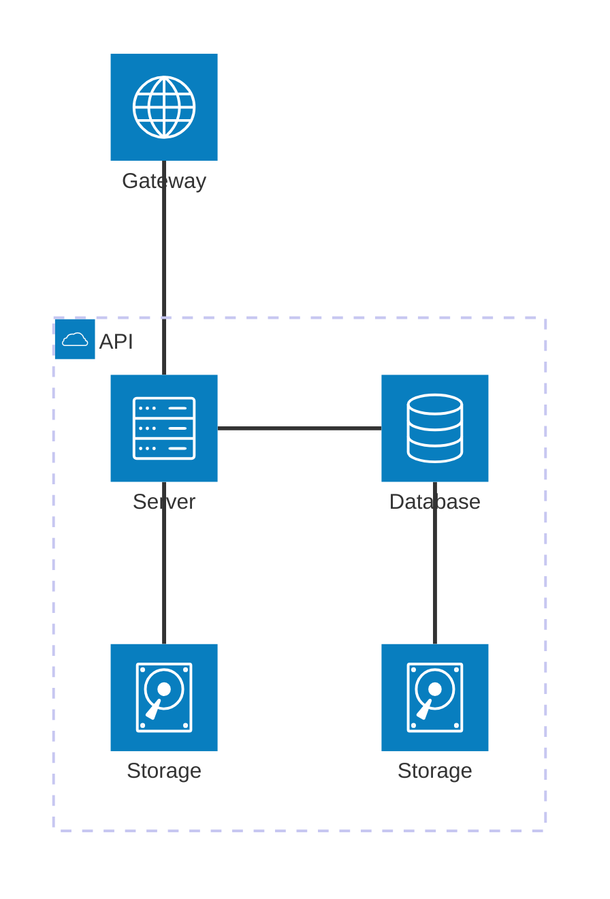
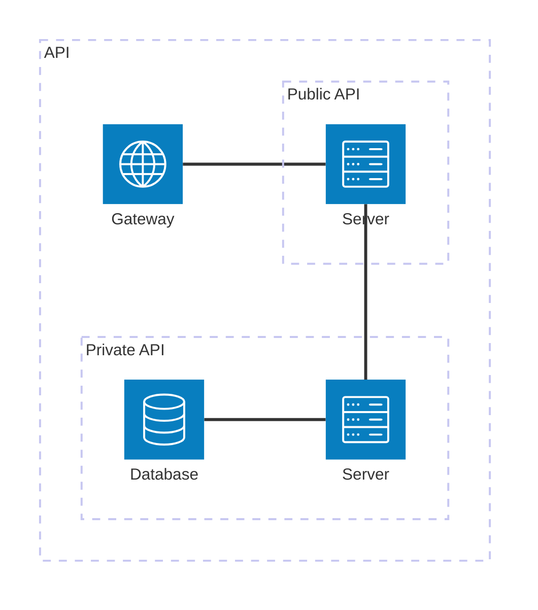
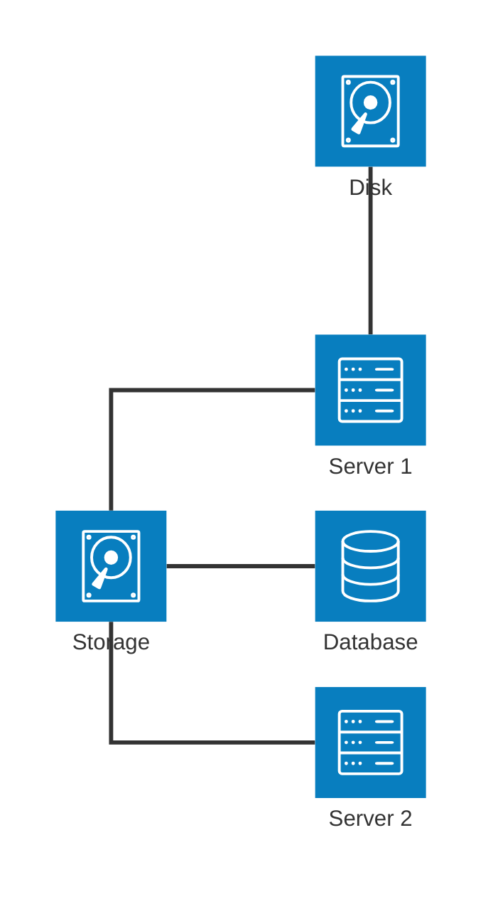
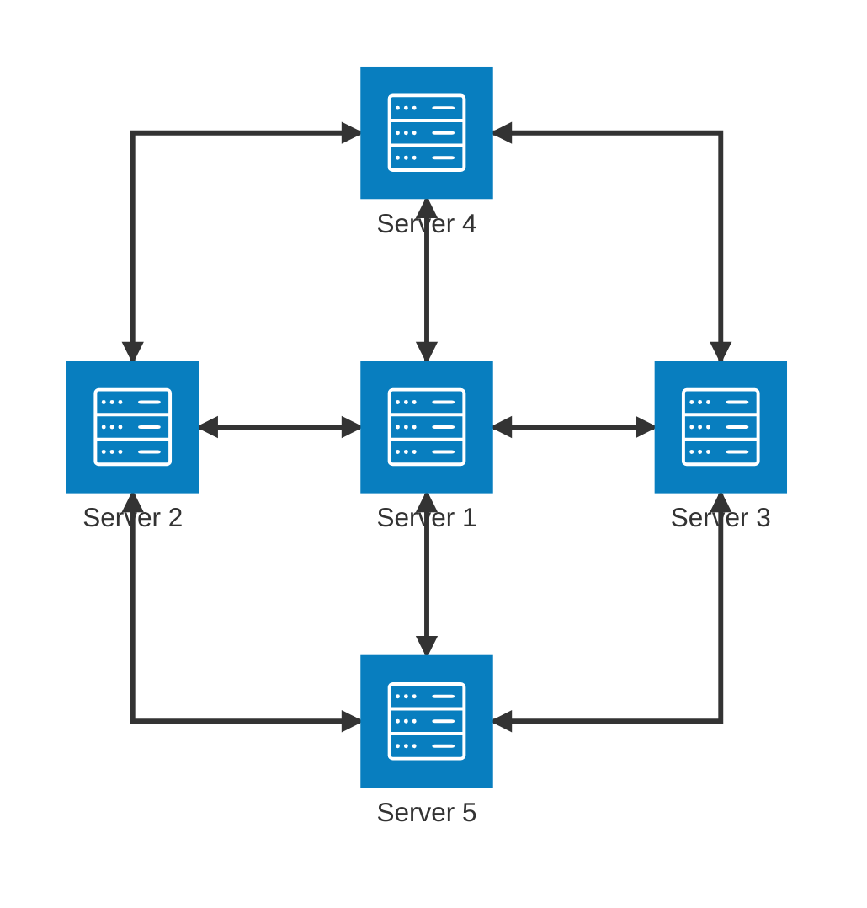
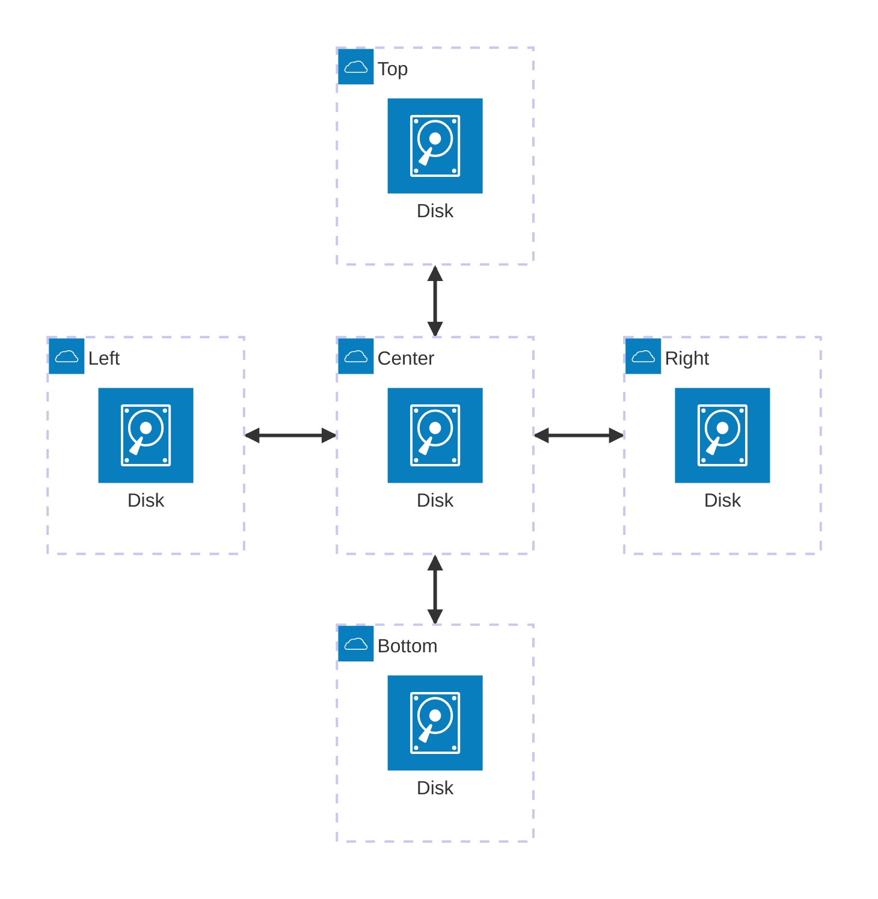
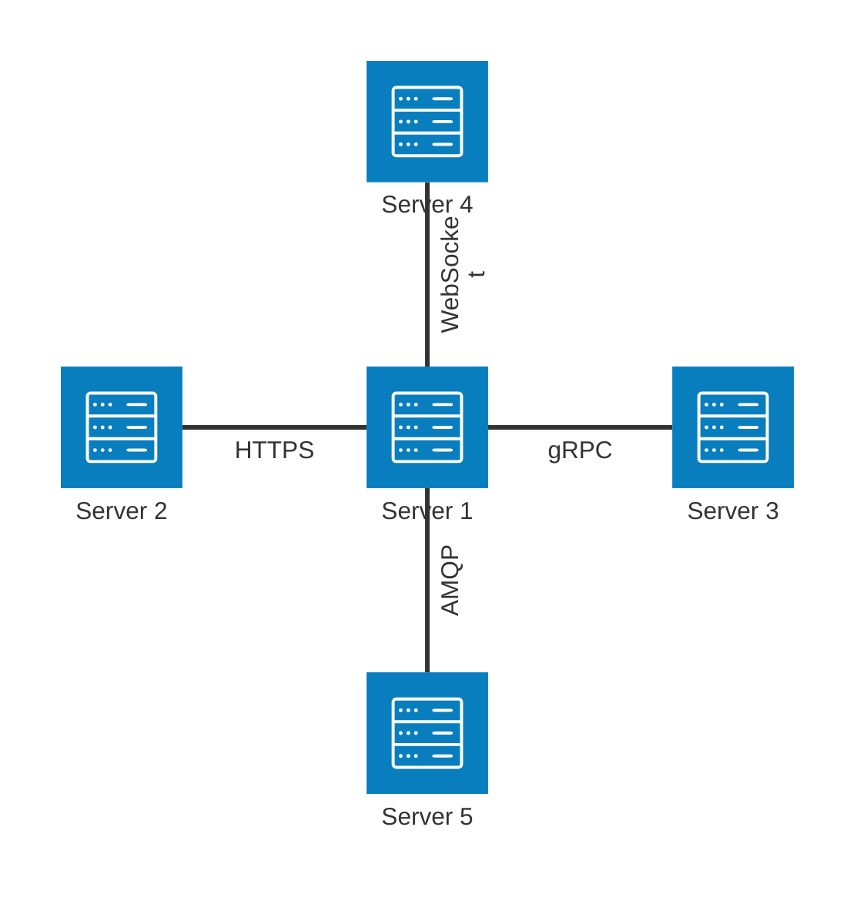
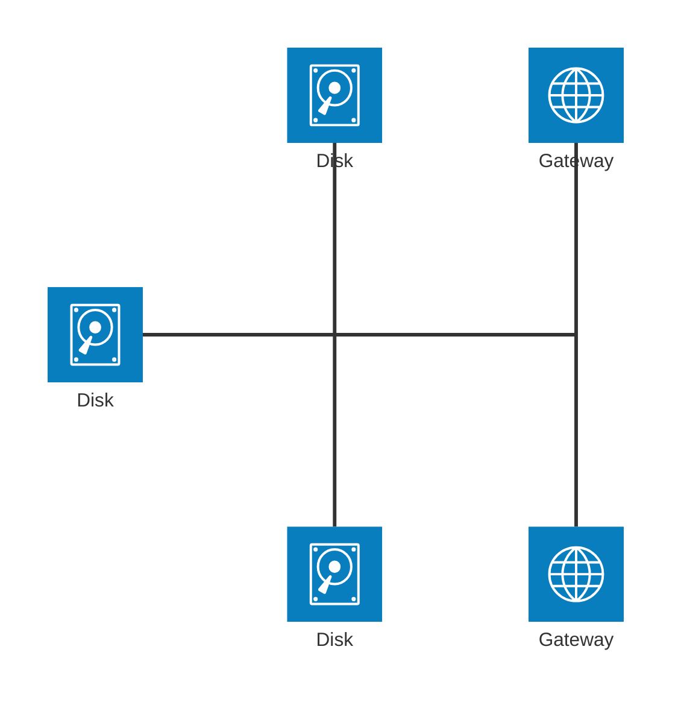
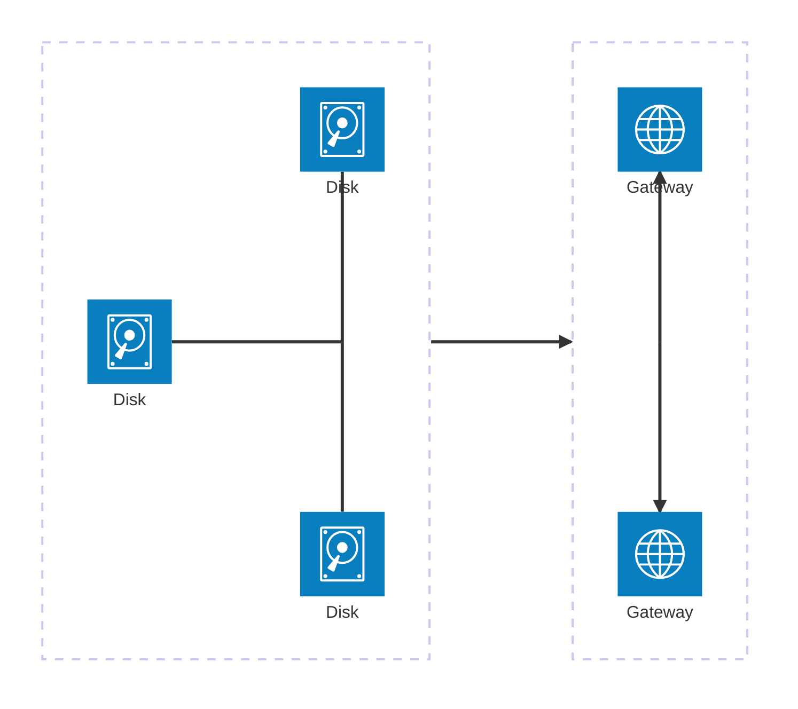

# Architecture Diagram (composants)

!!! note "Importance"
    Le diagramme Architecture sert à représenter des composants et leurs relations (groupes, services). C'est pertinent pour une vue SOC, une plateforme SI, ou une architecture applicative distribuée, avec une lecture claire des zones et des flux entre composants.

## Cas d'utilisation

| Domaine | Pertinence | Contexte |
|---|:---:|---|
| Systèmes & Réseau | 🔴 Critique | Architecture réseau, zones de confiance, flux entre composants d'infrastructure |
| Cyber technique | 🔴 Critique | Vue SOC[^1], chaîne EDR[^2]/SIEM[^3]/SOAR[^4], périmètres de défense |
| Architecture SI | 🟠 Élevé | Représentation des services d'une plateforme distribuée, dépendances |
| DevSecOps | 🟠 Élevé | Pipeline de sécurité, composants d'un environnement CI/CD sécurisé |

---

## Exemples de diagrammes

### Groupes et services simples

Le cas d'usage le plus courant : des services déclarés à l'intérieur d'un groupe, reliés par des connexions directionnelles. Les directions (`L`, `R`, `T`, `B`) indiquent le côté du composant depuis lequel part ou arrive la connexion.

_Un groupe cloud contenant quatre services interconnectés, avec une passerelle externe en sortie._

 

---

### Groupes imbriqués

Les groupes peuvent être imbriqués pour représenter des sous-domaines fonctionnels à l'intérieur d'un périmètre plus large — par exemple une API publique et une API privée au sein d'un même SI.

_Séparation entre surface exposée (Public API) et composants internes (Private API) au sein d'un même groupe._

 

---

### Directions de connexion libres

Les connexions ne sont pas forcément horizontales ou verticales de manière symétrique. Cet exemple illustre comment combiner librement les directions pour représenter des flux non linéaires.

_Plusieurs services se connectent à un storage central depuis des directions différentes._

 

---

### Icône inconnue (comportement de fallback)

Lorsqu'un nom d'icône n'est pas reconnu par Mermaid, un pictogramme générique `?` est affiché à la place. Ce comportement est utile à connaître pour anticiper le rendu lors de l'utilisation d'icônes non standard.

_Le nom d'icône `iconnamedoesntexist` est inconnu — Mermaid affiche un fallback `?` sans erreur bloquante._

 

---

### Flèches bidirectionnelles

Les connexions peuvent être bidirectionnelles via `<-->`. Cet exemple teste toutes les combinaisons directionnelles possibles autour d'un service central — utile pour valider le rendu des flux aller-retour.

_Un service central communique en bidirectionnel avec quatre services périphériques._

 

---

### Connexions entre groupes (Group Edges)

Le suffixe `{group}` permet de relier des groupes entre eux plutôt que des services individuels. C'est utile pour représenter des flux inter-zones sans exposer les détails internes de chaque groupe.

_Cinq groupes cloud reliés à un groupe central — représentation d'une topologie en étoile inter-zones._

 

---

### Labels sur les connexions

Les connexions peuvent porter un label textuel via la syntaxe `-[Label]-`. Cet exemple teste les labels courts et longs pour valider le rendu de Zensical sur les deux cas.

_Labels de protocole sur chaque connexion — utile pour préciser la nature du flux entre deux composants._

 

---

### Junctions (nœuds de convergence)

Les `junction` sont des nœuds sans label ni icône servant uniquement à faire converger ou diverger plusieurs connexions. C'est l'équivalent d'un point de routage ou d'un switch logique dans un diagramme d'architecture réseau.

_Deux junctions servent de points de convergence entre disques et gateways — représentation d'un routage logique._

 

---

### Junctions dans des groupes

Les junctions peuvent être placées à l'intérieur de groupes et connectées via `{group}`. Ce cas avancé permet de modéliser des flux inter-zones avec des points de convergence internes à chaque zone.

_Flux unidirectionnel entre deux zones via des junctions internes — utile pour représenter un flux réseau entrant vers un DMZ[^5]._

 

---

### Icônes externes (logos et Font Awesome)

Architecture Diagram supporte les icônes externes via les préfixes `logos:` (Iconify) et `fa:` (Font Awesome). Ce cas est à valider sous Zensical — le support des icônes externes dépend du renderer et de la version de Mermaid embarquée.

```mermaid
architecture-beta
    service s3(logos:aws-s3)[Cloud Store]
    service ec2(logos:aws-ec2)[Server]
    service api(logos:aws-api-gateway)[Api Gateway]
    service fa(fa:image)[Font Awesome Icon]
```

_Icônes AWS[^6] via Iconify et Font Awesome — rendu à valider selon le support Zensical._

 

---

!!! info "Lien officiel : [https://mermaid.js.org/syntax/architecture.html](https://mermaid.js.org/syntax/architecture.html)"

 

[^1]: **SOC** — Security Operations Center. Centre opérationnel de sécurité chargé de la surveillance, de la détection et de la réponse aux incidents de sécurité en temps réel.
[^2]: **EDR** — Endpoint Detection and Response. Solution de sécurité déployée sur les postes de travail et serveurs pour détecter et répondre aux menaces au niveau des terminaux.
[^3]: **SIEM** — Security Information and Event Management. Plateforme centralisant la collecte, la corrélation et l'analyse des logs de sécurité pour détecter les incidents.
[^4]: **SOAR** — Security Orchestration, Automation and Response. Plateforme d'automatisation de la réponse aux incidents, permettant d'orchestrer des workflows de sécurité entre plusieurs outils.
[^5]: **DMZ** — Demilitarized Zone. Segment réseau isolé placé entre le réseau interne et Internet, hébergeant les services exposés publiquement tout en protégeant le SI interne.
[^6]: **AWS** — Amazon Web Services. Plateforme de services cloud proposée par Amazon, offrant des ressources d'infrastructure, de stockage, de calcul et de sécurité à la demande.