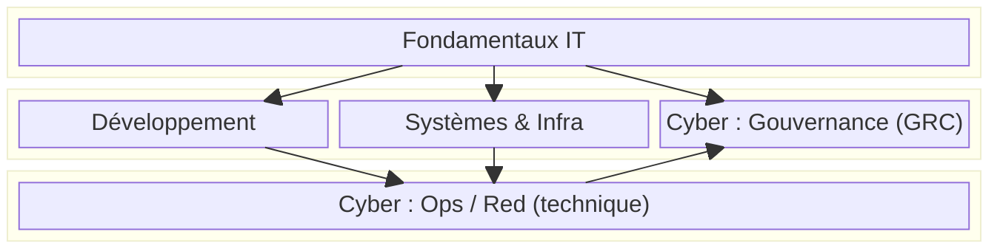

# Block Diagram (vue macro)

!!! note "Importance"
    Le block diagram est adapté aux vues macro : dépendances entre domaines, chaînes de valeur, flux entre briques. Il est utile lorsque l'on souhaite exprimer une structure haut niveau sans entrer dans le détail des échanges entre composants.

## Cas d'utilisation

| Domaine | Pertinence | Contexte |
|---|:---:|---|
| Architecture SI[^1] | 🔴 Critique | Vue macro d'un système, dépendances entre domaines fonctionnels |
| Parcours pédagogiques | 🟠 Élevé | Structuration d'une progression, enchaînement de blocs thématiques |
| Cyber gouvernance | 🟠 Élevé | Cartographie de programmes de sécurité, chaînes de conformité |
| Pilotage | 🟡 Modéré | Représentation des dépendances entre chantiers ou équipes |

## Exemple de diagramme

Le block diagram organise les éléments en colonnes via `columns`. Chaque `block` regroupe des nœuds qui appartiennent au même niveau logique. Les flèches `-->` entre nœuds de blocs différents permettent d'exprimer les dépendances de progression ou de flux.

_Ce schéma formalise une progression : socle commun, spécialisations parallèles, convergence technique, puis renforcement GRC[^2]._

 

---

!!! info "Lien officiel : [https://mermaid.js.org/syntax/block.html](https://mermaid.js.org/syntax/block.html)"

 

[^1]: **SI** — Système d'Information. Ensemble des ressources humaines, techniques et organisationnelles permettant de collecter, stocker, traiter et diffuser l'information au sein d'une organisation.
[^2]: **GRC** — Governance, Risk and Compliance. Ensemble des pratiques visant à aligner la gouvernance de la sécurité, la gestion des risques et la conformité réglementaire au sein d'une organisation.