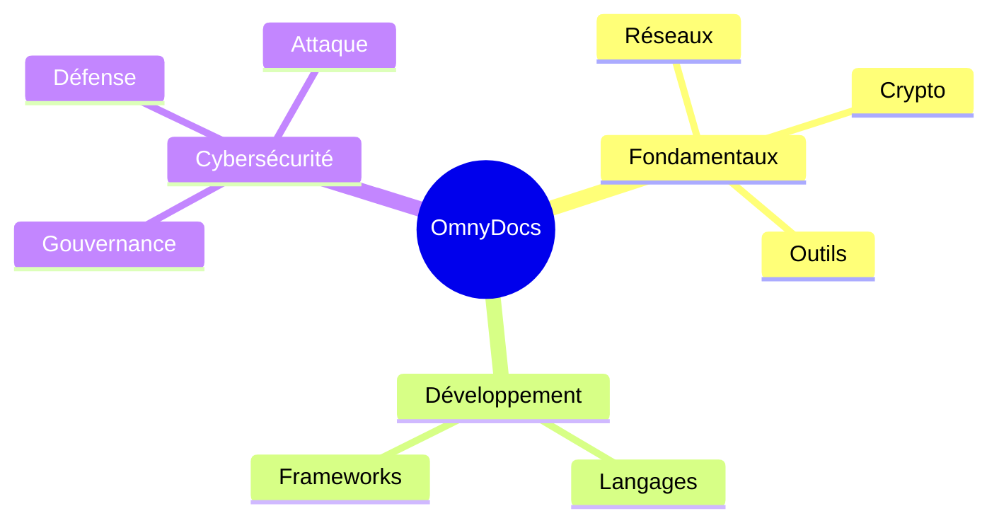

# Mindmap (structuration)

!!! note "Importance"
    La mindmap aide à structurer des concepts : chapitres, thèmes, dépendances pédagogiques. Elle est efficace pour une vue d'ensemble rapide d'un corpus ou d'un domaine. Son support dépend de la version Mermaid exposée par le renderer — à valider sous Zensical.

!!! quote "Analogie pédagogique"
    _Apprendre la syntaxe de ce diagramme, c'est comme apprendre un nouveau vocabulaire : cela vous permet d'exprimer des idées complexes de manière concise et visuelle._

## Cas d'utilisation

| Domaine | Pertinence | Contexte |
|---|:---:|---|
| Fondamentaux IT | 🟠 Élevé | Cartographie des concepts clés d'un domaine, arbre de prérequis |
| Développement | 🟠 Élevé | Vue d'ensemble d'une stack, dépendances entre technologies |
| Cyber gouvernance | 🟡 Modéré | Arborescence des référentiels (ISO, NIST, RGPD), périmètres de contrôle |
| Synthèses | 🟡 Modéré | Résumé visuel d'un chapitre ou d'un parcours d'apprentissage |

## Exemple de diagramme

La mindmap Mermaid utilise l'indentation pour définir la hiérarchie — chaque niveau indenté devient un nœud enfant du niveau supérieur. Le nœud racine est encadré par `((...))` pour le distinguer visuellement.

_Ce schéma structure le corpus documentaire d'OmnyDocs sous forme d'arbre conceptuel à trois niveaux._

 

---

## Conclusion

!!! quote "Ce qu'il faut retenir"
    La maîtrise de ce diagramme enrichit considérablement la clarté de votre documentation. Utilisez-le dès qu'une explication textuelle devient trop dense.

 

---

!!! info "Lien officiel : [https://mermaid.js.org/syntax/mindmap.html](https://mermaid.js.org/syntax/mindmap.html)"

 