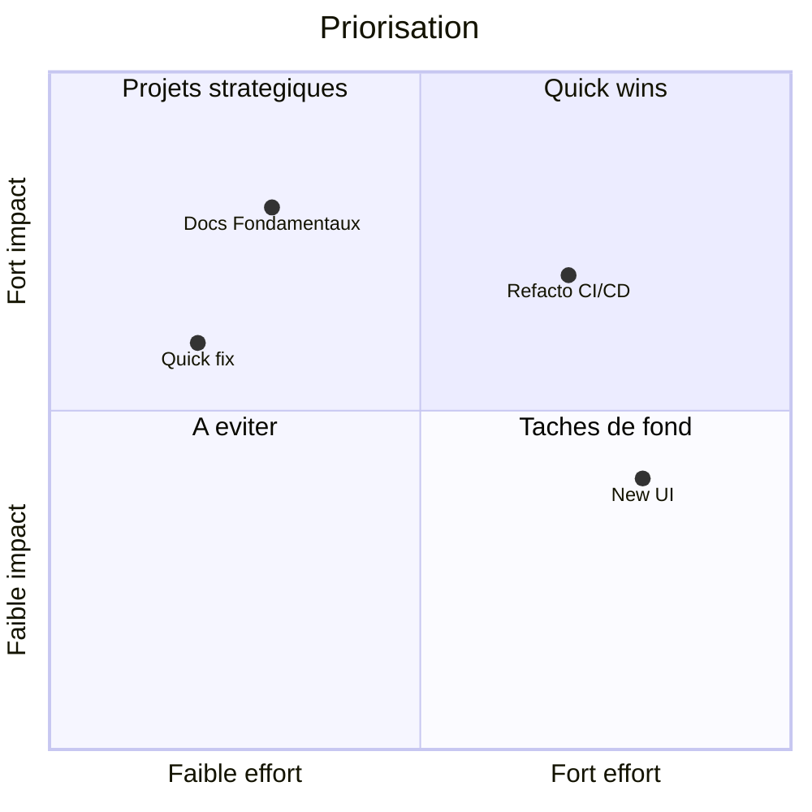

# Quadrant Chart (priorisation)

!!! note "Importance"
    Le quadrant chart sert à prioriser : effort vs impact, risque vs valeur, urgence vs importance. C'est utile pour arbitrer des chantiers et communiquer une logique de décision sans surcharger en texte.

## Cas d'utilisation

| Domaine | Pertinence | Contexte |
|---|:---:|---|
| Cyber gouvernance | 🔴 Critique | Priorisation des risques, arbitrage des plans de remédiation |
| Pilotage produit | 🟠 Élevé | Positionnement des fonctionnalités selon effort et valeur métier |
| Gestion de projet | 🟠 Élevé | Arbitrage des chantiers, communication de la logique de décision |
| DevSecOps | 🟡 Modéré | Priorisation des dettes techniques et des correctifs de sécurité |

## Exemple de diagramme

Les coordonnées de chaque point s'expriment en valeurs normalisées entre 0 et 1 sur les deux axes — `[x, y]`. Les labels des quadrants se déclarent dans l'ordre : haut-droite (`quadrant-1`), haut-gauche (`quadrant-2`), bas-gauche (`quadrant-3`), bas-droite (`quadrant-4`).

_Ce schéma positionne quatre initiatives selon leur effort et leur impact pour guider la décision de priorisation._

 

---

!!! info "Lien officiel : [https://mermaid.js.org/syntax/quadrantChart.html](https://mermaid.js.org/syntax/quadrantChart.html)"

 