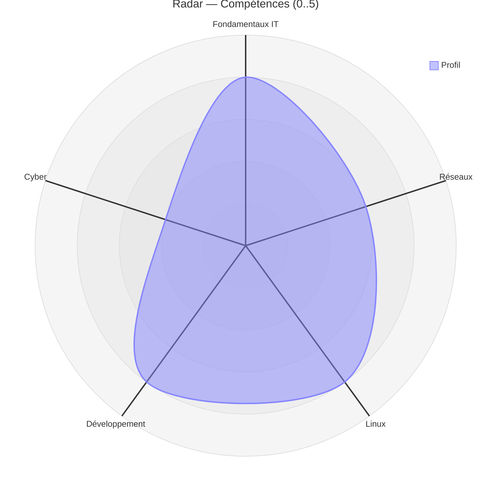

# Radar (compétences multi-axes)

!!! note "Importance"
    Le radar permet de représenter une matrice de compétences multi-axes sur une échelle normalisée. C'est utile pour comparer des profils, matérialiser une progression ou exposer un objectif cible par domaine. Il est utilisé dans OmnyDocs pour les diagrammes de compétences par parcours.

## Cas d'utilisation

| Domaine | Pertinence | Contexte |
|---|:---:|---|
| Parcours pédagogiques | 🔴 Critique | Visualisation d'un profil de compétences, comparaison entre parcours |
| Évaluation | 🟠 Élevé | Positionnement d'un apprenant sur plusieurs axes, objectif cible |
| Cyber gouvernance | 🟠 Élevé | Mesure de maturité sécurité par domaine (CMMI[^1], ISO 27001[^2]) |
| Pilotage RH[^3] | 🟡 Modéré | Cartographie des compétences d'une équipe, identification des lacunes |

## Exemple de diagramme (0..5)

La syntaxe `radar-beta` est obligatoire — la version stable n'est pas encore disponible. Chaque `axis` déclare un axe nommé, et chaque `curve` associe un label à un jeu de valeurs ordonnées correspondant aux axes déclarés. Les paramètres `max`, `min` et `ticks` définissent l'échelle de rendu.

_Ce schéma positionne un profil sur cinq axes techniques avec une échelle de 0 à 5._

 

---

!!! info "Lien officiel : [https://mermaid.js.org/syntax/radar.html](https://mermaid.js.org/syntax/radar.html)"

 

[^1]: **CMMI** — Capability Maturity Model Integration. Modèle d'évaluation de la maturité des processus organisationnels, utilisé en sécurité pour mesurer le niveau de maîtrise des pratiques sur une échelle de 1 à 5.
[^2]: **ISO 27001** — Norme internationale définissant les exigences d'un Système de Management de la Sécurité de l'Information (SMSI). Elle fournit un cadre pour identifier, gérer et réduire les risques liés à la sécurité de l'information.
[^3]: **RH** — Ressources Humaines. Désigne la fonction organisationnelle chargée de la gestion du personnel, incluant le recrutement, la formation, l'évaluation des compétences et la gestion des carrières.