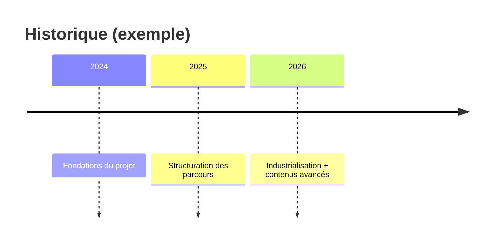

# Timeline (évolution)

!!! note "Importance"
    La timeline sert à représenter une évolution dans le temps : projet, programme, conformité. Elle donne une lecture historique utile pour contextualiser une décision, une refonte ou une montée en maturité sur un axe temporel.

## Cas d'utilisation

| Domaine | Pertinence | Contexte |
|---|:---:|---|
| Cyber gouvernance | 🔴 Critique | Historique d'un programme de conformité, jalons réglementaires, plan de remédiation |
| Gestion de projet | 🟠 Élevé | Chronologie des phases, jalons de livraison, contexte d'une décision |
| Documentation produit | 🟠 Élevé | Historique des versions, évolution d'une architecture ou d'un périmètre |
| Traçabilité | 🟡 Modéré | Chronologie d'un incident, séquence d'événements pour un rapport forensic[^1] |

## Exemple de diagramme

La timeline Mermaid structure les événements par section temporelle. Chaque entrée suit le format `section : événement`. Plusieurs événements peuvent être associés à la même section en les séparant par des virgules ou en les déclarant sur des lignes distinctes.

_Ce schéma présente une chronologie structurée par années avec un événement marquant par période._

 

---

!!! info "Lien officiel : [https://mermaid.js.org/syntax/timeline.html](https://mermaid.js.org/syntax/timeline.html)"

 

[^1]: **Forensic** — Analyse numérique légale (aussi appelée DFIR : Digital Forensics and Incident Response). Discipline consistant à collecter, préserver et analyser des preuves numériques dans le cadre d'une investigation post-incident.