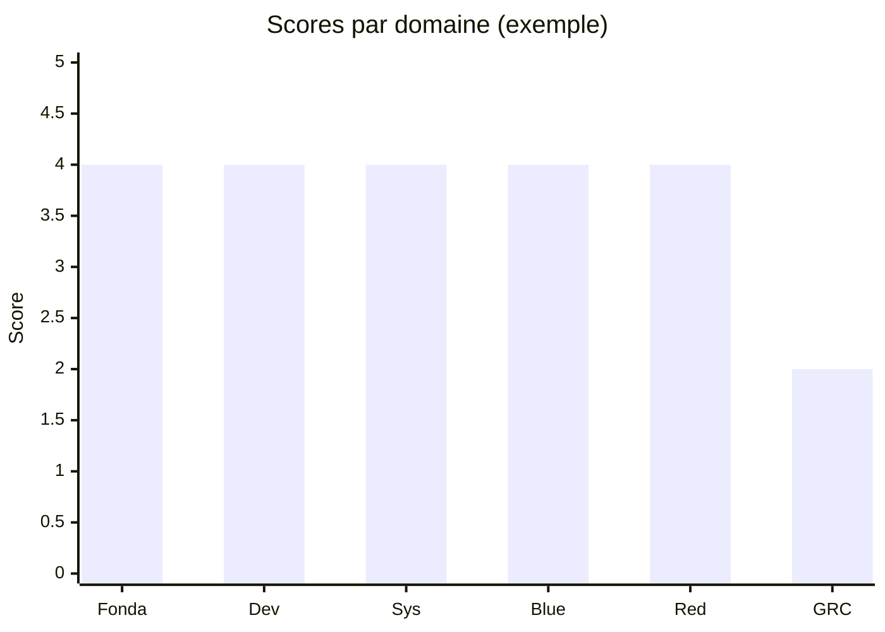

# XY Chart (beta)

!!! note "Importance"
    Le XY chart est utile pour représenter rapidement des scores ou des mesures simples : comparaisons, évolutions, benchmarks. Son support est variable car la syntaxe est encore en version bêta — ce fichier sert précisément à valider le rendu sous Zensical.

## Cas d'utilisation

| Domaine | Pertinence | Contexte |
|---|:---:|---|
| Métriques | 🟠 Élevé | Visualisation de scores par domaine, indicateurs de couverture |
| Benchmarks | 🟠 Élevé | Comparaison de niveaux entre profils, environnements ou versions |
| Pilotage | 🟡 Modéré | Représentation d'une progression dans le temps sur un axe quantitatif |
| Tests de compatibilité | 🔴 Critique | Validation du support `xychart-beta` par le renderer Zensical |

## Exemple de diagramme

Le XY chart Mermaid supporte deux types de séries : `bar` pour les barres et `line` pour les courbes. Les axes `x-axis` et `y-axis` acceptent respectivement des labels textuels et une plage numérique. La syntaxe `xychart-beta` est obligatoire — la version stable n'est pas encore disponible.

<em>Ce schéma compare des scores par domaine sur une échelle de 0 à 5 — représentation alternative à un radar pour une lecture plus linéaire.</em>

 

---

!!! info "Lien officiel : [https://mermaid.js.org/syntax/xyChart.html](https://mermaid.js.org/syntax/xyChart.html)"

 