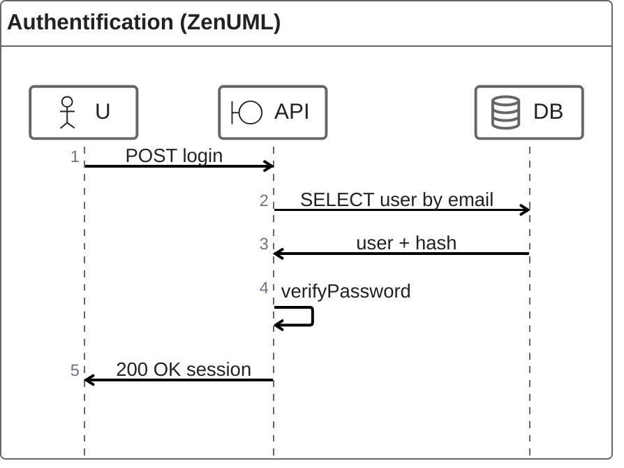

# ZenUML (séquence orientée scénario)

!!! note "Importance"
    ZenUML propose une variante narrative des diagrammes de séquence. C'est adapté lorsque l'on souhaite un rendu lisible avec des stéréotypes d'acteurs (boundary, contrôle, base de données) sans alourdir la syntaxe. Le support dépend du renderer — à valider sous Zensical.

## Cas d'utilisation

| Domaine | Pertinence | Contexte |
|---|:---:|---|
| Développement | 🟠 Élevé | Cas d'usage applicatifs, scénarios narratifs orientés acteur |
| API[^1] | 🟠 Élevé | Documentation des flux d'appel avec stéréotypes boundary/contrôle |
| Authentification & IAM[^2] | 🟠 Élevé | Scénarios de login, MFA[^3], gestion de session avec acteurs typés |
| Cyber technique | 🟡 Modéré | Représentation narrative d'un scénario d'attaque ou d'incident |

## Exemple de diagramme

ZenUML introduit des stéréotypes d'acteurs via les annotations `@Actor`, `@Boundary`, `@Database` et `@Control`. Ces annotations correspondent aux stéréotypes UML[^4] standard et permettent de différencier visuellement les rôles de chaque participant sans surcharger le diagramme.

<em>Ce schéma décrit un scénario narratif d'authentification : requête, lecture base, vérification du mot de passe, puis réponse applicative.</em>

 

---

!!! info "Lien officiel : [https://mermaid.js.org/syntax/zenuml.html](https://mermaid.js.org/syntax/zenuml.html)"

 

[^1]: **API** — Application Programming Interface. Interface permettant à deux applications de communiquer entre elles selon un contrat défini (endpoints, méthodes, formats de données).
[^2]: **IAM** — Identity and Access Management. Ensemble des processus et outils permettant de gérer les identités numériques et de contrôler les droits d'accès aux ressources d'un système.
[^3]: **MFA** — Multi-Factor Authentication. Mécanisme d'authentification exigeant au moins deux facteurs de vérification distincts (mot de passe, OTP, biométrie) pour accéder à un système.
[^4]: **UML** — Unified Modeling Language. Langage de modélisation standardisé utilisé pour représenter la structure et le comportement d'un système logiciel via des diagrammes normalisés.