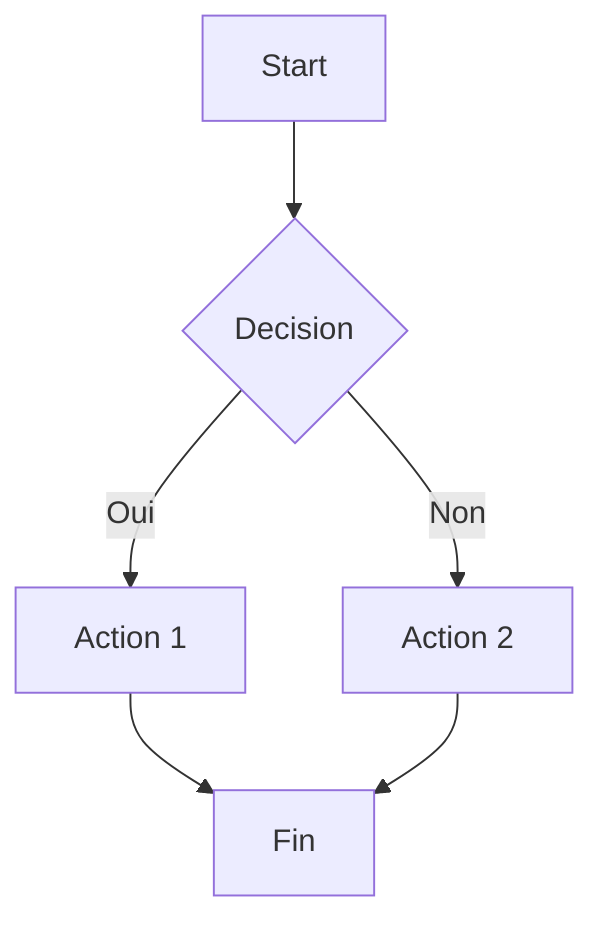

# Flowchart (fondamental)

!!! note "Importance"
    Le flowchart est le diagramme le plus utilisé en documentation technique. Il sert à décrire un enchaînement logique, un workflow applicatif, une procédure d'exploitation, ou une démarche de réponse à incident, avec un niveau de détail immédiatement lisible.

!!! quote "Analogie pédagogique"
    _Apprendre la syntaxe de ce diagramme, c'est comme apprendre un nouveau vocabulaire : cela vous permet d'exprimer des idées complexes de manière concise et visuelle._

## Cas d'utilisation

| Domaine | Pertinence | Contexte |
|---|:---:|---|
| Développement | 🟠 Élevé | Documentation de workflows applicatifs, logique métier, pipelines CI/CD |
| Systèmes & Réseau | 🟠 Élevé | Procédures d'exploitation, runbooks, arbres de décision d'incident |
| Cyber technique | 🟠 Élevé | Démarches de triage, chaînes d'exploitation, réponse à incident |
| Cyber gouvernance | 🟡 Modéré | Processus de conformité, chaînes de validation, flux d'audit |

## Exemple de diagramme (TB)

Le flowchart en orientation `TB` (top to bottom) est la forme la plus lisible pour un flux linéaire avec embranchements. Il convient à tout processus dont les étapes s'enchaînent du haut vers le bas avec des décisions intermédiaires.

<em>Ce schéma illustre un flux décisionnel simple avec embranchement conditionnel et sortie unique.</em>

 

---

## Conclusion

!!! quote "Ce qu'il faut retenir"
    La maîtrise de ce diagramme enrichit considérablement la clarté de votre documentation. Utilisez-le dès qu'une explication textuelle devient trop dense.

 

---

!!! info "Lien officiel : [https://mermaid.js.org/syntax/flowchart.html](https://mermaid.js.org/syntax/flowchart.html)"

 