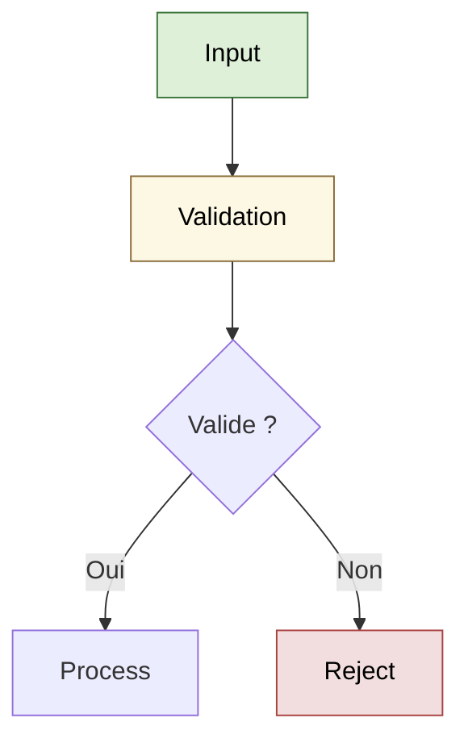

# Flowchart — Styles & Classes

!!! note "Importance"
    Les styles et classes permettent de normaliser la lecture d'un diagramme : états OK/Warning/Erreur, composants critiques, chemins à risque. C'est particulièrement utile en runbook, triage ou documentation sécurité où la signalétique visuelle accélère la prise de décision.

!!! quote "Analogie pédagogique"
    _Apprendre la syntaxe de ce diagramme, c'est comme apprendre un nouveau vocabulaire : cela vous permet d'exprimer des idées complexes de manière concise et visuelle._

## Cas d'utilisation

| Domaine | Pertinence | Contexte |
|---|:---:|---|
| Systèmes & Réseau | 🔴 Critique | Runbooks, procédures de triage, états de supervision |
| Cyber technique | 🔴 Critique | Chemins d'exploitation, composants vulnérables, flux de réponse à incident |
| Développement | 🟠 Élevé | Validation de données, états de pipeline CI/CD, résultats de tests |
| Cyber gouvernance | 🟡 Modéré | Statuts de conformité, avancement d'audit, niveaux de risque |

## Exemple de diagramme (classDef)

Le bloc `classDef` définit un style nommé réutilisable sur n'importe quel nœud via `class`. Cette approche est préférable aux styles inline (`style A fill:...`) car elle centralise la définition et garantit une cohérence visuelle sur l'ensemble du diagramme.

_Ce schéma applique des styles différenciés pour guider la lecture : vert (OK), jaune (avertissement), rouge (erreur)._

 

---

## Conclusion

!!! quote "Ce qu'il faut retenir"
    La maîtrise de ce diagramme enrichit considérablement la clarté de votre documentation. Utilisez-le dès qu'une explication textuelle devient trop dense.

 

---

!!! info "Lien officiel : [https://mermaid.js.org/syntax/flowchart.html](https://mermaid.js.org/syntax/flowchart.html)"

 