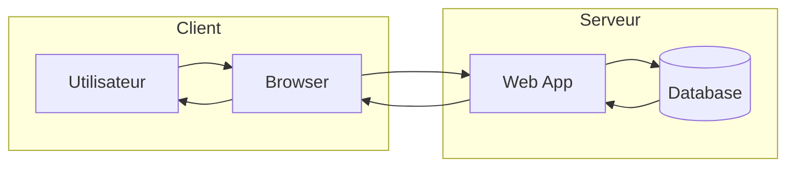

# Flowchart — Subgraph

!!! note "Importance"
    Les subgraphs permettent d'introduire des zones fonctionnelles (**client/serveur**, **LAN/DMZ**, **équipes**, **environnements**) tout en conservant la lisibilité du flowchart. C'est utile pour clarifier une frontière de responsabilité ou une séparation d'architecture sans recourir à un diagramme plus complexe.

!!! quote "Analogie pédagogique"
    _Apprendre la syntaxe de ce diagramme, c'est comme apprendre un nouveau vocabulaire : cela vous permet d'exprimer des idées complexes de manière concise et visuelle._

## Cas d'utilisation

| Domaine | Pertinence | Contexte |
|---|:---:|---|
| Développement | 🟠 Élevé | Séparation frontend/backend, microservices, environnements (dev/prod) |
| Systèmes & Réseau | 🔴 Critique | Architecture réseau en zones (LAN, DMZ, WAN), segmentation |
| Cyber technique | 🟠 Élevé | Cartographie d'infrastructure cible, zones de confiance, périmètres |
| Architecture SI | 🔴 Critique | Vue d'ensemble des composants par domaine fonctionnel ou équipe |

## Exemple de diagramme (flowchart + subgraph)

L'orientation `LR` (left to right) est privilégiée avec les subgraphs car elle met en évidence la séparation entre zones de manière naturelle — le flux progresse de gauche à droite à travers les frontières définies.

_Ce schéma illustre un échange client/serveur en séparant clairement les zones fonctionnelles._

 

---

## Conclusion

!!! quote "Ce qu'il faut retenir"
    La maîtrise de ce diagramme enrichit considérablement la clarté de votre documentation. Utilisez-le dès qu'une explication textuelle devient trop dense.

 

---

!!! info "Lien officiel : [https://mermaid.js.org/syntax/flowchart.html](https://mermaid.js.org/syntax/flowchart.html)"

 