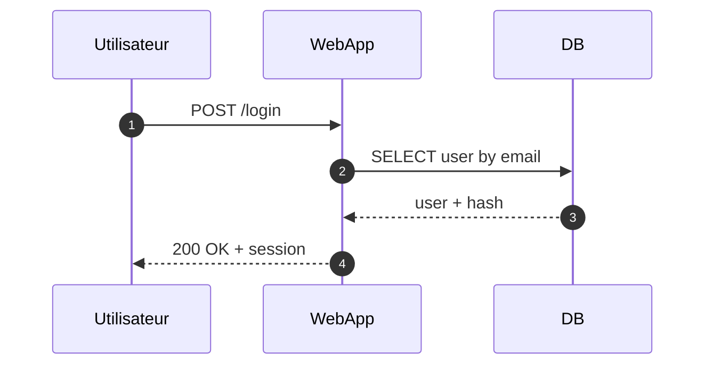

# Séquence (fondamental)

!!! note "Importance"
    Le diagramme de séquence est indispensable pour comprendre l'ordre des échanges entre acteurs et composants (client, API, base de données, services). Il est particulièrement efficace pour documenter une authentification, un appel API, un traitement asynchrone, ou un scénario d'incident.

!!! quote "Analogie pédagogique"
    _Apprendre la syntaxe de ce diagramme, c'est comme apprendre un nouveau vocabulaire : cela vous permet d'exprimer des idées complexes de manière concise et visuelle._

## Cas d'utilisation

| Domaine | Pertinence | Contexte |
|---|:---:|---|
| Développement | 🟠 Élevé | Documentation des flux applicatifs, appels API, gestion de sessions |
| Systèmes & Réseau | 🟠 Élevé | Échanges entre services, protocoles réseau, flux d'authentification |
| Cyber technique | 🟠 Élevé | Scénarios d'incident, chronologie d'attaque, réponse à incident |
| API | 🔴 Critique | Référence principale pour documenter les contrats d'interface et les échanges REST |

## Exemple de diagramme (autonumber)

L'option `autonumber` numérote automatiquement chaque échange, ce qui facilite la référence à une étape précise dans un commentaire ou un rapport. Elle est particulièrement utile lorsque le diagramme accompagne une procédure ou un audit.

_Ce diagramme décrit la chronologie d'un login : requête, accès base, puis réponse applicative._

 

---

## Conclusion

!!! quote "Ce qu'il faut retenir"
    La maîtrise de ce diagramme enrichit considérablement la clarté de votre documentation. Utilisez-le dès qu'une explication textuelle devient trop dense.

 

---

!!! info "Lien officiel : [https://mermaid.js.org/syntax/sequenceDiagram.html](https://mermaid.js.org/syntax/sequenceDiagram.html)"

 