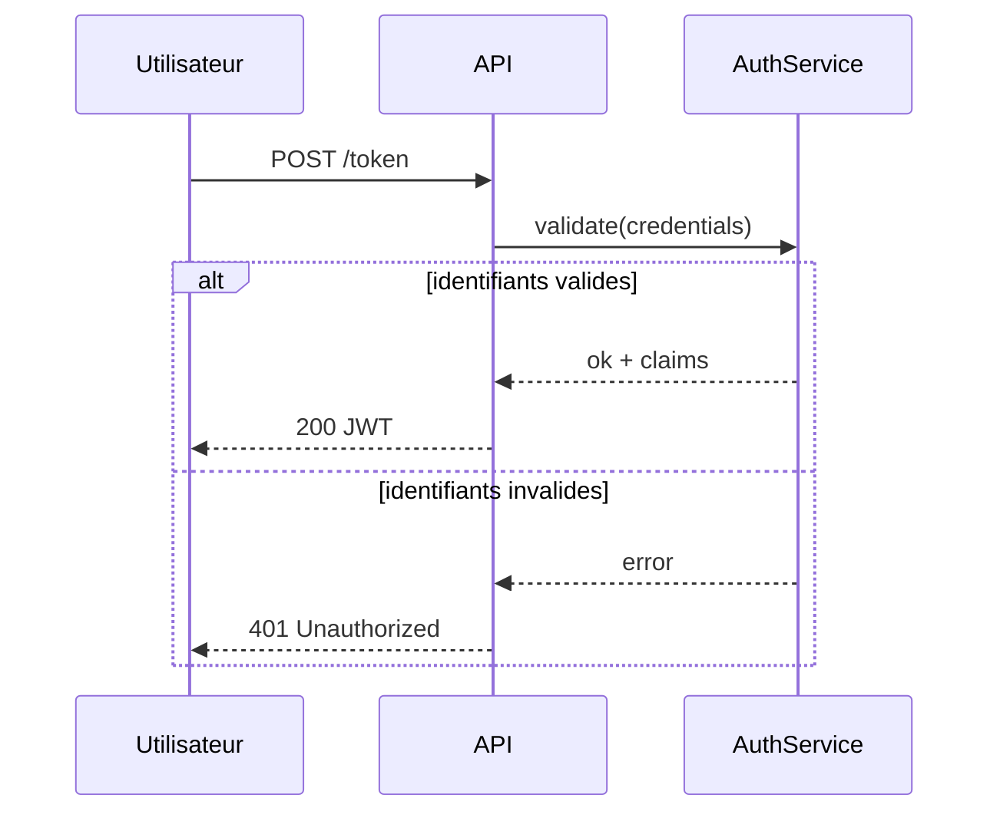

# Séquence — Alt / Else

!!! note "Importance"
    Les blocs `alt/else` sont essentiels pour documenter des scénarios conditionnels : **succès/échec**, **autorisé/refusé**, **timeout/réessai**. En sécurité, c'est particulièrement utile pour formaliser des contrôles d'authentification, de MFA ou de politique d'accès.

## Cas d'utilisation

| Domaine | Pertinence | Contexte |
|---|:---:|---|
| Développement | 🟠 Élevé | Gestion des branches succès/erreur dans les flux applicatifs |
| API | 🔴 Critique | Documentation des codes de retour HTTP selon les cas d'usage |
| Cyber technique | 🟠 Élevé | Formalisation des contrôles d'accès, scénarios d'attaque conditionnels |
| Authentification & IAM | 🔴 Critique | Modélisation des flux MFA, SSO, politique d'accès conditionnel |

## Exemple de diagramme (alt/else)

Le bloc `alt` introduit un embranchement conditionnel nommé dans le diagramme de séquence. Contrairement au flowchart, la condition est lisible directement dans le flux — ce qui le rend particulièrement adapté à la documentation de contrats d'API ou de politiques de sécurité.

_Ce schéma formalise deux issues possibles d'une demande de token : succès ou refus, avec réponses distinctes._

 

---

!!! info "Lien officiel : [https://mermaid.js.org/syntax/sequenceDiagram.html](https://mermaid.js.org/syntax/sequenceDiagram.html)"

 