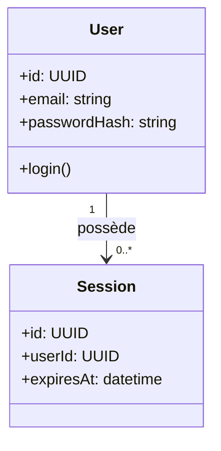

# Class Diagram (UML)

!!! note "Importance"
    Le class diagram documente la structure objet : entités, attributs, opérations et relations. C'est un support central pour expliciter un modèle de domaine, clarifier une architecture orientée objet, et sécuriser la cohérence entre conception et implémentation.

!!! quote "Analogie pédagogique"
    _Apprendre la syntaxe de ce diagramme, c'est comme apprendre un nouveau vocabulaire : cela vous permet d'exprimer des idées complexes de manière concise et visuelle._

## Cas d'utilisation

| Domaine | Pertinence | Contexte |
|---|:---:|---|
| Développement | 🔴 Critique | Modélisation des entités métier, documentation du code orienté objet |
| Architecture logicielle | 🔴 Critique | Représentation des dépendances entre composants, contrats d'interface |
| Conception | 🟠 Élevé | Alignement équipe sur le modèle de domaine avant implémentation |
| Cyber gouvernance | 🟡 Modéré | Modélisation des responsabilités, objets de contrôle, périmètres d'audit |

## Exemple de diagramme

Le class diagram Mermaid utilise la syntaxe `+` pour les membres publics, `-` pour les privés et `#` pour les protégés — cohérent avec la notation UML standard. Les cardinalités (`"1"`, `"0..*"`) se placent directement sur les flèches de relation.

_Ce schéma représente une relation un-à-plusieurs entre un utilisateur et ses sessions._

 

---

## Conclusion

!!! quote "Ce qu'il faut retenir"
    La maîtrise de ce diagramme enrichit considérablement la clarté de votre documentation. Utilisez-le dès qu'une explication textuelle devient trop dense.

 

---

!!! info "Lien officiel : [https://mermaid.js.org/syntax/classDiagram.html](https://mermaid.js.org/syntax/classDiagram.html)"

 