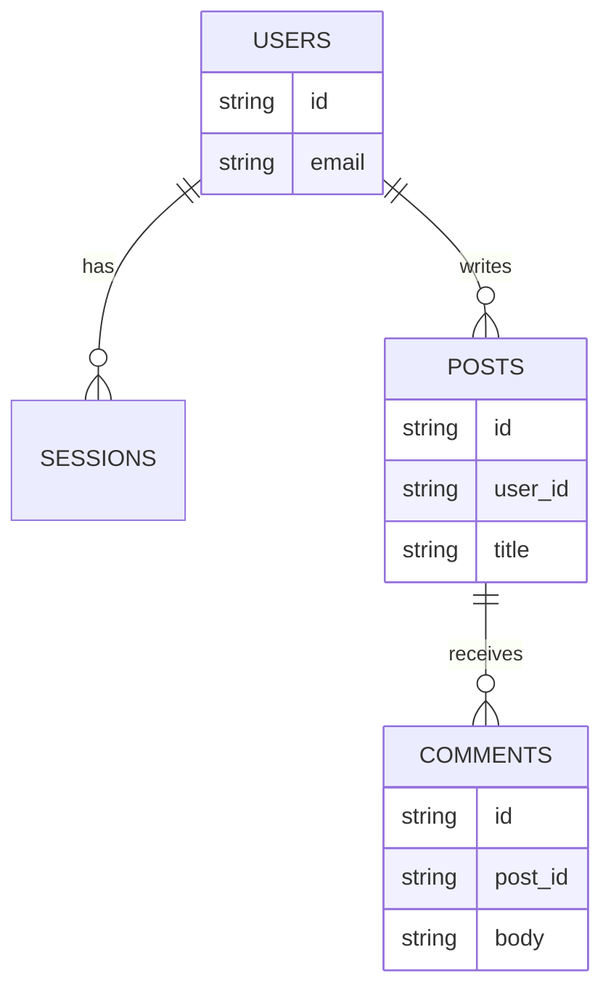

# ER Diagram (modèle de données)

!!! note "Importance"
    L'ER diagram formalise un modèle relationnel : tables, relations et cardinalités. Il permet de vérifier la cohérence du schéma, d'anticiper l'intégrité référentielle, et d'aligner équipe dev, DBA et sécurité sur une même représentation.

!!! quote "Analogie pédagogique"
    _Apprendre la syntaxe de ce diagramme, c'est comme apprendre un nouveau vocabulaire : cela vous permet d'exprimer des idées complexes de manière concise et visuelle._

## Cas d'utilisation

| Domaine | Pertinence | Contexte |
|---|:---:|---|
| Développement | 🔴 Critique | Documentation du schéma de base de données, migrations, contraintes |
| Base de données | 🔴 Critique | Référence principale pour la conception et la revue de schéma relationnel |
| Architecture SI | 🟠 Élevé | Cartographie des flux de données entre composants d'un système |
| Cyber technique | 🟡 Modéré | Analyse d'impact sur les données, forensic, identification des tables sensibles |

## Exemple de diagramme

La notation Mermaid pour les ER diagrams utilise des symboles de cardinalité crow's foot : `||--o{` signifie "un et un seul vers zéro ou plusieurs". Les attributs déclarés dans chaque entité permettent de documenter le type de données directement dans le schéma.

_Ce schéma modélise un **SI**[^1] minimal : utilisateurs, contenus et commentaires avec leurs relations._

 

---

## Conclusion

!!! quote "Ce qu'il faut retenir"
    La maîtrise de ce diagramme enrichit considérablement la clarté de votre documentation. Utilisez-le dès qu'une explication textuelle devient trop dense.

 

---

!!! info "Lien officiel : [https://mermaid.js.org/syntax/entityRelationshipDiagram.html](https://mermaid.js.org/syntax/entityRelationshipDiagram.html)"

 

[^1]: **SI** — Système d'Information. Désigne l'ensemble des ressources (humaines, techniques, organisationnelles) permettant de collecter, stocker, traiter et diffuser l'information au sein d'une organisation.