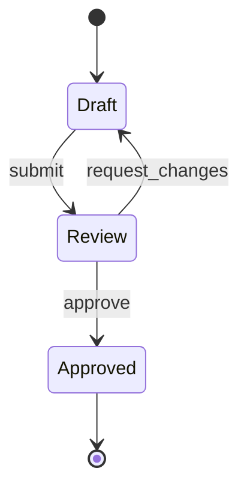

# State Diagram (cycle de vie)

!!! note "Importance"
    Le state diagram est adapté pour représenter un cycle de vie et ses transitions. Il clarifie les états possibles d'un objet (ticket, commande, incident) et les événements déclencheurs. Il est particulièrement utile pour éviter les états implicites ou non gérés dans un workflow.

## Cas d'utilisation

| Domaine | Pertinence | Contexte |
|---|:---:|---|
| Développement | 🔴 Critique | Cycle de vie des entités métier, machines à états, gestion des statuts |
| Workflow métier | 🟠 Élevé | Validation, approbation, publication — processus à états multiples |
| Cyber technique | 🟠 Élevé | Gestion d'incidents, cycle de vie d'une alerte SOC, états d'une session |
| Cyber gouvernance | 🟡 Modéré | Processus de conformité, états d'un contrôle, avancement d'un audit |

## Exemple de diagramme (v2)

La version `stateDiagram-v2` est recommandée sur `stateDiagram` : elle supporte les états composites, les notes et une syntaxe plus lisible. Le pseudo-état `[*]` représente le point d'entrée et de sortie du cycle de vie.

_Ce schéma décrit un cycle de validation avec retour arrière possible via une demande de modifications._

 

---

!!! info "Lien officiel : [https://mermaid.js.org/syntax/stateDiagram.html](https://mermaid.js.org/syntax/stateDiagram.html)"

 