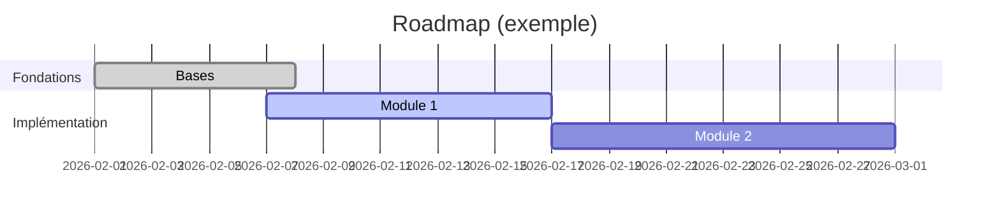

# Gantt (planification)

!!! note "Importance"
    Le Gantt sert à planifier une roadmap : jalons, dépendances implicites et phases. Il est pertinent pour cadrer un projet, synchroniser plusieurs équipes et rendre visible une trajectoire dans le temps.

## Cas d'utilisation

| Domaine | Pertinence | Contexte |
|---|:---:|---|
| Gestion de projet | 🔴 Critique | Roadmap, jalons, phases de livraison, dépendances entre tâches |
| Cyber gouvernance | 🟠 Élevé | Planification d'un plan de remédiation, calendrier de conformité |
| DevSecOps[^1] | 🟠 Élevé | Visualisation des sprints, cycles de release, fenêtres de déploiement |
| Documentation produit | 🟡 Modéré | Communication de la trajectoire produit à une audience non technique |

## Exemple de diagramme

Le Gantt Mermaid utilise `dateFormat` pour définir le format de date attendu dans les déclarations de tâches. Les statuts `done` et `active` colorent automatiquement les barres — utile pour distinguer visuellement ce qui est terminé, en cours ou à venir.

_Ce schéma planifie des phases avec statuts (done/active) et durées exprimées en jours._

 

---

!!! info "Lien officiel : [https://mermaid.js.org/syntax/gantt.html](https://mermaid.js.org/syntax/gantt.html)"

 

[^1]: **DevSecOps** — Pratique d'ingénierie logicielle intégrant la sécurité (Sec) au sein du cycle de développement (Dev) et d'exploitation (Ops), dès les premières phases du projet plutôt qu'en fin de cycle.