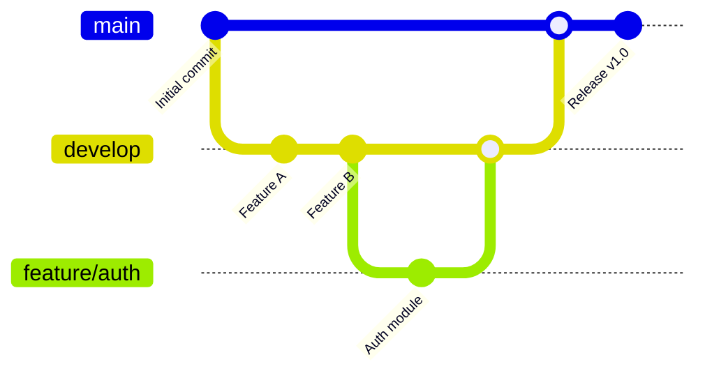

# GitGraph (workflow Git)

!!! note "Importance"
    GitGraph permet de visualiser un workflow de branches, merges et releases. C'est utile pour formaliser une stratégie Git (main/develop/feature/hotfix), expliquer un process d'intégration et réduire les incompréhensions lors des revues et déploiements.

!!! quote "Analogie pédagogique"
    _Apprendre la syntaxe de ce diagramme, c'est comme apprendre un nouveau vocabulaire : cela vous permet d'exprimer des idées complexes de manière concise et visuelle._

## Cas d'utilisation

| Domaine | Pertinence | Contexte |
|---|:---:|---|
| Développement | 🔴 Critique | Documentation de la stratégie de branching, conventions d'équipe |
| DevOps[^1] | 🔴 Critique | Visualisation du pipeline de release, workflows CI/CD[^2] |
| CI/CD | 🟠 Élevé | Représentation des étapes d'intégration et de déploiement continu |
| Cyber gouvernance | 🟡 Modéré | Standardisation des pratiques Git, traçabilité des changements |

## Exemple de diagramme

GitGraph suit la chronologie réelle des opérations Git : `branch`, `checkout`, `commit` et `merge` correspondent exactement aux commandes du CLI[^3]. L'ordre de déclaration dans le diagramme détermine l'ordre visuel des branches.

_Ce schéma illustre une branche feature fusionnée dans develop, puis promue vers main pour une release._

 

---

## Conclusion

!!! quote "Ce qu'il faut retenir"
    La maîtrise de ce diagramme enrichit considérablement la clarté de votre documentation. Utilisez-le dès qu'une explication textuelle devient trop dense.

 

---

!!! info "Lien officiel : [https://mermaid.js.org/syntax/gitgraph.html](https://mermaid.js.org/syntax/gitgraph.html)"

 

[^1]: **DevOps** — Approche organisationnelle et technique visant à rapprocher les équipes de développement (Dev) et d'exploitation (Ops) pour accélérer les cycles de livraison logicielle.
[^2]: **CI/CD** — Continuous Integration / Continuous Deployment. Pratique consistant à automatiser l'intégration du code, les tests et le déploiement en production à chaque modification.
[^3]: **CLI** — Command Line Interface. Interface en ligne de commande permettant d'interagir avec un système ou un outil via des commandes textuelles.