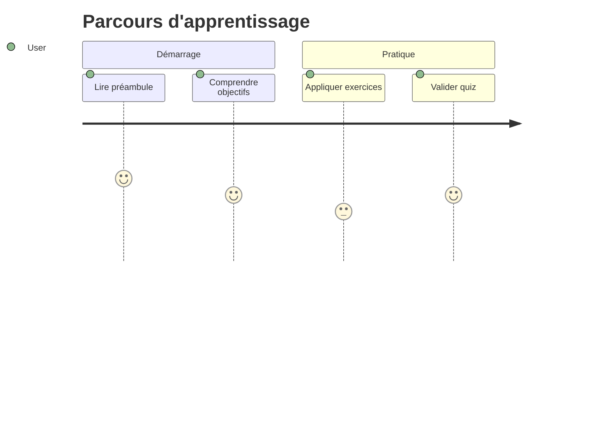

# Journey (parcours utilisateur)

!!! note "Importance"
    Journey permet de décrire un parcours en étapes — utilisateur, apprenant ou intervenant sur incident. C'est utile pour formaliser une progression, mettre en évidence les points de friction et donner une lecture terrain à un processus.

## Cas d'utilisation

| Domaine | Pertinence | Contexte |
|---|:---:|---|
| Développement | 🟠 Élevé | Documentation du parcours UX[^1], onboarding utilisateur, flux d'interaction |
| Systèmes & Réseau | 🟡 Modéré | Runbooks[^2] orientés opérateur, procédures d'exploitation étape par étape |
| Cyber technique | 🟠 Élevé | Parcours d'un IR[^3], chronologie d'un incident du signal à la clôture |
| Pédagogie | 🔴 Critique | Visualisation d'un parcours d'apprentissage, progression par phases |

## Exemple de diagramme

La valeur numérique associée à chaque étape (de 1 à 5) représente le niveau de satisfaction ou d'effort perçu à ce moment du parcours. Elle ne constitue pas une note de qualité, mais un indicateur de charge cognitive ou de ressenti — utile pour identifier les étapes à simplifier.

_Ce schéma décrit un parcours en deux phases avec un indicateur de charge par étape._

 

---

!!! info "Lien officiel : [https://mermaid.js.org/syntax/journey.html](https://mermaid.js.org/syntax/journey.html)"

 

[^1]: **UX** — User Experience. Désigne la qualité de l'expérience vécue par un utilisateur lors de son interaction avec un produit ou une interface.
[^2]: **Runbook** — Document opérationnel décrivant les procédures à suivre pas à pas pour accomplir une tâche d'exploitation ou répondre à un incident.
[^3]: **IR** — Incident Response. Processus structuré de détection, d'analyse, de confinement et de remédiation d'un incident de sécurité.