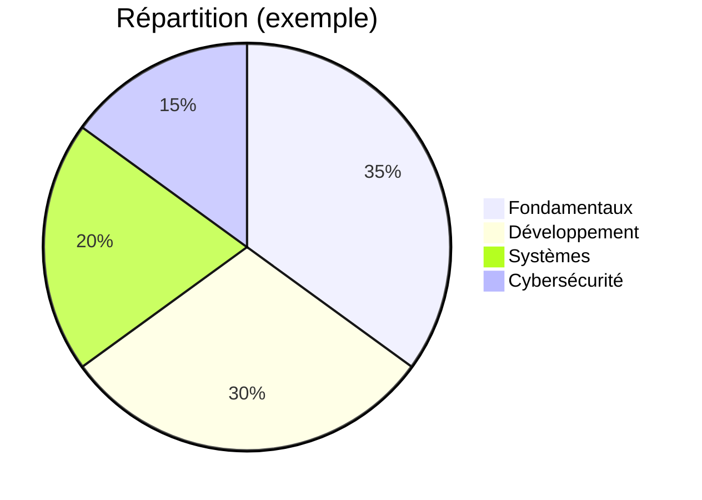

# Pie Chart (répartition)

!!! note "Importance"
    Le pie chart est un support simple de répartition : charges, couverture documentaire, répartition d'efforts. Il ne remplace pas une analyse, mais améliore la lisibilité d'un état macro sans nécessiter de lecture de données brutes.

## Cas d'utilisation

| Domaine | Pertinence | Contexte |
|---|:---:|---|
| Cyber gouvernance | 🟠 Élevé | Répartition du budget sécurité, couverture des contrôles, état de conformité |
| Reporting | 🟠 Élevé | Synthèse visuelle pour une audience dirigeante ou non technique |
| Suivi de contenus | 🟡 Modéré | Proportion de contenus produits par domaine, avancement éditorial |
| Pilotage | 🟡 Modéré | Vue macro d'une répartition d'efforts ou de ressources sur un projet |

## Exemple de diagramme

Le pie chart Mermaid ne supporte pas les données dynamiques — les valeurs sont déclarées statiquement dans le fichier. Il convient donc à des répartitions stables ou à des instantanés périodiques plutôt qu'à des métriques temps réel.

_Ce schéma illustre une répartition proportionnelle entre domaines — les valeurs sont relatives, pas absolues._

 

---

!!! info "Lien officiel : [https://mermaid.js.org/syntax/pie.html](https://mermaid.js.org/syntax/pie.html)"

 