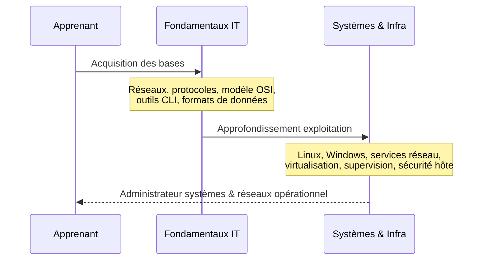
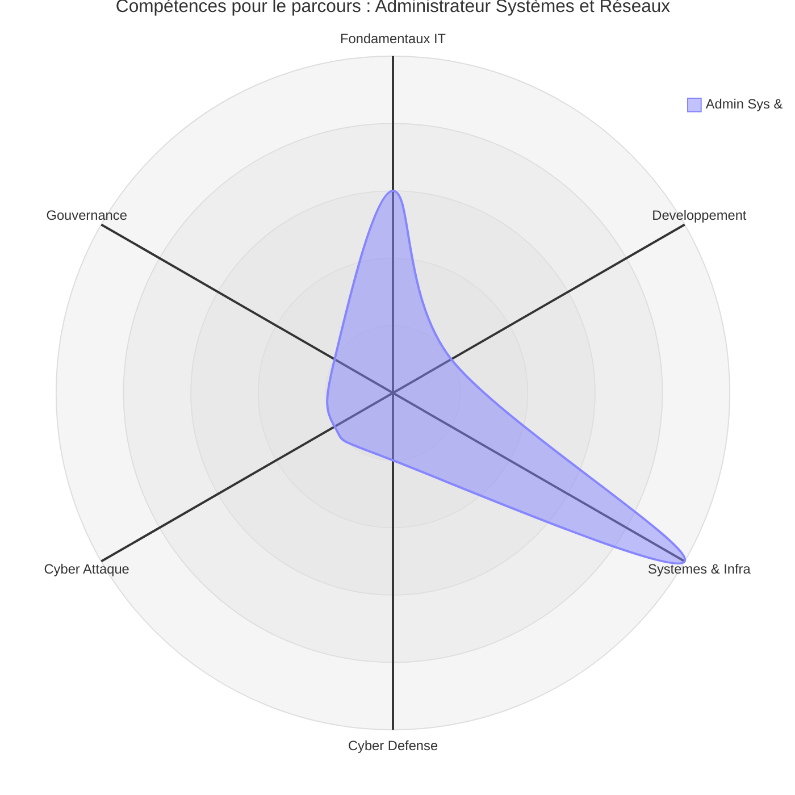
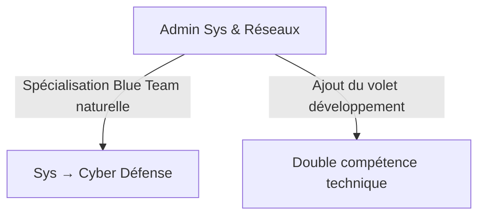

# Parcours — Administrateur Systèmes & Réseaux

!!! note "**Accessibilité : modérée** — _Ce parcours demande de la rigueur sur les concepts réseau et système avant d'être pleinement opérationnel._"

## Que fait ce parcours

Découvrons via ce diagramme de séquence le parcours de l'administrateur systèmes et réseaux.

_Ce parcours cible l'**exploitation** et l'**administration des environnements techniques**. Il couvre l'ensemble des compétences attendues pour gérer un **parc serveur**, des **services réseau** et des **environnements virtualisés** en conditions réelles._

!!! quote "En somme, ce parcours construit une maîtrise complète de l'administration système Linux et Windows, de la gestion des services réseau et de la virtualisation. Il ne suppose aucune connaissance préalable en développement ou en cybersécurité pour être mené à terme."

 

---

## Matrice

La ligne ci-dessous est extraite de la [Matrice de compétences](../matrice.md).  
Elle indique à quel stade chaque niveau de progression est structurant pour ce parcours.

| Domaine | N1 | N2 | N3 | N4 |
|:---|:---:|:---:|:---:|:---:|
| Systèmes & Infrastructure | 🟢 Faible | 🟠 Élevé | 🟠 Élevé | 🟡 Modéré |

**Lecture :** le parcours devient structurant dès le N2. L'entrée en N1 nécessite impérativement de consolider les Fondamentaux IT — en particulier les réseaux, le modèle OSI et les outils CLI — avant d'aborder l'administration système.

 

---

## Heatmap

Les colonnes ci-dessous sont extraites de la [Heatmap de compétences](../heatmap.md).  
Elles indiquent l'intensité attendue sur les compétences transversales directement mobilisées dans ce parcours.

| Compétence | Systèmes & Infra |
|---|:---|
| Logique informatique | 🟠 Élevé |
| Programmation | 🟡 Modéré |
| **Administration Linux** | 🔴 **Critique** |
| **Réseaux** | 🔴 **Critique** |
| Analyse de logs | 🟠 Élevé |
| Tests applicatifs | 🟢 Faible |
| Pentest | 🟡 Modéré |
| Détection / règles | 🟠 Élevé |
| Gestion des risques | 🟡 Modéré |
| Conformité | 🟡 Modéré |

!!! note
    Ce parcours concentre deux compétences critiques : l'**Administration Linux** et les **Réseaux**. Ces deux axes sont non négociables — un administrateur système qui ne maîtrise pas les protocoles réseau ni l'exploitation Linux ne peut pas exercer en conditions réelles. L'analyse de logs et la détection constituent des compétences cœur complémentaires qui préparent naturellement à une extension vers la Cyber Défense.

 

---

## Radar

!!! quote "Note"
    _Le radar ci-dessous illustre la forme du parcours Administrateur Systèmes & Réseaux. Le pic dominant sur l'axe Systèmes & Infra est symétrique à celui du parcours Développeur web sur l'axe Développement. Ces deux profils sont les deux points d'entrée naturels de la documentation._

 

---

## Orientations possibles

Ce parcours constitue la base la plus solide pour évoluer vers la cybersécurité défensive, et une voie crédible vers l'offensif une fois complété par le volet développement.

_L'extension vers la **Cyber Défense** est la plus directe : la maîtrise de l'infrastructure est le prérequis principal de la détection, de la supervision et de la réponse à incident. L'extension vers la **Double compétence technique** est plus exigeante — elle suppose de compléter intégralement le parcours Développeur web avant de converger vers la cybersécurité._

!!! warning "**Accessibilité : avancée à difficile** — Ces deux extensions supposent d'avoir solidement consolidé ce parcours avant de bifurquer."

 

---

## Conclusion

Le parcours Administrateur Systèmes & Réseaux est le symétrique technique du parcours Développeur web.  
Il produit un profil opérationnel sur Linux, Windows et les services réseau, immédiatement applicable en environnement professionnel.

**Point d'entrée recommandé : [Fondamentaux IT](../../bases/index.md) — puis [Systèmes & Infrastructure](../../sys-reseau/index.md).**

!!! note "Pour comparer ce profil avec les autres parcours disponibles, consultez la page [Compréhension](../comprehension.md)."

 