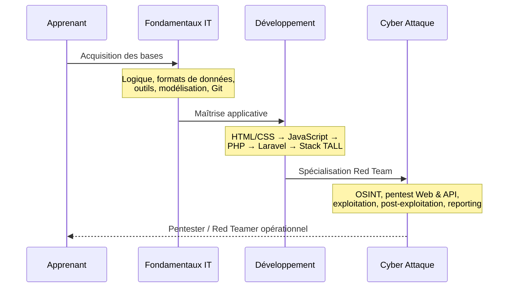
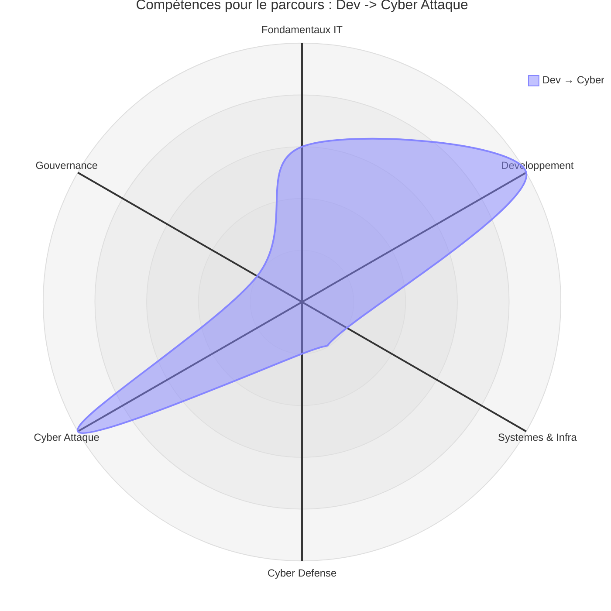
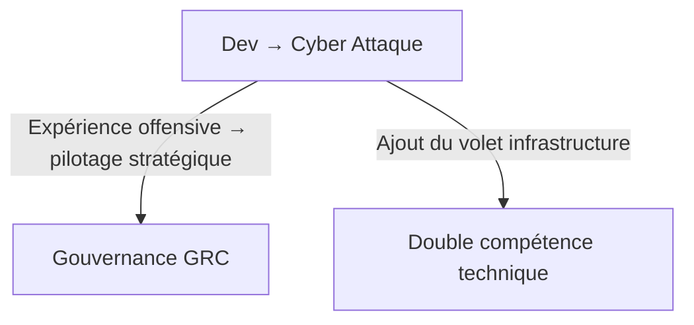

# Parcours — Dev → Cyber Attaque

!!! warning "**Accessibilité : avancée** — _Ce parcours exige une compréhension réelle du code applicatif pour exploiter les vulnérabilités de manière pertinente._"

## Que fait ce parcours

Découvrons via ce diagramme de séquence le parcours orienté Cyber Attaque.

_Ce parcours privilégie la compréhension du code et des vulnérabilités applicatives. Il prépare efficacement aux **tests d'intrusion Web** et **API**, en partant du principe qu'un attaquant qui comprend le code trouve ce que les autres manquent._

!!! quote "En somme, ce parcours est l'extension naturelle du parcours Développeur web vers la sécurité offensive. La maîtrise du développement applicatif est le prérequis direct du pentest Web — on n'exploite correctement que ce que l'on sait construire."

 

---

## Matrice

Les lignes ci-dessous sont extraites de la [Matrice de compétences](../matrice.md).  
Elles indiquent à quel stade chaque niveau de progression est structurant pour ce parcours.

| Domaine | N1 | N2 | N3 | N4 |
|:---|:---:|:---:|:---:|:---:|
| Développement | 🟢 Faible | 🟠 Élevé | 🟠 Élevé | 🟡 Modéré |
| Cyber Attaque (Red / Pentest) | — | 🟡 Modéré | 🟡 Modéré | 🟠 Élevé |

**Lecture :** le domaine Développement doit atteindre le N3 avant que la spécialisation Cyber Attaque ne devienne pleinement structurante. Contrairement à la Cyber Défense, la Red Team monte en puissance progressivement jusqu'au N4 — c'est un domaine qui exige de l'expérience accumulée, pas seulement des connaissances théoriques.

 

---

## Heatmap

Les colonnes ci-dessous sont extraites de la [Heatmap de compétences](../heatmap.md).  
Elles indiquent l'intensité attendue sur les compétences transversales mobilisées dans ce parcours, sur les deux domaines concernés.

| Compétence | Développement | Cyber Attaque |
|---|:---:|:---:|
| Logique informatique | 🟠 Élevé | 🟡 Modéré |
| **Programmation** | 🔴 **Critique** | 🟠 Élevé |
| Administration Linux | 🟡 Modéré | 🟠 Élevé |
| **Réseaux** | 🟡 Modéré | 🔴 **Critique** |
| Analyse de logs | 🟡 Modéré | 🟡 Modéré |
| Tests applicatifs | 🟠 Élevé | 🟡 Modéré |
| **Pentest** | 🟡 Modéré | 🔴 **Critique** |
| Détection / règles | 🟡 Modéré | 🟡 Modéré |
| Gestion des risques | 🟢 Faible | 🟢 Faible |
| Conformité | 🟢 Faible | 🟢 Faible |

!!! note
    Ce parcours concentre trois compétences critiques. La **Programmation** est critique en Développement — c'est le prérequis qui différencie un pentester applicatif d'un script kiddie. Les **Réseaux** et le **Pentest** deviennent critiques en Cyber Attaque : comprendre les protocoles réseau est indispensable pour cartographier une cible et exploiter des services exposés. L'Administration Linux monte à 🟠 Élevé en Cyber Attaque — la majorité des environnements cibles fonctionnent sous Linux.

 

---

## Radar

!!! quote "Note"
    _Le radar ci-dessous illustre la forme du parcours Dev → Cyber Attaque. Les deux pics symétriques sur Développement et Cyber Attaque reflètent la dépendance directe entre maîtrise applicative et exploitation offensive. Ce profil est le miroir offensif du parcours Sys → Cyber Défense._

 

---

## Orientations possibles

Une fois la spécialisation Red Team consolidée, deux extensions stratégiques sont accessibles.

_L'extension vers la **Gouvernance** est pertinente à ce stade : un pentester expérimenté comprend les vecteurs d'attaque réels, ce qui donne une crédibilité terrain précieuse pour piloter la conformité et les analyses de risques. L'extension vers la **Double compétence technique** nécessite de compléter intégralement le volet Systèmes & Infrastructure avant de converger._

!!! warning "**Accessibilité : avancée à difficile** — Ces deux extensions supposent d'avoir atteint le N3 en Cyber Attaque avant de bifurquer."

 

---

## Conclusion

Le parcours Dev → Cyber Attaque est l'extension offensive naturelle du parcours Développeur web.  
Il produit un profil pentester Web et API opérationnel, capable de conduire des tests d'intrusion applicatifs en environnement professionnel dans un cadre légal et éthique explicite.

**Point d'entrée recommandé : [Fondamentaux IT](../../bases/index.md) — puis [Développement & Stack TALL](../../dev-cloud/index.md) — puis [Cyber : Attaque](../../cyber/tools/index.md).**

!!! note "Pour comparer ce profil avec les autres parcours disponibles, consultez la page [Compréhension](../comprehension.md)."

 