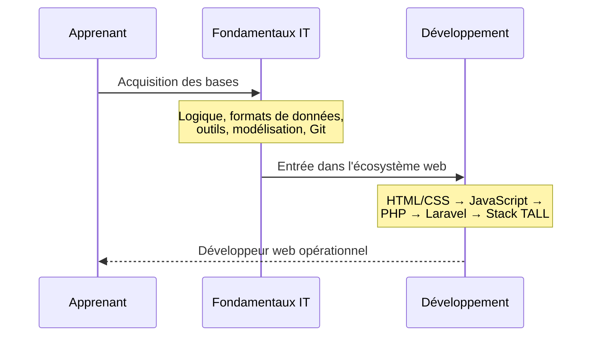
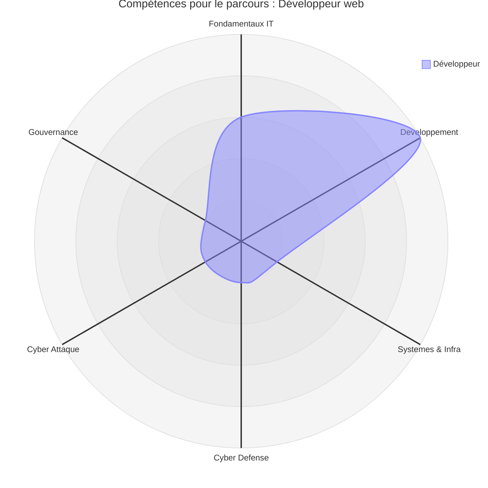
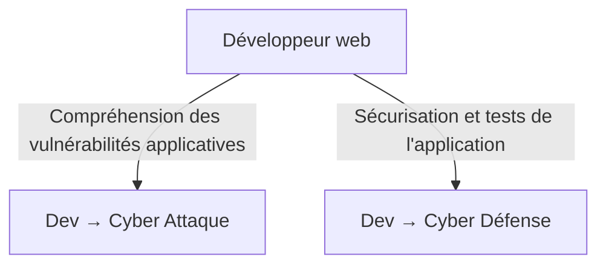

# Parcours — Développeur web

!!! quote "Analogie pédagogique"
    _Choisir le parcours Développeur Web, c'est comme apprendre le métier de bâtisseur. Vous commencez par comprendre les fondations (Fondamentaux IT), puis vous montez les murs (HTML/CSS), installez l'électricité (JavaScript) et enfin concevez l'architecture complète du bâtiment (Laravel/TALL)._

!!! tip "**Accessibilité : facile** — _Ce parcours est le plus direct et le moins exigeant en prérequis._"

## Que fait ce parcours

Découvrons via ce diagramme de séquence le parcours du développeur web.

_Ce parcours est le plus direct pour viser un poste de **développeur web**. Il ne nécessite pas de passer par les sections **Systèmes** ou **Cybersécurité** pour être opérationnel. L'encart **DevSecOps** inclus dans la section Développement (Git, Docker, GitHub Actions) couvre les besoins du quotidien en entreprise._

!!! quote "En somme, ce parcours cible la maîtrise du développement web moderne via la stack **TALL** (Tailwind CSS, Alpine.js, Laravel, Livewire). Il ne suppose aucune connaissance préalable en infrastructure ou en cybersécurité pour être mené à terme."

 

---

## Matrice

La ligne ci-dessous est extraite de la [Matrice de compétences](../matrice.md).  
Elle indique à quel stade chaque niveau de progression est structurant pour ce parcours.

| Domaine | N1 | N2 | N3 | N4 |
|:---|:---:|:---:|:---:|:---:|
| Développement | 🟢 Faible | 🟠 Élevé | 🟠 Élevé | 🟡 Modéré |

**Lecture :** le parcours devient structurant dès le N2. L'entrée en N1 reste possible mais doit impérativement passer par les Fondamentaux IT avant d'aborder les frameworks.

 

---

## Heatmap

Les colonnes ci-dessous sont extraites de la [Heatmap de compétences](../heatmap.md).  
Elles indiquent l'intensité attendue sur les compétences transversales directement mobilisées dans ce parcours.

| Compétence | Développement |
|---|:---|
| Logique informatique | 🟠 Élevé |
| **Programmation** | 🔴 **Critique** |
| Administration Linux | 🟡 Modéré |
| Réseaux | 🟡 Modéré |
| Analyse de logs | 🟡 Modéré |
| Tests applicatifs | 🟠 Élevé |
| Pentest | 🟡 Modéré |
| Détection / règles | 🟡 Modéré |
| Gestion des risques | 🟢 Faible |
| Conformité | 🟢 Faible |

!!! note
    La **Programmation** est la seule compétence critique de ce parcours. La logique informatique et les tests applicatifs constituent les deux compétences cœur complémentaires. L'administration Linux et les réseaux restent à un niveau modéré — suffisant pour travailler en environnement Docker sans être administrateur système.

 

---

## Radar

!!! quote "Note"
    _Le radar ci-dessous illustre la forme du parcours Développeur web. Le pic dominant sur l'axe Développement reflète la spécialisation assumée de ce chemin. Les autres axes restent volontairement bas — ce parcours ne vise ni la cybersécurité ni l'infrastructure._

 

---

## Orientations possibles

Ce parcours constitue une base solide pour évoluer vers deux spécialisations naturelles une fois la stack TALL maîtrisée.

_L'extension vers la **Cyber Attaque** est la plus naturelle : la maîtrise du code applicatif est le prérequis principal du pentest Web et API. L'extension vers la **Cyber Défense** est également accessible en complétant la section Systèmes & Infrastructure au préalable._

!!! warning "**Accessibilité : avancée** — Ces deux extensions supposent d'avoir solidement consolidé ce parcours avant de bifurquer."

 

---

## Conclusion

!!! quote "Ce qu'il faut retenir"
    Le parcours Développeur web est le chemin le plus accessible de la documentation.  
    Il produit un profil opérationnel sur la stack TALL, immédiatement applicable en environnement professionnel.

**Point d'entrée recommandé : [Fondamentaux IT](../../bases/index.md) — puis [Développement & Stack TALL](../../dev-cloud/index.md).**

!!! note "Pour comparer ce profil avec les autres parcours disponibles, consultez la page [Compréhension](../comprehension.md)."

 