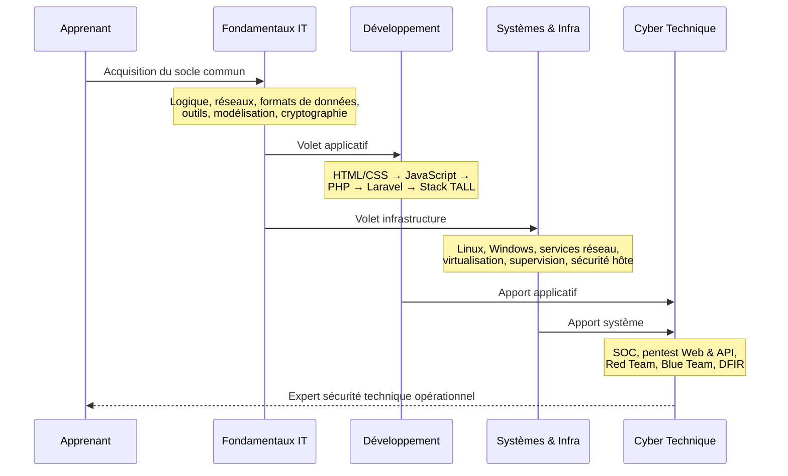
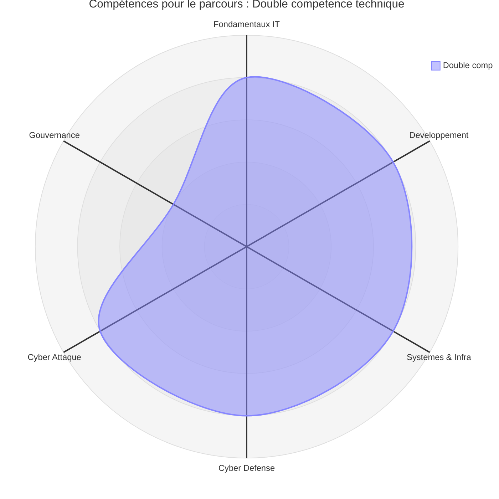
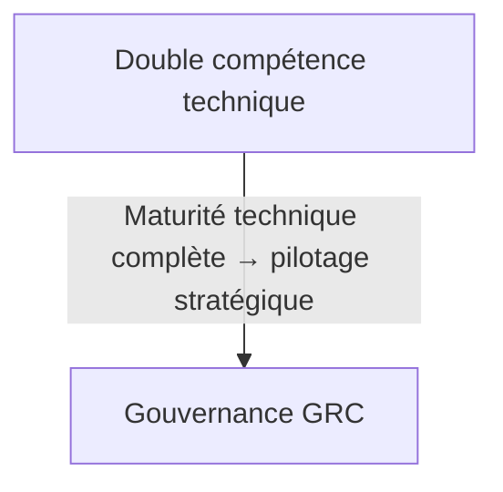

# Parcours — Double compétence technique

!!! quote "Analogie pédagogique"
    _La Double Compétence, c'est maîtriser à la fois l'architecture du bâtiment (Développement) et l'urbanisme de la ville (Systèmes/Réseaux). C'est le parcours le plus exigeant, mais celui qui offre la vision la plus complète pour devenir un architecte technique de haut niveau._

!!! danger "**Accessibilité : difficile** — _Ce parcours est le plus exigeant. Il ne s'aborde pas sans avoir solidement consolidé les deux volets techniques au préalable._"

## Que fait ce parcours

Découvrons via ce diagramme de séquence le parcours Double compétence technique.

_Ce parcours produit les profils les plus complets. Il combine **vision applicative** et **maîtrise infrastructure** pour aborder la cybersécurité technique sous ses deux angles simultanément._

!!! quote "En somme, ce parcours n'est pas une troisième voie indépendante — c'est la convergence des parcours Développeur web et Administrateur Systèmes & Réseaux vers la cybersécurité. Il suppose d'avoir investi les deux volets techniques avant toute spécialisation offensive ou défensive."

 

---

## Matrice

Les lignes ci-dessous sont extraites de la [Matrice de compétences](../matrice.md).  
Ce parcours est le seul à mobiliser trois lignes de la matrice de manière convergente.

| Domaine | N1 | N2 | N3 | N4 |
|:---|:---:|:---:|:---:|:---:|
| Développement | 🟢 Faible | 🟠 Élevé | 🟠 Élevé | 🟡 Modéré |
| Systèmes & Infrastructure | 🟢 Faible | 🟠 Élevé | 🟠 Élevé | 🟡 Modéré |
| Cyber Défense / Attaque | — | 🟡 Modéré | 🟠 Élevé | 🟠 Élevé |

**Lecture :** les deux volets techniques — Développement et Systèmes — doivent atteindre le N3 avant que la spécialisation cyber ne soit abordée. C'est la contrainte principale de ce parcours. Un apprenant qui tente de bifurquer vers la cybersécurité avant d'avoir consolidé les deux domaines produit un profil superficiel sur l'ensemble des axes.

 

---

## Heatmap

Les colonnes ci-dessous sont extraites de la [Heatmap de compétences](../heatmap.md).  
Ce parcours mobilise les trois domaines techniques simultanément — c'est la heatmap la plus dense de la documentation.

| Compétence | Développement | Systèmes & Infra | Cyber Défense | Cyber Attaque |
|---|:---:|:---:|:---:|:---:|
| Logique informatique | 🟠 Élevé | 🟠 Élevé | 🟡 Modéré | 🟡 Modéré |
| **Programmation** | 🔴 **Critique** | 🟡 Modéré | 🟡 Modéré | 🟠 Élevé |
| **Administration Linux** | 🟡 Modéré | 🔴 **Critique** | 🔴 **Critique** | 🟠 Élevé |
| **Réseaux** | 🟡 Modéré | 🔴 **Critique** | 🔴 **Critique** | 🔴 **Critique** |
| **Analyse de logs** | 🟡 Modéré | 🟠 Élevé | 🔴 **Critique** | 🟡 Modéré |
| Tests applicatifs | 🟠 Élevé | 🟢 Faible | 🟡 Modéré | 🟡 Modéré |
| **Pentest** | 🟡 Modéré | 🟡 Modéré | 🟢 Faible | 🔴 **Critique** |
| **Détection / règles** | 🟡 Modéré | 🟠 Élevé | 🔴 **Critique** | 🟡 Modéré |
| Gestion des risques | 🟢 Faible | 🟡 Modéré | 🟡 Modéré | 🟢 Faible |
| Conformité | 🟢 Faible | 🟡 Modéré | 🟢 Faible | 🟢 Faible |

!!! note
    Ce parcours concentre six compétences critiques réparties sur quatre domaines. Les **Réseaux** sont la seule compétence critique sur l'ensemble des domaines techniques — c'est l'axe transversal irremplaçable de tout profil cybersécurité avancé. La **Programmation** reste le pilier du volet développement, tandis que l'**Administration Linux**, l'**Analyse de logs** et la **Détection / règles** structurent le volet défensif. Le **Pentest** devient critique uniquement en Cyber Attaque — il n'est pas un prérequis universel mais une spécialisation assumée.

 

---

## Radar

!!! quote "Note"
    _Le radar ci-dessous illustre la forme du parcours Double compétence technique. Le polygone quasi-hexagonal est le plus régulier de la documentation — il traduit un équilibre technique rare entre tous les domaines. La gouvernance reste volontairement à 2 : elle n'est pas l'objectif de ce parcours, mais une extension naturelle accessible une fois ce niveau atteint._

 

---

## Orientations possibles

Ce parcours est le point de convergence de la documentation. Une seule extension naturelle en découle.

_L'extension vers la **Gouvernance** est la seule orientation pertinente à ce stade. Un profil ayant consolidé les deux volets techniques dispose de la légitimité terrain maximale pour aborder la conformité, la gestion des risques et le pilotage SMSI. C'est le profil le plus crédible pour un poste de RSSI ou de consultant sécurité senior._

!!! warning "**Accessibilité : modérée depuis ce parcours** — La Gouvernance reste exigeante intellectuellement, mais la base technique solide de ce profil en facilite considérablement l'accès."

 

---

## Conclusion

!!! quote "Ce qu'il faut retenir"
    Le parcours Double compétence technique est le chemin le plus long et le plus exigeant de la documentation.  
    Il produit un profil expert sécurité technique capable d'intervenir aussi bien en Red Team qu'en Blue Team, avec une compréhension profonde des deux faces de la cybersécurité.

**Point d'entrée recommandé : [Fondamentaux IT](../../bases/index.md) — puis [Développement & Stack TALL](../../dev-cloud/index.md) et [Systèmes & Infrastructure](../../sys-reseau/index.md) en parallèle — puis [Cyber : Défense](../../cyber/operations/index.md) et [Cyber : Attaque](../../cyber/tools/index.md).**

!!! note "Pour comparer ce profil avec les autres parcours disponibles, consultez la page [Compréhension](../comprehension.md)."

 