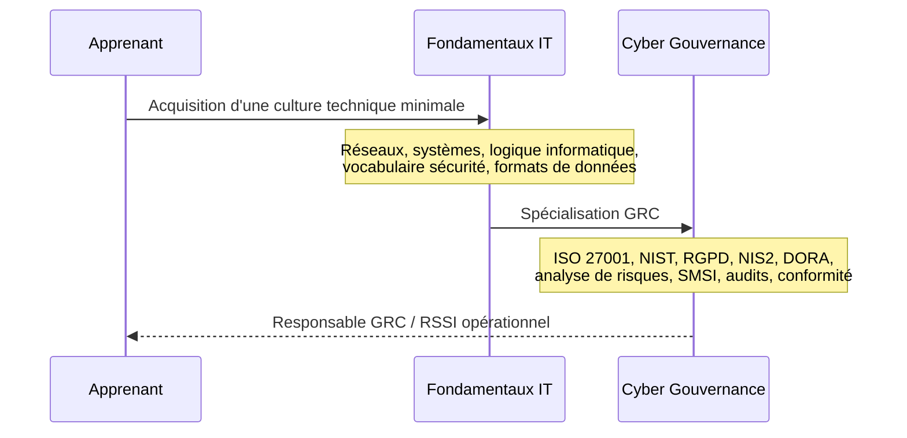
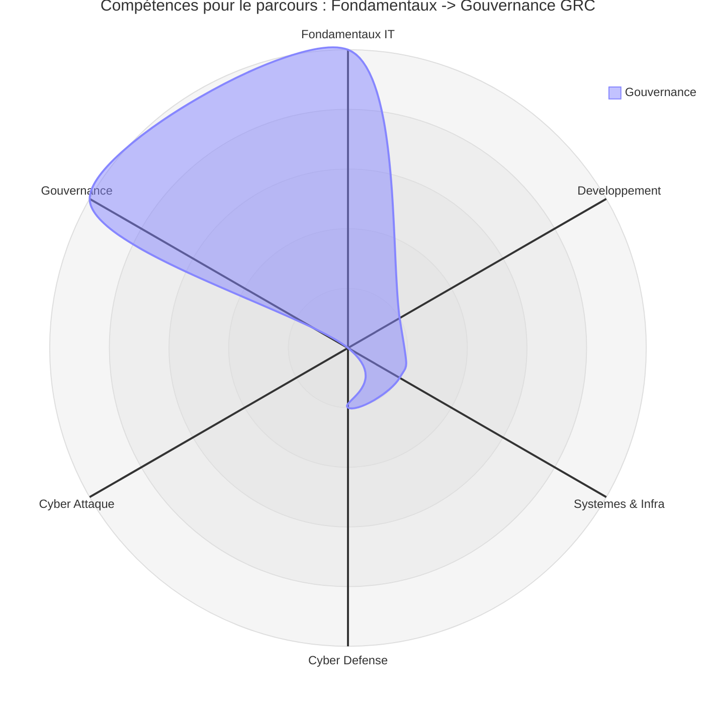
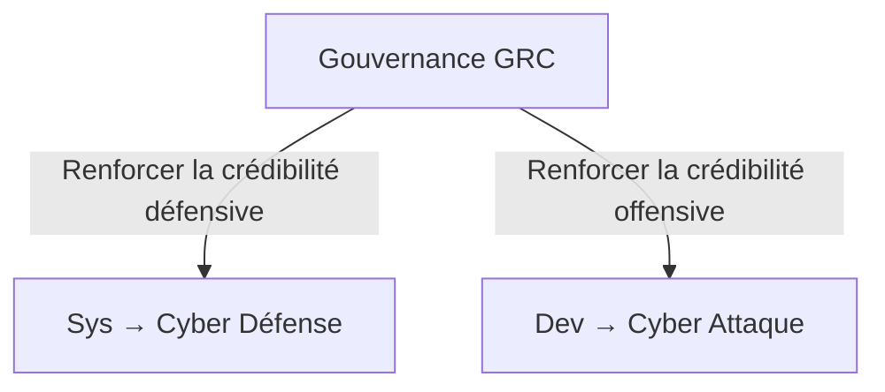

# Parcours — Gouvernance (GRC)

!!! note "**Accessibilité : modérée** — _Ce parcours est accessible sans expertise technique poussée, mais une culture système et réseau reste indispensable pour maintenir une crédibilité opérationnelle face aux équipes terrain._"

## Que fait ce parcours

Découvrons via ce diagramme de séquence le parcours orienté Gouvernance GRC.

_Ce parcours cible la **gestion des risques**, la **conformité réglementaire** et le **pilotage stratégique de la sécurité**. Il ne suppose pas de maîtrise technique poussée, mais une culture terrain reste indispensable pour conserver de la crédibilité face aux équipes opérationnelles._

!!! quote "En somme, la gouvernance sans expérience technique produit des référentiels déconnectés du terrain. Ce parcours est accessible en entrée directe, mais il atteint sa pleine valeur lorsqu'il s'appuie sur une expérience opérationnelle préalable — défensive ou offensive."

 

---

## Matrice

La ligne ci-dessous est extraite de la [Matrice de compétences](../matrice.md).  
Elle indique à quel stade chaque niveau de progression est structurant pour ce parcours.

| Domaine | N1 | N2 | N3 | N4 |
|:---|:---:|:---:|:---:|:---:|
| Cyber Gouvernance (GRC) | 🟢 Faible | 🟡 Modéré | 🟡 Modéré | 🟠 Élevé |

**Lecture :** contrairement aux autres domaines, la Gouvernance ne présente pas de pic en N2 ou N3 — elle monte progressivement jusqu'au N4. C'est un domaine où la maturité s'acquiert dans la durée, par l'accumulation d'expériences d'audit, de mise en conformité et de pilotage SMSI. Un profil GRC en N2 est opérationnel ; un profil GRC en N4 est stratégique.

 

---

## Heatmap

Les colonnes ci-dessous sont extraites de la [Heatmap de compétences](../heatmap.md).  
Elles indiquent l'intensité attendue sur les compétences transversales directement mobilisées dans ce parcours.

| Compétence | Gouvernance |
|---|:---:|
| Logique informatique | 🟡 Modéré |
| Programmation | 🟢 Faible |
| Administration Linux | 🟢 Faible |
| Réseaux | 🟡 Modéré |
| Analyse de logs | 🟡 Modéré |
| Tests applicatifs | 🟢 Faible |
| Pentest | 🟢 Faible |
| Détection / règles | 🟡 Modéré |
| **Gestion des risques** | 🔴 **Critique** |
| **Conformité** | 🔴 **Critique** |

!!! note
    Ce parcours est le seul de la documentation dont les deux compétences critiques — **Gestion des risques** et **Conformité** — ne sont pas des compétences techniques. C'est précisément ce qui le distingue des autres parcours. La Programmation et l'Administration Linux restent à 🟢 Faible — une lecture des référentiels et une compréhension des enjeux suffisent. En revanche, les Réseaux, l'Analyse de logs et la Détection / règles maintiennent un niveau 🟡 Modéré : sans cette culture minimale, le dialogue avec les équipes SOC et infrastructure devient creux.

 

---

## Radar

!!! quote "Note"
    _Le radar ci-dessous illustre la forme du parcours Gouvernance GRC. Le profil asymétrique — deux pics forts sur Fondamentaux et Gouvernance, axes techniques quasi inexistants — n'est pas un défaut. Il reflète fidèlement un profil GRC pur, orienté conformité et pilotage stratégique. Ce radar est le plus atypique de la documentation._

 

---

## Orientations possibles

La Gouvernance GRC est le terminus naturel de tous les parcours techniques. Depuis ce parcours, une seule orientation est pertinente : renforcer la crédibilité terrain par l'expérience opérationnelle.

_Contrairement aux autres parcours, les orientations ici sont des **retours en arrière volontaires** vers la technique — non pas par nécessité, mais pour renforcer la légitimité opérationnelle d'un profil GRC qui souhaite dépasser le rôle de gestionnaire de conformité pour devenir un interlocuteur technique crédible._

!!! tip "**Recommandation** — Un profil GRC qui a consolidé au moins un volet technique (défense ou attaque) est significativement plus efficace qu'un profil GRC pur dans un contexte d'entreprise à taille critique."

 

---

## Conclusion

Le parcours Gouvernance GRC est le seul de la documentation dont la valeur augmente avec l'expérience accumulée dans les autres parcours.  
Il produit un profil RSSI, auditeur ou consultant GRC opérationnel, capable de piloter la conformité et la gestion des risques avec une lecture réaliste des enjeux techniques.

**Point d'entrée recommandé : [Fondamentaux IT](../../bases/index.md) — puis [Cyber : Gouvernance](../../cyber/grc/index.md).**

!!! note "Pour comparer ce profil avec les autres parcours disponibles, consultez la page [Compréhension](../comprehension.md)."

 