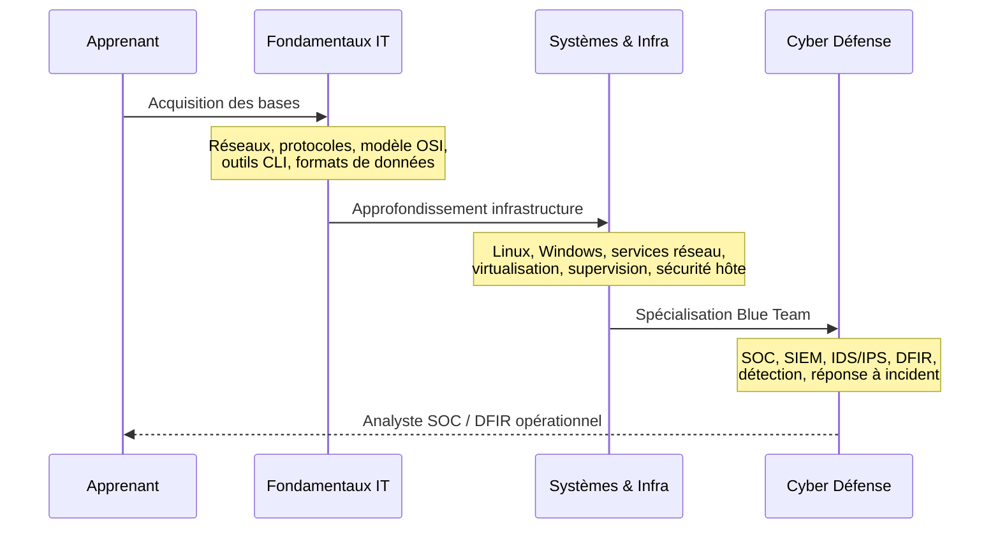
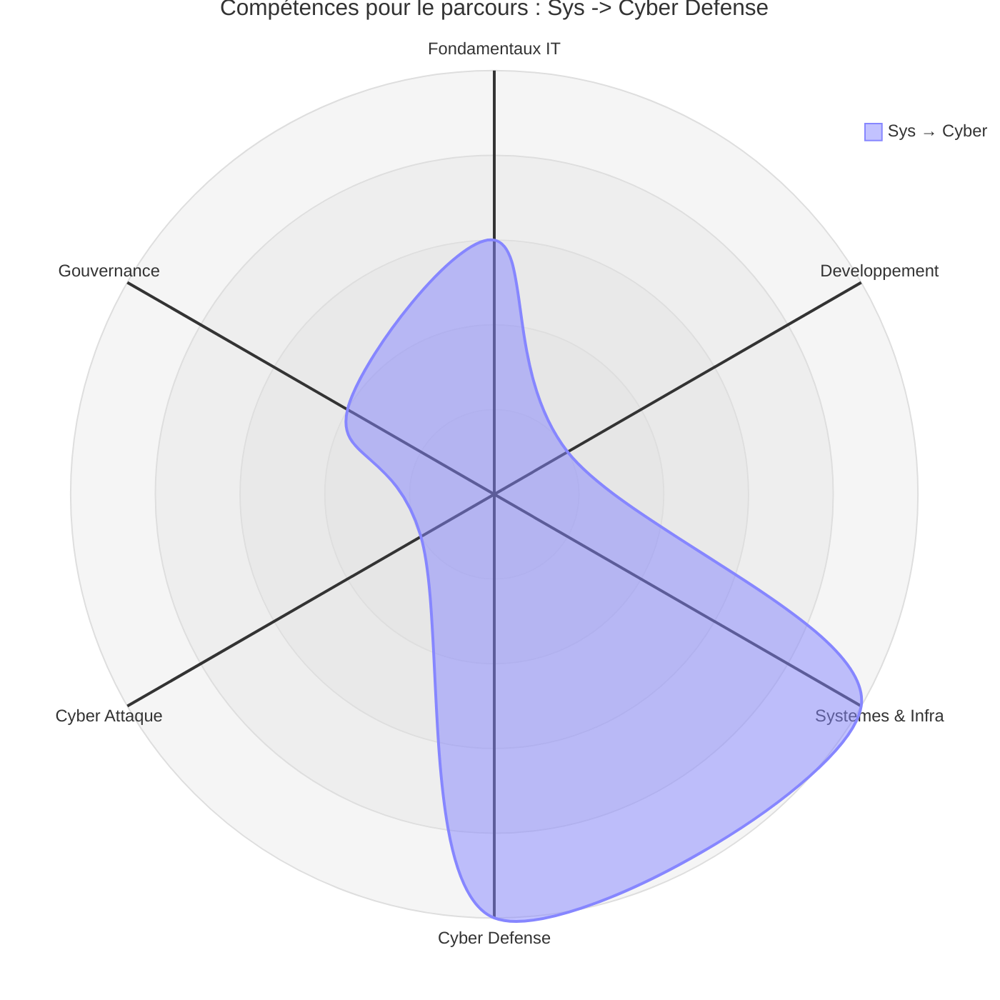
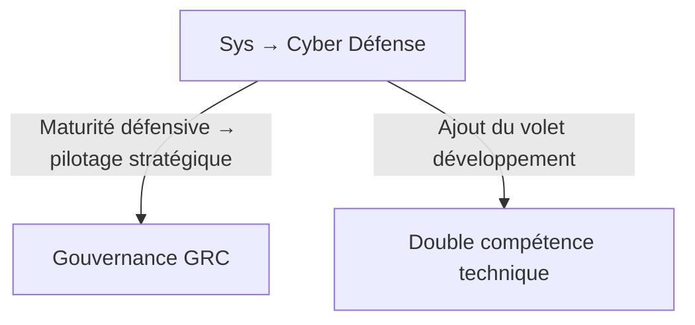

# Parcours — Sys → Cyber Défense

!!! quote "Analogie pédagogique"
    _Passer de l'Infrastructure à la Cyber Défense s'apparente à évoluer du métier d'architecte réseau routier à celui de chef de la police. Vous connaissez déjà chaque route et chaque recoin de la ville ; vous apprenez maintenant à repérer les comportements suspects et à intercepter les criminels (SOC/DFIR)._

!!! warning "**Accessibilité : avancée** — _Ce parcours suppose une maîtrise solide de l'infrastructure avant d'aborder la détection et la réponse à incident._"

## Que fait ce parcours

Découvrons via ce diagramme de séquence le parcours orienté Cyber Défense.

_Ce parcours suit une progression orientée exploitation puis défense. Il conduit vers des fonctions de **détection**, **supervision** et **réponse à incident** dans un contexte SOC ou DFIR._

!!! quote "En somme, ce parcours est l'extension naturelle du parcours Administrateur Systèmes & Réseaux. La maîtrise de l'infrastructure est le prérequis direct de la cybersécurité défensive — on ne détecte correctement que ce que l'on comprend en profondeur."

 

---

## Matrice

Les lignes ci-dessous sont extraites de la [Matrice de compétences](../matrice.md).  
Elles indiquent à quel stade chaque niveau de progression est structurant pour ce parcours.

| Domaine | N1 | N2 | N3 | N4 |
|:---|:---:|:---:|:---:|:---:|
| Systèmes & Infrastructure | 🟢 Faible | 🟠 Élevé | 🟠 Élevé | 🟡 Modéré |
| Cyber Défense (Blue / SOC / DFIR) | — | 🟡 Modéré | 🟠 Élevé | 🟠 Élevé |

**Lecture :** ce parcours est le seul à mobiliser deux lignes de la matrice de manière séquentielle. Le domaine Systèmes & Infrastructure doit atteindre le N3 avant que la spécialisation Cyber Défense ne devienne structurante. Tenter d'aborder la Blue Team en N2 sans socle infrastructure solide produit des lacunes critiques en détection et en forensic.

 

---

## Heatmap

Les colonnes ci-dessous sont extraites de la [Heatmap de compétences](../heatmap.md).  
Elles indiquent l'intensité attendue sur les compétences transversales mobilisées dans ce parcours, sur les deux domaines concernés.

| Compétence | Systèmes & Infra | Cyber Défense |
|---|:---:|:---:|
| Logique informatique | 🟠 Élevé | 🟡 Modéré |
| Programmation | 🟡 Modéré | 🟡 Modéré |
| **Administration Linux** | 🔴 **Critique** | 🔴 **Critique** |
| **Réseaux** | 🔴 **Critique** | 🔴 **Critique** |
| **Analyse de logs** | 🟠 Élevé | 🔴 **Critique** |
| Tests applicatifs | 🟢 Faible | 🟡 Modéré |
| Pentest | 🟡 Modéré | 🟢 Faible |
| **Détection / règles** | 🟠 Élevé | 🔴 **Critique** |
| Gestion des risques | 🟡 Modéré | 🟡 Modéré |
| Conformité | 🟡 Modéré | 🟢 Faible |

!!! note
    Ce parcours concentre quatre compétences critiques au total. L'Administration Linux et les Réseaux sont critiques sur les deux domaines — elles constituent le socle irremplaçable. L'Analyse de logs et la Détection / règles deviennent critiques en Cyber Défense : un analyste SOC qui ne sait pas lire des logs ni écrire des règles de corrélation ne peut pas exercer efficacement. Ces deux compétences sont directement préparées par la section Systèmes & Infrastructure.

 

---

## Radar

!!! quote "Note"
    _Le radar ci-dessous illustre la forme du parcours Sys → Cyber Défense. Les deux pics symétriques sur Systèmes & Infra et Cyber Défense reflètent la dépendance directe entre les deux domaines. Un pic sans l'autre serait un profil incomplet._

 

---

## Orientations possibles

Une fois la spécialisation Blue Team consolidée, deux extensions stratégiques sont accessibles.

_L'extension vers la **Gouvernance** est la plus naturelle à ce stade : un analyste SOC expérimenté dispose de la crédibilité terrain nécessaire pour aborder la conformité, la gestion des risques et le pilotage SMSI avec pertinence. L'extension vers la **Double compétence technique** est plus exigeante — elle nécessite de compléter intégralement le volet développement avant de converger._

!!! warning "**Accessibilité : avancée à difficile** — Ces deux extensions supposent d'avoir atteint le N3 en Cyber Défense avant de bifurquer."

 

---

## Conclusion

!!! quote "Ce qu'il faut retenir"
    Le parcours Sys → Cyber Défense est l'un des deux chemins offensifs de la documentation — ici orienté protection, détection et investigation.  
    Il produit un profil analyste SOC ou DFIR opérationnel, capable d'intervenir sur des incidents réels en environnement de production.

**Point d'entrée recommandé : [Fondamentaux IT](../../bases/index.md) — puis [Systèmes & Infrastructure](../../sys-reseau/index.md) — puis [Cyber : Défense](../../cyber/operations/index.md).**

!!! note "Pour comparer ce profil avec les autres parcours disponibles, consultez la page [Compréhension](../comprehension.md)."

 