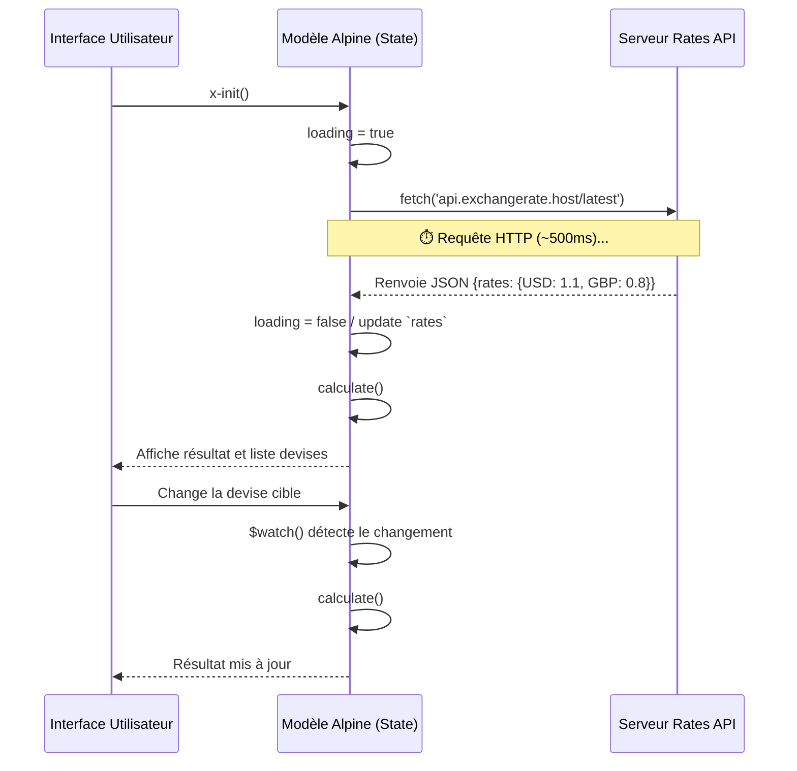

# Currency Converter

<div
  class="omny-meta"
  data-level="🟡 Intermédiaire"
  data-version="Alpine 3.x"
  data-time="1 Heure">
</div>


!!! quote "Analogie pédagogique"
    _Travailler sur un projet complet est comparable à l'assemblage final d'une voiture sur une ligne de production. C'est ici que toutes les pièces individuelles (concepts appris précédemment) doivent s'emboîter parfaitement pour créer un produit fonctionnel et sécurisé._

!!! quote "Branchement sur le Cloud"
    Jusqu'à présent, notre logique restait cloisonnée dans notre fichier. Dans la vie réelle, la majorité des applications affichent des données fraîches provenant de serveurs distants. Dans ce second projet, nous allons créer un **Convertisseur de Devises**. L'objectif est double : déclencher une requête HTTP (`fetch`) vers une API gratuite pour récupérer les taux de change à l'ouverture de la page, et relancer automatiquement le calcul de conversion à chaque fois que l'utilisateur modifie un champ via un observateur de changement (`x-effect` ou `$watch`).

<br>


<p><em>Maquette UI conceptuelle du projet : Interface de conversion de devises connectée à une API.</em></p>

<br>

---

## 1. Cahier des Charges et Objectifs

### Enjeux du rendu

- **Afficher un montant à convertir** (un `<input type="number">`).
- **Deux sélecteurs (Dropdowns)** pour choisir la monnaie source et la monnaie cible (ex: EUR, USD, GBP, JPY).
- **Le résultat calculé** affiché instantanément en grand.
- **Ajout d'un statut "Chargement"** le temps que l'API réponde, pour éviter une interface vide.

### Concepts Alpine.js abordés

- `x-init` : Pour exécuter la fonction fetch asynchrone dès que l'application "mount".
- `fetch()` / `async/await` : Intégrés organiquement dans les méthodes Alpine.
- `$watch` : Une fonction magique qui "surveille" les variables pour agir lorsqu'elles changent.

<br>

---

## 2. Le Flux des Données (Data Flow)

Contrairement au premier projet qui s'exécutait en local de façon instantanée, ici nous devons gérer une notion de "Temps d'attente" (Asynchrone).



<br>

---

## 3. Implémentation du Code

### Étape 3.1 : Le Modèle Asynchrone

*Nous utiliserons l'API libre `api.frankfurter.app/latest` pour récupérer des taux en direct.*

```html title="Configuration x-data avec Fetch"
<!-- Wrapper englobant avec x-data asynchrone -->
<div x-data="{
        amount: 100,
        fromCurrency: 'EUR',
        toCurrency: 'USD',
        currencies: ['EUR', 'USD', 'GBP', 'JPY', 'CAD', 'CHF', 'AUD'],
        rates: {},
        result: 0,
        isLoading: true,
        error: null,

        // Fonction d'appel à l'API
        async fetchRates() {
            this.isLoading = true;
            this.error = null;
            try {
                // On récupère la valeur locale (ex: EUR)
                const res = await fetch(`https://api.frankfurter.app/latest?from=${this.fromCurrency}`);
                
                if (!res.ok) throw new Error('API indisponible');
                const data = await res.json();
                
                this.rates = data.rates;
                // La monnaie de base vaut toujours 1
                this.rates[this.fromCurrency] = 1; 
                this.calculate();
            } catch (err) {
                this.error = 'Impossible de charger les taux.';
            } finally {
                this.isLoading = false;
            }
        },

        // Logique mathématique de base
        calculate() {
             if (this.fromCurrency === this.toCurrency) {
                 this.result = this.amount;
             } else if (this.rates[this.toCurrency]) {
                 this.result = (this.amount * this.rates[this.toCurrency]).toFixed(2);
             }
        },

        // Hook d'initialisation + Écouteurs de changement
        init() {
            // Lancer le Fetch au démarrage
            this.fetchRates();
            
            // Re-calcul automatique sur les changements textuels
            this.$watch('amount', value => this.calculate());
            this.$watch('toCurrency', value => this.calculate());
            
            // Re-fetch si on change la monnaie de Base !
            this.$watch('fromCurrency', value => this.fetchRates());
        }
    }" 
    class="max-w-lg mx-auto bg-white dark:bg-gray-800 p-8 rounded-2xl shadow-xl mt-12 border border-gray-100 dark:border-gray-700">

    <h2 class="text-2xl font-bold mb-6 text-gray-800 dark:text-gray-100 flex items-center">
        🌍 Convertisseur Mondial
    </h2>

    <!-- Le Contenu visuel au 3.2 -->

</div>
```

*Le bloc `init()` est un hook spécial d'AlpineJS ! Dès que le composant est inséré dans le DOM, cette méthode est automatiquement invoquée.*

<br>

### Étape 3.2 : Implémenter l'état de Chargement et Erreurs

C'est une hérésie d'afficher des zéros en attendant qu'une API réponde. La directive `x-show` gère ça parfaitement. Poursuivons à l'intérieur de notre `<div x-data>` :

```html title="États Conditionnels (Skeleton UI)"
    <!-- Bannière d'Erreur (x-show) -->
    <div x-show="error" 
         x-transition
         class="bg-red-100 border-l-4 border-red-500 text-red-700 p-4 mb-6 rounded">
        <p class="font-bold">Alerte Serveur</p>
        <p x-text="error"></p>
    </div>

    <!-- Interface d'Entrée Principale -->
    <div class="grid grid-cols-1 md:grid-cols-2 gap-4 mb-6">
        <div>
            <label class="block text-sm font-medium text-gray-700 dark:text-gray-300 mb-2">Montant</label>
            <!-- L'input lié empêche nativement la saisie de texte grâce à type='number' -->
            <input type="number" x-model="amount" 
                   class="w-full text-lg p-3 rounded-lg border border-gray-300 dark:bg-gray-700 dark:border-gray-600 focus:ring-2 focus:ring-blue-500">
        </div>
        
        <div>
            <label class="block text-sm font-medium text-gray-700 dark:text-gray-300 mb-2">De</label>
            <!-- Sélecteur Bouclé (x-for) sur la liste de Monnaies -->
            <select x-model="fromCurrency" 
                    class="w-full text-lg p-3 rounded-lg border border-gray-300 dark:bg-gray-700 dark:border-gray-600">
                <template x-for="curr in currencies" :key="curr">
                    <!-- :value et x-text lient les données bouclées au rendu HTML -->
                    <option :value="curr" x-text="curr"></option>
                </template>
            </select>
        </div>
    </div>
```

<br>

### Étape 3.3 : Panneau de Résultat et Cible

Désormais, nous lions le sélecteur cible, et nous affichons conditionnellement le fameux Spinner si `isLoading` est Vrai.

```html title="Boucle et Résultat final"
    <div class="grid grid-cols-1 md:grid-cols-2 gap-4 mb-6">
        <div>
            <label class="block text-sm font-medium text-gray-700 dark:text-gray-300 mb-2">Vers</label>
            <select x-model="toCurrency" 
                    class="w-full text-lg p-3 rounded-lg border border-gray-300 dark:bg-gray-700 dark:border-gray-600">
                <template x-for="curr in currencies" :key="curr">
                    <option :value="curr" x-text="curr"></option>
                </template>
            </select>
        </div>
        
        <!-- Boîte de Résultat Finale bleue -->
        <div class="bg-blue-500 rounded-lg p-4 flex flex-col justify-center items-center text-white shadow-inner relative overflow-hidden">
            <span class="text-xs uppercase opacity-75 mb-1">Total Calculé</span>
            
            <!-- Le fameux Spinner CSS si l'API cherche -->
            <div x-show="isLoading" class="absolute inset-0 bg-blue-600 flex justify-center items-center">
                <svg class="animate-spin h-6 w-6 text-white" xmlns="http://www.w3.org/2000/svg" fill="none" viewBox="0 0 24 24">
                  <circle class="opacity-25" cx="12" cy="12" r="10" stroke="currentColor" stroke-width="4"></circle>
                  <path class="opacity-75" fill="currentColor" d="M4 12a8 8 0 018-8V0C5.373 0 0 5.373 0 12h4zm2 5.291A7.962 7.962 0 014 12H0c0 3.042 1.135 5.824 3 7.938l3-2.647z"></path>
                </svg>
            </div>
            
            <!-- L'Affichage texte masqué pendant le spinner -->
            <div x-show="!isLoading" x-transition.opacity duration.500ms class="flex items-baseline space-x-1">
                <span class="text-3xl font-black" x-text="result"></span>
                <span class="text-lg font-bold opacity-80" x-text="toCurrency"></span>
            </div>
        </div>
    </div>
```

<br>

---

## Conclusion

!!! quote "Les Observateurs ($watch)"
    Dans d'anciennes piles Vanilla JS, vous auriez été forcés de rajouter des `addEventListener("change", handler)` sur l'input, sur les deux selects, de vérifier qui appelait qui, etc.
    **Le hook `$watch(propriété, action)` surveille dynamiquement une variable précise.** Si l'utilisateur tape un "0" de plus dans le `amount`, `$watch` re-calcule immédiatement sans toucher au serveur, tandis que si le `fromCurrency` change, il relancera volontairement le téléchargement API réseau !

> Vous êtes équipés. Variables simples ? Maitrisées (Projet 1). API réseau et états de chargement ? Maitrisé (Projet 2). Il est temps de construire le monstre final de la formation Alpine.js en fusionnant la persistence, le routage, l'export et des calculs massifs ! Rendez-vous au projet 3 (Pentest Reporting Tool).

<br>

---

## Conclusion

!!! quote "Ce qu'il faut retenir"
    La validation de cette étape confirme votre capacité à intégrer des concepts avancés dans un flux de travail professionnel. L'architecture globale prend maintenant tout son sens.

> [Retour à l'index du projet →](../index.md)
