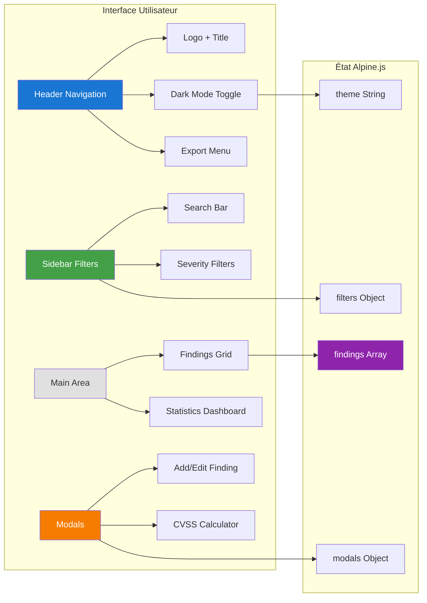

# Pentest Reporting Tool

<div
  class="omny-meta"
  data-level="🔴 Avancé"
  data-version="Alpine 3.x"
  data-time="15 Heures">
</div>

!!! quote "Analogie pédagogique"
    Imaginez que vous êtes un **auditeur en cybersécurité** qui découvre des dizaines de vulnérabilités lors d'un test d'intrusion. Vous devez les organiser, prioriser, documenter et produire un rapport professionnel. Un tableur Excel serait trop rigide, un outil commercial trop coûteux. **Alpine.js est comme votre carnet de notes intelligent** : léger, réactif, qui s'adapte à votre workflow sans vous imposer une structure complexe. Chaque vulnérabilité devient une carte interactive, les filtres s'appliquent instantanément, et le rapport se génère automatiquement - le tout dans votre navigateur, sans serveur.

<br>


<p><em>Maquette UI conceptuelle du projet : Le Dashboard complet avec calculs CVSS et exports.</em></p>

<br>

---

## 1. Cahier des Charges et Objectifs

Dans ce projet monumental, nous allons réunir toutes vos compétences front-end pour créer un outil métier complet.

### Enjeux du rendu

- **Un Dashboard** listant les vulnérabilités trouvées lors d'un audit.
- **Ajout/Édition** via des fenêtres modales (`x-show` avec transitions).
- **Calculateur CVSS 3.1** pour évaluer la sévérité d'une faille dynamiquement.
- **Filtres interactifs** pour trier les failles par niveau critique.
- **Génération de rapport** exportable en Markdown.
- **Persistance des données** (sauvegarde automatique navigateur hors-ligne).

### Concepts Alpine.js avancés utilisés

- `$persist` : Le plugin officiel pour le LocalStorage.
- `Alpine.store()` : Pour la gestion de l'état global (le Theme Sombre, la data globale).
- Les boucles imbriquées `x-for`.
- Les getters (computed properties) pour les filtres.

<br>

---

## 2. L'Architecture Complète

L'application doit coordonner plusieurs stores et composants isolés.



_Le compositing de l'application dévoile l'importance des Stores par rapport au scope d'un simple `x-data`. Le bouton du Dark Mode change un `Alpine.store('theme')` qui est répercuté automatiquement sur la balise Document HTML._

<br>

---

## 3. Implémentation du Moteur Métier

### Étape 3.1 : Le Store de Thème et Données Générales

Pour un SI de cette envergure, nous combinons les plugins externes. Il faut charger le CDN Alpine **avec** le module d'extension `persist`.

```javascript title="app.js - Le Moteur Principal de l'Application"
document.addEventListener('alpine:init', () => { 
    
    // Store pour le mode sombre global
    Alpine.store('theme', { 
        current: Alpine.$persist('light').as('app-theme'), 
        
        toggle() {
            this.current = this.current === 'light' ? 'dark' : 'light';
            document.documentElement.classList.toggle('dark');
        },
        
        init() { 
            if (this.current === 'dark') {
                document.documentElement.classList.add('dark');
            }
        }
    });

    // Enregistrement du composant "PentestApp"
    Alpine.data('pentestApp', () => ({ 
        // Sauvegarde de toutes les vulnérabilités dans le disque dur de l'utilisateur
        findings: Alpine.$persist([]).as('pentest-findings'), 
        
        filters: {
            search: '',
            severity: []
        },

        // Getter : Calcul dynamique des statistiques
        get stats() { 
            return {
                total: this.findings.length,
                critical: this.findings.filter(f => f.severity === 'critical').length,
                high: this.findings.filter(f => f.severity === 'high').length
            };
        },

        // Fonction d'ajout
        addFinding(newFinding) {
            this.findings.push(newFinding);
        }
    }));
    
    // Initialisation forcée
    Alpine.store('theme').init();
});
```

_La magie de `$persist().as('cle')` résout d'elle-même la transformation complexe de Tableaux JSON en string local, avec l'avantage inouï de se synchroniser instantanément : si on perd la connexion ou si le navigateur crash, les audits sont sauvés._

<br>

### Étape 3.2 : Intégrer les Modals Complexes

Un Modal (Pop-up) doit intercepter les touches globales du clavier (comme `Echap` pour fermer). 

```javascript title="app.js - Mécanique des Fenêtres Contextuelles"
Alpine.data('modal', () => ({
    isOpen: false,
    
    open() {
        this.isOpen = true;
        // On empêche le scroll du site derrière le modal
        document.body.style.overflow = 'hidden'; 
    },
    
    close() {
        this.isOpen = false;
        // On rétablit le comportement normal de la page web
        document.body.style.overflow = '';
    },
    
    init() {
        // Observez comment on lie les API Natives du navigateur avec le monde d'Alpine :
        this.$watch('isOpen', value => { 
            if (value) {
                const handler = (e) => {
                    if (e.key === 'Escape') this.close();
                };
                document.addEventListener('keydown', handler);
                // Le garbage collector d'Alpine nettoie la RAM à la fermeture
                this.$cleanup(() => document.removeEventListener('keydown', handler)); 
            }
        });
    }
}));
```

<br>

### Étape 3.3 : Construire le Vue HTML Associée

Voici la carapace de notre point d'entrée, qui va absorber la puissance des scripts initialisés plus haut.

```html title="index.html - Structure Front-End Alpine.js"
<!DOCTYPE html>
<!-- Le $store est accessible globalement sans qu'il soit dans le balise parente de l'App ! -->
<html lang="fr" :class="$store.theme.current">
<body>

    <!-- L'application se greffe avec x-data globale sur pentestApp -->
    <div id="app" x-data="pentestApp()"> 
        
        <header class="navbar">
            <h1>Outil d'Audit Sécurité</h1>
            
            <button @click="$store.theme.toggle()">
                Changer de Thème
            </button>
            
            <div class="stats">
                <span x-text="stats.total"></span> Faille(s) |
                <span style="color:red" x-text="stats.critical"></span> Critique(s)
            </div>
        </header>
        
        <!-- Liste des Vulnérabilités -->
        <main>
            <template x-for="find in findings" :key="find.id">
                <div class="vuln-card">
                    <h2 x-text="find.title"></h2>
                    <span class="badge" x-text="find.severity"></span>
                </div>
            </template>
        </main>

        <!-- Fenêtre Modale Isolée -->
        <div x-data="modal()">
            <button @click="open()">+ Nouvelle Vulnérabilité</button>
            
            <div class="modal-overlay" x-show="isOpen" @click.self="close()">
                <div class="modal-content">
                    <h2>Créer une Faille</h2>
                    <!-- ... Formulaire de saisie ... -->
                </div>
            </div>
        </div>

    </div>

</body>
</html>
```

_Le `.self` dans `@click.self` indique à Alpine de fermer le modal **que si** l'on clique sur le filtre noir (l'overlay) et non si on clique sur la carte interne du modal._

<br>

---

## Conclusion

!!! quote "Ce qu'il faut retenir"
    La création de cet outil démontre la puissance d'Alpine.js pour le prototypage d'interfaces. En quelques lignes de code réactif, vous avez conçu un dashboard dynamique sans la lourdeur d'un framework SPA classique (React/Vue).

!!! quote "Le point final du Front-End réactif"
    Créer un véritable logiciel métier Javascript sans build-tools complexes est désormais possible. Vous avez manipulé la persistence, les calculs dérivatifs, le binding d'état des plugins tiers, tout en respectant une méthodologie industrielle.

> Le Framework Alpine et ses trois grands piliers (Projets et Théorie) n'ont plus aucun secret pour vous. Il est l'heure de le mixer avec une API backend ultra performante construite en **Laravel** ou en **Go**. Félicitations !
