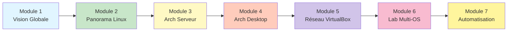

# Module 1 : Vision Globale du Projet Arch-Lab

<div
  class="omny-meta"
  data-level="🟢 Débutant & 🟡 Intermédiaire"
  data-version="0.2"
  data-time="30-40 minutes">
</div>

## Introduction

Bienvenue dans le premier module d'Arch-Lab ! Avant de plonger dans l'installation et la configuration technique, il est essentiel que **vous compreniez** la vision d'ensemble du projet, son architecture globale et la logique pédagogique qui structure ce parcours.

Ce module **vous présente** :

- Les objectifs pédagogiques d'Arch-Lab
- L'architecture d'ensemble du laboratoire
- Le rôle de chaque distribution Linux et système
- La structure logique des sept modules
- Les compétences que vous allez acquérir

!!! quote "Pourquoi commencer par la vision globale ?"
    Imaginez que vous allez construire une maison. Avant de poser la première brique, vous devez comprendre le plan d'ensemble : où seront les fondations, les murs porteurs, les étages. C'est exactement le rôle de ce module : **vous donner le plan complet** avant de commencer la construction.

---

## Objectifs d'Apprentissage

À la fin de ce module, **vous serez capable de** :

- [ ] Expliquer la finalité pédagogique d'Arch-Lab
- [ ] Identifier le rôle de chaque système (Arch, Ubuntu, Rocky, Windows) dans le laboratoire
- [ ] Comprendre l'architecture réseau globale (NAT, Host-Only, Internal)
- [ ] Situer chaque module dans la progression logique du projet
- [ ] Anticiper les compétences que vous allez développer

---

## Qu'est-ce qu'Arch-Lab ?

**Arch-Lab est un laboratoire virtualisé multi-OS** conçu pour **vous former** de manière progressive et structurée aux systèmes Linux, à l'administration réseau et aux pratiques professionnelles DevSecOps.

### Un Environnement Professionnel Simulé

Arch-Lab reproduit un **mini-datacenter d'entreprise** comprenant :

| Système | Rôle dans le Lab | Famille Linux | Gestionnaire de paquets |
|---------|------------------|---------------|------------------------|
| **Arch Linux Serveur** | Infrastructure de base, services réseau | Arch | pacman |
| **Arch Linux Desktop** | Poste de travail utilisateur | Arch | pacman |
| **Ubuntu LTS** | Système stable de référence | Debian | apt |
| **Rocky Linux** | Système entreprise certifié | Red Hat | dnf |
| **Windows 10/11** | Poste utilisateur bureautique | Microsoft | - |

### Pourquoi VirtualBox ?

VirtualBox **vous offre** :

- Un environnement isolé et sans risque pour expérimenter
- La possibilité de créer des snapshots (points de restauration instantanés)
- Une gestion réseau avancée (NAT, Host-Only, Internal Network)
- La compatibilité multi-plateforme (Windows, Linux, macOS)
- La gratuité et l'open source

!!! tip "Avantage des snapshots"
    Vous pouvez casser votre système, tester des configurations dangereuses, simuler des attaques... puis revenir en arrière en quelques secondes. C'est un **filet de sécurité absolu** pour l'apprentissage.

---

## Architecture Globale du Laboratoire

### Vue éclaté & d'Ensemble

=== "Réseau NAT (Internet)"

    ```mermaid
    graph TB
        subgraph "Machine Hôte (Votre PC)"
            HOST[Windows 11<br/>48 Go RAM]
        end
        
        subgraph "Couche Virtualisation"
            VB[VirtualBox 7.0+<br/>Gestionnaire de VMs]
        end
        
        subgraph "Réseau NAT (Internet)"
            NAT[NAT VirtualBox<br/>Accès sortant uniquement]
        end
        
        subgraph "Machines Virtuelles"
            AS[Arch Server<br/>2-4 Go RAM]
            AD[Arch Desktop<br/>4-8 Go RAM]
            UB[Ubuntu LTS<br/>2-4 Go RAM]
            RL[Rocky Linux<br/>2-4 Go RAM]
            WIN[Windows 10/11<br/>4-8 Go RAM]
        end
        
        HOST --> VB
        VB --> NAT
        
        NAT -.->|Internet| AS
        NAT -.->|Internet| AD
        NAT -.->|Internet| UB
        NAT -.->|Internet| RL
        
        style HOST fill:#e1f5ff
        style VB fill:#c8e6c9
        style NAT fill:#fff9c4
        style AS fill:#b2dfdb
        style AD fill:#b2dfdb
        style UB fill:#ffccbc
        style RL fill:#f8bbd0
        style WIN fill:#fff59d
    ```

=== "Réseau Host-Only"

    ```mermaid
    graph TB
        subgraph "Machine Hôte (Votre PC)"
            HOST[Windows 11<br/>48 Go RAM]
        end
        
        subgraph "Couche Virtualisation"
            VB[VirtualBox 7.0+<br/>Gestionnaire de VMs]
        end
        
        subgraph "Réseau Host-Only (Administration)"
            HO[192.168.56.0/24<br/>Communication Hôte ↔ VMs]
        end
        
        subgraph "Machines Virtuelles"
            AS[Arch Server<br/>2-4 Go RAM]
            AD[Arch Desktop<br/>4-8 Go RAM]
            UB[Ubuntu LTS<br/>2-4 Go RAM]
            RL[Rocky Linux<br/>2-4 Go RAM]
            WIN[Windows 10/11<br/>4-8 Go RAM]
        end
        
        HOST --> VB
        VB --> HO
        
        HO <-->|SSH/Admin| AS
        HO <-->|SSH/Admin| AD
        HO <-->|RDP| WIN
        
        style HOST fill:#e1f5ff
        style VB fill:#c8e6c9
        style HO fill:#ffccbc
        style AS fill:#b2dfdb
        style AD fill:#b2dfdb
        style UB fill:#ffccbc
        style RL fill:#f8bbd0
        style WIN fill:#fff59d
    ```

=== "Réseau Internal (LAN lab)"

    ```mermaid
    graph TB
        subgraph "Machine Hôte (Votre PC)"
            HOST[Windows 11<br/>48 Go RAM]
        end
        
        subgraph "Couche Virtualisation"
            VB[VirtualBox 7.0+<br/>Gestionnaire de VMs]
        end
        
        subgraph "Réseau Internal (LAN Lab)"
            INT[10.10.0.0/24<br/>LAN isolé des VMs]
        end
        
        subgraph "Machines Virtuelles"
            AS[Arch Server<br/>2-4 Go RAM]
            AD[Arch Desktop<br/>4-8 Go RAM]
            UB[Ubuntu LTS<br/>2-4 Go RAM]
            RL[Rocky Linux<br/>2-4 Go RAM]
            WIN[Windows 10/11<br/>4-8 Go RAM]
        end
        
        HOST --> VB
        VB --> INT
        
        INT <-->|LAN| AS
        INT <-->|LAN| AD
        INT <-->|LAN| UB
        INT <-->|LAN| RL
        INT <-->|LAN| WIN
        
        style HOST fill:#e1f5ff
        style VB fill:#c8e6c9
        style INT fill:#d1c4e9
        style AS fill:#b2dfdb
        style AD fill:#b2dfdb
        style UB fill:#ffccbc
        style RL fill:#f8bbd0
        style WIN fill:#fff59d
    ```

=== "Vue d'Ensemble"

    ```mermaid
    graph TB
        subgraph "Machine Hôte (Votre PC)"
            HOST[Windows 11<br/>48 Go RAM]
        end
        
        subgraph "Couche Virtualisation"
            VB[VirtualBox 7.0+<br/>Gestionnaire de VMs]
        end
        
        subgraph "Réseau NAT (Internet)"
            NAT[NAT VirtualBox<br/>Accès sortant uniquement]
        end
        
        subgraph "Réseau Host-Only (Administration)"
            HO[192.168.56.0/24<br/>Communication Hôte ↔ VMs]
        end
        
        subgraph "Réseau Internal (LAN Lab)"
            INT[10.10.0.0/24<br/>LAN isolé des VMs]
        end
        
        subgraph "Machines Virtuelles"
            AS[Arch Server<br/>2-4 Go RAM]
            AD[Arch Desktop<br/>4-8 Go RAM]
            UB[Ubuntu LTS<br/>2-4 Go RAM]
            RL[Rocky Linux<br/>2-4 Go RAM]
            WIN[Windows 10/11<br/>4-8 Go RAM]
        end
        
        HOST --> VB
        VB --> NAT
        VB --> HO
        VB --> INT
        
        NAT -.->|Internet| AS
        NAT -.->|Internet| AD
        NAT -.->|Internet| UB
        NAT -.->|Internet| RL
        
        HO <-->|SSH/Admin| AS
        HO <-->|SSH/Admin| AD
        HO <-->|RDP| WIN
        
        INT <-->|LAN| AS
        INT <-->|LAN| AD
        INT <-->|LAN| UB
        INT <-->|LAN| RL
        INT <-->|LAN| WIN
        
        style HOST fill:#e1f5ff
        style VB fill:#c8e6c9
        style NAT fill:#fff9c4
        style HO fill:#ffccbc
        style INT fill:#d1c4e9
        style AS fill:#b2dfdb
        style AD fill:#b2dfdb
        style UB fill:#ffccbc
        style RL fill:#f8bbd0
        style WIN fill:#fff59d
    ```

### Les Trois Couches Réseau Expliquées

#### 1. NAT (Network Address Translation)

**Rôle** : Permettre aux VMs d'accéder à Internet pour télécharger des paquets et mises à jour.

**Fonctionnement** : VirtualBox fait office de routeur virtuel. Les VMs voient Internet, mais Internet ne peut pas initier de connexion vers les VMs.

**Analogie** : C'est comme un guichet unique dans une entreprise. Les employés (VMs) peuvent sortir et revenir, mais les visiteurs extérieurs ne peuvent pas entrer directement.

**Utilisation dans Arch-Lab** :
```bash
# Depuis une VM, vous pouvez faire :
sudo pacman -Syu  # Mettre à jour Arch
sudo apt update   # Mettre à jour Ubuntu
```

#### 2. Host-Only (Réseau d'Administration)

**Rôle** : Créer un réseau privé entre votre machine hôte et les VMs pour l'administration.

**Fonctionnement** : VirtualBox crée une interface réseau virtuelle sur votre PC (192.168.56.1) et les VMs obtiennent des IP dans cette plage (192.168.56.x).

**Analogie** : C'est un couloir privé réservé aux administrateurs pour accéder aux salles serveurs sans passer par l'entrée principale.

**Utilisation dans Arch-Lab** :
```bash
# Depuis votre PC Windows, vous pouvez faire :
ssh admin@192.168.56.10  # Se connecter à Arch Server
ssh admin@192.168.56.20  # Se connecter à Arch Desktop
```

#### 3. Internal Network (LAN du Lab)

**Rôle** : Créer un réseau local totalement isolé où les VMs communiquent entre elles.

**Fonctionnement** : Les VMs voient uniquement les autres VMs du réseau interne. Pas d'accès Internet, pas d'accès à l'hôte.

**Analogie** : C'est le réseau interne d'une entreprise où les serveurs et postes de travail communiquent entre eux, isolés du monde extérieur.

**Utilisation dans Arch-Lab** :
```bash
# Depuis Arch Server, vous pouvez faire :
ping 10.10.0.30  # Ping Ubuntu
ping 10.10.0.40  # Ping Rocky Linux
ssh admin@10.10.0.20  # SSH vers Arch Desktop
```

### Plan d'Adressage Standardisé

| Machine | Interface NAT | Interface Host-Only | Interface Internal |
|---------|---------------|---------------------|-------------------|
| **Arch Server** | DHCP auto (enp0s3) | 192.168.56.10 (enp0s8) | 10.10.0.10 (enp0s9) |
| **Arch Desktop** | DHCP auto (enp0s3) | 192.168.56.20 (enp0s8) | 10.10.0.20 (enp0s9) |
| **Ubuntu LTS** | DHCP auto (enp0s3) | - | 10.10.0.30 (enp0s8) |
| **Rocky Linux** | DHCP auto (enp0s3) | - | 10.10.0.40 (enp0s8) |
| **Windows** | - | 192.168.56.50 (Ethernet) | 10.10.0.50 (Ethernet 2) |

!!! info "Pourquoi trois interfaces par machine ?"
    Chaque interface a un rôle précis et répond à un besoin professionnel :
    
    - **NAT** : mises à jour système
    - **Host-Only** : administration SSH/RDP depuis votre PC
    - **Internal** : communications inter-serveurs dans le LAN

---

## Rôle Pédagogique de Chaque Système

### :fontawesome-brands-linux: Arch Linux Serveur

**Pourquoi Arch comme serveur ?**

Arch Linux est une distribution **minimaliste** qui **vous oblige** à comprendre chaque composant du système. Contrairement à Ubuntu qui installe tout automatiquement, Arch **vous demande** de :

- Partitionner manuellement le disque
- Installer le bootloader vous-même
- Configurer le réseau à la main
- Choisir chaque paquet installé

**Ce que vous apprenez** :

- Architecture interne d'un système Linux (boot, init, kernel, réseau)
- Gestion de paquets avec pacman
- Configuration système bas niveau
- Philosophie "rolling release"[^1]

[^1]: **Rolling release** : modèle de distribution où le système est mis à jour en continu sans réinstallation. Contrairement aux versions figées (Ubuntu 22.04, 24.04...), Arch est toujours "à jour".

**Usage dans le lab** : Serveur minimal pour héberger des services (web, DNS, base de données, outils SOC...).

---

### :fontawesome-brands-linux: Arch Linux Desktop

**Pourquoi séparer serveur et desktop ?**

En entreprise, on distingue toujours :

- **Serveurs** : systèmes minimaux sans interface graphique, optimisés pour les services
- **Postes de travail** : systèmes avec environnement graphique pour les utilisateurs

En créant un Arch Desktop, **vous apprenez** :

- Installation et configuration de Xorg[^2]
- Déploiement de KDE Plasma ou GNOME
- Configuration d'un Display Manager (SDDM/GDM)
- Intégration Guest Additions VirtualBox
- Optimisation graphique sous virtualisation

[^2]: **Xorg** : serveur d'affichage graphique historique sous Linux. Alternative moderne : Wayland.

**Usage dans le lab** : Poste utilisateur pour naviguer, développer, administrer les autres machines.

---

### :fontawesome-brands-ubuntu: Ubuntu LTS

**Pourquoi Ubuntu en plus d'Arch ?**

Ubuntu représente la **famille Debian**, radicalement différente d'Arch :

| Aspect | Arch (pacman) | Ubuntu (apt) |
|--------|---------------|--------------|
| **Installation** | Manuelle complète | Guidée graphique |
| **Paquets** | Dernières versions | Versions stables testées |
| **Philosophie** | Simplicité conceptuelle | Stabilité maximale |
| **Support** | Communauté | Canonical (entreprise) |
| **Cycle** | Rolling | LTS (5 ans de support) |

**Ce que vous apprenez** :

- Écosystème Debian/Ubuntu omniprésent en entreprise
- Gestion de paquets avec apt/dpkg
- Différences philosophiques entre distributions
- Choix système selon contexte (production vs apprentissage)

**Usage dans le lab** : Système stable de référence pour comparer avec Arch et Rocky.

---

### :fontawesome-brands-redhat: Rocky Linux

**Pourquoi Rocky Linux ?**

Rocky est un **clone gratuit de Red Hat Enterprise Linux (RHEL)**, le système Linux le plus utilisé en entreprise et dans le cloud (AWS, Azure, Google Cloud).

**Spécificités Red Hat** :

- Gestionnaire de paquets **dnf/yum** (différent d'apt et pacman)
- Format de paquets **RPM** (vs .deb sous Debian)
- **SELinux activé par défaut** (sécurité renforcée)
- Support commercial 10 ans
- Certifications professionnelles (RHCSA, RHCE)

**Ce que vous apprenez** :

- Écosystème Red Hat/Fedora/CentOS/Rocky
- Gestion dnf et modules
- SELinux (Security-Enhanced Linux)
- Standards entreprise et conformité

**Usage dans le lab** : Serveur "entreprise" pour simulations professionnelles, tests applicatifs multi-distributions.

---

### :fontawesome-brands-windows: Windows 10/11

**Pourquoi Windows dans un lab Linux ?**

En entreprise, les environnements sont **hybrides** :

- Serveurs Linux
- Postes utilisateurs Windows
- Active Directory Windows
- Services mixtes (Samba, partages réseau...)

**Ce que vous apprenez** :

- Intégration Windows/Linux dans un même réseau
- Partage de fichiers cross-platform
- Tests d'applications multi-OS
- Administration hybride

**Usage dans le lab** : Poste utilisateur bureautique, tests de compatibilité, scénarios d'administration mixte.

---

## Progression Logique des Sept Modules



### Logique de Construction

1. **Module 1** (vous y êtes) : Comprendre le projet global
2. **Module 2** : Acquérir les bases théoriques sur les familles Linux
3. **Module 3** : Construire le socle technique (serveur Arch)
4. **Module 4** : Étendre vers l'utilisateur final (desktop Arch)
5. **Module 5** : Maîtriser le réseau virtualisé
6. **Module 6** : Assembler le laboratoire complet multi-OS
7. **Module 7** : Industrialiser et automatiser

Chaque module **s'appuie sur les acquis des précédents**. C'est pourquoi il est fortement recommandé de suivre l'ordre proposé.

---

## Les Quatre Piliers Pédagogiques d'Arch-Lab

<div class="grid cards" markdown>

-   :fontawesome-solid-graduation-cap:{ .lg .middle } **1. Comprendre les Familles Linux**

    ---

    **Objectif** : Différencier Debian/Ubuntu, Red Hat/Rocky et Arch.
    
    **Modules concernés** : 2, 3, 4, 6
    
    **Compétences acquises** :
    - Identifier les philosophies de chaque famille
    - Choisir la distribution selon le contexte
    - Maîtriser apt, dnf et pacman
    - Naviguer dans les trois écosystèmes

-   :fontawesome-solid-server:{ .lg .middle } **2. Maîtriser Arch comme Système de Référence**

    ---

    **Objectif** : Comprendre l'architecture interne d'un système Linux.
    
    **Modules concernés** : 3, 4, 7
    
    **Compétences acquises** :
    - Installation UEFI/GPT manuelle
    - Configuration bootloader systemd-boot
    - Gestion réseau avec NetworkManager
    - Construction environnement graphique
    - Durcissement et sécurisation

-   :fontawesome-solid-diagram-project:{ .lg .middle } **3. Concevoir un Réseau Virtuel Professionnel**

    ---

    **Objectif** : Reproduire une architecture réseau d'entreprise.
    
    **Modules concernés** : 5, 6, 7
    
    **Compétences acquises** :
    - Segmentation réseau (NAT, Host-Only, Internal)
    - Adressage IP statique
    - Isolation et cloisonnement
    - Tests de connectivité
    - Topologies réalistes

-   :fontawesome-solid-shield-halved:{ .lg .middle } **4. Orchestrer un Laboratoire Multi-OS**

    ---

    **Objectif** : Déployer et maintenir un environnement complet.
    
    **Modules concernés** : 6, 7
    
    **Compétences acquises** :
    - Déploiement Ubuntu, Rocky, Windows
    - Intégration réseau cohérente
    - Snapshots et clonage
    - Scripts d'automatisation
    - Maintenance et industrialisation

</div>

---

## Compétences Professionnelles Développées

À l'issue d'Arch-Lab, **vous disposerez de compétences** directement valorisables en entreprise :

### Administration Système

- Installation et configuration de distributions Linux variées
- Gestion de paquets multi-écosystèmes (apt, dnf, pacman)
- Configuration réseau avancée (interfaces, adressage, routage)
- Gestion des utilisateurs et permissions
- Automatisation avec scripts Bash

### DevSecOps

- Infrastructure as Code avec VirtualBox CLI
- Snapshots et gestion de versions d'infrastructure
- Segmentation réseau pour isolation (principe du moindre privilège)
- Reproductibilité et standardisation
- Documentation technique

### Cybersécurité

- Architecture réseau cloisonnée (modèle Zero Trust)
- Environnement de test isolé pour simulations
- Compréhension des systèmes pour le pentest
- Durcissement système (hardening)
- Analyse de logs et monitoring

### Virtualisation

- VirtualBox avancé (réseau, snapshots, clonage)
- Gestion multi-VMs avec VBoxManage
- Optimisation ressources (RAM, CPU, disque)
- Export/import d'appliances OVF
- Automatisation avec scripts

---

## Philosophie "Apprendre en Cassant"

!!! quote "Le meilleur apprentissage passe par l'expérimentation"
    Dans Arch-Lab, **vous êtes encouragé à** :
    
    - Tester des configurations différentes
    - Casser volontairement votre système
    - Expérimenter des commandes "dangereuses"
    - Faire des erreurs et les comprendre
    - Revenir en arrière grâce aux snapshots

**Les snapshots sont votre filet de sécurité.** Vous ne pouvez rien casser de manière irréversible.

---

## Le Mot de la Fin

Félicitations ! Vous avez terminé le premier module d'Arch-Lab.

### Ce que vous avez appris

- La finalité pédagogique du projet (simulation d'environnement professionnel)
- L'architecture globale (5 VMs, 3 réseaux, 3 familles Linux)
- Le rôle de chaque système dans le laboratoire
- La progression logique des 7 modules
- Les quatre piliers pédagogiques
- Les compétences professionnelles que vous allez acquérir

### Points clés à retenir

1. **Arch-Lab reproduit un mini-datacenter** d'entreprise virtualisé
2. **Chaque système a un rôle pédagogique précis** (serveur, desktop, stable, entreprise)
3. **Trois réseaux distincts** segmentent et isolent les machines (NAT, Host-Only, Internal)
4. **Les modules sont progressifs** et s'appuient les uns sur les autres
5. **Les snapshots permettent l'expérimentation sans risque**

### Prochaine étape

Vous êtes maintenant prêt à entrer dans le vif du sujet avec le **Module 2 : Panorama des Familles Linux**.

Ce module **vous donnera les bases théoriques** indispensables pour comprendre les différences entre Debian/Ubuntu (apt), Red Hat/Rocky (dnf) et Arch (pacman). Vous découvrirez leurs philosophies respectives, leurs cas d'usage et pourquoi Arch-Lab les combine.

**Prenez une pause de 5-10 minutes, puis continuez vers le Module 2 !**

[:lucide-arrow-right: Accéder au Module 2](./02-panorama-linux.md){ .md-button .md-button--primary }

---

## Ressources Complémentaires

- [Arch Wiki - System Installation](https://wiki.archlinux.org/title/Installation_guide)
- [VirtualBox Manual](https://www.virtualbox.org/manual/)
- [Linux Foundation - Introduction to Linux](https://training.linuxfoundation.org/)

---

!!! tip "**Si vous avez des questions ou remarques sur ce module ? N'hésitez pas à revenir sur cette page de référence tout au long de votre parcours Arch-Lab.**"
