# Module 2 : Panorama des Familles Linux

<div
  class="omny-meta"
  data-level="🟢 Débutant & 🟡 Intermédiaire"
  data-version="0.2"
  data-time="50-70 minutes">
</div>

## Introduction

Avant de plonger dans l'installation technique, il est crucial que **vous compreniez** les différences fondamentales entre les trois grandes familles de distributions Linux. Ce module **vous donne** les clés pour naviguer dans l'écosystème Linux et choisir la distribution adaptée selon le contexte.

Dans Arch-Lab, nous utilisons **trois familles distinctes** :

- **Debian/Ubuntu** avec le gestionnaire **apt**
- **Red Hat/Rocky** avec le gestionnaire **dnf/yum**
- **Arch Linux** avec le gestionnaire **pacman**

Chacune possède sa philosophie, ses forces, ses cas d'usage privilégiés et son approche de la gestion des paquets.

!!! quote "Analogie pédagogique"
    Imaginez trois constructeurs automobiles :
    
    - **Debian/Ubuntu** = Volvo : fiabilité maximale, sécurité éprouvée, confort stable
    - **Red Hat/Rocky** = Mercedes : innovation contrôlée, certifications professionnelles, support entreprise
    - **Arch Linux** = Kit car : vous assemblez chaque pièce vous-même, contrôle total, apprentissage maximum

---

## Objectifs d'Apprentissage

À la fin de ce module, **vous serez capable de** :

- [ ] Identifier les trois grandes familles Linux et leurs gestionnaires de paquets
- [ ] Expliquer les différences philosophiques entre Debian, Red Hat et Arch
- [ ] Comparer les cycles de vie (LTS vs Rolling Release)
- [ ] Choisir la distribution appropriée selon le contexte (production, formation, développement)
- [ ] Comprendre pourquoi Arch-Lab combine ces trois familles

---

## Vue d'Ensemble des Trois Familles

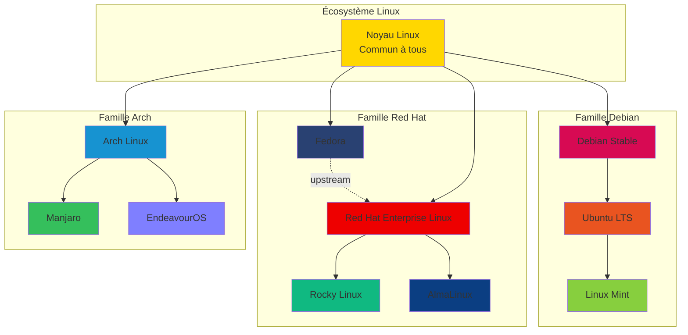

### Tableau de Synthèse Rapide

| Critère | Debian/Ubuntu | Red Hat/Rocky | Arch Linux |
|---------|---------------|---------------|------------|
| **Gestionnaire** | apt / dpkg | dnf / yum / rpm | pacman |
| **Format paquet** | .deb | .rpm | .pkg.tar.zst |
| **Philosophie** | Stabilité maximale | Innovation contrôlée | Simplicité conceptuelle |
| **Cycle** | LTS (5 ans) | LTS (10 ans) | Rolling release[^1] |
| **Public** | Débutants, serveurs web | Entreprise, cloud | Power users, formation |
| **Installation** | Guidée graphique | Semi-automatique | Manuelle complète |
| **Documentation** | Wiki Ubuntu | Red Hat Docs | Arch Wiki[^2] |

---

## PARTIE 1 : La Famille Debian/Ubuntu (apt)

### Philosophie Générale

La famille Debian privilégie la **stabilité absolue** au détriment de la nouveauté. Chaque paquet est testé exhaustivement avant d'être intégré dans la distribution stable.

**Principe fondamental** : "Ne rien casser jamais"

**Devise Debian** : "The Universal Operating System"

### Histoire et Écosystème
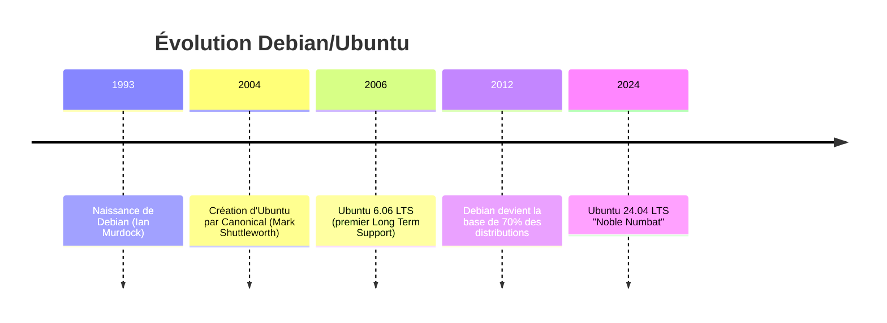

**Dérivées principales** :

- **Debian Stable** : la distribution mère, ultra-stable
- **Ubuntu LTS** : version commerciale avec support Canonical
- **Linux Mint** : Ubuntu simplifié pour débutants
- **Pop!_OS** : Ubuntu optimisé pour développeurs (System76)

### Le Gestionnaire APT (Advanced Package Tool)

#### Architecture de Gestion des Paquets
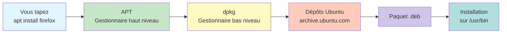

#### Commandes APT Essentielles
```bash
# Mise à jour de la liste des paquets disponibles
# apt consulte les dépôts configurés dans /etc/apt/sources.list
sudo apt update

# Mise à niveau de tous les paquets installés
# apt télécharge et installe les nouvelles versions
sudo apt upgrade

# Installation d'un paquet
# -y : répond automatiquement "yes" aux confirmations
sudo apt install -y <nom_paquet>

# Recherche d'un paquet
# apt interroge la base de données locale des paquets
apt search <mot_clé>

# Affichage des informations détaillées d'un paquet
# version, dépendances, description, mainteneur
apt show <nom_paquet>

# Suppression d'un paquet
# remove : garde les fichiers de configuration
sudo apt remove <nom_paquet>

# Suppression complète (paquet + configuration)
# purge : supprime tout, y compris /etc/<paquet>/
sudo apt purge <nom_paquet>

# Nettoyage des paquets téléchargés obsolètes
# libère de l'espace disque dans /var/cache/apt/archives/
sudo apt autoremove
sudo apt clean
```

#### Structure des Dépôts Debian/Ubuntu

Les dépôts sont organisés en **quatre catégories** :

| Catégorie | Contenu | Licence | Support |
|-----------|---------|---------|---------|
| **main** | Logiciels libres officiels | Open Source | Canonical |
| **restricted** | Pilotes propriétaires essentiels | Propriétaire | Canonical |
| **universe** | Logiciels libres communautaires | Open Source | Communauté |
| **multiverse** | Logiciels propriétaires non-essentiels | Propriétaire | Communauté |

**Configuration des dépôts** : `/etc/apt/sources.list`
```bash
# Exemple de contenu (Ubuntu 24.04 LTS)
deb http://archive.ubuntu.com/ubuntu/ noble main restricted universe multiverse
deb http://archive.ubuntu.com/ubuntu/ noble-updates main restricted universe multiverse
deb http://security.ubuntu.com/ubuntu/ noble-security main restricted universe multiverse
```

### Cycle de Vie Ubuntu LTS
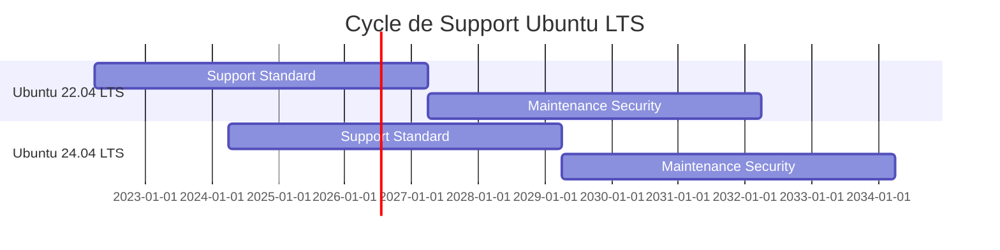

**Points clés** :

- **LTS** : Long Term Support = 5 ans de mises à jour standard + 5 ans optionnels (ESM[^3])
- **Versions intermédiaires** : tous les 6 mois (ex : 23.10, 24.10) = 9 mois de support seulement
- **Stratégie entreprise** : toujours utiliser les versions LTS

### Avantages Debian/Ubuntu dans Arch-Lab

| Avantage | Impact pour vous |
|----------|------------------|
| **Stabilité maximale** | Système fiable pour les services critiques |
| **Documentation abondante** | Solutions faciles à trouver sur forums |
| **Grande communauté** | Support rapide en cas de problème |
| **Compatibilité logicielle** | La plupart des logiciels supportent Ubuntu |
| **Installation simple** | Idéal si vous débutez avec Linux |

### Cas d'Usage Professionnels

**Vous utiliserez Debian/Ubuntu pour** :

- Serveurs web (LAMP/LEMP stack)
- Environnements de production stables
- Systèmes nécessitant un support long terme
- Premiers pas en administration Linux
- Comparaison avec Arch (stabilité vs nouveauté)

!!! tip "Dans Arch-Lab"
    Ubuntu représente le **système de référence stable**. Vous pourrez comparer son comportement avec Arch (rolling) et Rocky (entreprise) dans des scénarios identiques.

---

## PARTIE 2 : La Famille Red Hat/Rocky (dnf/yum)

### Philosophie Générale

La famille Red Hat cherche l'équilibre entre **innovation et stabilité entreprise**. Contrairement à Debian (ultra-conservateur) et Arch (ultra-moderne), Red Hat propose des technologies récentes mais **rigoureusement testées et certifiées**.

**Principe fondamental** : "Innovation sous contrôle qualité stricte"

**Devise Red Hat** : "The Open Source Leader"

### Histoire et Écosystème
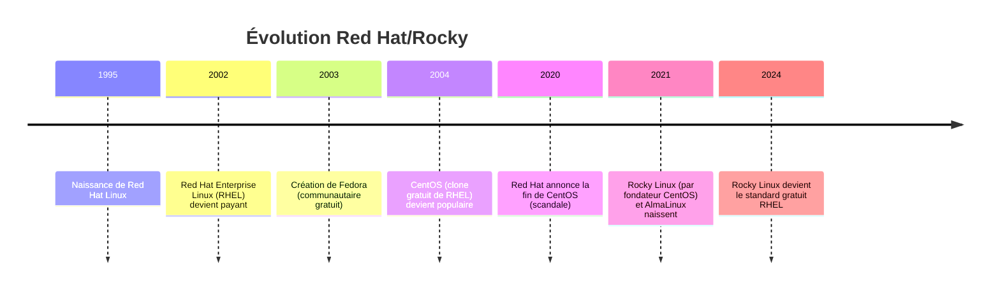

**Dérivées principales** :

- **RHEL** : version commerciale avec support Red Hat (payant)
- **Fedora** : version "laboratoire" avec technologies modernes (gratuit)
- **Rocky Linux** : clone gratuit 1:1 de RHEL (gratuit)
- **AlmaLinux** : autre clone RHEL soutenu par CloudLinux (gratuit)

### Pourquoi Rocky Linux dans Arch-Lab ?

**Rocky Linux est un clone bug-for-bug de RHEL**, ce qui signifie :

1. **100% compatible binaire** avec RHEL
2. **Mêmes paquets RPM** que RHEL
3. **Mêmes certifications** que RHEL (PCI-DSS, ISO 27001...)
4. **Gratuit et open source**

!!! info "Rocky vs CentOS"
    CentOS était le clone gratuit historique de RHEL. En 2020, Red Hat a annoncé la fin de CentOS et son remplacement par CentOS Stream (version "bêta" de RHEL). 
    
    La communauté a créé Rocky Linux pour maintenir un clone stable gratuit de RHEL.

### Le Gestionnaire DNF (Dandified YUM)

#### Architecture de Gestion des Paquets
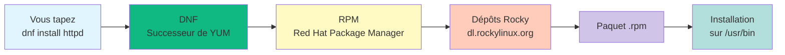

#### Commandes DNF Essentielles
```bash
# Mise à jour de la liste des paquets disponibles
# dnf consulte les dépôts configurés dans /etc/yum.repos.d/
sudo dnf check-update

# Mise à niveau de tous les paquets installés
# dnf télécharge et installe les nouvelles versions
sudo dnf upgrade

# Installation d'un paquet
# -y : répond automatiquement "yes" aux confirmations
sudo dnf install -y <nom_paquet>

# Recherche d'un paquet
# dnf interroge les métadonnées des dépôts
dnf search <mot_clé>

# Affichage des informations détaillées d'un paquet
# version, architecture, dépendances, description
dnf info <nom_paquet>

# Suppression d'un paquet
# remove : supprime le paquet et les dépendances non utilisées
sudo dnf remove <nom_paquet>

# Nettoyage du cache des paquets téléchargés
# libère de l'espace disque dans /var/cache/dnf/
sudo dnf clean all

# Installation d'un groupe de paquets
# ex : "Development Tools" installe gcc, make, autoconf...
sudo dnf groupinstall "Nom du Groupe"

# Liste des groupes disponibles
dnf grouplist

# Installation d'un module spécifique (fonctionnalité avancée)
# permet d'avoir plusieurs versions d'un logiciel (ex : PHP 7.4 et 8.1)
sudo dnf module install <module>:<version>
```

#### Différences DNF vs YUM

| Aspect | YUM (ancien) | DNF (moderne) |
|--------|--------------|---------------|
| **Résolution dépendances** | Parfois lente | Rapide (libsolv) |
| **Mémoire RAM** | ~300 Mo | ~100 Mo |
| **Gestion erreurs** | Basique | Avancée |
| **API Python** | Python 2 | Python 3 |
| **Statut** | Déprécié | Actif |

**Vous utiliserez DNF** (pas YUM) dans Rocky Linux 9.x.

#### Structure des Dépôts Rocky Linux
```bash
# Fichiers de configuration : /etc/yum.repos.d/
ls /etc/yum.repos.d/
# rocky.repo
# rocky-addons.repo
# rocky-extras.repo
```

**Dépôts principaux** :

| Dépôt | Contenu | Mise à jour |
|-------|---------|-------------|
| **BaseOS** | Système de base minimal | Stable |
| **AppStream** | Applications et langages | Modules[^4] |
| **Extras** | Logiciels additionnels | Communauté |
| **PowerTools** | Outils de développement | Optionnel |

### SELinux : La Spécificité Red Hat

**SELinux (Security-Enhanced Linux)** est un système de **contrôle d'accès obligatoire** développé par la NSA et activé par défaut sous Rocky/RHEL.

#### Modes SELinux
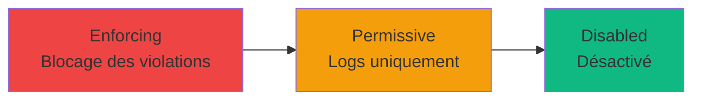
```bash
# Vérifier le statut SELinux
sestatus

# Résultat attendu sous Rocky :
# SELinux status:                 enabled
# Current mode:                   enforcing

# Passer temporairement en mode permissif (jusqu'au reboot)
sudo setenforce 0

# Vérifier le mode actuel
getenforce
```

!!! warning "SELinux et apprentissage"
    SELinux peut bloquer des actions légitimes si mal configuré. Dans Arch-Lab, **vous apprendrez** à :
    
    - Diagnostiquer les blocages SELinux avec `ausearch` et `audit2why`
    - Créer des politiques personnalisées avec `audit2allow`
    - Désactiver SELinux uniquement pour tests (jamais en production)

### Cycle de Vie Rocky Linux
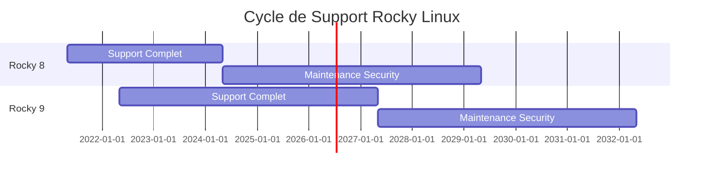

**Points clés** :

- **10 ans de support total** (identique à RHEL)
- **Versions majeures tous les 3-4 ans** (8, 9, 10...)
- **Updates mineures** tous les 6 mois (9.0, 9.1, 9.2...)
- **Stabilité absolue** : pas de changements majeurs pendant le cycle

### Avantages Red Hat/Rocky dans Arch-Lab

| Avantage | Impact pour vous |
|----------|------------------|
| **Standard entreprise** | Compétences valorisables en entreprise |
| **Certifications professionnelles** | RHCSA, RHCE reconnus mondialement |
| **Support 10 ans** | Idéal pour infrastructures critiques |
| **SELinux intégré** | Sécurité renforcée par défaut |
| **Écosystème cloud** | AWS, Azure, GCP utilisent RHEL/Rocky |
| **Modules DNF** | Gestion multi-versions simplifiée |

### Cas d'Usage Professionnels

**Vous utiliserez Rocky Linux pour** :

- Infrastructures cloud (AWS EC2, Azure VMs)
- Serveurs nécessitant certifications (banques, hôpitaux)
- Environnements DevOps/Kubernetes (OpenShift)
- Apprentissage écosystème Red Hat avant RHCSA
- Comparaison avec Ubuntu (dnf vs apt)

!!! tip "Dans Arch-Lab"
    Rocky représente le **système entreprise**. Vous comprendrez pourquoi les grandes entreprises privilégient Red Hat : stabilité + innovation + support + certifications.

---

## PARTIE 3 : La Famille Arch Linux (pacman)

### Philosophie Générale

Arch Linux adopte une approche radicalement différente : **simplicité conceptuelle et transparence totale**. Aucune couche d'abstraction, aucun automatisme caché. Vous construisez votre système pièce par pièce.

**Principe fondamental** : "Keep It Simple, Stupid" (KISS)

**Devise Arch** : "A simple, lightweight distribution"

### Histoire et Écosystème
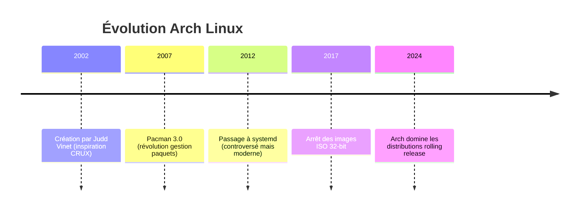

**Dérivées principales** :

- **Arch Linux** : distribution mère minimaliste
- **Manjaro** : Arch simplifié avec installeur graphique
- **EndeavourOS** : Arch avec installation assistée légère
- **Garuda Linux** : Arch optimisé gaming avec Btrfs

!!! info "Pourquoi Arch est difficile"
    Arch n'est pas "difficile" techniquement. Il est **exigeant intellectuellement**. Il **vous oblige** à comprendre chaque composant au lieu de les cacher derrière des menus graphiques.

### Le Gestionnaire Pacman (Package Manager)

#### Architecture de Gestion des Paquets
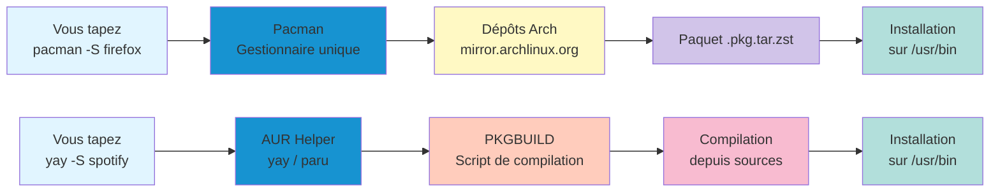

#### Commandes Pacman Essentielles
```bash
# Synchronisation des bases de données + mise à jour complète
# -S : synchronise (install)
# -y : rafraîchit la base de données des dépôts
# -u : met à jour tous les paquets installés
sudo pacman -Syu

# Installation d'un paquet
# -S : synchronise et installe
sudo pacman -S <nom_paquet>

# Installation de plusieurs paquets en une commande
sudo pacman -S <paquet1> <paquet2> <paquet3>

# Recherche d'un paquet
# -Ss : search sync (dans les dépôts)
pacman -Ss <mot_clé>

# Affichage des informations détaillées d'un paquet
# -Si : sync info
pacman -Si <nom_paquet>

# Suppression d'un paquet (garde les dépendances)
# -R : remove
sudo pacman -R <nom_paquet>

# Suppression d'un paquet + dépendances inutilisées + fichiers config
# -Rns : remove + no save + dependencies
sudo pacman -Rns <nom_paquet>

# Nettoyage du cache des paquets téléchargés
# Libère de l'espace disque dans /var/cache/pacman/pkg/
# -Sc : sync clean (garde uniquement versions installées)
sudo pacman -Sc

# Nettoyage complet (supprime TOUT le cache)
# -Scc : sync clean clean (dangereux, impossible de downgrade)
sudo pacman -Scc

# Liste de tous les paquets installés
# -Q : query (paquets installés localement)
pacman -Q

# Recherche dans les paquets installés
# -Qs : query search
pacman -Qs <mot_clé>

# Informations sur un paquet installé
# -Qi : query info
pacman -Qi <nom_paquet>

# Lister les fichiers d'un paquet installé
# -Ql : query list
pacman -Ql <nom_paquet>

# Trouver quel paquet possède un fichier
# -Qo : query owner
pacman -Qo /usr/bin/firefox
```

#### Le AUR (Arch User Repository)

Le **AUR** est un dépôt communautaire contenant **85 000+ paquets** non officiels.

**Caractéristiques** :

- **PKGBUILD** : recettes de compilation transparentes
- **Compilation locale** : vous compilez depuis les sources
- **Communautaire** : maintenus par des utilisateurs, pas Arch
- **Dangereux potentiellement** : vérifiez toujours le PKGBUILD avant installation
```bash
# Installation d'un AUR helper (yay recommandé)
# yay est lui-même dans l'AUR, donc installation manuelle initiale

# 1. Installer les outils de compilation
sudo pacman -S --needed base-devel git

# 2. Cloner le dépôt yay
git clone https://aur.archlinux.org/yay.git
cd yay

# 3. Compiler et installer yay
makepkg -si
# makepkg : compile le PKGBUILD
# -s : installe automatiquement les dépendances
# -i : installe le paquet compilé

# 4. Utiliser yay comme pacman
yay -S spotify  # Installe Spotify depuis l'AUR
yay -Syu        # Met à jour système + paquets AUR
```

!!! danger "Sécurité AUR"
    **TOUJOURS** vérifier le PKGBUILD avant installation :
```bash
    yay -G <paquet>  # Télécharge le PKGBUILD sans installer
    cd <paquet>
    cat PKGBUILD     # Lire le script de compilation
```
    
    Un PKGBUILD malveillant peut exécuter n'importe quel code sur votre système.

#### Structure des Dépôts Arch
```bash
# Fichier de configuration : /etc/pacman.conf
cat /etc/pacman.conf
```

**Dépôts officiels** :

| Dépôt | Contenu | Stabilité |
|-------|---------|-----------|
| **core** | Système de base | Testé |
| **extra** | Logiciels additionnels | Testé |
| **multilib** | Paquets 32-bit (pour Wine, Steam...) | Testé |

**Dépôts communautaires** :

| Dépôt | Contenu | Stabilité |
|-------|---------|-----------|
| **AUR** | Tout le reste (85 000+ paquets) | Variable |

### Rolling Release : Avantages et Inconvénients
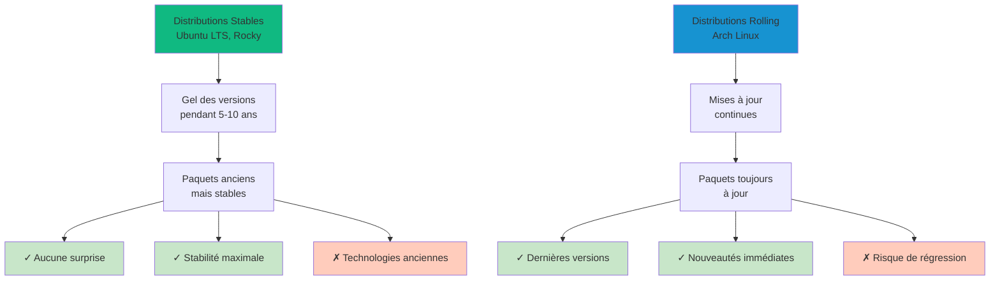

**Exemple concret** :

| Logiciel | Ubuntu 24.04 LTS | Arch Linux (aujourd'hui) |
|----------|------------------|--------------------------|
| **Kernel Linux** | 6.8 (avril 2024) | 6.11 (décembre 2024) |
| **Firefox** | 115 ESR | 133 |
| **Python** | 3.12 | 3.13 |
| **Node.js** | 18 LTS | 23 |
| **Docker** | 24.0 | 27.3 |

### Arch Wiki : La Meilleure Documentation Linux

Le **Arch Wiki** est considéré comme la ressource Linux la plus complète au monde.

**Pourquoi c'est exceptionnel** :

- Couvre **tous les aspects** d'un système Linux (pas que Arch)
- Maintenu **quotidiennement** par la communauté
- Explications **techniques précises** sans simplification excessive
- Utilisable pour **n'importe quelle distribution**

**Exemples de pages indispensables** :

- [Installation Guide](https://wiki.archlinux.org/title/Installation_guide)
- [Network Configuration](https://wiki.archlinux.org/title/Network_configuration)
- [Systemd](https://wiki.archlinux.org/title/Systemd)
- [GRUB](https://wiki.archlinux.org/title/GRUB) (même si vous utilisez Ubuntu)

!!! tip "Conseil professionnel"
    Même si vous n'utilisez jamais Arch, **bookmarkez le Arch Wiki**. C'est une ressource inestimable pour résoudre des problèmes sous Ubuntu, Fedora, Debian...

### Avantages Arch Linux dans Arch-Lab

| Avantage | Impact pour vous |
|----------|------------------|
| **Apprentissage maximal** | Vous comprenez TOUT le système |
| **Toujours à jour** | Dernières technologies disponibles |
| **Contrôle total** | Aucune magie noire, tout transparent |
| **Documentation exceptionnelle** | Arch Wiki = référence mondiale |
| **Minimalisme** | Système ultra-léger, personnalisable |
| **AUR** | 85 000+ paquets communautaires |

### Cas d'Usage Professionnels

**Vous utiliserez Arch Linux pour** :

- **Formation système** : comprendre Linux en profondeur
- **Postes de travail développeurs** : toujours les dernières versions
- **Laboratoires d'apprentissage** : environnement cassable/réparable
- **Veille technologique** : tester immédiatement les nouveautés
- **Comparaison avec distributions stables** : rolling vs LTS

!!! tip "Dans Arch-Lab"
    Arch est le **système pédagogique**. En l'installant manuellement (Module 3), vous comprendrez comment fonctionnent TOUS les systèmes Linux (Ubuntu, Rocky, Debian...).

---

## Tableau Comparatif Complet

### Gestion des Paquets

| Opération | Debian/Ubuntu (apt) | Red Hat/Rocky (dnf) | Arch (pacman) |
|-----------|---------------------|---------------------|---------------|
| **Mettre à jour la base** | `sudo apt update` | `sudo dnf check-update` | `sudo pacman -Sy` |
| **Mettre à jour système** | `sudo apt upgrade` | `sudo dnf upgrade` | `sudo pacman -Syu` |
| **Installer paquet** | `sudo apt install <pkg>` | `sudo dnf install <pkg>` | `sudo pacman -S <pkg>` |
| **Rechercher paquet** | `apt search <term>` | `dnf search <term>` | `pacman -Ss <term>` |
| **Infos paquet** | `apt show <pkg>` | `dnf info <pkg>` | `pacman -Si <pkg>` |
| **Supprimer paquet** | `sudo apt remove <pkg>` | `sudo dnf remove <pkg>` | `sudo pacman -R <pkg>` |
| **Supprimer complet** | `sudo apt purge <pkg>` | `sudo dnf remove <pkg>` | `sudo pacman -Rns <pkg>` |
| **Nettoyer cache** | `sudo apt clean` | `sudo dnf clean all` | `sudo pacman -Sc` |
| **Lister installés** | `apt list --installed` | `dnf list installed` | `pacman -Q` |

### Philosophies et Priorités
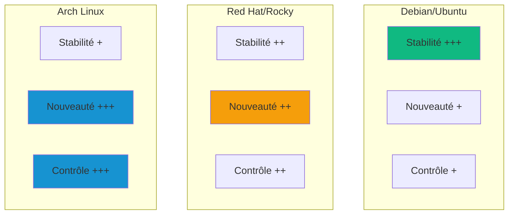

### Scénarios d'Utilisation

| Besoin | Distribution Recommandée | Justification |
|--------|-------------------------|---------------|
| **Serveur web production** | Ubuntu LTS | Stabilité 5 ans, support Canonical |
| **Infrastructure cloud** | Rocky Linux | Standard entreprise, certifications |
| **Poste développeur** | Arch Linux | Dernières versions, flexibilité totale |
| **Débutant Linux** | Ubuntu Desktop | Installation simple, grande communauté |
| **Apprentissage système** | Arch Linux | Compréhension maximale |
| **Serveur critique** | Rocky Linux | Support 10 ans, SELinux |
| **Laboratoire pentest** | Arch Linux | Outils à jour, cassable sans risque |

---

## Pourquoi Arch-Lab Combine les Trois Familles

**Vous allez comprendre** les différences **par la pratique** :

1. **Installer Arch manuellement** (Module 3) → compréhension profonde du système
2. **Déployer Ubuntu** (Module 6) → observer la différence apt vs pacman
3. **Intégrer Rocky** (Module 6) → découvrir l'écosystème Red Hat/dnf + SELinux
4. **Comparer les comportements** → même tâche, trois approches différentes

### Exemple Concret : Installer un Serveur Web

**Ubuntu (apt)** :
```bash
sudo apt update
sudo apt install -y apache2
sudo systemctl start apache2
# Configuration dans /etc/apache2/
```

**Rocky (dnf)** :
```bash
sudo dnf install -y httpd
sudo systemctl start httpd
sudo firewall-cmd --add-service=http --permanent
sudo firewall-cmd --reload
# Configuration dans /etc/httpd/
# SELinux peut bloquer → audit2why + audit2allow
```

**Arch (pacman)** :
```bash
sudo pacman -S apache
sudo systemctl start httpd
# Configuration dans /etc/httpd/
# Fichier de config souvent plus épuré
```

**Vous constatez** :

- Noms de paquets différents (`apache2` vs `httpd` vs `apache`)
- Localisations différentes (`/etc/apache2/` vs `/etc/httpd/`)
- Complexités variables (SELinux sous Rocky, simplicité sous Arch)

---

## Le Mot de la Fin

Félicitations ! Vous avez terminé le Module 2, la base théorique essentielle d'Arch-Lab.

### Ce que vous avez appris

- Les trois grandes familles Linux : **Debian/Ubuntu**, **Red Hat/Rocky**, **Arch**
- Leurs gestionnaires de paquets : **apt**, **dnf**, **pacman**
- Leurs philosophies : **stabilité**, **entreprise**, **apprentissage**
- Leurs cycles de vie : **LTS**, **10 ans**, **rolling release**
- Leurs cas d'usage professionnels respectifs
- Pourquoi Arch-Lab combine ces trois univers

### Points clés à retenir

1. **Debian/Ubuntu** = stabilité maximale, idéal production/débutants
2. **Red Hat/Rocky** = standard entreprise, certifications, SELinux
3. **Arch Linux** = apprentissage maximal, contrôle total, toujours à jour
4. **Chaque famille répond à des besoins différents**, aucune n'est "meilleure"
5. **Maîtriser les trois** vous rend polyvalent et employable

### Vérification de Compréhension

**Avant de passer au Module 3, assurez-vous de pouvoir répondre à :**

- [ ] Quelle est la différence entre LTS et rolling release ?
- [ ] Pourquoi Rocky Linux est-il gratuit alors que RHEL est payant ?
- [ ] Qu'est-ce que le AUR et pourquoi est-il potentiellement dangereux ?
- [ ] Quelle distribution choisir pour un serveur critique en production ?
- [ ] Pourquoi le Arch Wiki est-il utile même si vous utilisez Ubuntu ?

!!! success "Si vous répondez oui à tout"
    Vous êtes prêt pour le **Module 3 : Installation Arch Linux Serveur**, le module le plus technique du parcours.

### Prochaine étape

Le **Module 3** vous plonge dans l'installation manuelle complète d'Arch Linux. Vous allez :

- Partitionner un disque en mode UEFI/GPT
- Installer le système de base avec `pacstrap`
- Configurer le bootloader systemd-boot
- Créer un utilisateur administrateur
- Comprendre chaque étape du boot Linux

**C'est le module le plus exigeant mais aussi le plus formateur.** Prévoyez 90-120 minutes ininterrompues et une concentration maximale.

**Prenez une pause de 15-20 minutes, hydratez-vous, puis attaquez le Module 3 !**

[:lucide-arrow-right: Accéder au Module 3](./03-arch-serveur.md){ .md-button .md-button--primary }

---

## Ressources Complémentaires

### Documentation Officielle

- [Arch Wiki - List of Distributions](https://wiki.archlinux.org/title/Arch_compared_to_other_distributions)
- [Ubuntu Documentation](https://help.ubuntu.com/)
- [Rocky Linux Docs](https://docs.rockylinux.org/)
- [Red Hat Customer Portal](https://access.redhat.com/)

### Comparaisons Approfondies

- [DistroWatch](https://distrowatch.com/) - statistiques et comparaisons
- [Pacman Rosetta](https://wiki.archlinux.org/title/Pacman/Rosetta) - équivalences commandes
- [RPM vs DEB](https://wiki.debian.org/RPM) - différences formats paquets

### Communautés

- [r/archlinux](https://reddit.com/r/archlinux)
- [r/Ubuntu](https://reddit.com/r/Ubuntu)
- [r/RockyLinux](https://reddit.com/r/RockyLinux)

---

**Vous maîtrisez maintenant les fondations théoriques. Place à la pratique avec l'installation d'Arch Linux !**

[^1]: **Rolling release** : modèle où le système est mis à jour en continu sans versions majeures. Pas de "Ubuntu 22.04 → 24.04", mais toujours la dernière version.

[^2]: **Arch Wiki** : considéré comme la meilleure documentation Linux au monde, utilisable même pour d'autres distributions. [wiki.archlinux.org](https://wiki.archlinux.org)
[^3]: **ESM (Extended Security Maintenance)** : support étendu payant proposé par Canonical pour les entreprises nécessitant 10 ans de support total.
[^4]: **Modules DNF** : permettent d'installer plusieurs versions d'un logiciel simultanément. Exemple : PHP 7.4 pour app legacy + PHP 8.3 pour app moderne.

