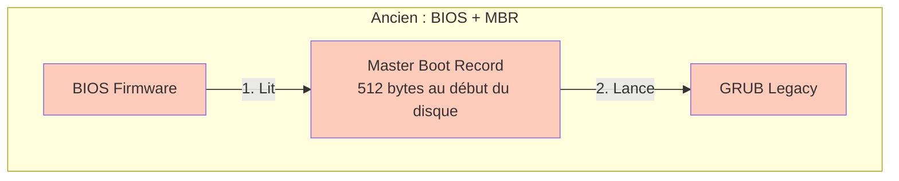
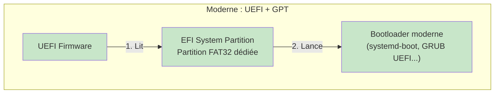
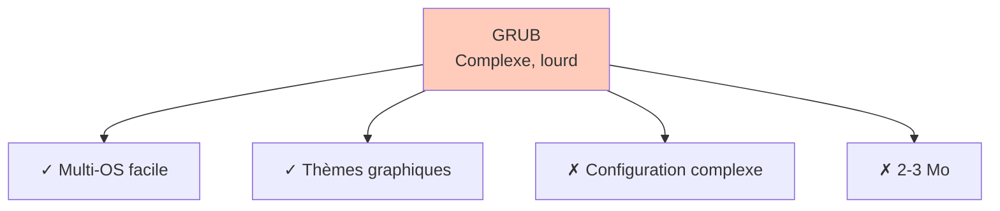
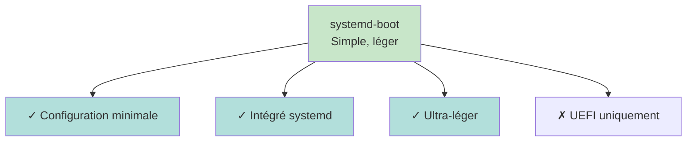
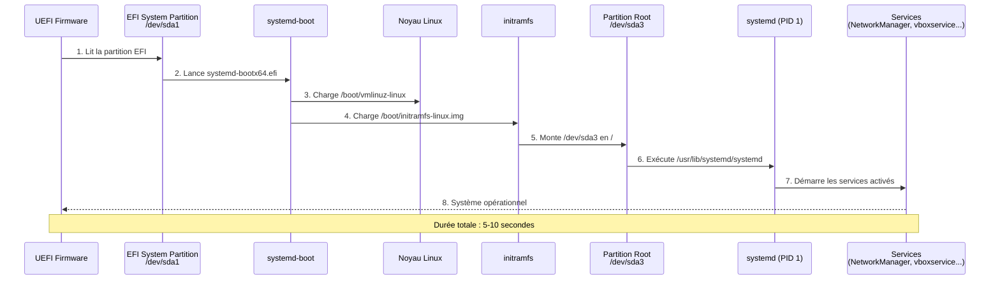

# Module 3 : Installation Arch Linux Serveur

<div
  class="omny-meta"
  data-level="🟡 Intermédiaire"
  data-version="0.2"
  data-time="90-120 minutes (total module)">
</div>

## Introduction

Bienvenue dans le module le plus technique et le plus formateur d'Arch-Lab. Vous allez **installer manuellement** un serveur Arch Linux minimal sous VirtualBox, en mode UEFI/GPT avec systemd-boot comme bootloader.

Ce module constitue le **socle fondamental** de votre laboratoire. Contrairement à Ubuntu qui propose un installeur graphique, Arch **vous oblige** à comprendre chaque étape du processus d'installation. C'est exigeant, mais c'est ainsi que **vous comprendrez réellement** comment fonctionne un système Linux moderne.

!!! quote "Philosophie de ce module"
    Vous n'allez pas simplement "installer Arch". Vous allez **construire** un système Linux de zéro en comprenant :
    
    - Comment le firmware UEFI démarre un OS
    - Comment partitionner un disque en GPT
    - Comment le noyau Linux initialise le système
    - Comment `systemd` prend le relais après le boot
    - Comment NetworkManager gère le réseau
    
    À la fin, **vous saurez ce que fait chaque fichier, chaque commande, chaque configuration**.

## Objectifs d'Apprentissage

> À la fin de ce module, **vous serez capable de réaliser quatre phases bien distincte telle que** :

??? abstract "Préparation et Partitionnement"

    - [ ] Créer et configurer une VM VirtualBox en mode UEFI
    - [ ] Démarrer sur l'ISO Arch et vérifier la connectivité réseau
    - [ ] Comprendre le schéma de partitionnement UEFI/GPT moderne
    - [ ] Partitionner un disque avec `cfdisk` (EFI + swap + root)
    - [ ] Formater les partitions (FAT32, swap, ext4)
    - [ ] Monter correctement le système de fichiers

??? abstract "Installation et Configuration Système"

    - [ ] Installer le système de base avec `pacstrap`
    - [ ] Générer automatiquement le fichier `fstab`
    - [ ] Entrer dans le système installé avec `arch-chroot`
    - [ ] Configurer timezone, locales et hostname
    - [ ] Définir les mots de passe (root et utilisateur)

??? abstract "Bootloader et Administration"

    - [ ] Installer et configurer systemd-boot (bootloader UEFI)
    - [ ] Créer des entrées de boot fonctionnelles
    - [ ] Créer un utilisateur administrateur avec droits sudo
    - [ ] Configurer le groupe wheel pour les privilèges
    - [ ] Activer NetworkManager pour la gestion réseau automatique

??? abstract "Finalisation et Intégration"

    - [ ] Installer les Guest Additions VirtualBox
    - [ ] Démonter proprement le système avant reboot
    - [ ] Valider le premier démarrage du système
    - [ ] Vérifier réseau, sudo, services et espaces disque
    - [ ] Créer un snapshot VirtualBox de référence

## Prérequis

Avant de commencer, **assurez-vous d'avoir** :

- [ ] **VirtualBox 7.0+** installé et fonctionnel
- [ ] **ISO Arch Linux** téléchargée ([archlinux.org/download](https://archlinux.org/download/))
- [ ] **Extension Pack VirtualBox** installé (pour USB 3.0)
- [ ] **2-3 heures devant vous** sans interruption
- [ ] **Connexion Internet stable** (pour télécharger les paquets)
- [ ] **Modules 1 et 2 lus** (vision globale + panorama Linux)

!!! warning "Important"
    L'installation d'Arch demande **concentration et précision**. Une erreur de partition peut rendre le système non bootable. Heureusement, avec VirtualBox, vous pouvez tout recommencer sans risque.

## Comprendre Avant d'Agir

!!! info "L'installation manuelle d'Arch Linux est un **processus long et exigeant** qui peut sembler intimidant au premier abord. Contrairement aux distributions comme Ubuntu qui automatisent tout derrière un installeur graphique, Arch **vous demande de comprendre et d'exécuter chaque étape** du processus."

**Pourquoi 28 étapes ?**

Nous avons volontairement décomposé l'installation en **28 étapes distinctes et numérotées** pour plusieurs raisons pédagogiques essentielles :

1. **Clarté maximale** : _chaque étape traite d'un concept unique (partitionnement, formatage, bootloader, utilisateur...)_
2. **Progression logique** : _vous avancez étape par étape sans vous perdre dans un processus monolithique_
3. **Points de contrôle** : _après chaque étape, vous pouvez vérifier que tout fonctionne avant de continuer_
4. **Compréhension profonde** : _en isolant chaque action, vous comprenez son rôle précis dans le système final_
5. **Débogage facilité** : _si un problème survient, vous savez exactement où il s'est produit_

!!! danger "Durée réaliste"
    **Prévoyez 90 à 120 minutes** pour l'installation complète si vous suivez attentivement chaque étape. C'est normal et même souhaitable de prendre son temps. Un professionnel expérimenté peut installer Arch en 20-30 minutes, mais il a déjà tout compris. Votre objectif ici est **d'apprendre**, pas de battre un record de vitesse.

### Structure des 28 Étapes

Les étapes sont organisées en **quatre grandes phases** correspondant aux diagrammes qui seront présentés :

| Phase | Étapes | Objectif | Durée estimée |
|-------|--------|----------|---------------|
| **Phase 1 : Préparation** | 1 à 8 | Créer la VM, partitionner et formater le disque | 20-30 min |
| **Phase 2 : Installation** | 9 à 15 | Installer le système de base et le configurer | 30-40 min |
| **Phase 3 : Bootloader** | 16 à 20 | Rendre le système bootable et créer l'utilisateur | 20-25 min |
| **Phase 4 : Finalisation** | 21 à 28 | Optimiser, tester et créer le snapshot de référence | 20-25 min |

### Ce que Vous Allez Vraiment Faire

Concrètement, voici ce que représentent ces 28 étapes :

- **Étapes 1-2** : Préparer l'environnement VirtualBox (VM + ISO)
- **Étapes 3-5** : Démarrer et configurer l'environnement live
- **Étapes 6-8** : Préparer le disque (partitionner, formater, monter)
- **Étapes 9-11** : Installer Linux et entrer dans le système
- **Étapes 12-15** : Configurer langue, fuseau horaire, réseau et mot de passe root
- **Étapes 16-17** : Installer et configurer le bootloader systemd-boot
- **Étapes 18-20** : Créer l'utilisateur admin et activer les services réseau
- **Étapes 21-22** : Installer les Guest Additions et démonter proprement
- **Étapes 23-25** : Premier démarrage et vérifications complètes
- **Étapes 26-27** : Configuration SSH et mise à jour système
- **Étape 28** : Snapshot final du système opérationnel

### Vue d'Ensemble du Processus d'Installation

=== "Diagramme de Séquence Complet"

    L'installation d'Arch Linux suit un **processus linéaire en 28 étapes** que vous allez exécuter dans l'ordre. Ce diagramme représente l'intégralité du parcours, depuis la création de la VM jusqu'au snapshot final. Chaque étape numérotée correspond à une action précise que **vous** effectuerez.

    **Comment lire ce diagramme ?**

    - Les **flèches pleines** (→) représentent vos actions
    - Les **flèches pointillées** (-->) représentent les réponses du système
    - Les **notes jaunes** détaillent ce qui se passe en arrière-plan
    - Les **séparateurs horizontaux** regroupent les étapes par thématique (préparation, installation, boot, finalisation)

    Ce diagramme vous permet de **visualiser où vous en êtes** tout au long de l'installation. Utilisez-le comme une carte pour ne pas vous perdre dans le processus.

    ```mermaid
    sequenceDiagram
        participant You as Vous
        participant VB as VirtualBox
        participant ISO as ISO Arch Live
        participant Disk as Disque /dev/sda
        participant Sys as Système Installé
        
        rect rgb(230, 245, 255)
            Note over You,Sys: PHASE PRÉPARATION (Étapes 1-8)
        end
        
        You->>VB: 1. Créer VM "Arch-Server"<br/>(UEFI activé)
        VB-->>You: VM créée
        
        You->>VB: 2. Monter ISO Arch
        VB-->>ISO: ISO chargée
        
        You->>ISO: 3. Boot sur ISO
        ISO-->>You: Prompt root@archiso
        
        You->>ISO: 4. Vérifier réseau (ping)
        ISO-->>You: Connectivité OK
        
        You->>ISO: 5. Configurer clavier FR
        ISO-->>You: Clavier français actif
        
        You->>Disk: 6. Partitionner (cfdisk)
        Note over Disk: sda1 (EFI 512M)<br/>sda2 (swap 2G)<br/>sda3 (root ~36G)
        
        You->>Disk: 7. Formater partitions
        Note over Disk: FAT32, swap, ext4
        
        You->>Disk: 8. Monter /mnt + /mnt/boot
        Disk-->>You: Système de fichiers prêt
        
        rect rgb(255, 245, 230)
            Note over You,Sys: PHASE INSTALLATION (Étapes 9-15)
        end
        
        You->>Sys: 9. pacstrap /mnt base linux...
        Note over Sys: Téléchargement<br/>~500-800 Mo
        Sys-->>You: Système installé
        
        You->>Sys: 10. genfstab -U /mnt
        Note over Sys: /etc/fstab généré
        
        You->>Sys: 11. arch-chroot /mnt
        Sys-->>You: Entrée dans le système
        
        You->>Sys: 12. Timezone + hwclock
        Note over Sys: Europe/Paris configuré
        
        You->>Sys: 13. Locales (locale-gen)
        Note over Sys: fr_FR.UTF-8 + en_US.UTF-8
        
        You->>Sys: 14. Hostname + /etc/hosts
        Note over Sys: arch-server configuré
        
        You->>Sys: 15. passwd (root)
        Note over Sys: Mot de passe root défini
        
        rect rgb(230, 255, 230)
            Note over You,Sys: PHASE BOOTLOADER (Étapes 16-20)
        end
        
        You->>Sys: 16. bootctl install
        Note over Sys: systemd-boot installé<br/>dans /boot/EFI/
        
        You->>Sys: 17. Créer arch.conf + loader.conf
        Note over Sys: Entrée de boot configurée
        
        You->>Sys: 18. useradd -m admin
        Note over Sys: Utilisateur admin créé
        
        You->>Sys: 19. visudo (wheel)
        Note over Sys: sudo activé pour wheel
        
        You->>Sys: 20. systemctl enable NetworkManager
        Note over Sys: Réseau au démarrage activé
        
        rect rgb(255, 230, 230)
            Note over You,Sys: PHASE FINALISATION (Étapes 21-28)
        end
        
        You->>Sys: 21. pacman -S virtualbox-guest-*
        Note over Sys: Guest Additions installées
        
        You->>Sys: 22. exit + umount -R /mnt
        Sys-->>ISO: Retour à l'ISO live
        
        You->>ISO: 23. reboot (retirer ISO)
        ISO-->>VB: Redémarrage
        
        VB->>Sys: 24. Premier boot sur Arch
        Sys-->>You: Login arch-server
        
        You->>Sys: 25. Vérifications complètes
        Note over Sys: ping, ip addr, sudo,<br/>df -h, neofetch
        Sys-->>You: Tous les tests OK
        
        You->>Sys: 26. pacman -S openssh + enable sshd
        Note over Sys: SSH activé
        
        You->>Sys: 27. sudo pacman -Syu
        Note over Sys: Système à jour
        
        You->>Sys: 28. sudo poweroff
        Sys-->>VB: Arrêt propre
        
        You->>VB: Snapshot "Arch-Server-Base"
        VB-->>You: Point de restauration créé
        
        Note over You,Sys: ✓ Installation complète terminée
    ```

    <small>*Ce diagramme représente l'intégralité du processus d'installation d'Arch Linux en 28 étapes séquentielles. Les couleurs distinguent les quatre grandes phases : préparation (bleu), installation (orange), bootloader (vert) et finalisation (rouge). Chaque action que vous effectuez déclenche une réponse du système, formant une chaîne logique depuis la VM vide jusqu'au système opérationnel. Durée totale estimée : 90 à 120 minutes.*</small>

=== "Schéma d'Architecture Cible"

    Avant de commencer l'installation, il est essentiel que **vous compreniez l'architecture finale** que vous allez construire. Ce schéma représente la structure complète du serveur Arch-Server une fois l'installation terminée.

    **Que montre ce schéma ?**

    - **La couche physique** : les trois partitions du disque virtuel 40 Go
    - **La couche logique** : les points de montage du système de fichiers
    - **Le processus de démarrage** : la séquence complète depuis l'UEFI jusqu'à systemd

    **Comment lire ce schéma ?**

    - Les **flèches numérotées** (1→2→3...) montrent l'ordre chronologique du boot
    - Les **flèches pleines** représentent les actions directes (lecture, lancement, montage)
    - Les **flèches pointillées** représentent les relations logiques (swap comme mémoire virtuelle)
    - Les **couleurs** différencient les types de composants (voir légende ci-dessous)

    Ce schéma vous servira de **référence visuelle** tout au long de l'installation pour comprendre où vous en êtes et pourquoi chaque étape est nécessaire.

    ```mermaid
    graph LR
        subgraph "VM Arch-Server"
            UEFI[UEFI Firmware<br/>VirtualBox]
            
            subgraph "Disque /dev/sda (40 Go)"
                EFI["/dev/sda1<br/>EFI System Partition<br/>512 Mo<br/>FAT32"]
                SWAP["/dev/sda2<br/>Linux Swap<br/>2-4 Go<br/>swap"]
                ROOT["/dev/sda3<br/>Root Partition<br/>~36 Go<br/>ext4"]
            end
            
            subgraph "Système de Fichiers Monté"
                BOOT["/boot<br/>(montage de /dev/sda1)"]
                ROOTFS["/\n(montage de /dev/sda3)"]
            end
            
            subgraph "Processus de Boot"
                BOOTLOADER[systemd-boot<br/>dans /boot/EFI/systemd/]
                KERNEL[Noyau Linux<br/>/boot/vmlinuz-linux]
                INITRAMFS[Initramfs<br/>/boot/initramfs-linux.img]
                SYSTEMD[systemd<br/>PID 1]
            end
        end
        
        UEFI -->|1. Lit| EFI
        EFI -->|2. Lance| BOOTLOADER
        BOOTLOADER -->|3. Charge| KERNEL
        KERNEL -->|4. Utilise| INITRAMFS
        INITRAMFS -->|5. Monte| ROOTFS
        ROOTFS -->|6. Exécute| SYSTEMD
        SWAP -.->|Mémoire virtuelle| SYSTEMD
        
        style UEFI fill:#e1f5ff
        style EFI fill:#fff9c4
        style SWAP fill:#ffccbc
        style ROOT fill:#c8e6c9
        style BOOTLOADER fill:#d1c4e9
        style KERNEL fill:#f8bbd0
        style SYSTEMD fill:#b2dfdb
    ```
    <small>*Ce schéma illustre l'architecture complète du serveur Arch-Server après installation. Il se décompose en quatre niveaux : (1) le **disque physique** avec ses trois partitions (EFI, swap, root), (2) les **points de montage** logiques (/ et /boot), (3) le **processus de démarrage** UEFI en 6 étapes séquentielles depuis le firmware jusqu'à systemd, et (4) la **relation swap** qui étend la mémoire RAM. Les couleurs codent les types de composants : bleu clair = firmware, jaune = partition bootable, rouge = swap, vert = système racine, violet = bootloader, rose = noyau, vert d'eau = init system. Cette architecture est celle d'un système Linux moderne standard en UEFI/GPT.*</small>

    **Légende des couleurs :**

    | Couleur | Type de composant | Exemples |
    |---------|-------------------|----------|
    | 🔵 Bleu clair | Firmware / Matériel | UEFI VirtualBox |
    | 🟡 Jaune | Partition bootable | EFI System Partition (FAT32) |
    | 🔴 Rouge | Mémoire virtuelle | Partition swap |
    | 🟢 Vert | Système de fichiers racine | Partition root (ext4) |
    | 🟣 Violet | Bootloader | systemd-boot |
    | 🌸 Rose | Noyau système | vmlinuz-linux |
    | 🟦 Vert d'eau | Gestionnaire de services | systemd (PID 1) |

    **Points clés à retenir de cette architecture :**

    1. **Trois partitions obligatoires** : EFI (boot), swap (mémoire), root (système)
    2. **UEFI lit FAT32 uniquement** : c'est pourquoi /dev/sda1 DOIT être en FAT32
    3. **Boot en 6 étapes** : UEFI → EFI → systemd-boot → kernel → initramfs → root → systemd
    4. **systemd (PID 1)** : premier processus lancé, gère tous les services
    5. **Durée de boot** : environ 5-10 secondes une fois le système configuré

### Conseils Avant de Commencer

!!! tip "Pour réussir votre installation"
    - **Lisez chaque étape en entier** avant de l'exécuter
    - **Ne sautez AUCUNE étape**, même si elle semble facultative
    - **Vérifiez systématiquement** les résultats attendus après chaque commande
    - **Prenez des notes** si vous rencontrez des messages d'erreur
    - **Ne paniquez pas** en cas d'erreur : les snapshots VirtualBox permettent de tout recommencer
    - **Faites des pauses** entre les phases pour rester concentré

!!! quote "Philosophie de l'apprentissage"
    _"Ne paniquez pas si ça ne fonctionne pas du premier coup, c'est parfaitement normal ! Même les professionnels Linux ont cassé leur première installation Arch. L'important n'est pas de réussir immédiatement, mais de comprendre pourquoi ça n'a pas marché et de recommencer avec cette connaissance."_

!!! warning "Points de vigilance critiques"
    Certaines étapes sont **critiques** et une erreur rendra le système non-bootable :
    
    - **Étape 1** : L'UEFI DOIT être activé dans VirtualBox
    - **Étape 6** : Le partitionnement doit créer exactement 3 partitions
    - **Étape 7** : L'EFI DOIT être en FAT32 (pas ext4, pas autre chose)
    - **Étape 16** : systemd-boot doit être installé dans /boot
    - **Étape 17** : L'entrée de boot doit pointer vers /dev/sda3
    
    Nous les signalerons clairement avec des avertissements.


**Vous Êtes Prêt ?**

> Si vous avez lu et compris cette introduction, si vous disposez de 2 heures devant vous, si votre connexion Internet est stable, alors **vous êtes prêt à commencer**.

!!! quote "**Respirez, concentrez-vous, et lancez-vous dans l'aventure Arch Linux.**"

## Étape 1 : Création de la Machine Virtuelle

### Configuration VirtualBox

> Ouvrez VirtualBox et cliquez sur **Nouvelle** (ou **New**).

**Paramètres de base** :

| Paramètre | Valeur | Justification |
|-----------|--------|---------------|
| **Nom** | `Arch-Server` | Identification claire |
| **Type** | Linux | Optimisations Linux |
| **Version** | Arch Linux (64-bit) | Détection automatique |
| **RAM** | 2048-4096 Mo | Suffisant pour serveur minimal |
| **CPU** | 2 vCPU | Performance équilibrée |
| **Disque** | 40 Go (dynamique) | Espace confortable |
| **Contrôleur** | SATA | Standard et fiable |

### Activation UEFI (CRITIQUE)

!!! danger "Étape obligatoire, **Sans UEFI activé, systemd-boot ne fonctionnera pas**. Arch démarrerait en mode BIOS legacy incompatible avec ce tutoriel."

1. Sélectionnez votre VM `Arch-Server`
2. Cliquez sur **Configuration** (ou **Settings**)
3. Allez dans **Système** → **Carte mère** (System → Motherboard)
4. **Cochez** : `Enable EFI (special OSes only)`
5. Cliquez sur **OK**

```bash
# Pour vérifier depuis la ligne de commande VirtualBox :
VBoxManage modifyvm "Arch-Server" --firmware efi
```

### Montage de l'ISO Arch

1. VM sélectionnée → **Configuration** → **Stockage** (Storage)
2. Sous **Contrôleur: IDE** ou **Contrôleur: SATA**, cliquez sur l'icône CD vide
3. À droite, cliquez sur l'icône CD → **Choose a disk file...**
4. Sélectionnez votre `archlinux-XXXX.XX.XX-x86_64.iso`
5. Cliquez sur **OK**

### Configuration Réseau (optionnel mais recommandé)

Pour faciliter l'administration future, ajoutez une interface Host-Only :

1. **Configuration** → **Réseau**
2. **Adapter 1** : NAT (par défaut, obligatoire pour Internet)
3. **Adapter 2** : Host-only Adapter (vboxnet0)

!!! info "Pourquoi deux interfaces réseaux ?"
    - **NAT** : permet de télécharger les paquets Arch
    - **Host-Only** : permet de vous connecter en SSH depuis votre PC Windows

## Étape 2 : Démarrage sur l'ISO Arch

### Lancement de la VM

> Cliquez sur **Démarrer** (Start). La VM va booter sur l'ISO Arch.

Vous devriez voir :

```
Arch Linux install medium (x86_64, UEFI)
Arch Linux install medium (x86_64, UEFI) with speech
```

!!! note "Sélectionnez la première option et appuyez sur **Entrée**."

### Premier Contact avec Arch

Après quelques secondes de chargement, vous arrivez sur :

```
root@archiso ~ #
```

!!! tip "**Félicitations !** Vous êtes dans l'environnement live d'Arch Linux."

!!! info "Vous êtes root"
    Dans l'ISO live, vous êtes automatiquement connecté en tant que root. Pas besoin de `sudo` pour les commandes.

---

## Étape 3 : Vérification du Réseau

### Test de Connectivité

```bash
# Ping vers les serveurs Arch Linux
# -c 3 : envoie 3 paquets ICMP puis s'arrête
ping -c 3 archlinux.org
```

**Résultat attendu** :

```
PING archlinux.org (95.217.163.246) 56(84) bytes of data.
64 bytes from archlinux.org: icmp_seq=1 ttl=53 time=15.2 ms
64 bytes from archlinux.org: icmp_seq=2 ttl=53 time=14.8 ms
64 bytes from archlinux.org: icmp_seq=3 ttl=53 time=15.1 ms

--- archlinux.org ping statistics ---
3 packets transmitted, 3 received, 0% packet loss
```

### En Cas de Problème

| Symptôme | Cause probable | Solution |
|----------|----------------|----------|
| `Network is unreachable` | Interface réseau désactivée | `ip link set enp0s3 up` |
| `Name or service not known` | DNS non configuré | Vérifier `/etc/resolv.conf` |
| `Destination Host Unreachable` | Pas de route par défaut | `ip route add default via 10.0.2.2` |

```bash
# Lister les interfaces réseau disponibles
# Vous devriez voir enp0s3 (NAT VirtualBox)
ip link show

# Si l'interface est DOWN, l'activer
ip link set enp0s3 up

# Vérifier que l'adresse IP est attribuée (DHCP automatique)
ip addr show enp0s3

# Résultat attendu : une IP 10.0.2.15/24 (réseau NAT par défaut de VirtualBox)
```

## Étape 4 : Configuration du Clavier Français

> Par défaut, l'ISO Arch utilise un clavier QWERTY américain.

```bash
# Charger la disposition clavier française
# fr-latin9 : variante moderne avec support euro (€) et caractères accentués
loadkeys fr-latin9
```

**Test rapide** : tapez `azertyuiopù` pour vérifier que les touches correspondent bien.

!!! info "Cette commande configure le clavier uniquement pour la session live. **Vous reconfigurerez le clavier de manière permanente à l'étape 13**."

## Étape 5 : Compréhension du Partitionnement UEFI/GPT

> Avant de partitionner, comprenons **pourquoi** nous créons trois partitions.

### Comparaison BIOS/MBR vs UEFI/GPT


<small>*Ces diagrammes comparent l'ancienne méthode de démarrage BIOS/MBR (obsolète) avec la méthode moderne UEFI/GPT. UEFI lit directement une partition FAT32 dédiée (ESP) contenant le bootloader, contrairement au BIOS qui lit les 512 premiers octets du disque (MBR). C'est pourquoi nous créons une partition EFI System de 512 Mo en FAT32.*</small>



<small>*Comparaison entre GRUB (bootloader traditionnel complexe mais flexible) et systemd-boot (moderne, minimaliste, intégré à systemd). Pour Arch-Lab en UEFI pur avec un seul OS, systemd-boot est le choix optimal grâce à sa simplicité de configuration et sa légèreté.*</small>

### Les Trois Partitions Obligatoires

| Partition | Point de montage | Type | Taille | Format | Rôle |
|-----------|------------------|------|--------|--------|------|
| **/dev/sda1** | `/boot` | EFI System | 512 Mo | FAT32 | Bootloader UEFI[^1] |
| **/dev/sda2** | (swap) | Linux swap | 2-4 Go | swap | Mémoire virtuelle[^2] |
| **/dev/sda3** | `/` | Linux filesystem | Reste (~36 Go) | ext4 | Système racine[^3] |


## Étape 6 : Partitionnement avec cfdisk

### Lancement de cfdisk

```bash
# cfdisk : outil de partitionnement interactif en mode texte
# /dev/sda : premier disque SATA de la VM
cfdisk /dev/sda
```

**Écran initial** :

```
Select label type:
 gpt
 dos
 sgi
 sun
```

**Sélectionnez `gpt`** (_GUID Partition Table, standard moderne UEFI_).

### Interface cfdisk

> Vous voyez maintenant une interface en mode texte :

```
                        Disk: /dev/sda
               Size: 40 GiB, 42949672960 bytes, 83886080 sectors
                         Label: gpt, identifier: ...

    Device          Start          End      Sectors     Size    Type
>>  Free space                                           40 GiB

 ┌──────────────────────────────────────────────────────────┐
 │ [  New  ] [  Quit  ] [  Help  ] [  Write  ] [  Dump  ]   │
 └──────────────────────────────────────────────────────────┘
```

**Navigation** :

- **Flèches haut/bas** : sélectionner partition ou espace libre
- **Flèches gauche/droite** : sélectionner action (New, Delete, Type...)
- **Entrée** : valider

### Création Partition n°1 : **EFI System**

1. **Espace libre** sélectionné → flèche droite vers `[ New ]` → **Entrée**
2. **Partition size** : tapez `512M` → **Entrée**
3. La partition `/dev/sda1` est créée (type "Linux filesystem" par défaut)
4. **Flèche droite** vers `[ Type ]` → **Entrée**
5. **Sélectionnez** `EFI System` dans la liste → **Entrée**

```
    Device          Start          End      Sectors     Size    Type
    /dev/sda1        2048      1050623      1048576     512M    EFI System
>>  Free space                                          ~39.5G
```

!!! warning "Type **EFI obligatoire** - Si vous oubliez de changer le type en "EFI System", le firmware UEFI ne reconnaîtra pas la partition bootable."

### Création Partition n°2 : **Linux Swap**

1. **Free space** sélectionné → `[ New ]` → **Entrée**
2. **Partition size** : tapez `2G` (ou `4G` si vous avez beaucoup de RAM) → **Entrée**
3. Partition `/dev/sda2` créée → **Flèche droite** vers `[ Type ]` → **Entrée**
4. **Sélectionnez** `Linux swap` → **Entrée**

```
    Device          Start          End      Sectors     Size    Type
    /dev/sda1        2048      1050623      1048576     512M    EFI System
    /dev/sda2     1050624      5244927      4194304       2G    Linux swap
>>  Free space                                          ~37.5G
```

### Création Partition n°3 : **Root (/)**

1. **Free space** sélectionné → `[ New ]` → **Entrée**
2. **Partition size** : appuyez juste sur **Entrée** (prend tout l'espace restant)
3. Type "Linux filesystem" déjà correct → pas besoin de changer

```
    Device          Start          End      Sectors     Size    Type
    /dev/sda1        2048      1050623      1048576     512M    EFI System
    /dev/sda2     1050624      5244927      4194304       2G    Linux swap
    /dev/sda3     5244928     83884031     78639104    37.5G    Linux filesystem
```

### Écriture des Modifications sur le Disque

!!! danger "Point de non-retour"
    La commande `Write` va **modifier physiquement** le disque. Vérifiez que vous avez bien :
    
    - 1 partition EFI System (512M)
    - 1 partition Linux swap (2-4G)
    - 1 partition Linux filesystem (reste)

1. **Flèche droite** vers `[ Write ]` → **Entrée**
2. **Confirmation** : tapez `yes` (en entier, pas juste `y`) → **Entrée**
3. Message : `The partition table has been altered.`
4. **Flèche droite** vers `[ Quit ]` → **Entrée**


!!! quote "**Vous êtes de retour au prompt.**"

## Étape 7 : Formatage des Partitions

> Maintenant que les partitions existent, nous devons les formater avec les systèmes de fichiers appropriés.

### Formatage EFI (FAT32)

```bash
# mkfs.fat : crée un système de fichiers FAT
# -F32 : force le format FAT32 (obligatoire pour UEFI)
# /dev/sda1 : partition EFI créée précédemment
mkfs.fat -F32 /dev/sda1
```

**Sortie** :

```
mkfs.fat 4.2 (2021-01-31)
```

!!! info "Pourquoi FAT32 ?"
    Le firmware UEFI ne comprend que **FAT12**/**FAT16**/**FAT32**. _Aucun autre système de fichiers n'est supporté nativement par UEFI_.

### Activation et Formatage Swap

```bash
# mkswap : crée une zone de swap sur la partition
# /dev/sda2 : partition swap créée précédemment
mkswap /dev/sda2

# swapon : active immédiatement le swap
# Permet d'utiliser cette partition comme mémoire virtuelle dès maintenant
swapon /dev/sda2
```

**Sortie** :

```
Setting up swapspace version 1, size = 2 GiB (2147479552 bytes)
no label, UUID=...
```

### Formatage Root (ext4)

```bash
# mkfs.ext4 : crée un système de fichiers ext4
# /dev/sda3 : partition racine créée précédemment
# ext4 : système de fichiers journalisé moderne, robuste, performant
mkfs.ext4 /dev/sda3
```

**Sortie** :

```
mke2fs 1.47.0 (5-Feb-2023)
Creating filesystem with 9829888 4k blocks and 2457600 inodes
Filesystem UUID: ...
...
Allocating group tables: done
Writing inode tables: done
Creating journal (32768 blocks): done
Writing superblocks and filesystem accounting information: done
```

## Étape 8 : Montage du Système de Fichiers

> Avant d'installer Arch, nous devons **monter** les partitions pour que l'installateur sache où écrire.

### Montage de la Racine

```bash
# mount : commande pour monter un système de fichiers
# /dev/sda3 : partition root formatée en ext4
# /mnt : point de montage temporaire (convention Arch)
mount /dev/sda3 /mnt
```

!!! note "Pas de message = succès"

### Création du Répertoire **/boot**

```bash
# mkdir : create directory
# -p : crée les répertoires parents si nécessaires
# /mnt/boot : où sera montée la partition EFI
mkdir -p /mnt/boot
```

### Montage de l'EFI

```bash
# On monte /dev/sda1 (EFI) dans /mnt/boot
# Le bootloader sera installé ici
mount /dev/sda1 /mnt/boot
```

### Vérification Finale

```bash
# lsblk : list block devices (affiche l'arborescence des disques)
# Permet de vérifier visuellement que tout est monté correctement
lsblk
```

**Résultat attendu** :

```
NAME   MAJ:MIN RM  SIZE RO TYPE MOUNTPOINTS
sda      8:0    0   40G  0 disk 
├─sda1   8:1    0  512M  0 part /mnt/boot
├─sda2   8:2    0    2G  0 part [SWAP]
└─sda3   8:3    0 37.5G  0 part /mnt
```

!!! success "Checkpoint : Si vous voyez `/mnt/boot` et `/mnt` dans la colonne MOUNTPOINTS, **félicitations** ! Votre système de fichiers est prêt."

> Ainsi s'achève la Phase de préparation (_Étapes 1-8_)

---

## Étape 9 : Installation du Système de Base avec pacstrap

> Vous allez maintenant installer le système Arch minimal sur `/mnt`.

### Compréhension de pacstrap

**pacstrap** est un script qui installe des paquets depuis les dépôts Arch vers un répertoire cible (ici `/mnt`). C'est l'équivalent de "_décompresser un système complet sur le disque_".
```bash
# pacstrap : script d'installation Arch
# -K : initialise un trousseau de clés (keyring) pour la vérification des signatures
# /mnt : répertoire cible où installer le système
# base : méta-paquet contenant le strict minimum (kernel, shell, outils de base)
# linux : noyau Linux stable
# linux-firmware : firmwares pour matériel (WiFi, GPU, etc.)
# base-devel : outils de compilation (gcc, make, autoconf...) nécessaires pour AUR
# vim : éditeur de texte puissant
# nano : éditeur simple pour débutants
# networkmanager : gestionnaire réseau moderne (remplace netctl)
# sudo : permet d'exécuter des commandes en tant que root
pacstrap -K /mnt base linux linux-firmware base-devel vim nano networkmanager sudo
```

!!! info "Durée estimée"
    Cette commande télécharge ~500-800 Mo de paquets. Durée : 5-15 minutes selon votre connexion.

**Sortie attendue** :
```
==> Creating install root at /mnt
==> Installing packages to /mnt
:: Synchronizing package databases...
 core                         156.8 KiB   350 KiB/s 00:00
 extra                          8.6 MiB  15.2 MiB/s 00:01
 multilib                     144.9 KiB   280 KiB/s 00:01
:: Starting full system upgrade...
resolving dependencies...
looking for conflicting packages...

Packages (XXX) base-X.X-X  linux-X.X.X  linux-firmware-XXXXX.XXXXX-X ...

Total Download Size:    XXX.XX MiB
Total Installed Size:  XXXX.XX MiB

:: Proceed with installation? [Y/n] 
```

!!! quote "Appuyez sur **Entrée** (défaut = Yes). Le téléchargement commence. **Patientez sans interrompre.**"

### Vérification Post-Installation

```bash
# Vérifier que le système est bien installé dans /mnt
ls /mnt
```

**Résultat attendu** :
```
bin  boot  dev  etc  home  lib  lib64  mnt  opt  proc  root  run  sbin  srv  sys  tmp  usr  var
```

!!! note "**Vous venez d'installer Linux !** Mais il n'est pas encore bootable."

## Étape 10 : Génération du Fichier fstab

> Le fichier **fstab** (File System TABle) indique à Linux quelles partitions monter au démarrage et où.

```bash
# genfstab : génère automatiquement le fichier fstab
# -U : utilise les UUID (identifiants uniques) plutôt que /dev/sdaX
#      Avantage : les UUID ne changent jamais, même si l'ordre des disques change
# /mnt : répertoire source à analyser
# >> /mnt/etc/fstab : redirection vers le fichier fstab du nouveau système
genfstab -U /mnt >> /mnt/etc/fstab
```

### Vérification du fstab

```bash
# Afficher le contenu du fstab généré
cat /mnt/etc/fstab
```

**Résultat attendu** :

```
# Static information about the filesystems.
# See fstab(5) for details.

# <file system> <dir> <type> <options> <dump> <pass>
# /dev/sda3
UUID=xxxxxxxx-xxxx-xxxx-xxxx-xxxxxxxxxxxx    /         ext4    rw,relatime    0 1

# /dev/sda1
UUID=XXXX-XXXX                                /boot     vfat    rw,relatime,...    0 2

# /dev/sda2
UUID=xxxxxxxx-xxxx-xxxx-xxxx-xxxxxxxxxxxx    none      swap    defaults    0 0
```

**Pourquoi utiliser les UUID plutôt que /dev/sdaX ?**

Les UUID (_Universally Unique Identifiers_) sont des identifiants uniques attribués à chaque partition lors du formatage. Contrairement aux noms de périphériques comme `/dev/sda1` qui peuvent changer si vous ajoutez ou réorganisez des disques, **les UUID restent toujours identiques**. Cela garantit que Linux montera toujours la bonne partition au démarrage, même si l'ordre des disques change.

### Comprendre le fichier "fstab"

!!! tip "Structure d'une ligne fstab"
    Le fichier `fstab` contient **une ligne par partition** à monter au démarrage. Chaque ligne est elle-même **divisée en 6 colonnes** séparées par des espaces, décrivant précisément comment monter la partition.
    
    **Structure d'une ligne fstab :**
    
    - **Colonne 1** : UUID de la partition
    - **Colonne 2** : point de montage (/, /boot, swap)
    - **Colonne 3** : type de système de fichiers (ext4, vfat, swap)
    - **Colonne 4** : options de montage
    - **Colonne 5** : dump (sauvegarde, 0=non)
    - **Colonne 6** : pass (ordre de vérification au boot)

!!! example "**Exemple concret**"
    
    Si vous ajoutez un deuxième disque virtuel dans VirtualBox, votre partition root pourrait devenir `/dev/sdb3` au lieu de `/dev/sda3`, mais son UUID ne changera jamais. Le système démarrera sans problème.
    
**Les valeurs importantes :**
    
- **Pass = 1** (racine) : vérifié en premier au boot avec `fsck`
- **Pass = 2** (autres partitions) : vérifié après la racine
- **Pass = 0** (swap, réseaux) : jamais vérifié"


## Étape 11 : Entrée dans le Nouveau Système (arch-chroot)

> **arch-chroot** change la racine du système vers `/mnt`, permettant de travailler **à l'intérieur** du système installé comme s'il était démarré.

```bash
# arch-chroot : change root + configure l'environnement
# /mnt : nouveau répertoire racine
arch-chroot /mnt
```

**Votre prompt change** :

```
[root@archiso /]#
```

!!! success "Vous êtes maintenant **DANS votre futur système Arch**, toutes les commandes suivantes s'exécutent dans le système installé, **plus dans l'ISO live**."


## Étape 12 : Configuration de l'Horloge Système

### Définition du Fuseau Horaire

```bash
# ln : create symbolic link
# -sf : force la création, écrase si existe déjà
# /usr/share/zoneinfo/ : contient tous les fuseaux horaires mondiaux
# Europe/Paris : fuseau pour France métropolitaine (UTC+1/+2 selon DST)
# /etc/localtime : fichier système indiquant le fuseau horaire actif
ln -sf /usr/share/zoneinfo/Europe/Paris /etc/localtime
```

### Synchronisation Horloge Matérielle

```bash
# hwclock : commande de gestion de l'horloge matérielle (BIOS/UEFI)
# --systohc : synchronise l'horloge matérielle avec l'horloge système
#             (system to hardware clock)
hwclock --systohc
```

!!! note "**Pas de sortie** est synonyme de **succès**."

## Étape 13 : Configuration des Locales (Langue du Système)

> Les **locales** définissent la langue, le format de date, la monnaie, etc.

### Activation des Locales

```bash
# Éditer le fichier de configuration des locales
vim /etc/locale.gen
```

**Dans vim** :

1. Appuyez sur `/` pour chercher
2. Tapez `fr_FR.UTF-8` puis **Entrée**
3. Appuyez sur `i` pour passer en mode insertion
4. **Supprimez le #** au début de la ligne `#fr_FR.UTF-8 UTF-8`
5. Répétez pour `en_US.UTF-8 UTF-8` (recommandé comme fallback)
6. Appuyez sur **Échap** puis tapez `:wq` et **Entrée** (write + quit)

**Lignes à décommenter** :

```
en_US.UTF-8 UTF-8
fr_FR.UTF-8 UTF-8
```

!!! tip "Si vous préférez nano"

    ```bash
    nano /etc/locale.gen
    # Décommenter avec Ctrl+K (couper) + Ctrl+U (coller)
    # Sauver avec Ctrl+O puis Entrée
    # Quitter avec Ctrl+X
    ```

### Génération des Locales

```bash
# locale-gen : compile les locales sélectionnées
# Génère les fichiers binaires de traduction
locale-gen
```

**Sortie** :

```
Generating locales...
  en_US.UTF-8... done
  fr_FR.UTF-8... done
Generation complete.
```

### Configuration Langue Par Défaut

```bash
# Définir la locale par défaut du système
# LANG= : variable d'environnement système
# fr_FR.UTF-8 : français avec encodage UTF-8 (supporte tous les caractères)
echo "LANG=fr_FR.UTF-8" > /etc/locale.conf
```

### Configuration Clavier Console Permanente

```bash
# Définir la disposition clavier pour la console (tty)
# KEYMAP= : disposition clavier au boot (avant interface graphique)
# fr-latin9 : clavier français moderne avec support €
echo "KEYMAP=fr-latin9" > /etc/vconsole.conf
```

## Étape 14 : Configuration Réseau (Hostname)

> Le **hostname** est le nom de votre machine sur le réseau.

### Définition du Hostname

```bash
# Créer le fichier /etc/hostname contenant le nom de la machine
# arch-server : nom choisi (modifiable selon vos besoins)
echo "arch-server" > /etc/hostname
```

### Configuration du Fichier Hosts

Le fichier **/etc/hosts** fait correspondre des noms d'hôtes à des adresses IP localement.

```bash
# Créer le fichier /etc/hosts avec les mappings de base
cat << 'EOF' > /etc/hosts
# IPv4 loopback
127.0.0.1   localhost

# IPv6 loopback
::1         localhost

# Hostname local
127.0.1.1   arch-server.localdomain arch-server
EOF
```

**Explication** :

- `127.0.0.1` : adresse loopback IPv4 (la machine elle-même)
- `::1` : adresse loopback IPv6
- `127.0.1.1` : convention pour le hostname local
- `.localdomain` : domaine local (pas sur Internet)

## Étape 15 : Définition du Mot de Passe Root

!!! danger "Le compte **root** est le super-administrateur. Il **DOIT** avoir un mot de passe."

```bash
# passwd : commande pour changer un mot de passe
# Sans argument : change le mot de passe de l'utilisateur courant (root)
passwd
```

**Interaction** :
```
New password: 
Retype new password: 
passwd: password updated successfully
```

!!! warning "Mot de passe fort recommandé"
    Même dans une VM de test, prenez l'habitude d'utiliser des mots de passe robustes :
    
    - 12+ caractères
    - Mélange majuscules/minuscules/chiffres/symboles
    - Pas de mots du dictionnaire

> Ainsi s'achève la Phase d'installation (_Étapes 9-15_)

---

## Étape 16 : Installation du Bootloader systemd-boot

> Le **bootloader** est le programme qui démarre Linux après l'UEFI.  
> Nous utilisons **systemd-boot** (simple, moderne, intégré à systemd).

### Pourquoi systemd-boot ?

Avant d'installer le bootloader, il est important que **vous compreniez pourquoi** nous choisissons systemd-boot plutôt que GRUB, le bootloader traditionnel le plus répandu. Les deux diagrammes suivants comparent leurs avantages et inconvénients respectifs pour **vous aider à saisir** les différences fondamentales entre ces deux approches.

**GRUB (Grand Unified Bootloader)** est l'historique du monde Linux, extrêmement flexible mais complexe. **systemd-boot** est le bootloader moderne, minimaliste et intégré à systemd. Pour Arch-Lab, systemd-boot est le choix optimal.


<small>*GRUB excelle dans la gestion multi-OS (Windows + Linux) et permet une personnalisation graphique poussée, mais au prix d'une configuration complexe via `/boot/grub/grub.cfg` et d'un poids de 2-3 Mo.*</small>




<small>*systemd-boot privilégie la simplicité avec des fichiers de configuration texte lisibles dans `/boot/loader/entries/`, s'intègre nativement à systemd et ne pèse que quelques centaines de Ko. Sa seule limitation : il nécessite UEFI (pas de support BIOS legacy).*</small>

**Notre choix pour Arch-Lab :**

Dans le contexte de ce laboratoire, systemd-boot est idéal car :

- [x] Nous sommes en **UEFI pur** (pas de BIOS legacy)
- [x] Nous n'avons qu'**un seul OS par VM** (pas de multi-boot)
- [x] Nous privilégions la **compréhension** plutôt que les fonctionnalités avancées
- [x] La **configuration simple** facilite l'apprentissage et le débogage

!!! tip "**En production, vous choisirez selon vos besoins**. Pour apprendre, systemd-boot est imbattable."


### Installation de systemd-boot
```bash
# bootctl : utilitaire de gestion systemd-boot
# install : installe systemd-boot dans la partition EFI
#           Crée automatiquement /boot/EFI/systemd/systemd-bootx64.efi
bootctl install
```

**Sortie attendue** :
```
Created "/boot/EFI".
Created "/boot/EFI/systemd".
Created "/boot/EFI/BOOT".
Created "/boot/loader".
Created "/boot/loader/entries".
Copied "/usr/lib/systemd/boot/efi/systemd-bootx64.efi" to "/boot/EFI/systemd/systemd-bootx64.efi".
Copied "/usr/lib/systemd/boot/efi/systemd-bootx64.efi" to "/boot/EFI/BOOT/BOOTX64.EFI".
Random seed file /boot/loader/random-seed successfully written (32 bytes).
Successfully initialized system token in EFI variable with 32 bytes.
Created EFI boot entry "Linux Boot Manager".
```

!!! success "`systemd-boot` installé, le firmware UEFI peut maintenant trouver et lancer systemd-boot au démarrage."

## Étape 17 : Configuration des Entrées de Boot

> `systemd-boot` a besoin d'une **entrée de boot** indiquant quel noyau lancer et où se trouve la partition root.

### Création de l'Entrée Arch

```bash
# Créer le fichier de configuration de l'entrée Arch
# /boot/loader/entries/ : répertoire des entrées de boot
# arch.conf : nom du fichier (peut être différent)
cat << 'EOF' > /boot/loader/entries/arch.conf
title   Arch Linux
linux   /vmlinuz-linux
initrd  /initramfs-linux.img
options root=/dev/sda3 rw
EOF
```

**Explication ligne par ligne** :

| Ligne | Signification |
|-------|---------------|
| `title Arch Linux` | Nom affiché dans le menu de boot |
| `linux /vmlinuz-linux` | Chemin vers le noyau Linux[^4] |
| `initrd /initramfs-linux.img` | Chemin vers l'initramfs[^5] |
| `options root=/dev/sda3 rw` | Partition root + mode lecture/écriture |

!!! warning "Utiliser UUID recommandé en production"
    Pour plus de robustesse, remplacez `root=/dev/sda3` par l'UUID :
    ```bash
    # Récupérer l'UUID de /dev/sda3
    blkid /dev/sda3
    
    # Résultat : UUID="xxxxxxxx-xxxx-xxxx-xxxx-xxxxxxxxxxxx"
    
    # Dans arch.conf, utilisez :
    options root=UUID=xxxxxxxx-xxxx-xxxx-xxxx-xxxxxxxxxxxx rw
    ```

### Configuration du Loader Principal

```bash
# Configurer le comportement du bootloader
cat << 'EOF' > /boot/loader/loader.conf
default arch
timeout 3
console-mode max
editor no
EOF
```

**Explication** :

| Paramètre | Valeur | Signification |
|-----------|--------|---------------|
| `default` | arch | Entrée lancée par défaut (correspond à arch.conf) |
| `timeout` | 3 | Affiche le menu 3 secondes avant de démarrer |
| `console-mode` | max | Utilise la résolution maximale de la console |
| `editor` | no | Désactive l'édition des options au boot (sécurité) |

## Étape 18 : Création d'un Utilisateur Administrateur

> **Principe fondamental Linux** : ne jamais travailler en root au quotidien. Nous créons un utilisateur avec droits sudo.

### Création de l'Utilisateur "admin"

```bash
# useradd : créer un nouvel utilisateur
# -m : crée le répertoire home (/home/admin)
# -G wheel : ajoute l'utilisateur au groupe "wheel"
#            (groupe conventionnel pour les administrateurs sous Arch)
# -s /bin/bash : définit bash comme shell par défaut
# admin : nom de l'utilisateur (modifiable selon vos préférences)
useradd -m -G wheel -s /bin/bash admin
```

!!! note "**Pas de sortie** = **succès**."

### Définition du Mot de Passe

```bash
# passwd : définir le mot de passe de l'utilisateur
# admin : nom de l'utilisateur cible
passwd admin
```

**Interaction** :

```
New password: 
Retype new password: 
passwd: password updated successfully
```

### Vérification de la Création

```bash
# Vérifier que l'utilisateur existe
id admin
```

**Résultat attendu** :

```
uid=1000(admin) gid=1000(admin) groups=1000(admin),998(wheel)
```

!!! info "Pourquoi UID 1000 ?"
    _Sous Linux, `les utilisateurs système` ont des **UID < 1000**.  
    `Les utilisateurs humains` commencent à **1000**. Votre premier utilisateur aura toujours UID 1000._

## Étape 19 : Configuration de sudo

> Le groupe **wheel** doit être autorisé à utiliser `sudo`.

### Édition du Fichier sudoers

```bash
# visudo : éditeur sécurisé pour /etc/sudoers
# EDITOR=vim : utilise vim comme éditeur (peut être nano)
EDITOR=vim visudo
```

**Dans vim** :

1. Tapez `/wheel` puis **Entrée** (rechercher "wheel")
2. Descendez jusqu'à la ligne :
```
# %wheel ALL=(ALL:ALL) ALL
```
3. Appuyez sur `i` (mode insertion)
4. **Supprimez le #** au début de la ligne
5. Résultat :
```
%wheel ALL=(ALL:ALL) ALL
```
6. Appuyez sur **Échap** puis tapez `:wq` et **Entrée**

**Signification de la ligne** :
```
%wheel ALL=(ALL:ALL) ALL
  │     │    │  │    │
  │     │    │  │    └─ Toutes les commandes autorisées
  │     │    │  └────── Peut devenir n'importe quel groupe
  │     │    └───────── Peut devenir n'importe quel utilisateur
  │     └────────────── Sur toutes les machines (pour /etc/sudoers partagés)
  └──────────────────── Groupe wheel
```

!!! tip "Alternative pour nano"

    ```bash
    EDITOR=nano visudo
    # Naviguer avec les flèches
    # Décommenter la ligne %wheel
    # Ctrl+O pour sauver
    # Ctrl+X pour quitter
    ```

### Test de sudo

```bash
# Tester que l'utilisateur admin peut utiliser sudo
su - admin
# Vous êtes maintenant connecté en tant qu'admin

# Tester sudo
sudo whoami
# Si demande de mot de passe, entrez celui d'admin
# Résultat attendu : root
```

!!! note "Si vous voyez `root`, **sudo fonctionne correctement**."

```bash
# Revenir en root pour la suite
exit
```

## Étape 20 : Activation de NetworkManager

> **NetworkManager** gérera automatiquement le réseau au démarrage.

### Activation du Service

```bash
# systemctl : contrôleur systemd
# enable : active un service au démarrage (crée un lien symbolique)
# NetworkManager : service de gestion réseau moderne
#                  (attention à la casse : N et M majuscules)
systemctl enable NetworkManager
```

**Sortie** :

```
Created symlink /etc/systemd/system/multi-user.target.wants/NetworkManager.service → /usr/lib/systemd/system/NetworkManager.service.
Created symlink /etc/systemd/system/dbus-org.freedesktop.nm-dispatcher.service → /usr/lib/systemd/system/NetworkManager-dispatcher.service.
Created symlink /etc/systemd/system/network-online.target.wants/NetworkManager-wait-online.service → /usr/lib/systemd/system/NetworkManager-wait-online.service.
```

!!! success "**NetworkManager activé**, au prochain démarrage, le réseau sera configuré automatiquement en DHCP."

### Pourquoi NetworkManager ?

| Alternative | Avantage | Inconvénient |
|-------------|----------|--------------|
| **systemd-networkd** | Minimaliste, intégré | Configuration manuelle |
| **netctl** | Ancien standard Arch | Déprécié |
| **NetworkManager** | Automatique, WiFi, VPN | Légèrement plus lourd |

!!! quote "**Pour Arch-Lab, NetworkManager est idéal** car il gère automatiquement les interfaces VirtualBox <br />(_NAT, Host-Only, Internal_)."

### Vérifications Avant Reboot

> Avant de quitter le chroot, **vérifiez que tout est en place** :

```bash
# Le bootloader est-il installé ?
ls /boot/EFI/systemd/systemd-bootx64.efi
# Résultat attendu : le fichier existe

# L'entrée de boot existe-t-elle ?
cat /boot/loader/entries/arch.conf
# Résultat attendu : affiche le contenu

# L'utilisateur admin existe-t-il ?
id admin
# Résultat attendu : uid=1000...

# NetworkManager est-il activé ?
systemctl is-enabled NetworkManager
# Résultat attendu : enabled
```

!!! note "Si toutes ces commandes répondent correctement, **vous êtes prêt pour la finalisation**."

**Dernière ligne droite, tenez bon !**

> Ainsi s'achève la Phase lié au BootLoader (_Étapes 16-20_)

---

## Étape 21 : Installation des Guest Additions VirtualBox

> Les **Guest Additions** optimisent l'intégration entre VirtualBox et la VM : résolution dynamique, presse-papier partagé, dossiers partagés, meilleure performance graphique.

### Installation des Paquets

```bash
# Installer les Guest Additions pour Arch Linux
# virtualbox-guest-utils : outils utilisateur (vboxservice, vboxclient...)
# virtualbox-guest-modules-arch : modules kernel pour l'intégration
pacman -S virtualbox-guest-utils virtualbox-guest-modules-arch
```

**Interaction** :

```
resolving dependencies...
looking for conflicting packages...

Packages (2) virtualbox-guest-modules-arch-X.X.X-X  virtualbox-guest-utils-X.X.X-X

Total Download Size:   X.XX MiB
Total Installed Size:  XX.XX MiB

:: Proceed with installation? [Y/n]
```

!!! note "Appuyez sur **Entrée** (défaut = Yes)."

### Activation du Service vboxservice

```bash
# systemctl enable : active le service au démarrage
# vboxservice : démon VirtualBox qui gère l'intégration hôte/invité
#               (synchronisation heure, presse-papier, résolution écran...)
systemctl enable vboxservice
```

**Sortie** :

```
Created symlink /etc/systemd/system/multi-user.target.wants/vboxservice.service → /usr/lib/systemd/system/vboxservice.service.
```

!!! info "Que fait **vboxservice** ?"
    - [x] Synchronise l'heure avec l'hôte
    - [x] Permet le presse-papier bidirectionnel
    - [x] Ajuste automatiquement la résolution d'écran
    - [x] Gère les dossiers partagés
    - [x] Optimise les performances réseau

## Étape 22 : Sortie du Chroot et Démontage

> Nous avons terminé la configuration. Il faut maintenant sortir proprement du système installé.

### Sortie de arch-chroot

```bash
# exit : sort du chroot et revient à l'environnement ISO live
exit
```

**Votre prompt redevient** :

```
root@archiso ~ #
```

!!! success "**Vous êtes de retour dans l'ISO live**. Ainsi, toutes les modifications sont sauvegardées sur le disque. Nous allons maintenant démonter proprement."

### Démontage des Partitions

```bash
# umount : démonte un système de fichiers
# -R : récursif (démonte aussi les sous-montages comme /mnt/boot)
# /mnt : point de montage racine à démonter
umount -R /mnt
```

!!! note "**Pas de sortie** = **succès**."

### Désactivation du Swap

```bash
# swapoff : désactive la partition swap
# /dev/sda2 : partition swap créée précédemment
swapoff /dev/sda2
```

!!! note "**Pas de sortie** = **succès**."

### Vérification du Démontage

```bash
# Vérifier qu'aucune partition n'est montée
lsblk
```

**Résultat attendu** :

```
NAME   MAJ:MIN RM  SIZE RO TYPE MOUNTPOINTS
sda      8:0    0   40G  0 disk 
├─sda1   8:1    0  512M  0 part 
├─sda2   8:2    0    2G  0 part 
└─sda3   8:3    0 37.5G  0 part 
```

!!! info "**Aucun MOUNTPOINTS** ne doit apparaître. ✓"

## Étape 23 : Redémarrage et Retrait de l'ISO

> C'est le moment de vérité : **votre système va-t-il démarrer ?**

### Redémarrage de la VM

```bash
# reboot : redémarre immédiatement la machine
reboot
```

!!! quote "La VM va redémarrer."

### Retrait de l'ISO (IMPORTANT)

> **Avant que la VM ne redémarre complètement**, vous devez retirer l'ISO pour qu'elle boote sur le disque installé, pas sur l'ISO.

**Deux méthodes :**

=== "Méthode 1 : Interface VirtualBox ( _recommandée si vous avez le temps_ )"

    1. **IMMÉDIATEMENT** après avoir tapé `reboot`, cliquez sur **Machines** → **Settings**
    2. **Stockage** → cliquez sur l'ISO dans le lecteur CD
    3. **Remove disk from virtual drive** (icône disque avec X rouge)
    4. **OK**

=== "Méthode 2 : Forcer l'éjection au boot"

    > Pendant le redémarrage, dès que vous voyez le logo VirtualBox/UEFI :

    1. Cliquez sur **Devices** → **Optical Drives** → **Remove disk from virtual drive**

    !!! warning "Si vous oubliez de retirer l'ISO, **la VM rebooterait sur l'ISO live au lieu du système installé**. Pas grave : éteignez la VM, retirez l'ISO, et redémarrez."

## Étape 24 : Premier Boot sur Arch Installé

### Séquence de Boot Attendue

Vous devriez voir :

1. **Logo VirtualBox/UEFI** (quelques secondes)
2. **Menu systemd-boot** (3 secondes)
   ```
   Arch Linux
   Reboot Into Firmware Interface
   ```
3. **Démarrage du noyau Linux** (messages de boot rapides)
4. **Prompt de connexion** :
   ```
   Arch Linux X.X.X-arch1-1 (tty1)
   
   arch-server login: _
   ```

### Connexion avec l'Utilisateur admin

```
arch-server login: admin
Password: [votre mot de passe admin]
```

**Prompt attendu** :

```
[admin@arch-server ~]$
```

!!! success "FÉLICITATIONS, **Vous venez d'installer Arch Linux de zéro !** Votre système fonctionne."


## Étape 25 : Vérifications Post-Installation

> Maintenant que le système a démarré, vérifions que tout fonctionne correctement.

### Vérification 1 : Connexion Réseau

```bash
# Tester la connectivité Internet
# -c 3 : envoie 3 paquets puis s'arrête
ping -c 3 archlinux.org
```

**Résultat attendu** :

```
PING archlinux.org (95.217.163.246) 56(84) bytes of data.
64 bytes from archlinux.org: icmp_seq=1 ttl=53 time=15.2 ms
64 bytes from archlinux.org: icmp_seq=2 ttl=53 time=14.8 ms
64 bytes from archlinux.org: icmp_seq=3 ttl=53 time=15.1 ms

--- archlinux.org ping statistics ---
3 packets transmitted, 3 received, 0% packet loss
```

!!! success "**Réseau fonctionnel**"

### Vérification 2 : Interfaces Réseau

```bash
# Lister les interfaces réseau et leurs adresses IP
# ip : commande moderne de gestion réseau (remplace ifconfig)
# addr : affiche les adresses IP
# show : liste toutes les interfaces
ip addr show
```

**Résultat attendu** :

```
1: lo: <LOOPBACK,UP,LOWER_UP> ...
    inet 127.0.0.1/8 scope host lo
    
2: enp0s3: <BROADCAST,MULTICAST,UP,LOWER_UP> ...
    inet 10.0.2.15/24 brd 10.0.2.255 scope global dynamic enp0s3
    
3: enp0s8: <BROADCAST,MULTICAST,UP,LOWER_UP> ...
    inet 192.168.56.10/24 brd 192.168.56.255 scope global dynamic enp0s8
```

- **lo** : loopback (127.0.0.1), normal
- **enp0s3** : interface NAT, IP 10.0.2.x (VirtualBox par défaut)
- **enp0s8** : interface Host-Only, IP 192.168.56.x

!!! success "**Interfaces réseau configurées automatiquement par NetworkManager**"

### Vérification 3 : Commandes sudo

```bash
# Tester que sudo fonctionne
# whoami : affiche le nom de l'utilisateur courant
sudo whoami
```

**Interaction** :

```
[sudo] password for admin: [tapez votre mot de passe]
root
```

!!! success "**sudo fonctionnel**"

### Vérification 4 : Espace Disque

```bash
# df : disk free (affiche l'utilisation du disque)
# -h : human-readable (Go, Mo au lieu d'octets)
df -h
```

**Résultat attendu** :

```
Filesystem      Size  Used Avail Use% Mounted on
/dev/sda3        37G  1.5G   34G   5% /
/dev/sda1       511M   65M  447M  13% /boot
```

!!! success "**Partitions correctement montées**"

### Vérification 5 : Services Actifs

```bash
# Lister les services actifs au démarrage
# systemctl : gestionnaire systemd
# list-unit-files : liste tous les services et leur état
# --state=enabled : filtre uniquement les services activés
systemctl list-unit-files --state=enabled | grep -E 'NetworkManager|vboxservice'
```

**Résultat attendu** :

```
NetworkManager.service          enabled
vboxservice.service             enabled
```

!!! success "**Services critiques activés**"

### Vérification 6 : Informations Système

```bash
# Afficher les informations système stylisées
# neofetch : outil d'affichage d'infos système (installé via base-devel)
neofetch
```

**Résultat attendu** :

```
       /\            admin@arch-server 
      /  \           ----------------- 
     /\   \          OS: Arch Linux x86_64 
    /      \         Kernel: 6.x.x-arch1-1 
   /   ,,   \        Uptime: X mins 
  /   |  |  -\       Packages: XXX (pacman) 
 /_-''    ''-_\      Shell: bash 5.x.x 
                     Resolution: 1920x1080 
                     Terminal: /dev/pts/0 
                     CPU: Intel ... (2) @ X.XXGHz 
                     Memory: XXXMiB / 2048MiB 
```

!!! success "**Système opérationnel**"

## Étape 26 : Configuration SSH depuis l'Hôte (Optionnel mais Recommandé)

> Pour faciliter l'administration, activons SSH pour vous connecter depuis votre PC Windows.

### Installation et Activation de SSH

```bash
# Installer le serveur SSH
sudo pacman -S openssh

# Activer le service SSH au démarrage
sudo systemctl enable sshd

# Démarrer SSH immédiatement
sudo systemctl start sshd
```

### Connexion depuis Windows

Sur votre **PC Windows**, ouvrez **PowerShell** ou **Windows Terminal** :

```powershell
# Se connecter à Arch-Server via Host-Only
ssh admin@192.168.56.10
```

**Interaction** :

```
The authenticity of host '192.168.56.10' can't be established.
ED25519 key fingerprint is SHA256:...
Are you sure you want to continue connecting (yes/no/[fingerprint])? yes

admin@192.168.56.10's password: [votre mot de passe admin]

[admin@arch-server ~]$
```

!!! success "**Vous administrez maintenant Arch depuis votre PC Windows !**"

!!! tip "Avantages de SSH"
    - Copier-coller fonctionne parfaitement
    - Fenêtre terminal native Windows
    - Possibilité d'utiliser plusieurs sessions simultanées
    - Transfert de fichiers facile avec `scp` (_Secure CoPy_)

## Étape 27 : Mise à Jour Post-Installation

> Maintenant que tout fonctionne, mettons le système à jour.

```bash
# Synchroniser les bases de données et mettre à jour tous les paquets
# -Syu : Sync + refresh (y) + upgrade (u)
sudo pacman -Syu
```

**Si des mises à jour sont disponibles** :

```
:: Synchronizing package databases...
 core is up to date
 extra is up to date
:: Starting full system upgrade...
resolving dependencies...
looking for conflicting packages...

Packages (X) ...

Total Download Size:   XX.XX MiB
Total Installed Size: XXX.XX MiB
Net Upgrade Size:      X.XX MiB

:: Proceed with installation? [Y/n]
```

!!!note "Appuyez sur **Entrée**."

!!! warning "Fréquence de mise à jour sous Arch"
    Arch étant en rolling release, il est recommandé de mettre à jour **au minimum une fois par semaine** :
    
    ```bash
    # Mettre à jour le système
    sudo pacman -Syu
    ```
    
!!! danger "Ne jamais laisser un système Arch sans mise à jour pendant plusieurs mois (risque d'incompatibilités)."

!!! tip "Avant chaque mise à jour majeure"
    ```bash
    # Toujours créer un snapshot avant mise à jour importante
    # Dans VirtualBox : Snapshots → Take
    
    # Exemple de naming :
    # "Pre-kernel-6.12-upgrade"
    # "Before-major-update-2025-01"
    ```


## Étape 28 : Arrêt Propre et Création du Snapshot

> Votre système Arch Server est maintenant **complet, fonctionnel et à jour**. Créons un snapshot de base.

### Arrêt du Système

```bash
# Arrêter proprement le système
# poweroff : éteint la machine après avoir fermé tous les services
sudo poweroff
```

!!! quote "La VM s'éteint."

### Création du Snapshot "Arch-Server-Base"

Dans **VirtualBox** :

1. Sélectionnez la VM **Arch-Server**
2. Cliquez sur **Menu** (trois points) → **Snapshots**
3. Cliquez sur **Take** (icône appareil photo)
4. **Snapshot Name** : `Arch-Server-Base`
5. **Snapshot Description** :
   ```
   Système Arch Linux minimal fonctionnel
   - Installation UEFI/GPT + systemd-boot
   - Utilisateur admin avec sudo
   - NetworkManager activé
   - Guest Additions installées
   - Système à jour au [DATE]
   ```
6. Cliquez sur **OK**

!!! success "Snapshot créé, vous pouvez maintenant revenir à cet état à tout moment en quelques secondes. C'est votre **point zéro** pour toutes les expérimentations futures."

> Ainsi s'achève la Phase de finalisation (_Étapes 21-28_)

---

## Le Mot de la Fin

!!! quote
    
    **FÉLICITATIONS** ! Vous avez accompli un exploit technique majeur.  
    **Vous venez d'installer manuellement Arch Linux de zéro**, en comprenant chaque étape du processus.  
    C'est une compétence que peu de personnes possèdent, même parmi les professionnels Linux.

> **Remémorons nous ce que vous avez appris dans ce module complet**

### Compétences Techniques

- ✅ Création et configuration d'une VM VirtualBox en mode UEFI
- ✅ Partitionnement moderne GPT avec trois partitions (EFI + swap + root)
- ✅ Formatage de systèmes de fichiers (FAT32, swap, ext4)
- ✅ Installation d'un système Linux minimal avec pacstrap
- ✅ Configuration de fstab pour le montage automatique
- ✅ Utilisation de arch-chroot pour configurer un système
- ✅ Installation et configuration de systemd-boot (bootloader UEFI)
- ✅ Gestion des utilisateurs et permissions (useradd, sudo)
- ✅ Activation de services systemd (NetworkManager, vboxservice, sshd)
- ✅ Intégration Guest Additions VirtualBox
- ✅ Tests et validation d'une installation Linux

### Compétences Conceptuelles

- ✅ Compréhension du processus de boot UEFI
- ✅ Différence entre BIOS/MBR et UEFI/GPT
- ✅ Rôle de chaque partition (EFI, swap, root)
- ✅ Fonctionnement d'un bootloader
- ✅ Architecture d'un système Linux moderne
- ✅ Philosophie Arch (simplicité, transparence, contrôle)
- ✅ Gestion de paquets avec pacman
- ✅ Systemd et la gestion des services

### Récapitulatif des Fichiers Critiques Créés

| Fichier | Rôle | Localisation |
|---------|------|--------------|
| **fstab** | Définit quoi monter au boot | `/etc/fstab` |
| **locale.gen** | Liste des locales à générer | `/etc/locale.gen` |
| **locale.conf** | Langue du système | `/etc/locale.conf` |
| **vconsole.conf** | Clavier console | `/etc/vconsole.conf` |
| **hostname** | Nom de la machine | `/etc/hostname` |
| **hosts** | Résolution de noms locale | `/etc/hosts` |
| **arch.conf** | Entrée de boot systemd-boot | `/boot/loader/entries/arch.conf` |
| **loader.conf** | Configuration bootloader | `/boot/loader/loader.conf` |

## Schéma de Boot Complet (Récapitulatif)

### Présentation d schéma de Boot

Ce diagramme illustre la chaîne de démarrage d’un système Arch Linux configuré en **UEFI** avec **systemd-boot**. L’objectif est de visualiser la succession des composants critiques — firmware, partition EFI, bootloader, noyau, initramfs puis systemd — et la manière dont chacun transmet l’exécution au suivant pour aboutir à un système opérationnel. La lecture du schéma permet de comprendre l’ordre exact des opérations et les rôles respectifs de chaque étape du boot.

### Diagramme de séquence



*<small>Ce flux met en évidence un démarrage propre, déterministe et contrôlé, fondation indispensable pour la maintenance, le durcissement ou le débogage d’un système Linux.</small>*

## Prochaine Étape : Module 4 - Arch Desktop

Vous disposez maintenant d'un **serveur Arch Linux minimal stable**. Le prochain module va transformer ce serveur en **poste Desktop complet** avec :

- Installation de Xorg (serveur graphique)
- Déploiement de KDE Plasma ou GNOME
- Configuration d'un Display Manager (SDDM/GDM)
- Optimisation graphique VirtualBox
- Outils essentiels desktop (Firefox, LibreOffice...)

!!! note "**Prenez une pause bien méritée de 15-30 minutes voir plus, puis attaquez le Module 4 !**"

[:lucide-arrow-right: Accéder au Module 4 - Arch Desktop](./04-arch-desktop.md){ .md-button .md-button--primary }

---

## Dépannage Avancé

??? abstract "Problème : Le système ne boote pas (_Prompt UEFI Shell_)"

    ### Problème : Le système ne boote pas (Prompt UEFI Shell)

    **Symptôme** : Au lieu du menu systemd-boot, vous voyez :

    ```
    UEFI Interactive Shell v2.2
    UEFI v2.70 (EDK II, 0x00010000)
    Mapping table
    Shell>
    ```

    **Cause** : Le firmware UEFI ne trouve pas le bootloader.

    **Solution** :

    1. Éteignez la VM
    2. Rebootez sur l'ISO Arch
    3. Remontez le système :
      ```bash
      mount /dev/sda3 /mnt
      mount /dev/sda1 /mnt/boot
      arch-chroot /mnt
      ```
    4. Réinstallez systemd-boot :
      ```bash
      bootctl install
      ```
    5. Vérifiez l'entrée de boot :
      ```bash
      cat /boot/loader/entries/arch.conf
      ```
    6. Sortez et redémarrez :
      ```bash
      exit
      umount -R /mnt
      reboot
      ```

??? abstract "Problème : "Kernel Panic - not syncing: VFS: Unable to mount root fs""

    ### Problème : "Kernel Panic - not syncing: VFS: Unable to mount root fs"

    **Cause** : La partition root dans arch.conf est incorrecte.

    **Solution** :

    1. Rebootez sur ISO
    2. Montez et chroot :
      ```bash
      mount /dev/sda3 /mnt
      mount /dev/sda1 /mnt/boot
      arch-chroot /mnt
      ```
    3. Corrigez l'entrée de boot :
      ```bash
      # Trouvez l'UUID de /dev/sda3
      blkid /dev/sda3
      
      # Éditez arch.conf
      vim /boot/loader/entries/arch.conf
      
      # Remplacez root=/dev/sda3 par root=UUID=...
      ```
    4. Sortez et redémarrez

??? abstract "Problème : Pas de réseau après le premier boot"

    ### Problème : Pas de réseau après le premier boot

    **Symptôme** : `ping: archlinux.org: Name or service not known`

    **Cause** : NetworkManager non démarré.

    **Solution** :

    ```bash
    # Vérifier le statut de NetworkManager
    sudo systemctl status NetworkManager

    # Si inactif, le démarrer
    sudo systemctl start NetworkManager

    # S'assurer qu'il démarre au boot
    sudo systemctl enable NetworkManager
    ```

??? abstract "Problème : Impossible de se connecter en SSH"

    ### Problème : Impossible de se connecter en SSH

    **Cause** : sshd non démarré ou pare-feu bloquant.

    **Solution** :

    ```bash
    # Vérifier que sshd tourne
    sudo systemctl status sshd

    # Si inactif, le démarrer
    sudo systemctl start sshd
    sudo systemctl enable sshd

    # Vérifier l'IP Host-Only
    ip addr show enp0s8

    # Tester depuis la VM elle-même
    ssh admin@localhost
    ```

??? abstract "Le disque n'apparaît pas dans cfdisk"

    ### Le disque n'apparaît pas dans cfdisk

    **Cause** : VirtualBox n'a pas créé le disque virtuel.

    **Solution** :
    ```bash
    # Vérifier que le disque existe
    fdisk -l

    # Si /dev/sda n'apparaît pas, éteindre la VM et recréer le disque dans VirtualBox
    ```

??? abstract "Erreur "unable to open /dev/sda""

    ### Erreur "unable to open /dev/sda"

    **Cause** : Tentative de partitionner le mauvais périphérique.

    **Solution** :
    ```bash
    # Lister tous les disques
    lsblk

    # Utiliser le bon identifiant (pourrait être /dev/vda sur certaines configs)
    cfdisk /dev/vda
    ```

??? abstract "Swap non activé"

    ### Swap non activé

    **Cause** : Oubli de `swapon`.

    **Solution** :
    ```bash
    # Vérifier le swap
    swapon --show

    # Si vide, activer manuellement
    swapon /dev/sda2
    ```

---

## Ressources Complémentaires

### Documentation Officielle

- [Arch Wiki - Installation Guide](https://wiki.archlinux.org/title/Installation_guide) - guide officiel de référence
- [Arch Wiki - systemd-boot](https://wiki.archlinux.org/title/Systemd-boot) - documentation bootloader
- [Arch Wiki - NetworkManager](https://wiki.archlinux.org/title/NetworkManager) - gestion réseau avancée
- [VirtualBox Manual - Chapter 3](https://www.virtualbox.org/manual/ch03.html) - configuration réseau VirtualBox

### Tutoriels Communautaires

- [LearnLinuxTV - Arch Installation](https://www.youtube.com/c/LearnLinuxTV) - vidéos de qualité
- [DistroTube - Arch Install](https://www.youtube.com/c/DistroTube) - explications détaillées
- [r/archlinux](https://reddit.com/r/archlinux) - communauté active et bienveillante

### Outils Utiles

- [ArchInstall](https://wiki.archlinux.org/title/Archinstall) - installateur automatique officiel (pour tester rapidement)
- [Ventoy](https://www.ventoy.net/) - créer des clés USB bootables multi-ISO
- [Timeshift](https://github.com/linuxmint/timeshift) - sauvegardes système automatiques

---

!!! quote "**Vous maîtrisez désormais l’installation complète d’un système Arch Linux**. Continuez à explorer, tester, casser et reconstruire : l’apprentissage d’Arch repose sur l’expérimentation, et chaque tentative renforce votre compréhension du système."

[^1]: **EFI System Partition (ESP)** : partition spéciale lue par le firmware UEFI pour démarrer l'OS. **DOIT être en FAT32** (seul format compris par UEFI). Contient le bootloader systemd-boot et le noyau Linux. 

[^2]: **Swap** : espace disque utilisé comme extension de la RAM quand celle-ci est saturée. Taille recommandée : égale à la RAM si hibernation souhaitée, sinon 2-4 Go suffisent.

[^3]: **Root (/)** : partition principale contenant tout le système Linux. Format ext4 choisi pour sa robustesse et sa simplicité.

[^4]: **vmlinuz-linux** : noyau Linux compressé. Le "z" indique la compression (gzip historiquement). C'est le cœur du système d'exploitation.

[^5]: **initramfs** : système de fichiers temporaire en RAM utilisé pendant le boot. Contient les drivers nécessaires pour monter la vraie partition root. Une fois le système démarré, il est remplacé par le vrai système.