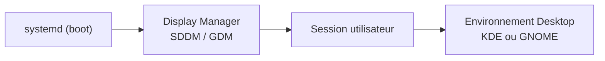
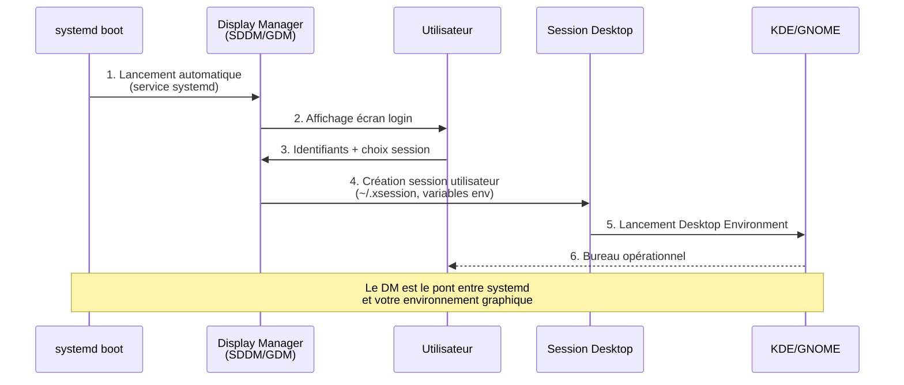
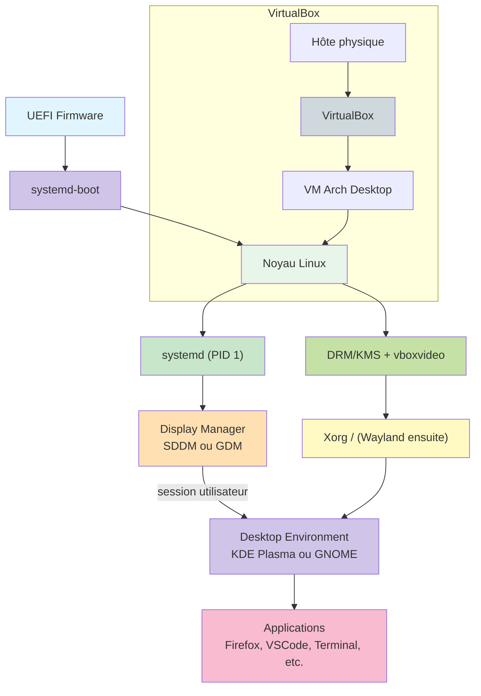

# Module 4 : Arch Linux — Poste Desktop (KDE & GNOME)

<div
  class="omny-meta"
  data-level="🟡 Intermédiaire & 🔴 Avancé"
  data-version="0.2"
  data-time="60-90 minutes (total module)">
</div>

## Introduction

Le **Module 3** vous a permis de construire un **serveur Arch Linux minimal** propre, stable, documenté, avec un bootloader maîtrisé et des services de base correctement configurés.

Ce **Module 4** transforme ce serveur en un **poste Desktop complet**, stable et adapté à un environnement de travail (*développement, documentation / bureautique, navigation web, apprentissage système / réseau / cyber, lab*) :

Vous allez construire un environnement graphique **moderne et propre** autour de deux grands environnements :

- **KDE Plasma** : léger (_pour un Desktop moderne_), extrêmement personnalisable, très agréable en VM.
- **GNOME** : cohérent, design épuré, ergonomie pensée pour limiter les distractions.

Les deux seront traités **en parallèle**, via des **onglets** pour que le chemin KDE et GNOME restent lisibles, compatibles VirtualBox et permettent de tester les comportements graphiques d’un poste Linux dans votre lab.

!!! quote "Analogie pédagogique"
    Le Module 3 (Serveur) a construit le **châssis, le moteur et le système électrique** de votre véhicule.  
    Le Module 4 (Desktop) ajoute **l’habitacle, le tableau de bord, les commandes, l’ergonomie et les sièges**.  
    Le moteur reste le même, mais l’expérience utilisateur change radicalement.

**Ce module reste strictement rationnel :**

> pas de packages superflus, uniquement l’essentiel pour un environnement de travail propre avec des choix justifiés, une **pile graphique documentée**, des points de contrôle réguliers et un snapshot final propre pour vos futurs labs.

## Objectifs d’apprentissage

> À la fin de ce module, vous serez capable de :

??? abstract "Objectifs techniques"

    - Installer et configurer la **pile graphique Linux** (Xorg, pilotes, Mesa) dans une VM VirtualBox.
    - Déployer un environnement Desktop complet :
      - **KDE Plasma** ou **GNOME** au choix.
    - Installer et activer un **Display Manager** (SDDM ou GDM[^4]) au démarrage.
    - Gérer les **polices**, la compatibilité Unicode (CJK, emoji) et l’affichage Web.
    - Installer les **outils essentiels d’un poste de travail** (navigateur, éditeur, outils système).
    - Optimiser l’affichage et les performances sous VirtualBox.
    - Diagnostiquer les principales pannes : écran noir, DM qui ne démarre pas, résolution bloquée.

??? abstract "Objectifs conceptuels"

    - Comprendre la **pile graphique Linux** :  
      noyau → DRM/KMS → Xorg/Wayland → Display Manager → Desktop Environment → applications.
    - Comprendre la différence entre :
      - **Display Manager** (écran de login),
      - **Desktop Environment** (KDE/GNOME),
      - **Window Manager** (KWin, Mutter…),
      - **serveur d’affichage** (Xorg / Wayland).
    - Comprendre comment VirtualBox s’insère dans cette pile (driver vboxvideo, Guest Additions, Mesa).

## Prérequis

Avant de commencer, assurez-vous d’avoir :

- Un **Arch-Server** fonctionnel, installé selon le **Module 3** :
  - Boot UEFI + systemd-boot,
  - Utilisateur `admin` avec `sudo`,
  - NetworkManager actif,
  - Guest Additions déjà installées (ou installables dans ce module).
- Une VM VirtualBox nommée par exemple `Arch-Desktop` ou `Arch-Server` que vous allez enrichir.
- Une connexion Internet fonctionnelle depuis la VM (`ping archlinux.org` OK).
- 60 à 90 minutes devant vous pour aller jusqu’au snapshot final.

!!! warning "Ne commencez pas sur une installation Arch incertaine"
    Si le Module 3 n’est pas **parfaitement valide** (boot propre, réseau, sudo, pacman fonctionnel), arrêtez-vous ici et corrigez d’abord le Module 3. Le Desktop **n’absorbera pas** les erreurs du serveur, il les amplifie.

## Comprendre avant d’agir

> Avant de lancer `pacman -S kde` ou `pacman -S gnome`, il est crucial de comprendre **ce que vous ajoutez** au système.

### Structure des 20 Étapes

> Comme dans le Module 3, ce module est décomposé en **phases** et en **étapes numérotées**

| Phase                                             | Étapes  | Objectif                                                                 | Durée estimée |
| ------------------------------------------------- | :-------: | ------------------------------------------------------------------------ | :------------: |
| **Phase 1<br /><small>Préparation VM & système**</small>            | 1 à 4   | Adapter la VM au Desktop, mettre Arch à jour, préparer la base graphique | 10-20 min     |
| **Phase 2<br /><small>Pile graphique & pilotes**</small>            | 5 à 9   | Installer Xorg, pilotes VirtualBox, polices, Mesa                        | 15-25 min     |
| **Phase 3<br /><small>Environnement Desktop (KDE / GNOME)**</small> | 10 à 16 | Installer KDE/GNOME, Display Manager, services, outils essentiels        | 20-30 min     |
| **Phase 4<br /><small>Tests, optimisation & snapshot**</small>      | 17 à 20 | Vérifier, optimiser, diagnostiquer, créer le snapshot de référence       | 15-20 min     |

### Ce que Vous Allez Vraiment Faire

Concrètement, vous allez :

- **Étapes 1-2** : _adapter la configuration VirtualBox et vérifier la base Arch._
- **Étapes 3-4** : _mettre le système à jour, vérifier le noyau / reboot si nécessaire._
- **Étapes 5-6** : _installer Xorg et vérifier qu’il est opérationnel._
- **Étapes 7-8** : _installer / vérifier les Guest Additions et le driver `vboxvideo`._
- **Étapes 9-10** : _installer les polices et Mesa._
- **Étapes 11-13** : _déployer KDE Plasma ou GNOME + Display Manager (via onglets)._
- **Étapes 14-15** : _installer les outils essentiels d’un poste Desktop._
- **Étapes 16-18** : _tester le démarrage graphique, les services et la 3D._
- **Étapes 19-20** : _finaliser et créer un snapshot VirtualBox._

### Vue d'Ensemble du Processus d'Installation

!!! quote "Avant de commencer les 20 étapes détaillées, prenez le temps de **visualiser l'ensemble du parcours**."

    Les deux diagrammes suivants vous donnent une vue macro du processus :

    1. **Le diagramme de séquence** montre le déroulé temporel des 20 étapes
    2. **Le schéma d'architecture** montre la structure finale que vous allez construire

Ces diagrammes sont votre **carte de navigation** pour ce module. Consultez-les régulièrement pendant l'installation pour savoir où vous en êtes.

!!! tip "Comment utiliser ces diagrammes"
    - **Avant de commencer** : lisez-les pour comprendre où vous allez
    - **Pendant l'installation** : revenez-y pour vous situer dans le processus
    - **En cas de blocage** : identifiez à quelle phase vous êtes pour mieux chercher de l'aide

=== "Diagramme de Séquence Complet"

    L'installation du Desktop Arch Linux suit un **processus structuré en 20 étapes** réparties en 4 phases distinctes. Ce diagramme représente l'intégralité du parcours, depuis la configuration de la VM jusqu'au snapshot final Desktop. Chaque étape numérotée correspond à une action précise que **vous** effectuerez pour transformer votre serveur Arch minimal en poste de travail graphique complet.

    **Comment lire ce diagramme ?**

    - Les **flèches pleines** (→) représentent vos actions
    - Les **flèches pointillées** (-->) représentent les réponses du système
    - Les **notes colorées** détaillent ce qui se passe en arrière-plan
    - Les **séparateurs horizontaux** marquent les transitions entre phases

    Ce diagramme vous sert de **carte de navigation** pour suivre votre progression dans la transformation serveur → desktop.
    ```mermaid
    sequenceDiagram
        participant You as Vous
        participant VB as VirtualBox
        participant Arch as Arch Server
        participant Desktop as Arch Desktop
        
        rect rgb(230, 245, 255)
            Note over You,Desktop: PHASE 1 : Préparation VM & Système (Étapes 1-4)
        end
        
        You->>VB: 1. Ajuster VM<br/>(RAM 4-8Go, VRAM 128Mo, 3D)
        VB-->>You: VM optimisée pour Desktop
        
        You->>Arch: 2. Boot + vérification base
        Arch-->>You: uname -r + ping OK
        
        You->>Arch: 3. sudo pacman -Syu
        Note over Arch: Mise à jour complète<br/>+ reboot si noyau MAJ
        Arch-->>You: Système à jour
        
        You->>Arch: 4. Vérifications post-update
        Arch-->>You: NetworkManager OK
        
        rect rgb(255, 245, 230)
            Note over You,Desktop: PHASE 2 : Pile Graphique & Pilotes (Étapes 5-9)
        end
        
        You->>Arch: 5. pacman -S xorg-server...
        Note over Arch: Installation Xorg
        
        You->>Arch: 6. Vérification Xorg
        Arch-->>You: which Xorg OK
        
        You->>Arch: 7. Guest Additions VirtualBox
        Note over Arch: vboxservice + modules
        
        You->>Arch: 8. Config vboxvideo driver
        Note over Arch: /etc/X11/xorg.conf.d/
        
        You->>Arch: 9. pacman -S mesa mesa-utils
        Note over Arch: Accélération 3D
        
        rect rgb(230, 255, 230)
            Note over You,Desktop: PHASE 3 : Desktop Environment (Étapes 10-16)
        end
        
        You->>Desktop: 10. Choix KDE ou GNOME
        Note over Desktop: plasma kde-applications<br/>OU gnome gnome-extra
        
        You->>Desktop: 11. Display Manager
        Note over Desktop: SDDM (KDE)<br/>OU GDM (GNOME)
        
        You->>Desktop: 12. Polices système
        Note over Desktop: ttf-dejavu noto-fonts...
        
        You->>Desktop: 13. Outils essentiels
        Note over Desktop: firefox git code...
        
        You->>Desktop: 14. Vérification services
        Desktop-->>You: NetworkManager + DM enabled
        
        You->>Desktop: 15. Test composants graphiques
        Desktop-->>You: vboxvideo + config OK
        
        You->>Desktop: 16. sudo reboot
        Desktop-->>You: Login graphique SDDM/GDM
        
        rect rgb(255, 230, 230)
            Note over You,Desktop: PHASE 4 : Tests & Snapshot (Étapes 17-20)
        end
        
        You->>Desktop: 17. Vérifications dans Desktop
        Note over Desktop: ping, df -h,<br/>$XDG_CURRENT_DESKTOP
        
        You->>Desktop: 18. Test OpenGL/Mesa
        Note over Desktop: glxinfo
        Desktop-->>You: Accélération 3D OK
        
        You->>Desktop: 19. Optimisations VirtualBox
        Note over Desktop: Clipboard, Drag&Drop,<br/>animations
        
        You->>Desktop: 20. sudo poweroff
        Desktop-->>VB: Arrêt propre
        
        You->>VB: Snapshot "Arch-Desktop-Base"
        VB-->>You: Point de restauration créé
        
        Note over You,Desktop: ✓ Desktop complet opérationnel
    ```

    <small>*Ce diagramme représente la transformation complète d'un serveur Arch minimal (Module 3) en poste Desktop graphique. Les 20 étapes sont organisées en 4 phases : (1) préparation de l'environnement VM et mise à jour système, (2) installation de la pile graphique Xorg et pilotes VirtualBox, (3) déploiement de l'environnement Desktop (KDE ou GNOME) avec Display Manager, (4) tests, optimisations et création du snapshot final. Durée totale estimée : 60 à 90 minutes.*</small>

=== "Schéma d'Architecture Cible"

    ```mermaid
    graph TB
        UEFI["UEFI + bootloader<br/>(Module 3)"] --> KERNEL[Noyau Linux]
        KERNEL --> DRM[DRM/KMS<br/>Gestion graphique noyau]
        DRM --> XORG[Xorg<br/>ou Wayland]
        XORG --> DM[Display Manager<br/>SDDM / GDM]
        DM --> DE[Desktop Environment<br/>KDE Plasma / GNOME]
        DE --> APPS["Applications<br/>(Firefox, VSCode, etc.)"]

        subgraph VirtualBox
            HOST[Hôte Windows/Linux] --> VB[VirtualBox]
            VB --> GUEST[VM Arch Desktop]
            GUEST --> DRM
        end

        style UEFI fill:#e1f5fe
        style KERNEL fill:#e8f5e9
        style DRM fill:#c5e1a5
        style XORG fill:#fff9c4
        style DM fill:#ffe0b2
        style DE fill:#d1c4e9
        style APPS fill:#f8bbd0
        style VB fill:#cfd8dc
    ```
    <small>_Ce schéma montre comment le chemin critique du Module 3 (UEFI → kernel → systemd) se prolonge désormais jusqu’au Desktop complet (DM, DE, applications), le tout encapsulé dans VirtualBox._</small>

### Xorg vs Wayland : quel serveur d'affichage choisir ?

!!! note "Avant d'installer la pile graphique, vous devez comprendre la différence entre les deux protocoles d'affichage Linux modernes."

**Comparaison technique :**

| Aspect | Xorg | Wayland |
|--------|------|---------|
| **Architecture** | Serveur X monolithique | Protocole compositeur |
| **Année** | 1984 (base X11) | 2008 (spécification moderne) |
| **Sécurité** | Applications accèdent à tout l'écran | Isolation stricte par fenêtre |
| **Performance** | Mature mais ancien | Plus efficace théoriquement |
| **Compatibilité VM** | Excellente | Variable selon pilotes |
| **VirtualBox** | ✅ Parfait | ⚠️ Parfois capricieux |
| **Tooling** | xrandr, xset, xdotool | wlr-randr, wl-clipboard |

**Notre choix pour Arch-Lab : Xorg**

!!! info "Dans un contexte **VirtualBox pédagogique**, nous privilégions **Xorg** pour plusieurs raisons :"

    1. **Stabilité éprouvée** : 40 ans de maturité
    2. **Compatibilité Guest Additions** : intégration parfaite avec VirtualBox
    3. **Débogage facilité** : outils de diagnostic nombreux (`xrandr`, logs clairs)
    4. **Documentation abondante** : solutions aux problèmes facilement trouvables

**Wayland en production :**

Sur un système physique moderne (laptop, workstation), Wayland devient le standard recommandé pour :

- Sécurité renforcée (isolation des applications)
- Meilleure gestion multi-écrans
- Performances accrues (moins de latence)
- Support natif des écrans HiDPI

!!! tip "Vous pourrez tester Wayland plus tard. **Une fois votre Desktop Xorg stable**, _vous pourrez expérimenter Wayland en installant les sessions Wayland de KDE/GNOME sans casser votre configuration de base._"


## Phase 1 — Préparation de la VM et mise à jour système (Étapes 1 à 4)

### Étape 1 : Ajuster la VM VirtualBox pour un usage Desktop

Un serveur minimal n’a pas nécessairement les réglages optimaux pour un système graphique.
Quelques ajustements sont recommandés.

> Dans VirtualBox, pour la VM `Arch-Server` (qui va devenir Desktop) ou `Arch-Desktop` :

| Paramètre            | Valeur recommandée | Justification                             |
| -------------------- | ------------------ | ----------------------------------------- |
| RAM                  | **4 à 8 Go**       | KDE/GNOME + navigateur + IDE              |
| CPU                  | 2 vCPU             | Fluide sans saturer l’hôte                |
| Vidéo (VRAM)         | **128 Mo minimum** | Requis pour un Desktop confortable        |
| Accélération 3D      | **Activée**        | Améliore fortement l’expérience KDE/GNOME |
| Contrôleur graphique | **VMSVGA**         | Pilote recommandé pour Linux modernes     |

!!! warning "Changer ces paramètres VM avant de lancer le Desktop"
    Une VRAM trop faible ou l’accélération 3D désactivée peut provoquer :

    - résolution figée,
    - lenteurs importantes,
    - plantages occasionnels de l’interface.

### Étape 2 : Démarrer la VM et vérifier la base

Connexion en console (TTY) avec votre utilisateur `admin` :

```bash
# Vérifier que vous êtes bien sur votre Arch installé
uname -r
# Affiche la version du noyau

# Vérifier la connectivité réseau
ping -c 3 archlinux.org
```

Résultat attendu : **ping OK, aucun paquet perdu**.

### Étape 3 : Mise à jour complète du système

Avant d’installer des composants graphiques, la base Arch doit être **à jour** :

```bash
# Commande pour mettre à jour le système
sudo pacman -Syu
```

!!! note "Si le noyau ou des composants critiques sont mis à jour, redémarrez avec la commande ci-dessous"

```bash
# Redémarre le système
sudo reboot
```

!!! note "Reconnectez-vous en `admin` après reboot."

!!! tip "Bon réflexe DevOps / Linux"
    Faire un `pacman -Syu` avant un gros changement (Desktop, gros paquets, etc.) évite énormément de conflits ou de comportements étranges.

### Étape 4 : Vérification rapide post-mise à jour

```bash
# Vérifier la version du noyau
uname -r

# Vérifier les services critiques
systemctl is-active NetworkManager
systemctl is-enabled NetworkManager
```

!!! note "Résultat attendu : `active` et `enabled` pour NetworkManager."

> Ainsi s'achève la Phase de préparation (Étapes 1-4)

---

## Phase 2 — Pile graphique & pilotes VirtualBox (Étapes 5 à 9)

### Étape 5 : Installation de Xorg (serveur graphique)

!!! info "KDE et GNOME peuvent fonctionner sous **Wayland**, mais dans VirtualBox, **Xorg** est plus stable."

> Nous partons sur **Xorg**, serveur graphique mature et compatible VirtualBox.

```bash
# Installation des paquets xorg nécessaire
sudo pacman -S xorg-server xorg-xinit xorg-apps
```

- `xorg-server` : _cœur du serveur X._
- `xorg-xinit` : _utilitaire pour lancer des sessions X manuelles._
- `xorg-apps` : _petite boîte à outils (xrandr, xset, etc.) utile pour diagnostiquer._

!!! quote "Ces paquets fournissent les composants nécessaires pour la couche graphique de base."

### Étape 6 : Vérification de base Xorg

Sans Desktop, Xorg peut déjà être testé minimalement :

```bash
# Vérifier la présence du binaire Xorg
which Xorg

# Lister les logs X (après premiers tests graphiques plus tard)
ls /var/log/Xorg.*
```

!!! note "Pour l’instant, vous ne lancez pas encore `startx`, le Desktop n’est pas installé. Ces commandes servent à confirmer que la base Xorg est bien en place."

### Étape 7 : Pilotes VirtualBox pour la partie graphique

> Si ce n’est pas déjà fait (_ou si vous avez un doute_), **installez** / **réinstallez les Guest Additions** côté Arch :

```bash
# Installation des Guest Additions VirtualBox
# virtualbox-guest-utils : outils utilisateur (vboxclient, vboxcontrol...)
#                          permettent le presse-papier partagé, résolution dynamique
# virtualbox-guest-modules-arch : modules kernel pour l'intégration matérielle
#                                 (carte graphique virtuelle, périphériques partagés)
sudo pacman -S virtualbox-guest-utils virtualbox-guest-modules-arch
sudo systemctl enable vboxservice
sudo systemctl start vboxservice
```

- **virtualbox-guest-utils** : _services et outils VirtualBox dans l’invité._
- **virtualbox-guest-modules-arch** : _modules noyau adaptés à la version Arch._

!!! info "Rôle de vboxservice"

    - ajustement dynamique de la résolution,
    - synchronisation de l’heure,
    - intégration souris,
    - partage presse-papier,
    - meilleure gestion de la carte graphique virtuelle.

### Étape 8 : Configuration explicite du driver vboxvideo (Xorg)

Création d’un fichier minimal de configuration Xorg pour forcer le driver VirtualBox :

```bash
sudo mkdir -p /etc/X11/xorg.conf.d

sudo tee /etc/X11/xorg.conf.d/20-vboxvideo.conf << 'EOF'
Section "Device"
    Identifier  "VirtualBox Graphics"
    Driver      "vboxvideo"
EndSection
EOF
```

!!! note "Ce fichier indique à **Xorg** d’utiliser explicitement le driver `vboxvideo` fourni par VirtualBox."

### Étape 9 : Installation de Mesa (accélération 3D)

> Mesa fournit l’implémentation OpenGL côté Linux.

```bash
sudo pacman -S mesa mesa-utils
```

!!! example "Test ultérieur (après Desktop) :"

    ```bash
    glxinfo | grep "OpenGL"
    ```
    
    **Résultat attendu** : une ligne indiquant un renderer VirtualBox avec accélération active.

> Ainsi s'achève la Phase Pile graphique & pilotes VirtualBox (Étapes 5-9)

---

## Phase 3 — Environnement Desktop (KDE / GNOME) et Display Manager (Étapes 10 à 16)

!!! quote "À partir de cette phase, les chemins divergent pour KDE et GNOME.<br />Les sections sont présentées en onglets parallèles."

### Étape 10 : Choix de l’environnement de bureau

=== "KDE Plasma"

    !!! quote "KDE est particulièrement adapté à un usage Desktop en VM :"

        - très personnalisable,
        - bonne intégration avec la plupart des workflows de développement,
        - comportement généralement fluide sous VirtualBox.

    Installation de base :

    ```bash
    sudo pacman -S plasma kde-applications
    ```

    - `plasma` : environnement KDE Plasma (bureaux, panneau, widgets…)
    - `kde-applications` : ensemble d’outils cohérents (Dolphin, Konsole, Okular, etc.)

    !!! note "Il est possible d’alléger `kde-applications` plus tard en supprimant les applications inutiles."

=== "GNOME"

    !!! quote "GNOME privilégie la cohérence, la simplicité visuelle et la réduction des distractions :"

        - interface épurée,
        - workflow centré sur les activités,
        - idéal pour expérimenter Wayland plus tard.

    Installation de base :

    ```bash
    sudo pacman -S gnome gnome-extra
    ```

    - `gnome` : environnement GNOME minimal (Shell, paramètres, utilitaires essentiels).
    - `gnome-extra` : collection d’outils complémentaires (utile pour un vrai poste Desktop).

    !!! note "Comme pour KDE, il sera possible de désinstaller certaines applications par la suite."

### Étape 11 : Installation du Display Manager

Un **Display Manager (DM)** est l'écran de login graphique qui lance votre session KDE ou GNOME.



**Rôle du Display Manager dans le processus de boot :**


<small>*Le Display Manager est lancé automatiquement par systemd au boot. Il affiche l'écran de connexion, authentifie l'utilisateur, initialise les variables d'environnement graphique (**DISPLAY**, **XDG_SESSION_TYPE**...), puis lance le Desktop Environment choisi (**KDE Plasma** ou **GNOME Shell**). Sans DM, vous devriez lancer manuellement `startx` depuis la console.*</small>

=== "KDE (SDDM)"

    > KDE est généralement associé à **SDDM** (Simple Desktop Display Manager).

    Installation et activation :

    ```bash
    sudo pacman -S sddm
    sudo systemctl enable sddm
    ```

    - `sddm` sera lancé automatiquement au boot par `systemd`.
    - Il affichera une liste d’utilisateurs et un sélecteur de session Plasma.


=== "GNOME (GDM)"

    > GNOME est généralement associé à **GDM**[^4] (GNOME Display Manager).

    Installation et activation :

    ```bash
    sudo pacman -S gdm
    sudo systemctl enable gdm
    ```

    - `gdm` gère le login graphique et la sélection de session GNOME,
    - il sait gérer les sessions **Xorg** et **Wayland** (selon la configuration).

!!! danger "Ne pas activer deux Display Managers simultanément. En effet, **un seul DM doit être enable** à la fois, sous peine de conflits au démarrage."

### Étape 12 : Polices, compatibilité et confort de lecture

> Un Desktop sans bonnes polices est un enfer à utiliser, surtout en multi-langues.

Installation d’un jeu de polices cohérent :

```bash
# Installation d'un ensemble complet de polices système
# ttf-dejavu : polices sans-serif lisibles, excellentes pour le code et l'interface
# ttf-liberation : équivalents libres des polices Microsoft (Arial, Times, Courier)
# noto-fonts : famille de polices Google couvrant l'ensemble d'Unicode
# noto-fonts-cjk : support chinois (Chinese), japonais (Japanese), coréen (Korean)
# noto-fonts-emoji : emoji modernes colorés (indispensable pour le web actuel)
sudo pacman -S ttf-dejavu ttf-liberation noto-fonts noto-fonts-cjk noto-fonts-emoji
```

- `ttf-dejavu`, `ttf-liberation` : polices de base lisibles pour la majorité des usages.
- `noto-fonts` : support large Unicode.
- `noto-fonts-cjk` : chinois / japonais / coréen.
- `noto-fonts-emoji` : emoji modernes (utile pour le Web).

### Étape 13 : Outils essentiels d’un poste Desktop

> Vous préparez un poste de travail, pas une simple démo graphique.

```bash
# Outils de base recommandés
sudo pacman -S firefox filezilla gparted htop neofetch p7zip unzip zip network-manager-applet

# Pour le développement
sudo pacman -S git base-devel

# Pour un éditeur / IDE moderne
sudo pacman -S code
# ou le paquet AUR "visual-studio-code-bin" via un helper AUR si configuré
```

(_La gestion AUR pourra être vue dans un module séparé._)

### Étape 14 : Activation et vérification des services

> Vérification côté réseau (NetworkManager) et Display Manager :

```bash
# Doit être enabled + active
systemctl is-enabled NetworkManager
systemctl is-active NetworkManager

# Vérifier le Display Manager choisi (UN SEUL)
systemctl is-enabled sddm 2>/dev/null # KDE
systemctl is-enabled gdm 2>/dev/null  # Gnome
```

**Résultat attendu** :

- **`enabled`** pour NetworkManager,
- **`enabled`** pour **un seul** Display Manager (`sddm` ou `gdm`).

!!! note "Le système lancera automatiquement l’environnement graphique au démarrage."

### Étape 15 : Test des composants graphiques (avant reboot)

Vous pouvez vérifier côté pilotes :

```bash
# Vérifier le module vboxvideo
lsmod | grep vboxvideo

# Vérifier la config Xorg VirtualBox
cat /etc/X11/xorg.conf.d/20-vboxvideo.conf
```
**Résultats attendus** :

- présence de `vboxvideo` dans les modules,
- fichier de configuration cohérent avec ce qui a été créé.

### Étape 16 : Premier redémarrage vers le Desktop

```bash
# Redémarrer le système
sudo reboot
```

Au redémarrage :

- VirtualBox → boot,
- systemd → lance le Display Manager (sddm ou gdm),
- vous devez arriver sur un écran de connexion graphique.

Connexion :

- utilisateur : admin (ou votre utilisateur équivalent),
- mot de passe : celui défini au Module 3.

!!! quote "Vous entrez alors dans **KDE Plasma** ou **GNOME**, selon votre choix."

> Ainsi s'achève la Phase Environnement Desktop & Display Manager (Étapes 10-16)

---

## Phase 4 — Tests, optimisation, dépannage & snapshot (Étapes 17 à 20)

### Étape 17 : Vérifications à l’intérieur du Desktop

Ouvrez un terminal dans votre environnement graphique :

- KDE : **Konsole**,
- GNOME : **Terminal**.

```bash
# Confirmer l’environnement de bureau
echo "$XDG_CURRENT_DESKTOP"
echo "$DESKTOP_SESSION"

# Tester le réseau
ping -c 3 archlinux.org

# Vérifier l’espace disque
df -h
```

Résultat attendu :

- `XDG_CURRENT_DESKTOP` affiche `KDE` ou `GNOME`,
- ping OK,
- `/` et `/boot` montés correctement.

### Étape 18 : Vérification OpenGL / Mesa

Dans le terminal graphique :

```bash
glxinfo | grep "OpenGL"
```

Résultat attendu :

- Une ligne indiquant un renderer type _“Chromium / VirtualBox”_ ou équivalent,
- Version OpenGL non nulle.

Si la commande `glxinfo` n’est pas trouvée, revérifiez :

```bash
sudo pacman -S mesa-utils
```

### Étape 19 : Optimisations pratiques pour VirtualBox

Quelques réglages à intégrer dans vos habitudes :

- Toujours garder VirtualBox Guest Additions à jour côté Arch.
- Adapter la résolution via les options View → Virtual Screen.
- Configurer dans VirtualBox :
    - Devices → Shared Clipboard → Bidirectional,
    - Devices → Drag and Drop → Bidirectional (si besoin).

!!! quote "Vous pouvez également régler le comportement de l’interface (animations, effets) :"

=== "KDE"

    - Ouvrir **Configuration du système** → **Affichage et écran** → réduire certains effets.
    - Désactiver éventuellement des animations superflues si l’hôte est modeste.
    - Adapter le thème pour plus de lisibilité (polices, contraste).

=== "GNOME"

    - Utiliser **GNOME Tweaks** (paquet `gnome-tweaks`) pour ajuster :
        - animations,
        - fontes,
        - thème,
        - extensions.
    - Installer quelques extensions GNOME uniquement si nécessaire, pour éviter la surcharge.

### Étape 20 : Arrêt propre et création du Snapshot de base Desktop

Lorsque tout est fonctionnel :

1. Éteindre proprement la VM : `sudo poweroff`

2. Dans VirtualBox :
    - Sélectionner la VM,
    - Aller dans l’onglet **Snapshots**,
    - Cliquer sur **Take**.

3. Nom recommandé : `Arch-Desktop-Base`

4. Description suggérée :

    ```
    Arch Desktop complet (KDE ou GNOME)
    - Base Module 3 entièrement fonctionnelle (UEFI + systemd-boot)
    - Environnement graphique installé et testé
    - NetworkManager + vboxservice opérationnels
    - Polices et outils essentiels (Firefox, Git, etc.)
    - Système à jour au [DATE]
    ```

!!! info "Ce snapshot devient votre référence Desktop pour :"

    - vos labs cyber
    - vos tests réseaux
    - vos environnements de dev
    - vos démonstrations pédagogiques

## Récapitulatif : Architecture Desktop finale



<small>Ce schéma finalise la continuité entre le Module 3 (boot/serveur) et le Module 4 (Desktop complet). Vous maîtrisez désormais toute la chaîne, du firmware à l’environnement de bureau.</small>

Dépannage avancé

??? abstract "Écran noir après le boot (pas de SDDM / GDM)"

    **Symptôme** : la machine boote, mais reste sur un écran noir ou une console texte, sans DM.

    **Causes possibles** :

    - Display Manager non activé (`enable` manquant),
    - conflit entre deux DM,
    - erreur Xorg / pilote.

    **Diagnostic minimal** (en console TTY, Ctrl+Alt+F2) :

    ```bash
    # Voir quel DM est enabled
    systemctl list-unit-files | grep -E 'sddm|gdm'

    # Voir le statut
    systemctl status sddm
    systemctl status gdm

    # Logs Xorg
    ls /var/log/Xorg.*
    cat /var/log/Xorg.0.log | tail -n 50
    ```

    **Correctifs** :

    - Désactiver l’un des DM si deux sont enabled :
      ```bash
      sudo systemctl disable gdm
      sudo systemctl enable sddm
      ```
      ou l’inverse.
    - Vérifier `/etc/X11/xorg.conf.d/20-vboxvideo.conf` et éventuellement le supprimer pour revenir à l’auto-détection.


??? abstract "Résolution d’écran bloquée, mauvaise taille de bureau"

    **Symptôme** : impossible d’ajuster la résolution correctement, écran minuscule ou zoomé.

    **Pistes** :

    - Vérifier le contrôleur graphique VirtualBox : **VMSVGA**.
    - Vérifier la VRAM : **128 Mo minimum**.
    - Vérifier `vboxservice` :
      ```bash
      systemctl status vboxservice
      ```
    - Depuis le Desktop, tester :
      - KDE : module d’affichage dans les paramètres.
      - GNOME : paramètres d’affichage.

    Si rien ne fonctionne, réinstaller les Guests :

    ```bash
    sudo pacman -S virtualbox-guest-utils virtualbox-guest-modules-arch
    sudo systemctl enable vboxservice --now
    ```


??? abstract "Le Desktop est très lent / saccadé"

    **Symptôme** : le pointeur lag, les fenêtres se déplacent au ralenti.

    **Vérifications** :

    - côté VM :
      - RAM allouée (4–8 Go),
      - VRAM (128 Mo),
      - 3D activée,
      - pas trop d’onglets/IDE ouverts.
    - côté Desktop :
      - réduire les animations :
        - KDE : Config système → Effets du bureau.
        - GNOME : `gnome-tweaks` → Desktop / Animations.

    **Conseil** : si l’hôte est modeste, privilégier KDE Plasma, souvent plus tolérant en VM.


??? abstract "Impossible de lancer des applications graphiques en SSH"

    Si vous vous connectez en SSH depuis l’hôte vers la VM, les applis graphiques ne se lancent pas (ou plantent).  
    C’est normal : ce module ne configure pas le **X11 forwarding**.

    Pour ce module, considérez que les applis graphiques sont **lancées depuis la VM**, pas exportées via SSH.

> Ainsi s'achève la Phase Tests, optimisation, dépannage & snapshot (Étapes 17-20)

---

## Le Mot de la Fin

### FÉLICITATIONS ! Vous avez transformé votre serveur Arch en Desktop complet.

!!! success "**Vous venez de construire un poste de travail graphique professionnel** en partant d'un serveur minimal. C'est une compétence rare qui démontre votre compréhension de l'architecture Linux moderne."

### Ce que vous avez appris dans ce module

!!! success "Compétences Techniques"

    - ✅ Configuration avancée d'une VM VirtualBox pour usage Desktop
    - ✅ Installation et configuration de la pile graphique Linux (Xorg, DRM/KMS)
    - ✅ Déploiement d'un environnement Desktop complet (KDE Plasma ou GNOME)
    - ✅ Installation et activation d'un Display Manager (SDDM/GDM[^4])
    - ✅ Gestion des polices système (Unicode, CJK, emoji)
    - ✅ Intégration Guest Additions VirtualBox pour optimisation graphique
    - ✅ Installation d'outils essentiels Desktop (Firefox, Git, IDE)
    - ✅ Tests et validation OpenGL/Mesa

!!! success "Compétences Conceptuelles"

    - ✅ Compréhension de la pile graphique Linux complète
    - ✅ Différence entre Xorg et Wayland
    - ✅ Rôle du Display Manager vs Desktop Environment
    - ✅ Architecture VirtualBox + pilotes graphiques (vboxvideo)
    - ✅ Optimisation performances graphiques en virtualisation

!!! note "Points Clés à Retenir"

    > Avant de passer au Module 5, assurez-vous d'avoir compris ces concepts fondamentaux :

    1. **La pile graphique Linux** fonctionne en couches : Kernel (DRM/KMS) → Xorg/Wayland → Display Manager → Desktop Environment
    2. **Xorg est plus stable en VM** que Wayland, même si Wayland est l'avenir sur hardware physique
    3. **Le Display Manager** (SDDM/GDM[^4]) n'est PAS le Desktop Environment (KDE/GNOME), c'est juste l'écran de login
    4. **VirtualBox Guest Additions** sont critiques pour une expérience Desktop fluide (résolution, clipboard, performances)
    5. **Un seul Display Manager** doit être activé à la fois (SDDM OU GDM[^4], pas les deux)
    6. **Mesa fournit OpenGL** sous Linux - sans lui, pas d'accélération 3D
    7. **Les polices Unicode** (noto-fonts) évitent les carrés blancs sur le web et dans les applications
    8. **RAM et VRAM** ont un impact direct sur la fluidité : 4-8 Go RAM + 128 Mo VRAM minimum

### Récapitulatif des Fichiers Critiques Créés

| Fichier/Service | Rôle | Localisation |
|-----------------|------|--------------|
| **xorg-server** | Serveur d'affichage graphique | `/usr/bin/Xorg` |
| **20-vboxvideo.conf** | Configuration driver VirtualBox | `/etc/X11/xorg.conf.d/` |
| **sddm/gdm service** | Display Manager auto-démarré | systemd unit |
| **plasma/gnome** | Desktop Environment | `/usr/bin/`, `/usr/share/` |
| **vboxservice** | Intégration Guest Additions | systemd unit |

### Points de Vigilance pour la Suite

!!! warning "Maintenance régulière nécessaire"
    Comme pour le serveur (Module 3), maintenez votre Desktop à jour :

    ```bash
    # Hebdomadaire recommandé
    sudo pacman -Syu
    ```
    
    **Attention** : après mise à jour majeure du noyau ou de Xorg, un redémarrage est souvent nécessaire.

!!! tip "Snapshots avant expérimentations"
    Avant d'installer des environnements de développement lourds (Docker, VMs imbriquées, IDE volumineux), créez un snapshot
    
!!! example "Exemple de nom pour un snapshot"

    - "Pre-Docker-Install"
    - "Before-PyCharm-Setup"
    - "Clean-Desktop-[DATE]"

### Comparaison Serveur (Module 3) vs Desktop (Module 4)

| Aspect | Module 3 (Serveur) | Module 4 (Desktop) |
|--------|-------------------|-------------------|
| **RAM recommandée** | 2-4 Go | 4-8 Go |
| **VRAM** | Non applicable | 128 Mo minimum |
| **Services** | systemd + NetworkManager | + Display Manager + Desktop |
| **Paquets installés** | ~200-300 | ~800-1200 |
| **Usage** | Infrastructure, services | Travail utilisateur, dev |
| **Temps de boot** | 5-10 secondes | 15-25 secondes |

### Prochaine Étape : Module 5 - Réseau VirtualBox

Vous disposez maintenant de :

- **Module 3** : Serveur Arch minimal maîtrisé
- **Module 4** : Desktop Arch complet fonctionnel

Le **Module 5** va vous apprendre à :

- Créer des topologies réseau VirtualBox professionnelles
- Segmenter vos machines (NAT, Host-Only, Internal Network)
- Construire un mini-datacenter virtualisé
- Interconnecter Arch Server, Arch Desktop, Ubuntu, Rocky et Windows

**Prenez une pause bien méritée de 15-30 minutes, puis continuez vers le Module 5 !**

[:lucide-arrow-right: Accéder au Module 5 - Réseau VirtualBox](./05-virtualbox-reseau.md){ .md-button .md-button--primary }


[^DRM]: **DRM (Direct Rendering Manager)** : sous-système du noyau Linux gérant l'accès à la carte graphique. KMS (Kernel Mode Setting) fait partie de DRM et gère les résolutions et modes d'affichage.

[^Mesa]: **Mesa** : implémentation open source d'OpenGL, Vulkan et autres APIs graphiques. Indispensable pour l'accélération 3D sous Linux.

[^SDDM]: **SDDM (Simple Desktop Display Manager)** : Display Manager léger et moderne, développé en Qt, recommandé pour KDE Plasma.

[^4]: **GDM (GNOME Display Manager)** : Display Manager officiel de GNOME, supporte nativement Xorg et Wayland.