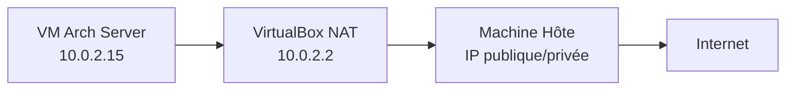
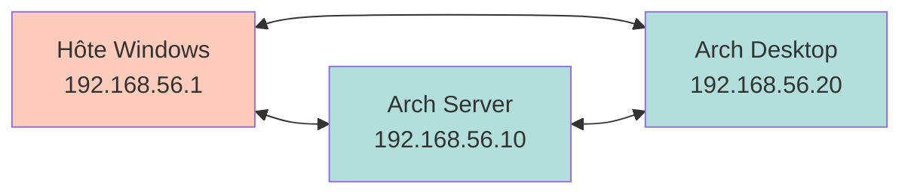
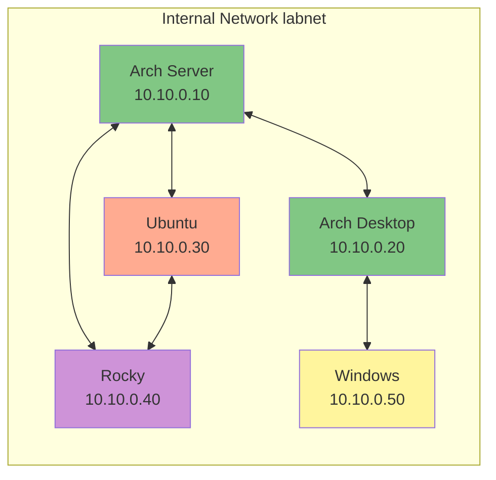
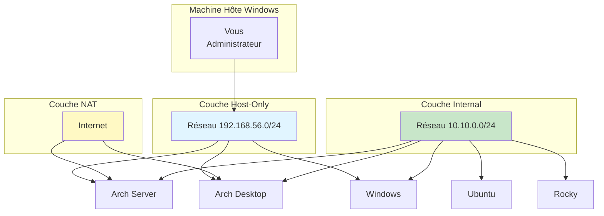
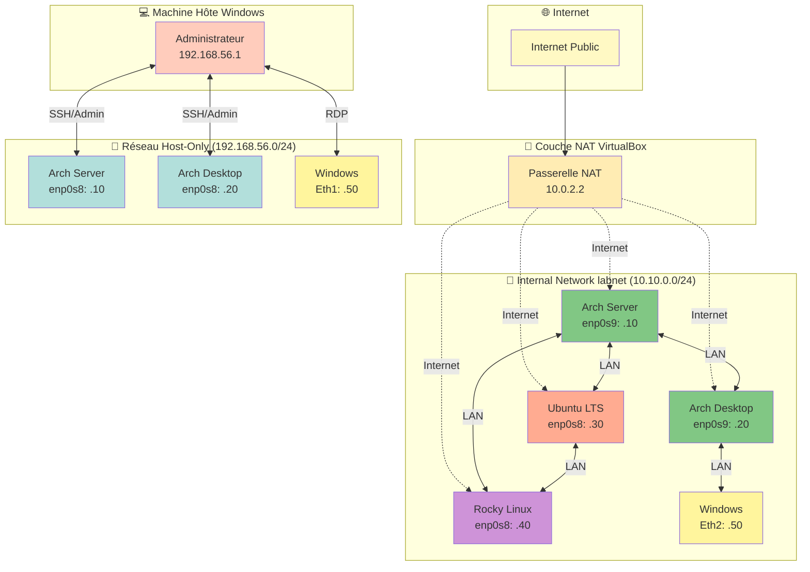

# Module 5 : Réseau VirtualBox Professionnel

<div
  class="omny-meta"
  data-level="🟡 Intermédiaire & 🔴 Avancé"
  data-version="0.2"
  data-time="90-110 minutes">
</div>

## Introduction

Les **Modules 3 et 4** vous ont permis de construire deux machines Arch Linux fonctionnelles :

- **Module 3** : Serveur Arch minimal avec boot UEFI, systemd-boot, NetworkManager
- **Module 4** : Desktop Arch complet avec KDE Plasma ou GNOME

!!! quote "Ces machines fonctionnent **isolément**, mais dans un véritable laboratoire professionnel, les systèmes doivent **communiquer entre eux** de manière contrôlée et segmentée."

Ce **Module 5** vous apprend à construire une **topologie réseau VirtualBox professionnelle** simulant un mini-datacenter d'entreprise avec :

- **Segmentation réseau** (NAT[^1], Host-Only[^2], Internal Natwork[^3])
- **Adressage IP cohérent** et reproductible
- **Isolation des flux** (Internet, administration, LAN interne)
- **Plan de communication** clair entre toutes les machines

À la fin de ce module, votre _Arch Server_, _Arch Desktop_, _Ubuntu_, _Rocky_ et _Windows_ communiqueront dans un réseau structuré identique à ce qu'on trouve en entreprise.

!!! quote "Analogie pédagogique"
    Imaginez un **immeuble de bureaux informatique** avec plusieurs étages :
    
    - **Rez-de-chaussée (NAT[^1])** : hall d'accès vers l'extérieur (Internet)
    - **1er étage (Host-Only[^2])** : couloir administratif réservé aux techniciens
    - **Étages supérieurs (Internal)** : bureaux internes où travaillent les serveurs et postes
    
    Chaque étage a son propre réseau, ses propres règles, mais tous cohabitent dans le même bâtiment (VirtualBox).

## Objectifs d'Apprentissage

À la fin de ce module, **vous serez capable de** :

### Objectifs Techniques

- [ ] Comprendre les trois types de réseaux VirtualBox (**NAT**, **Host-Only[^2]**, **Internal**)
- [ ] Créer et configurer un réseau Host-Only[^2] dans VirtualBox
- [ ] Créer un Internal Natwork[^3] nommé pour le LAN du lab
- [ ] Configurer plusieurs interfaces réseau sur une même VM
- [ ] Assigner des adresses IP statiques avec NetworkManager (`nmcli`[^4])
- [ ] Tester la connectivité entre machines (_ping_, _SSH_)
- [ ] Diagnostiquer les problèmes réseau courants en virtualisation

### Objectifs Conceptuels

- [ ] Comprendre la segmentation réseau et **pourquoi elle est critique en cybersécurité**
- [ ] Distinguer les usages de chaque type de réseau (**Internet**, **admin**, **LAN**)
- [ ] Comprendre le rôle d'un plan d'adressage IP cohérent
- [ ] Saisir les implications de l'isolation réseau pour les scénarios de **pentest**/**SOC**
- [ ] Anticiper l'intégration d'_Ubuntu_, _Rocky_ et _Windows_ dans cette topologie

## Prérequis

Avant de commencer, **assurez-vous d'avoir** :

- [ ] **Module 3 validé** : Arch Server fonctionnel (**boot**, **réseau**, **sudo**)
- [ ] **Module 4 validé** : Arch Desktop fonctionnel (**environnement graphique opérationnel**)
- [ ] **VirtualBox 7.0+** avec Extension Pack installé
- [ ] **90 à 110 minutes ou plus si nécessaire** devant vous sans interruption
- [ ] **Papier et stylo** (_ou outil de prise de notes_) pour documenter votre plan d'adressage

!!! danger "**Ne commencez surtout pas sans machines Arch stables**. En effet, si vos VMs Arch Server ou Arch Desktop ont des problèmes de réseau ou de boot, **corrigez-les d'abord**. Le réseau amplifie les problèmes existants, il ne les résout pas."

## Comprendre Avant d'Agir : La Segmentation Réseau

> Avant de créer des réseaux dans VirtualBox, vous devez comprendre **pourquoi** on segmente et **comment** fonctionnent les trois types d'interfaces réseau.

### Structure du Module en 15 Étapes

Ce module est organisé en **3 phases principales** :

| Phase | Étapes | Objectif | Durée estimée |
|-------|:------:|----------|:-------------:|
| **Phase 1<br/><small>Théorie et Architecture</small>** | 1 à 5 | Comprendre les réseaux VirtualBox, concevoir la topologie | ~30 min |
| **Phase 2<br/><small>Configuration Pratique</small>** | 6 à 11 | Créer les réseaux, configurer les interfaces, assigner les IPs | ~50 min |
| **Phase 3<br/><small>Tests et Validation</small>** | 12 à 15 | Vérifier connectivité, diagnostiquer, documenter | ~30 min |

### Ce que Vous Allez Vraiment Faire

Concrètement, vous allez :

- **Étapes 1-3** : _Comprendre NAT[^1], Host-Only[^2] et Internal Natwork[^3] (**théorie**)_
- **Étapes 4-5** : _Concevoir le plan d'adressage et la topologie globale_
- **Étapes 6-7** : _Créer les réseaux Host-Only[^2] et Internal dans VirtualBox_
- **Étapes 8-10** : _Configurer les interfaces réseau sur Arch Server et Arch Desktop_
- **Étape 11** : _Tester la connectivité entre toutes les couches réseau_
- **Étapes 12-13** : _Diagnostiquer les problèmes courants et optimiser_
- **Étapes 14-15** : _Documenter la configuration et créer les snapshots réseau_

### Vue d'Ensemble du Processus

Avant de commencer les 15 étapes détaillées, prenez le temps de **visualiser l'ensemble du parcours**. Les deux diagrammes suivants vous donnent une vue macro du processus :

1. **Le diagramme de séquence** montre le déroulé temporel des 15 étapes
2. **Le schéma de topologie réseau** montre l'architecture finale que vous allez construire

!!! quote "Ces diagrammes sont votre **carte de navigation** pour ce module. Consultez-les régulièrement pendant la configuration pour savoir où vous en êtes."

!!! tip "Comment utiliser ces diagrammes"
    - **Avant de commencer** : lisez-les pour comprendre où vous allez
    - **Pendant la configuration** : revenez-y pour vous situer dans le processus
    - **En cas de blocage** : identifiez à quelle phase vous êtes pour mieux chercher de l'aide

=== "Diagramme de Séquence Complet"

    La configuration du réseau Arch-Lab suit un **processus structuré en 15 étapes** réparties en 3 phases distinctes. Ce diagramme représente l'intégralité du parcours, depuis la compréhension théorique des réseaux VirtualBox jusqu'à la validation complète de la topologie.

    !!! info "Comment lire ce diagramme ?"

        - Les **flèches pleines** (→) représentent vos actions
        - Les **flèches pointillées** (-->) représentent les réponses du système
        - Les **notes colorées** détaillent ce qui se passe en arrière-plan
        - Les **séparateurs horizontaux** marquent les transitions entre phases

    > Ce diagramme vous sert de **carte de navigation** pour transformer des VMs isolées en réseau professionnel segmenté.

    ```mermaid
        sequenceDiagram
            participant You as Vous
            participant VB as VirtualBox
            participant ArchS as Arch Server
            participant ArchD as Arch Desktop
            participant Net as Réseaux
            
            rect rgb(230, 245, 255)
                Note over You,Net: PHASE 1 : Théorie et Architecture (Étapes 1-5)
            end
            
            You->>You: 1. Étudier NAT
            Note over You: Comprendre accès Internet<br/>sortant uniquement
            
            You->>You: 2. Étudier Host-Only
            Note over You: Réseau administration<br/>hôte ↔ VMs
            
            You->>You: 3. Étudier Internal Network
            Note over You: LAN isolé<br/>VMs entre elles
            
            You->>You: 4. Concevoir topologie
            Note over You: Arch-Lab : 3 réseaux<br/>5 machines
            
            You->>You: 5. Plan d'adressage IP
            Note over You: 10.10.0.0/24 (Internal)<br/>192.168.56.0/24 (Host-Only)
            
            rect rgb(255, 245, 230)
                Note over You,Net: PHASE 2 : Configuration Pratique (Étapes 6-11)
            end
            
            You->>VB: 6. Créer réseau Host-Only
            VB-->>Net: vboxnet0 (192.168.56.0/24)
            
            You->>VB: 7. Créer Internal Network "labnet"
            VB-->>Net: labnet (10.10.0.0/24)
            
            You->>ArchS: 8. Configurer 3 interfaces<br/>Arch Server
            Note over ArchS: enp0s3 (NAT)<br/>enp0s8 (Host-Only)<br/>enp0s9 (Internal)
            ArchS-->>You: Interfaces activées
            
            You->>ArchS: 9. Assigner IPs statiques
            Note over ArchS: 192.168.56.10 (admin)<br/>10.10.0.10 (LAN)
            
            You->>ArchD: 10. Configurer 3 interfaces<br/>Arch Desktop
            Note over ArchD: enp0s3 (NAT)<br/>enp0s8 (Host-Only)<br/>enp0s9 (Internal)
            ArchD-->>You: Interfaces activées
            
            You->>ArchD: 11. Assigner IPs statiques
            Note over ArchD: 192.168.56.20 (admin)<br/>10.10.0.20 (LAN)
            
            rect rgb(230, 255, 230)
                Note over You,Net: PHASE 3 : Tests et Validation (Étapes 12-15)
            end
            
            You->>ArchS: 12. Tests connectivité réseau
            ArchS->>Net: ping 10.10.0.20 (Desktop)
            Net-->>ArchS: Réponse OK
            ArchS->>Net: ping 192.168.56.1 (Hôte)
            Net-->>ArchS: Réponse OK
            ArchS->>Net: ping archlinux.org
            Net-->>ArchS: Réponse OK (NAT)
            
            You->>You: 13. Diagnostic problèmes réseau
            Note over You: ip addr, ip route,<br/>nmcli, ping
            
            You->>You: 14. Documentation configuration
            Note over You: Plan d'adressage<br/>Schéma topologie
            
            You->>VB: 15. Snapshots "Network-Configured"
            VB-->>You: Points de restauration créés
            
            Note over You,Net: ✓ Réseau professionnel opérationnel
    ```

    <small>*Ce diagramme représente la construction complète du réseau Arch-Lab. Les 15 étapes sont organisées en 3 phases : (1) apprentissage théorique des types de réseaux VirtualBox et conception de la topologie, (2) configuration pratique des réseaux et attribution des adresses IP, (3) tests de connectivité, diagnostic et documentation. Durée totale estimée : 90 à 110 minutes.*</small>

=== "Schéma de Topologie Réseau Finale"

    Avant de configurer quoi que ce soit, il est essentiel que **vous visualisiez l'architecture réseau finale** que vous allez construire. Ce schéma représente la topologie complète du laboratoire Arch-Lab avec ses trois couches réseau distinctes.

    **Que montre ce schéma ?**

    - **La couche NAT[^1]** : accès Internet sortant pour toutes les VMs
    - **La couche Host-Only[^2]** : réseau d'administration (SSH depuis votre PC)
    - **La couche Internal** : LAN privé isolé pour communications inter-VMs

    !!! info "Comment lire ce schéma ?"

        - Les **rectangles colorés** représentent les segments réseau
        - Les **nœuds avec IP** sont les interfaces réseau des VMs
        - Les **flèches bidirectionnelles** montrent les communications possibles
        - Les **couleurs** différencient les types de flux (voir légende)

    > Ce schéma vous servira de **référence visuelle** tout au long de la configuration réseau.

    ```mermaid
        flowchart TB
            subgraph Internet[" "]
                NAT[NAT VirtualBox<br/>Accès Internet sortant]
            end

            subgraph HostOnly["Réseau Host-Only (192.168.56.0/24)<br/>Administration"]
                direction LR
                HOST[Hôte Windows<br/>192.168.56.1]
                HS_HO[Arch Server<br/>enp0s8: 192.168.56.10]
                HD_HO[Arch Desktop<br/>enp0s8: 192.168.56.20]
                WIN_HO[Windows<br/>Ethernet: 192.168.56.50]
            end

            subgraph Internal["Internal Network labnet (10.10.0.0/24)<br/>LAN Lab Isolé"]
                direction LR
                HS_INT[Arch Server<br/>enp0s9: 10.10.0.10]
                HD_INT[Arch Desktop<br/>enp0s9: 10.10.0.20]
                UB_INT[Ubuntu LTS<br/>enp0s8: 10.10.0.30]
                RL_INT[Rocky Linux<br/>enp0s8: 10.10.0.40]
                WIN_INT[Windows<br/>Ethernet 2: 10.10.0.50]
            end

            NAT -.->|Internet| HS_INT
            NAT -.->|Internet| HD_INT
            NAT -.->|Internet| UB_INT
            NAT -.->|Internet| RL_INT

            HOST <-->|SSH/Admin| HS_HO
            HOST <-->|SSH/Admin| HD_HO
            HOST <-->|RDP| WIN_HO

            HS_INT <-->|LAN| HD_INT
            HS_INT <-->|LAN| UB_INT
            HS_INT <-->|LAN| RL_INT
            HD_INT <-->|LAN| WIN_INT

            style NAT fill:#fff9c4
            style HostOnly fill:#e1f5ff
            style Internal fill:#c8e6c9
            style HOST fill:#ffccbc
            style HS_HO fill:#b2dfdb
            style HD_HO fill:#b2dfdb
            style HS_INT fill:#81c784
            style HD_INT fill:#81c784
            style UB_INT fill:#ffab91
            style RL_INT fill:#ce93d8
            style WIN_INT fill:#fff59d
            style WIN_HO fill:#fff59d
    ```

    <small>*Ce schéma illustre l'architecture réseau complète d'Arch-Lab après configuration. Il se décompose en trois niveaux isolés : (1) **NAT[^1] VirtualBox** fournit l'accès Internet sortant à toutes les VMs Linux pour les mises à jour système, (2) **Host-Only[^2] (192.168.56.0/24)** permet l'administration SSH/RDP depuis votre PC Windows vers les VMs, (3) **Internal Natwork[^3] labnet (10.10.0.0/24)** crée un LAN privé où toutes les machines communiquent entre elles sans accès à l'hôte ni à Internet. Les couleurs codent les types de systèmes : bleu = réseau Host-Only[^2], vert = Arch Linux, orange = Ubuntu, violet = Rocky Linux, jaune = Windows.*</small>

    **Légende des couleurs :**

    | Couleur | Type de segment/machine | Exemples |
    |---------|-------------------------|----------|
    | 🟡 Jaune | NAT[^1] / Internet | Accès sortant uniquement |
    | 🔵 Bleu clair | Réseau Host-Only[^2] | Administration hôte ↔ VMs |
    | 🟢 Vert clair | Internal Natwork[^3] | LAN privé du lab |
    | 🔷 Bleu-vert | Arch Linux | Server + Desktop |
    | 🟠 Orange | Ubuntu LTS | Famille Debian/apt |
    | 🟣 Violet | Rocky Linux | Famille Red Hat/dnf |
    | 🟨 Jaune pâle | Windows | Poste utilisateur |

## Phase 1 — Théorie et Architecture Réseau (Étapes 1 à 5)

### Étape 1 : Comprendre le réseau NAT[^1] (Network Address Translation)

!!!quote "Le **NAT[^1]** est le mode réseau par défaut de VirtualBox. Il permet aux VMs d'accéder à Internet en passant par la machine hôte."

**Fonctionnement :**


**Caractéristiques du NAT :**

| Aspect | Comportement | Explication |
|--------|--------------|-------------|
| **Accès sortant** | ✅ Oui | La VM peut initier des connexions vers Internet |
| **Accès entrant** | ❌ Non (sauf port forwarding) | Internet/hôte ne peut pas initier de connexion vers la VM |
| **IP attribuée** | DHCP automatique | 10.0.2.15 par défaut (géré par VirtualBox) |
| **Communication inter-VM** | ❌ Non | Deux VMs en NAT[^1] ne se voient pas entre elles |

**Cas d'usage dans Arch-Lab :**

- Télécharger les paquets système (`sudo pacman -Syu`)
- Mettre à jour le système d'exploitation
- Accéder aux dépôts officiels (archlinux.org, packages.ubuntu.com, etc.)

!!! info "Le NAT[^1] est unidirectionnel. Pensez au NAT[^1] comme une **porte à sens unique** : vous pouvez sortir (télécharger), mais personne ne peut entrer sans configuration spéciale (_port forwarding_)."


### Étape 2 : Comprendre le réseau Host-Only[^2]

!!! quote "Le **Host-Only[^2]** crée un réseau privé entre votre machine physique (hôte) et vos VMs."

**Fonctionnement :**


**Caractéristiques du Host-Only[^2] :**

| Aspect | Comportement | Explication |
|--------|--------------|-------------|
| **Accès Internet** | ❌ Non | Réseau totalement isolé d'Internet |
| **Communication hôte ↔ VM** | ✅ Oui | SSH, RDP, transferts de fichiers |
| **Communication inter-VM** | ✅ Oui | Les VMs se voient entre elles |
| **IP attribuée** | Statique recommandée | 192.168.56.0/24 par défaut (_personnalisable_) |

**Cas d'usage dans Arch-Lab :**

- **SSH depuis Windows** : `ssh admin@192.168.56.10`
- **Transferts de fichiers** : `scp fichier.txt admin@192.168.56.10:/home/admin/`
- **Administration centralisée** : gérer toutes les VMs depuis votre PC
- **Monitoring** : accéder aux interfaces web de gestion (Webmin, Cockpit...)

!!! tip "Le Host-Only[^2] est votre couloir d'administration, en sommes, c'est le réseau que **vous** (_l'administrateur_) utilisez pour gérer vos VMs depuis votre poste Windows, sans passer par la console VirtualBox."

### Étape 3 : Comprendre l'Internal Network

!!! quote "L'**Internal Natwork[^3]** crée un LAN privé totalement isolé où seules les VMs communiquent entre elles."

**Fonctionnement :**



<small>*Ce diagramme illustre **quelques exemples** de communications possibles dans le réseau Internal labnet. En réalité, **toutes les machines étant sur le même réseau privé 10.10.0.0/24**, elles peuvent **toutes communiquer entre elles sans restriction**. Arch Server peut contacter Windows, Ubuntu peut contacter Arch Desktop, Rocky peut contacter tout le monde, etc. L'Internal Natwork[^3] fonctionne comme un switch physique : si deux machines sont branchées dessus et ont des IPs dans le même sous-réseau, elles peuvent se parler directement. Les flèches affichées ne sont qu'une représentation partielle pour simplifier le schéma.*</small>

**Caractéristiques de l'Internal Natwork[^3] :**

| Aspect | Comportement | Explication |
|--------|--------------|-------------|
| **Accès Internet** | ❌ Non | Isolement total du monde extérieur |
| **Communication avec hôte** | ❌ Non | L'hôte ne voit pas ce réseau |
| **Communication inter-VM** | ✅ Oui (uniquement) | Les VMs forment un LAN privé |
| **IP attribuée** | Statique obligatoire | Aucun DHCP, configuration manuelle |

**Cas d'usage dans Arch-Lab :**

- **Services internes** : serveur web, DNS, bases de données
- **Scénarios SOC/SIEM** : analyse de trafic isolé
- **Pentest** : attaques/défenses dans un environnement contrôlé
- **Active Directory** : domaine Windows isolé
- **Clustering** : serveurs qui se parlent sans sortir

!!! danger "**Attention, l'Internal Natwork[^3] est totalement isolé**, c'est le réseau le plus sécurisé : **aucune fuite possible** vers Internet ou l'hôte. Idéal pour simuler un datacenter interne d'entreprise."

### Étape 4 : Conception de la topologie Arch-Lab

!!! quote "Maintenant que vous comprenez les trois types de réseaux, concevons l'architecture globale."

**Principe de segmentation :**


**Règles de conception :**

1. **NAT[^1] pour tous les Linux** : _Arch_, _Ubuntu_, _Rocky_ ont besoin d'Internet pour les paquets
2. **Host-Only[^2] pour l'administration** : _Arch Server_, _Arch Desktop_, _Windows_ accessibles en SSH/RDP
3. **Internal pour le LAN** : toutes les machines communiquent dans le réseau privé 10.10.0.0/24
4. **Windows sans NAT[^1]** : pas besoin d'Internet direct (**évite les mises à jour Windows intempestives**)

### Étape 5 : Plan d'adressage IP complet

**Tableau récapitulatif des adresses :**

| Machine | Interface 1<br/>(NAT[^1]) | Interface 2<br/>(Host-Only[^2]) | Interface 3<br/>(Internal) |
|---------|----------------------|----------------------------|---------------------------|
| **Arch Server** | enp0s3<br/>DHCP auto (10.0.2.15) | enp0s8<br/>192.168.56.10/24 | enp0s9<br/>10.10.0.10/24 |
| **Arch Desktop** | enp0s3<br/>DHCP auto (10.0.2.15) | enp0s8<br/>192.168.56.20/24 | enp0s9<br/>10.10.0.20/24 |
| **Ubuntu LTS** | enp0s3<br/>DHCP auto (10.0.2.15) | — | enp0s8<br/>10.10.0.30/24 |
| **Rocky Linux** | enp0s3<br/>DHCP auto (10.0.2.15) | — | enp0s8<br/>10.10.0.40/24 |
| **Windows** | — | Ethernet<br/>192.168.56.50 | Ethernet 2<br/>10.10.0.50 |
| **Hôte Windows** | — | 192.168.56.1 | — |

!!! tip "Documenter ce plan, **copiez ce tableau** dans un fichier texte, sur papier, sur un outils de prise de note ou un tableur. Vous allez en avoir besoin pour les étapes suivants."

> Ainsi s'achève la Phase Théorie et Architecture (Étapes 1-5)

## Phase 2 — Configuration Pratique des Réseaux (Étapes 6 à 11)

### Étape 6 : Créer le réseau Host-Only[^2] dans VirtualBox

> Ouvrez VirtualBox et accédez au gestionnaire de réseaux hôte.

**Procédure :**

1. **VirtualBox** → **File** → **Tools** → **Network Manager**
2. Onglet **Host-Only[^2] Networks**
3. Cliquer sur **Create**
4. Un réseau `vboxnet0` (ou similaire) est créé

**Configuration du réseau Host-Only[^2] :**

| Paramètre | Valeur | Justification |
|-----------|--------|---------------|
| **Nom** | vboxnet0 | Nom par défaut VirtualBox |
| **Adresse IPv4** | 192.168.56.1 | IP de l'hôte sur ce réseau |
| **Masque** | 255.255.255.0 (/24) | 254 adresses disponibles |
| **DHCP Server** | ❌ Désactivé | On utilise des IPs statiques |

**Vérification :**
```bash
# Depuis Windows PowerShell
ipconfig | findstr "192.168.56"

# Résultat attendu :
# IPv4 Address. . . . . . . . . . . : 192.168.56.1
```

### Étape 7 : Créer l'Internal Network dans VirtualBox

!!! quote "Contrairement à Host-Only[^2], l'Internal Natwork[^3] se crée **lors de la configuration des VMs**, pas dans un gestionnaire centralisé."

**Important :**

- Toutes les VMs doivent utiliser **exactement le même nom** d'Internal Natwork[^3]
- Nom recommandé : `labnet`

!!! warning "Le nom est sensible à la casse : `labnet` ≠ `Labnet` ≠ `LABNET`. Utilisez toujours `labnet` en minuscules."

### Étape 8 : Configurer les interfaces réseau sur Arch Server

!!! quote "Nous allons configurer les **3 interfaces réseau** d'Arch Server."

**Dans VirtualBox :**

1. Sélectionnez la VM **Arch-Server**
2. **Settings** → **Network**

**Configuration des adaptateurs :**

| Adapter | Type | Nom réseau | Promiscuous Mode |
|---------|------|------------|------------------|
| **Adapter 1** | NAT[^1] | — | Deny |
| **Adapter 2** | Host-Only[^2] Adapter | vboxnet0 | Deny |
| **Adapter 3** | Internal Natwork[^3] | labnet | Allow All |

!!! note "**Cliquez sur OK** puis **Démarrez Arch Server** et connectez-vous en `admin`."

**Vérification des interfaces :**

```bash
# Lister toutes les interfaces réseau
# ip : commande moderne de gestion réseau
# link : affiche les interfaces au niveau liaison
# show : liste toutes les interfaces présentes
ip link show

# Résultat attendu :
# 1: lo: ...
# 2: enp0s3: ... (NAT)
# 3: enp0s8: ... (Host-Only)
# 4: enp0s9: ... (Internal)
```

### Étape 9 : Assigner les adresses IP statiques sur Arch Server

**Configuration Host-Only[^2] (enp0s8) :**

```bash
# Configurer l'adresse IP statique
# con mod : modifier une connexion existante
# hostonly : nom de la connexion créée précédemment
# ipv4.method manual : désactive DHCP, force IP statique
# ipv4.addresses 192.168.56.10/24 : IP et masque réseau
nmcli con mod hostonly ipv4.method manual ipv4.addresses 192.168.56.10/24

# Activer la connexion
# con up : démarrer/activer une connexion
# hostonly : nom de la connexion à activer
nmcli con up hostonly
```

**Configuration Internal Natwork[^3] (enp0s9) :**

```bash
# Créer la connexion Internal Network
# ifname enp0s9 : interface pour le LAN privé
# con-name internal : nom logique de la connexion
nmcli con add type ethernet ifname enp0s9 con-name internal

# Configurer l'adresse IP statique du LAN
# 10.10.0.10/24 : adresse dans le réseau privé 10.10.0.0/24
nmcli con mod internal ipv4.method manual ipv4.addresses 10.10.0.10/24

# Activer la connexion Internal
nmcli con up internal
```

**Vérification complète :**

```bash
# Afficher toutes les adresses IP configurées
# ip addr : affiche les interfaces et leurs IPs
ip addr show

# Résultat attendu :
# 2: enp0s3: ... inet 10.0.2.15/24 ... (NAT, DHCP auto)
# 3: enp0s8: ... inet 192.168.56.10/24 ... (Host-Only, statique)
# 4: enp0s9: ... inet 10.10.0.10/24 ... (Internal, statique)

# Vérifier les connexions NetworkManager
# nmcli con show : liste toutes les connexions configurées
nmcli con show

# Résultat attendu :
# NAME       UUID                                  TYPE      DEVICE
# hostonly   xxxxxxxx-xxxx-xxxx-xxxx-xxxxxxxxxxxx  ethernet  enp0s8
# internal   xxxxxxxx-xxxx-xxxx-xxxx-xxxxxxxxxxxx  ethernet  enp0s9
# enp0s3     xxxxxxxx-xxxx-xxxx-xxxx-xxxxxxxxxxxx  ethernet  enp0s3
```

!!! success "**Checkpoint Arch Server** : Si vous voyez les 3 interfaces avec les bonnes IPs, **Arch Server est correctement configuré**."

### Étape 10 : Configurer les interfaces réseau sur Arch Desktop

**Dans VirtualBox :**

1. Sélectionnez la VM **Arch-Desktop**
2. **Settings** → **Network**

**Configuration identique à Arch Server :**

| Adapter | Type | Nom réseau | Promiscuous Mode |
|---------|------|------------|------------------|
| **Adapter 1** | NAT[^1] | — | Deny |
| **Adapter 2** | Host-Only[^2] Adapter | vboxnet0 | Deny |
| **Adapter 3** | Internal Natwork[^3] | labnet | Allow All |

!!! note "**Cliquez sur OK** puis **démarrez Arch Desktop** et connectez-vous."

**Vérification des interfaces :**

```bash
# Vérifier que les 3 interfaces sont présentes
ip link show

# Résultat attendu : lo, enp0s3, enp0s8, enp0s9
```

### Étape 11 : Assigner les adresses IP statiques sur Arch Desktop

**Configuration Host-Only[^2] (enp0s8) :**

```bash
# Créer et configurer l'interface Host-Only
# Adresse IP différente d'Arch Server : 192.168.56.20
nmcli con add type ethernet ifname enp0s8 con-name hostonly
nmcli con mod hostonly ipv4.method manual ipv4.addresses 192.168.56.20/24
nmcli con up hostonly
```

**Configuration Internal Network (enp0s9) :**

```bash
# Créer et configurer l'interface Internal
# Adresse IP différente d'Arch Server : 10.10.0.20
nmcli con add type ethernet ifname enp0s9 con-name internal
nmcli con mod internal ipv4.method manual ipv4.addresses 10.10.0.20/24
nmcli con up internal
```

**Vérification complète :**

```bash
# Afficher toutes les adresses IP
ip addr show

# Résultat attendu :
# enp0s3: 10.0.2.15/24 (NAT)
# enp0s8: 192.168.56.20/24 (Host-Only)
# enp0s9: 10.10.0.20/24 (Internal)

# Vérifier les connexions actives
nmcli con show --active
```

!!! success "**Checkpoint Arch Desktop** : Les deux machines Arch sont maintenant configurées avec leurs 3 interfaces réseau."

> Ainsi s'achève la Phase Configuration Pratique (Étapes 6-11)


## Phase 3 — Tests, Validation et Documentation (Étapes 12 à 15)

### Étape 12 : Tests de connectivité réseau complets

!!! quote "Maintenant que les deux machines sont configurées, testons **toutes les couches réseau**."

**Depuis Arch Server :**

??? abstract "Test 1 : Accès Internet via NAT[^1]"

    ```bash
    # Tester la connectivité Internet
    # -c 3 : envoie 3 paquets ICMP puis s'arrête
    ping -c 3 archlinux.org

    # Résultat attendu :
    # 3 packets transmitted, 3 received, 0% packet loss
    ```

    ✅ **NAT[^1] fonctionnel** si vous recevez des réponses.

??? abstract "Test 2 : Communication avec l'hôte via Host-Only[^2]"

    ```bash
    # Tester la connexion à l'hôte Windows
    # 192.168.56.1 : IP de l'hôte sur vboxnet0
    ping -c 3 192.168.56.1

    # Résultat attendu :
    # 3 packets transmitted, 3 received, 0% packet loss
    ```

    ✅ **Host-Only[^2] fonctionnel** si vous recevez des réponses.

??? abstract "Test 3 : Communication avec Arch Desktop via Internal"

    ```bash
    # Tester la connexion au Desktop via le LAN privé
    # 10.10.0.20 : IP d'Arch Desktop sur labnet
    ping -c 3 10.10.0.20

    # Résultat attendu :
    # 3 packets transmitted, 3 received, 0% packet loss
    ```

    ✅ **Internal Natwork[^3] fonctionnel** si vous recevez des réponses.

**Depuis Arch Desktop :**

Répétez les mêmes tests :

```bash
# Test Internet
ping -c 3 archlinux.org

# Test hôte
ping -c 3 192.168.56.1

# Test Arch Server via LAN
ping -c 3 10.10.0.10
```

**Test SSH depuis Windows :**

Depuis votre **PC Windows**, ouvrez PowerShell :

```powershell
# Tester SSH vers Arch Server via Host-Only
ssh admin@192.168.56.10

# Tester SSH vers Arch Desktop via Host-Only
ssh admin@192.168.56.20
```

!!! success "Si tous les tests (`ping` et SSH fonctionnent) passent, votre réseau est **parfaitement configuré** !"


### Étape 13 : Diagnostic des problèmes réseau courants

!!! quote "Si certains tests échouent, voici la méthodologie de diagnostic."

??? abstract "Problème 1 : Pas de réponse au ping sur Internal Natwork[^3]"

    **Symptôme :**

    ```bash
    ping 10.10.0.20
    # ping: connect: Network is unreachable
    ```

    **Diagnostic :**

    ```bash
    # Vérifier que l'interface interne est UP
    # ip link : affiche l'état des interfaces (UP/DOWN)
    ip link show enp0s9

    # Si "state DOWN", activer l'interface :
    sudo ip link set enp0s9 up

    # Vérifier l'adresse IP
    ip addr show enp0s9

    # Si pas d'adresse IP, reconfigurer :
    nmcli con up internal
    ```

    **Vérifier aussi :**

    ```bash
    # Afficher la table de routage
    # ip route : montre comment les paquets sont routés
    ip route show

    # Résultat attendu doit inclure :
    # 10.10.0.0/24 dev enp0s9 proto kernel scope link src 10.10.0.10
    ```

??? abstract "Problème 2 : Pas d'accès Internet (NAT[^1])"

    **Symptôme :**

    ```bash
    ping archlinux.org
    # ping: archlinux.org: Name or service not known
    ```

    **Diagnostic :**

    ```bash
    # Vérifier la résolution DNS
    cat /etc/resolv.conf

    # Doit contenir un nameserver, par exemple :
    # nameserver 10.0.2.3 (DNS fourni par VirtualBox NAT)

    # Si vide, redémarrer NetworkManager
    sudo systemctl restart NetworkManager

    # Tester avec une IP directe (bypass DNS)
    ping -c 3 8.8.8.8

    # Si ça fonctionne : problème DNS uniquement
    # Si ça échoue : problème routage/NAT
    ```

    **Vérifier la route par défaut :**

    ```bash
    # Afficher la passerelle par défaut
    ip route | grep default

    # Résultat attendu :
    # default via 10.0.2.2 dev enp0s3 proto dhcp metric 100
    ```

??? abstract "Problème 3 : SSH impossible depuis Windows"

    **Symptôme :**

    ```powershell
    ssh admin@192.168.56.10
    # ssh: connect to host 192.168.56.10 port 22: Connection timed out
    ```

    **Diagnostic depuis Arch Server :**

    ```bash
    # Vérifier que sshd est actif
    systemctl status sshd

    # Si inactif, démarrer :
    sudo systemctl start sshd
    sudo systemctl enable sshd

    # Vérifier que l'interface Host-Only a l'IP correcte
    ip addr show enp0s8 | grep inet

    # Résultat attendu : inet 192.168.56.10/24
    ```

    **Diagnostic depuis Windows :**

    ```powershell
    # Tester la connectivité réseau (sans SSH)
    ping 192.168.56.10

    # Si le ping échoue : problème réseau Host-Only
    # Si le ping fonctionne : problème SSH uniquement
    ```

??? abstract "Problème 4 : Mauvais nom d'Internal Natwork[^3]"

    **Symptôme :** Les deux machines ne se voient pas sur le réseau Internal.

    **Vérification :**

    1. VirtualBox → **Arch-Server** → Settings → Network → Adapter 3
    2. Vérifier que "Name" = `labnet` (exactement, en minuscules)
    3. Faire de même pour **Arch-Desktop**

    !!! danger "Le nom doit être identique. Si Arch Server utilise `labnet` et Arch Desktop utilise `Labnet`, **elles ne communiqueront jamais**. C'est comme deux réseaux totalement séparés."


### Étape 14 : Documentation de la configuration réseau

!!! quote "Créez un fichier de documentation pour référence future."

**Créer le fichier :**

```bash
# Depuis Arch Server ou Desktop
nano ~/arch-lab-network-config.md
```

??? example "Exemple de **Contenu recommandé** écrit en Markdown"

    ````markdown
    # Configuration Réseau Arch-Lab

    Date de création : [DATE]
    Dernière mise à jour : [DATE]

    ## Plan d'adressage IP

    ### Réseau Host-Only[^2] (192.168.56.0/24)
    - Hôte Windows : 192.168.56.1
    - Arch Server : 192.168.56.10
    - Arch Desktop : 192.168.56.20
    - Windows VM : 192.168.56.50

    ### Réseau Internal labnet (10.10.0.0/24)
    - Arch Server : 10.10.0.10
    - Arch Desktop : 10.10.0.20
    - Ubuntu LTS : 10.10.0.30 (à configurer)
    - Rocky Linux : 10.10.0.40 (à configurer)
    - Windows VM : 10.10.0.50 (à configurer)

    ## Configuration des interfaces

    ### Arch Server
    - enp0s3 (NAT) : DHCP auto (10.0.2.15)
    - enp0s8 (Host-Only[^2]) : 192.168.56.10/24
    - enp0s9 (Internal) : 10.10.0.10/24

    ### Arch Desktop
    - enp0s3 (NAT) : DHCP auto (10.0.2.15)
    - enp0s8 (Host-Only[^2]) : 192.168.56.20/24
    - enp0s9 (Internal) : 10.10.0.20/24

    ## Commandes de vérification rapide

    ```bash
    # Vérifier toutes les IPs
    ip addr show

    # Tester connectivité Internet
    ping -c 3 archlinux.org

    # Tester Host-Only (hôte)
    ping -c 3 192.168.56.1

    # Tester Internal (Desktop depuis Server)
    ping -c 3 10.10.0.20
    ```

    ## Snapshots créés
    - Arch-Server-Network-Configured : [DATE]
    - Arch-Desktop-Network-Configured : [DATE]
    ```

    **Sauvegarder :** Ctrl+O, Entrée, Ctrl+X
    ````

    !!! tip "Versionner ce fichier - À chaque ajout de machine (Ubuntu, Rocky, Windows), mettez à jour ce fichier avec les nouvelles IPs."

### Étape 15 : Création des snapshots réseau

!!! quote "Une fois tout validé, créez des snapshots de référence."

**Pour Arch Server :**

1. Éteignez proprement : `sudo poweroff`
2. VirtualBox → **Arch-Server** → **Snapshots** → **Take**
3. **Nom** : `Network-Configured`
4. **Description** :

```
Configuration réseau complète
- 3 interfaces : NAT[^1] + Host-Only[^2] + Internal
- IPs statiques : 192.168.56.10 (admin) + 10.10.0.10 (LAN)
- Tests réseau validés (Internet, hôte, Desktop)
- Date : [DATE]
```

**Pour Arch Desktop :**

1. Éteignez proprement : `sudo poweroff`
2. VirtualBox → **Arch-Desktop** → **Snapshots** → **Take**
3. **Nom** : `Network-Configured`
4. **Description** :

```
Configuration réseau complète
- 3 interfaces : NAT + Host-Only[^2] + Internal
- IPs statiques : 192.168.56.20 (admin) + 10.10.0.20 (LAN)
- Tests réseau validés (Internet, hôte, Server)
- Date : [DATE]
```

!!! success "Snapshots créés - Vous pouvez maintenant revenir à cet état réseau stable à tout moment."

> Ainsi s'achève la Phase Tests, Validation et Documentation (Étapes 12-15)

---

## Schéma Récapitulatif de l'Architecture Finale



<small>*Architecture réseau finale d'Arch-Lab avec segmentation complète. Les trois couches réseau (NAT[^1], Host-Only[^2], Internal) sont clairement séparées. Arch Server et Arch Desktop sont maintenant configurés et opérationnels sur les trois réseaux. Ubuntu, Rocky et Windows seront ajoutés dans le Module 6.*</small>


## Dépannage Avancé

??? abstract "Les deux machines Arch ne se voient pas sur Internal Natwork[^3]"

    **Symptôme :** `ping 10.10.0.20` ne fonctionne pas depuis Arch Server.

    **Causes possibles :**

    1. Nom d'Internal Natwork[^3] différent entre les VMs
    2. Interface enp0s9 désactivée (DOWN)
    3. Firewall bloquant (peu probable sur Arch de base)

    **Solution étape par étape :**

    ```bash
    # 1. Vérifier le nom Internal Network dans VirtualBox
    # Settings → Network → Adapter 3 → Name
    # DOIT être exactement "labnet" sur les deux VMs
    
    # 2. Vérifier l'état de l'interface
    ip link show enp0s9
    
    # Si "state DOWN" :
    sudo ip link set enp0s9 up
    nmcli con up internal
    
    # 3. Vérifier l'IP
    ip addr show enp0s9
    
    # Si pas d'IP :
    nmcli con mod internal ipv4.addresses 10.10.0.10/24
    nmcli con up internal
    
    # 4. Tester depuis l'autre machine
    # (depuis Arch Desktop)
    ping -c 3 10.10.0.10
    ```

??? abstract "SSH fonctionne depuis la console VBox mais pas depuis Windows"

    **Symptôme :** SSH fonctionne en se connectant en local (VM à VM) mais échoue depuis le PC hôte.

    **Cause :** L'interface Host-Only[^2] n'est pas configurée ou a une mauvaise IP.

    **Solution :**

    ```bash
    # Vérifier l'IP Host-Only
    ip addr show enp0s8
    
    # Doit afficher 192.168.56.10 (Server) ou .20 (Desktop)
    
    # Si pas d'IP :
    nmcli con up hostonly
    
    # Si mauvaise IP :
    nmcli con mod hostonly ipv4.addresses 192.168.56.10/24
    nmcli con up hostonly
    
    # Redémarrer sshd
    sudo systemctl restart sshd
    ```

    **Depuis Windows, tester la connectivité réseau :**

    ```powershell
    # Tester ping (sans SSH)
    ping 192.168.56.10
    
    # Si ping OK mais SSH KO :
    # Vérifier que sshd écoute bien
    ```

    **Depuis Arch Server :**

    ```bash
    # Vérifier que sshd écoute sur toutes les interfaces
    sudo ss -tlnp | grep :22
    
    # Résultat attendu :
    # LISTEN 0 128 0.0.0.0:22 0.0.0.0:* users:(("sshd",pid=XXX,fd=3))
    ```

??? abstract "Pas d'accès Internet malgré NAT[^1] configuré"

    **Symptôme :** `ping archlinux.org` échoue avec "Name or service not known" ou "Network unreachable".

    **Diagnostic complet :**

    ```bash
    # 1. Vérifier que enp0s3 a une IP
    ip addr show enp0s3
    # Doit afficher : inet 10.0.2.15/24
    
    # 2. Vérifier la route par défaut
    ip route | grep default
    # Doit afficher : default via 10.0.2.2 dev enp0s3
    
    # 3. Tester avec IP directe (bypass DNS)
    ping -c 3 8.8.8.8
    
    # Si ping IP OK mais pas le nom de domaine :
    # → Problème DNS uniquement
    
    # 4. Vérifier DNS
    cat /etc/resolv.conf
    # Doit contenir : nameserver 10.0.2.3 (ou similaire)
    
    # Si pas de nameserver :
    sudo systemctl restart NetworkManager
    
    # 5. Si toujours pas d'accès :
    # Vérifier dans VirtualBox que Adapter 1 est bien en NAT
    ```

??? abstract "Conflit d'IP "Address already in use""

    **Symptôme :** Impossible d'assigner une IP statique, erreur "address already in use".

    **Cause :** Une ancienne connexion NetworkManager utilise déjà cette IP.

    **Solution :**

    ```bash
    # Lister toutes les connexions
    nmcli con show
    
    # Supprimer les connexions en double
    nmcli con delete "nom-connexion-ancienne"
    
    # Recréer proprement
    nmcli con add type ethernet ifname enp0s8 con-name hostonly
    nmcli con mod hostonly ipv4.method manual ipv4.addresses 192.168.56.10/24
    nmcli con up hostonly
    ```

## Le Mot de la Fin

### FÉLICITATIONS ! Vous avez construit un réseau VirtualBox professionnel.

!!! success "**Vous venez de créer une topologie réseau segmentée** identique à ce qu'on trouve dans les entreprises et datacenters. C'est une compétence DevSecOps/SysAdmin de haut niveau."

### Ce que vous avez appris dans ce module

!!! success "Compétences Techniques"

    - [x] Compréhension des trois types de réseaux VirtualBox (**NAT[^1]**, **Host-Only[^2]**, **Internal**)
    - [x] Création et configuration de réseaux Host-Only[^2] dans VirtualBox
    - [x] Création d'Internal Natwork[^3]s nommés pour isolation totale
    - [x] Configuration multi-interfaces sur des VMs Linux
    - [x] Attribution d'adresses IP statiques avec NetworkManager (`nmcli`[^4])
    - [x] Tests de connectivité réseau (_ping_, _SSH_, _diagnostic_)
    - [x] Documentation d'architecture réseau professionnelle

!!! success "Compétences Conceptuelles"

    - [x] Principe de segmentation réseau (**isolation des flux**)
    - [x] Différence entre réseau routé (**NAT[^1]**) et réseau commuté (**Internal**)
    - [x] Rôle critique du plan d'adressage IP cohérent
    - [x] Notion de réseau d'administration vs réseau de production
    - [x] Architecture réseau pour _SOC_/_pentest_/_lab cyber_

### Récapitulatif des Éléments Critiques Créés

| Élément | Configuration | Utilisation |
|---------|--------------|-------------|
| **Réseau Host-Only[^2] (vboxnet0)** | 192.168.56.0/24 | Administration SSH/RDP depuis l'hôte |
| **Internal Natwork[^3] (labnet)** | 10.10.0.0/24 | LAN privé isolé inter-VMs |
| **Arch Server - enp0s8** | 192.168.56.10/24 | Interface admin |
| **Arch Server - enp0s9** | 10.10.0.10/24 | Interface LAN |
| **Arch Desktop - enp0s8** | 192.168.56.20/24 | Interface admin |
| **Arch Desktop - enp0s9** | 10.10.0.20/24 | Interface LAN |

### Points Clés à Retenir

Avant de passer au Module 6, assurez-vous d'avoir compris ces concepts fondamentaux :

1. **NAT[^1] est unidirectionnel** : sortie possible (Internet), entrée bloquée (sauf port forwarding)
2. **Host-Only[^2] isole d'Internet** : communication hôte ↔ VMs uniquement, pas d'accès web
3. **Internal Natwork[^3] est totalement privé** : ni Internet, ni hôte, juste les VMs entre elles
4. **Le nom de l'Internal Natwork[^3]** doit être identique sur toutes les VMs (`labnet`)
5. **IPs statiques obligatoires** sur Host-Only[^2] et Internal (pas de DHCP)
6. **NetworkManager gère tout** : `nmcli`[^4] est l'outil universel de configuration réseau sous Arch
7. **La table de routage** détermine quelle interface utiliser pour chaque destination
8. **Segmentation réseau = sécurité** : un serveur compromis sur Internal ne peut pas sortir

### Comparaison Avant/Après Module 5

| Aspect | Avant Module 5 | Après Module 5 |
|--------|----------------|----------------|
| **Connectivité** | Machines isolées | Réseau structuré 3 couches |
| **Administration** | Console VirtualBox uniquement | SSH depuis PC hôte |
| **Communication inter-VM** | Impossible | LAN privé 10.10.0.0/24 |
| **Accès Internet** | NAT[^1] par défaut | NAT[^1] contrôlé + segmentation |
| **Scénarios possibles** | VM individuelles | SOC, pentest, Active Directory, clustering |

### Prochaine Étape : Module 6 - Lab Multi-OS

Vous disposez maintenant de :

- **Module 3** : Arch Server minimal maîtrisé
- **Module 4** : Arch Desktop complet fonctionnel
- **Module 5** : Réseau VirtualBox professionnel segmenté

Le **Module 6** va compléter votre laboratoire avec :

- Installation d'**Ubuntu LTS** (famille Debian/apt)
- Installation de **Rocky Linux** (famille Red Hat/dnf)
- Installation de **Windows 10/11** (poste utilisateur)
- Intégration de toutes les machines dans le réseau `labnet`
- Scénarios d'interconnexion et cas d'usage professionnels

**Prenez une pause bien méritée de 15-30 minutes, puis continuez vers le Module 6 !**

[:lucide-arrow-right: Accéder au Module 6 - Lab Multi-OS](./06-lab-multi-os.md){ .md-button .md-button--primary }

[^1]: **NAT (Network Address Translation)** : technique permettant à plusieurs machines sur un réseau privé de partager une seule adresse IP publique pour accéder à Internet. VirtualBox émule un routeur NAT pour chaque VM.
[^2]: **Host-Only Network** : réseau virtuel privé créé par VirtualBox où l'hôte agit comme un switch virtuel. Aucun accès Internet, seulement communication hôte ↔ VMs et VMs entre elles.
[^3]: **Internal Network** : réseau virtuel totalement isolé simulant un switch physique. Les VMs communiquent entre elles sans aucun accès à l'hôte ni à Internet. Idéal pour simuler un LAN d'entreprise.
[^4]: **nmcli (NetworkManager Command Line Interface)** : outil en ligne de commande pour gérer NetworkManager sous Linux. Permet de créer, modifier et activer des connexions réseau sans interface graphique.

